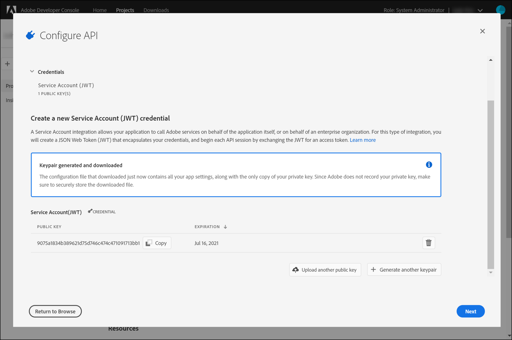
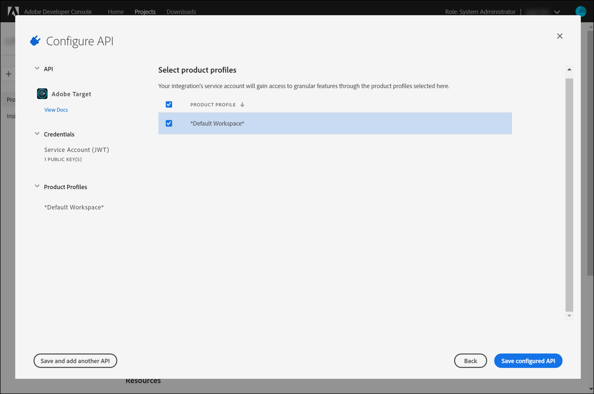

# Konfigurieren der Authentifizierung für [!DNL Adobe Target] -APIs

Die [!DNL Adobe Target] Admin-APIs, einschließlich der [!DNL Recommendations Admin] -APIs, werden durch Authentifizierung gesichert, um sicherzustellen, dass nur autorisierte Benutzer sie für den Zugriff auf [!DNL Adobe Target] verwenden. Verwenden Sie den [Adobe Developer Console](https://developer.adobe.com/console/home) , um diese Authentifizierung für alle [!DNL Adobe Experience Cloud solutions], einschließlich [!DNL Adobe Target], zu verwalten.

>[!IMPORTANT]
>
>Die in diesem Artikel beschriebenen Anmeldedaten für Dienstkonten (JWT) werden nicht mehr zugunsten der neuen OAuth Server-zu-Server-Anmeldedaten unterstützt.
>
>Die Anmeldedaten für das Dienstkonto (JWT) funktionieren bis zum 1. Januar 2025 weiterhin. Sie müssen Ihre Anwendung oder Integration migrieren, um die neue OAuth-Server-zu-Server-Berechtigung vor dem 1. Januar 2025 zu verwenden.
>
>Weitere Informationen und schrittweise Anweisungen zum Migrieren Ihrer Integration finden Sie unter [Migration von JWT-Anmeldedaten (Service Account) zu OAuth-Server-zu-Server-Anmeldedaten](https://developer.adobe.com/developer-console/docs/guides/authentication/ServerToServerAuthentication/migration/){target=_blank} in der Dokumentation zu *Developer Console* .
>
>Informationen zum Einrichten neuer OAuth-Anmeldedaten finden Sie unter [OAuth Server-zu-Server-Anmeldeimplementierung](https://developer.adobe.com/developer-console/docs/guides/authentication/ServerToServerAuthentication/implementation/){target=_blank} in der Dokumentation zu *Developer Console* .

Im Folgenden finden Sie die ersten Schritte, die zum Generieren der Legacy-JWT-Authentifizierungstoken erforderlich sind, die für die erfolgreiche Interaktion mit [!DNL Adobe Target] -APIs erforderlich sind:

1. Erstellen Sie ein Projekt (zuvor als Integration bezeichnet) im [!DNL Adobe Developer Console].
1. Exportieren Sie Projektdetails in Postman.
1. Generieren Sie ein Bearer-Zugriffstoken.
1. Testen Sie das Trägerzugriffs-Token.

## Voraussetzungen

| Ressource | Details |
| --- | --- |
| Postman | Um diese Schritte erfolgreich abzuschließen, rufen Sie die [Postman-App](https://www.postman.com/downloads/) für Ihr Betriebssystem ab. Postman Basic ist mit der Kontoerstellung kostenlos. Postman ist zwar nicht erforderlich, um [!DNL Adobe Target] -APIs im Allgemeinen zu verwenden, erleichtert aber API-Workflows. [!DNL Adobe Target] bietet mehrere Postman-Sammlungen, mit denen die APIs ausgeführt und ihre Funktionsweise kennengelernt werden können. Der Rest dieses Handbuchs setzt Grundkenntnisse in Postman voraus. Hilfe finden Sie in der [Postman-Dokumentation](https://learning.getpostman.com/). |
| Verweise | Im Rest dieses Handbuchs wird davon ausgegangen, dass Sie mit den folgenden Ressourcen vertraut sind:<ul><li>[Adobe I/O Github](https://github.com/adobeio)</li><li>[Dokumentation zur Target-Admin- und Profil-API](../administer/admin-api/admin-api-overview-new.md)</li><li>[Recommendations API-Dokumentation](https://developer.adobe.com/target/administer/recommendations-api/)</li></ul> |

## Erstellen eines Adobe I/O-Projekts

In diesem Abschnitt greifen Sie auf die [!DNL Adobe Developer Console] zu und erstellen ein Projekt für [!DNL Adobe Target]. Weitere Informationen finden Sie in der [Dokumentation zu Projekten](https://developer.adobe.com/developer-console/docs/guides/projects/).

&lt;!— Absatz 1. Generieren Sie Ihren privaten Schlüssel und Ihr öffentliches Zertifikat gemäß der [Dokumentation zur Authentifizierung](https://developer.adobe.com/developer-console/docs/guides/authentication/). // [//]: # (wie in **Schritt 1** von [Einrichten von Adobe IO: Authentifizierung - Schritt für Schritt](https://helpx.adobe.com/marketing-cloud-core/kb/adobe-io-authentication-step-by-step.html) beschrieben. Kehren Sie nach Abschluss von Schritt 1 zu diesem Handbuch zurück und fahren Sie mit Schritt 2 unten fort. // Das Ergebnis dieses Schritts sollte die Erstellung einer `private.key` -Datei und einer `certificate_pub.crt` -Datei sein. Kehren Sie nach der Erstellung dieser beiden Dateien zu diesem Handbuch zurück.)—>

1. Stellen Sie in der [Adobe Admin Console](https://adminconsole.adobe.com/) sicher, dass Ihr [!DNL Adobe] -Benutzerkonto sowohl auf [Produktadministrator](https://helpx.adobe.com/enterprise/using/admin-roles.html) als auch auf [Entwickler](https://helpx.adobe.com/enterprise/using/manage-developers.html) -Ebene Zugriff auf [!DNL Target] erhalten hat.

1. Wählen Sie in [Adobe Developer Console](https://developer.adobe.com/console/home) die [!UICONTROL Experience Cloud Organization] aus, für die Sie diese Integration erstellen möchten. (Beachten Sie, dass Sie wahrscheinlich nur Zugriff auf eine einzelne [!UICONTROL Experience Cloud Organization] haben.)

   

1. Klicken Sie auf **[!UICONTROL Create new project]**.

   

1. Klicken Sie auf &quot;**[!UICONTROL Add API]**&quot;, um Ihrem Projekt eine REST-API hinzuzufügen und auf [!DNL Adobe] Dienste und Produkte zuzugreifen.

   

1. Wählen Sie **[!DNL Adobe Target]** als [!DNL Adobe]-Dienst aus, mit dem Sie die Integration durchführen möchten. Klicken Sie auf die Schaltfläche &quot;**[!UICONTROL Next]**&quot;, die angezeigt wird.

   

1. Wählen Sie eine Option zum Verknüpfen öffentlicher und privater Schlüssel mit der Dienstkontointegration aus, die Sie für [!DNL Target] erstellen. Wählen Sie für dieses Beispiel **[!UICONTROL Option 1: Generate a key pair]** und klicken Sie auf **[!UICONTROL Generate keypair]**.

   

1. Notieren Sie sich, wie angegeben, die automatisch heruntergeladene Konfigurationsdatei (`config`), die Ihren privaten Schlüssel enthält. Klicken Sie auf **[!UICONTROL Next]**.

   

1. Überprüfen Sie in Ihrem Dateisystem den Speicherort von `config`, d. h. die komprimierte Konfigurationsdatei, die im vorherigen Schritt erstellt wurde. Diese `config` -Datei enthält Ihren privaten Schlüssel, den Sie später benötigen werden. Der genaue Speicherort in Ihrem Dateisystem kann sich von dem hier gezeigten unterscheiden.

   

1. Wählen Sie in der Adobe Developer Console die [Produktprofile](https://helpx.adobe.com/de/enterprise/using/manage-products-and-profiles.html) aus, die den Eigenschaften entsprechen, in denen Sie Adobe Recommendations verwenden. (Wenn Sie keine Eigenschaften verwenden, wählen Sie die Option Standard-Workspace aus.) Klicken Sie auf **[!UICONTROL Save configured API]**.

   

1. Klicken Sie auf **[!UICONTROL Create Integration]**. Sie sollten eine temporäre Meldung erhalten, die angibt, dass Ihre API erfolgreich konfiguriert wurde.
1. Benennen Sie Ihr Projekt als letzten Schritt in einen aussagekräftigeren Namen um als die ursprünglichen `Project 1`. Navigieren Sie dazu mithilfe des Navigationspfads zum Projekt, wie angezeigt, klicken Sie auf **[!UICONTROL Edit project]** , um auf das Modal **[!UICONTROL Edit Project]** zuzugreifen, und benennen Sie das Projekt um.

   

>[!NOTE]
>
>In diesem Beispiel nennen wir unser Projekt &quot;[!DNL Target] Integration&quot;. Wenn Sie davon ausgehen, Ihr Projekt für mehr als nur [!DNL Adobe Target] zu verwenden, sollten Sie es entsprechend benennen. Sie können ihn beispielsweise &quot;Adobe-APIs&quot;oder &quot;Experience Cloud-APIs&quot;nennen, da er mit anderen Lösungen in der Adobe Experience Cloud verwendet werden kann.

## Exportieren von Projektdetails

Nachdem Sie jetzt über ein Adobe-Projekt verfügen, das Sie für den Zugriff auf [!DNL Target] verwenden können, müssen Sie sicherstellen, dass Sie Details dieses Projekts zusammen mit Ihren Adobe-API-Anfragen senden. Diese Details sind erforderlich, um mit mehreren Adobe-APIs, darunter mehreren [!DNL Target] -APIs, zu interagieren. Die Integrationsdetails umfassen beispielsweise Autorisierungs- und Authentifizierungsinformationen, die für die [!DNL Target] Admin-APIs erforderlich sind. Um die APIs mit Postman zu verwenden, müssen Sie daher diese Details in Postman übertragen.

Es gibt viele Möglichkeiten, die Details Ihres Projekts in Postman anzugeben. In diesem Abschnitt nutzen wir jedoch einige vordefinierte Funktionen und Sammlungen. Zunächst (in diesem Abschnitt) exportieren Sie die Details Ihrer Integration in eine Postman-Umgebung. Als Nächstes generieren Sie ein Bearer-Zugriffstoken, um Ihnen Zugriff auf die erforderlichen Adobe-Ressourcen zu gewähren.

>[!NOTE]
>
>Videoanleitungen für alle Experience Cloud-Lösungen, einschließlich [!DNL Target], finden Sie unter [Verwenden von Postman mit Experience Platform-APIs](https://experienceleague.adobe.com/docs/platform-learn/tutorials/platform-api-authentication.html). Die folgenden Abschnitte sind für die [!DNL Target] -APIs relevant: 1. Erstellen und exportieren Sie die Experience Platform-API in Postman 2. Generieren Sie ein Zugriffstoken mit Postman. Diese Schritte werden im Folgenden beschrieben.

1. Navigieren Sie weiterhin in der [Adobe Developer Console](https://developer.adobe.com/console/home), um die **[!UICONTROL Service Account (JWT)]** -Anmeldedaten Ihres neuen Projekts anzuzeigen. Verwenden Sie entweder die linke Navigation oder den Abschnitt &quot;**[!UICONTROL Credentials]**&quot;, wie dargestellt.

   

   Beachten Sie, dass Sie in **[!UICONTROL Credential details]** Ihre **[!UICONTROL Public key(s)]**, **[!UICONTROL Client ID]** und andere Informationen zu Ihrem Dienstkonto anzeigen können.

   

1. Klicken Sie auf , um zu Informationen zur **[!DNL Adobe Target]**-API zu navigieren. Verwenden Sie entweder die linke Navigation oder den Abschnitt &quot;**Connected products and services**&quot;, wie dargestellt.

   

1. Klicken Sie auf **[!UICONTROL Download for Postman]** > **[!UICONTROL Service Account (JWT)]** , um eine JSON-Datei zu erstellen, die Ihre Authentifizierungsinformationen für eine Postman-Umgebung erfasst.

   

   Notieren Sie die JSON-Datei in Ihrem Dateisystem.

   

1. Klicken Sie in Postman auf das Zahnradsymbol, um Ihre Umgebungen zu verwalten, und klicken Sie dann auf **[!UICONTROL Import]** , um die JSON-Datei (Umgebung) zu importieren.

   

1. Wählen Sie Ihre Datei aus und klicken Sie auf **[!UICONTROL Open]**.

   

1. Klicken Sie im Modal Postman **Umgebungen verwalten** auf den Namen der neu importierten Umgebung, um sie zu überprüfen. (Ihr Umgebungsname kann sich von dem hier gezeigten unterscheiden. Bearbeiten Sie den Namen nach Bedarf. Sie muss nicht unbedingt mit dem Namen des Projekts [!DNL Adobe] übereinstimmen.)

   

1. Beachten Sie, dass die Werte für `CLIENT_SECRET` und `API_KEY` (zusammen mit anderen Variablen) vorausgefüllt sind und aus Ihrer Integration gemäß der Definition in Adobe Developer Console entnommen werden. (Die Variable Postman `CLIENT_SECRET` sollte mit der in der Developer Console angezeigten `CLIENT SECRET` Adobe-Berechtigung übereinstimmen, und `API_KEY` in Postman sollte ebenfalls mit `CLIENT ID` in der Developer Console übereinstimmen.) Im Gegensatz dazu sind die Anmerkungen `PRIVATE_KEY`, `JWT_TOKEN` und `ACCESS_TOKEN` leer. Zunächst geben wir den Wert `PRIVATE_KEY` an.

   

1. Öffnen Sie in Ihrem Dateisystem die Datei `config` und öffnen Sie die Schlüsseldatei `private` .

   

1. Wählen Sie den gesamten Inhalt der Schlüsseldatei `private` aus und kopieren Sie ihn.

   

1. Fügen Sie in Postman Ihren privaten Schlüsselwert in die Felder **[!UICONTROL INITIAL VALUE]** und **[!UICONTROL CURRENT VALUE]** ein.

   

1. Klicken Sie auf **[!UICONTROL Update]** und schließen Sie das Modal Umgebungen .

## Bearer-Zugriffstoken generieren

In diesem Abschnitt generieren Sie Ihr Trägerzugriffstoken, das zur Authentifizierung Ihrer Interaktion mit [!DNL Adobe Target] -APIs erforderlich ist. Um das Trägerzugriffs-Token zu generieren, müssen Sie Ihre Integrationsdetails (wie in den vorherigen Abschnitten beschrieben) an den [Adobe Identity Management Service (IMS)](https://www.adobe.io/authentication/auth-methods.html#!AdobeDocs/adobeio-auth/master/AuthenticationOverview/AuthenticationGuide.md) senden. Es gibt verschiedene Möglichkeiten, dies zu tun. In diesem Handbuch nutzen wir jedoch eine Postman-Sammlung mit einem vordefinierten IMS-Aufruf, der den Prozess direkt und einfach macht. Nach dem Import der Kollektion können Sie sie bei Bedarf wiederverwenden, um neue Token nicht nur für [!DNL Adobe Target], sondern auch für andere Adobe-APIs zu generieren.

1. Navigieren Sie zu den Beispielaufrufen für die [Adobe Identity Management Service-API](https://github.com/adobe/experience-platform-postman-samples/tree/master/apis/ims).

   

1. Klicken Sie auf &quot;**[!UICONTROL Adobe I/O Access Token Generation Postman collection]**&quot;.

   

1. Rufen Sie die JSON-Rohdaten für diese Sammlung ab, indem Sie auf &quot;**[!UICONTROL Raw]**&quot;klicken und dann die resultierende JSON in die Zwischenablage kopieren. (Alternativ können Sie die JSON-Rohdatei als JSON-Datei speichern.)

   

1. Importieren Sie die Sammlung in Postman, indem Sie die JSON-Rohdaten aus der Zwischenablage einfügen und senden. (Alternativ können Sie die von Ihnen gespeicherte JSON-Datei hochladen.) Klicken Sie auf **[!UICONTROL Continue]**.

   

1. Wählen Sie die **[!UICONTROL IMS: JWT Generate + Auth via User Token]** -Anfrage in der Postman-Sammlung &quot;Adobe I/O Access Token Generation&quot;aus, stellen Sie sicher, dass Ihre Umgebung ausgewählt ist, und klicken Sie auf **[!UICONTROL Send]**, um das Token zu generieren.

   

   >[!NOTE]
   >
   >Dieses Bearer-Zugriffstoken ist 24 Stunden lang gültig. Senden Sie die Anfrage erneut, sobald Sie ein neues Token generieren müssen.

1. Öffnen Sie erneut das Modal Umgebungen verwalten und wählen Sie Ihre Umgebung aus.

   

1. Beachten Sie, dass die Werte `ACCESS_TOKEN` und `JWT_TOKEN` jetzt ausgefüllt sind.

   

Frage: Muss ich die Postman-Sammlung &quot;Adobe I/O Access Token Generation&quot;verwenden, um das JSON Web Token (JWT) und das Trägerzugriffstoken zu generieren?

Antwort: Nein. Die Postman-Sammlung zur Adobe I/O-Zugriffstoken-Generierung ist verfügbar, um das JWT- und Trägerzugriffstoken in Postman einfacher zu generieren. Alternativ können Sie Funktionen in der Adobe Developer Console verwenden, um das Trägerzugriffs-Token manuell zu generieren.

## Testen des Trägerzugriffs-Tokens

In dieser Übung verwenden Sie Ihr neues Trägerzugriffstoken, indem Sie eine API-Anfrage senden, die eine Liste der Aktivitäten aus Ihrem [!DNL Target] -Konto abruft. Eine erfolgreiche Antwort gibt an, dass Ihr [!DNL Adobe] -Projekt und Ihre Authentifizierung wie erwartet funktionieren, um die API zu verwenden.

1. Importieren Sie die Postman-Sammlung der [[!DNL Adobe Target] Admin-APIs](https://developers.adobetarget.com/api/#admin-postman-collection). Befolgen Sie alle Anweisungen, bis die Sammlung in Postman importiert wurde.

   

1. Erweitern Sie die Sammlung und notieren Sie sich die **[!UICONTROL List activities]** -Anfrage.

   

1. Beachten Sie, dass Variablen wie `{{access_token}}` zunächst nicht aufgelöst werden. Sie können dies auf verschiedene Weise beheben - Sie können beispielsweise eine neue Erfassungsvariable mit dem Namen `{{access_token}}` definieren - aber in diesem Handbuch ändern Sie stattdessen die API-Anfrage, um die zuvor verwendete Postman-Umgebung zu nutzen. Dadurch kann die Umgebung auch weiterhin als einheitliche, konsistente Konsolidierung aller Variablen dienen, die in allen Adobe-APIs verwendet werden.

   

1. Typ, der `{{access_token}}` durch `{{ACCESS_TOKEN}}` ersetzen soll.

   

1. Typ, der `{{api_key}}` durch `{{API_KEY}}` ersetzen soll.

   

1. Typ, der `{{tenant}}` durch `{{TENANT_ID}}` ersetzen soll. Hinweis `{{TENANT_ID}}` wird noch nicht erkannt.

   

1. Öffnen Sie das Modal Umgebungen verwalten und wählen Sie Ihre Umgebung aus.

   

1. Geben Sie ein, um eine neue `{{TENANT_ID}}` -Umgebungsvariable hinzuzufügen. Kopieren Sie den Wert Ihrer Mandanten-ID und fügen Sie ihn in die Felder **[!UICONTROL INITIAL VALUE]** und **[!UICONTROL CURRENT VALUE]** für Ihre neue Umgebungsvariable `TENANT_ID` ein.

   

   >[!NOTE]
   >
   >Die Mandantenkennung unterscheidet sich von Ihrem [!DNL Target] `clientcode`. Die Mandanten-ID ist in der URL vorhanden, wenn Sie bei [!DNL Target] angemeldet sind. Um Ihre Mandantenkennung zu erhalten, melden Sie sich bei der Adobe Experience Cloud an, öffnen Sie [!DNL Target] und klicken Sie auf die Karte Target . Verwenden Sie den Wert der Mandanten-ID, wie in der URL-Subdomäne angegeben. Wenn Ihre URL beispielsweise bei [!DNL Adobe Target] den Wert `<https://mycompany.experiencecloud.adobe.com/...>` aufweist, lautet die Mandantenkennung &quot;mycompany&quot;.

1. Senden Sie Ihre Anfrage, nachdem Sie sichergestellt haben, dass Sie die richtige Umgebung ausgewählt haben. Sie sollten eine Antwort mit Ihrer Aktivitätenliste erhalten.

   

Nachdem Sie Ihre Adobe-Authentifizierung überprüft haben, können Sie damit mit [!DNL Adobe Target] -APIs (sowie anderen Adobe-APIs) interagieren. Sie können beispielsweise [Recommendations-APIs](recs-api/overview.md) verwenden, um Empfehlungen zu erstellen oder zu verwalten, oder Sie können sie mit der [Target-Bereitstellungs-API](/help/dev/implement/delivery-api/overview.md) verwenden.
