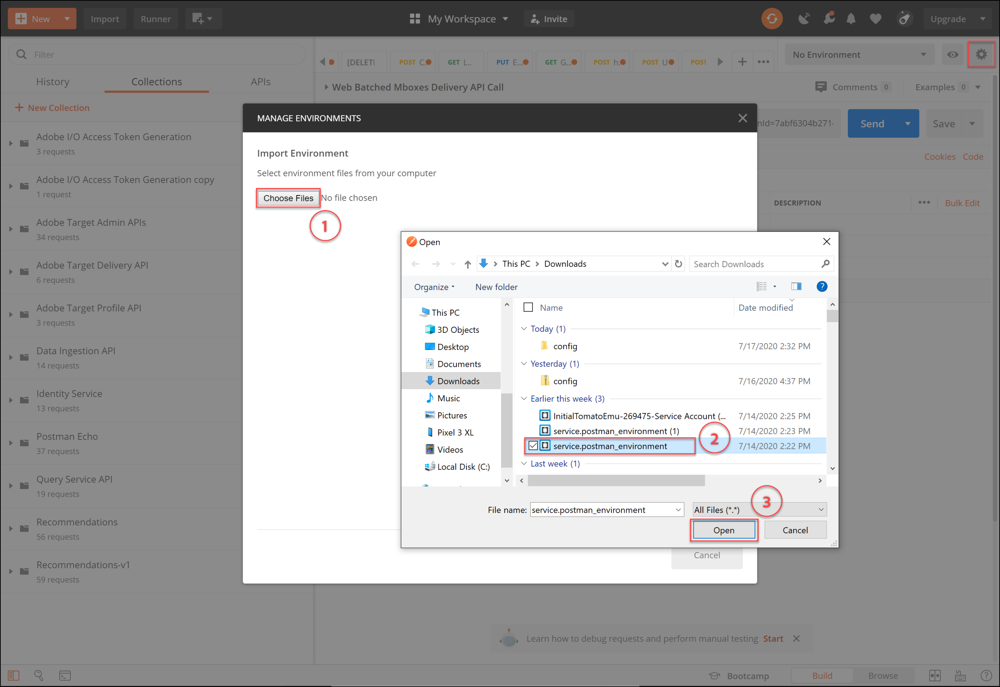
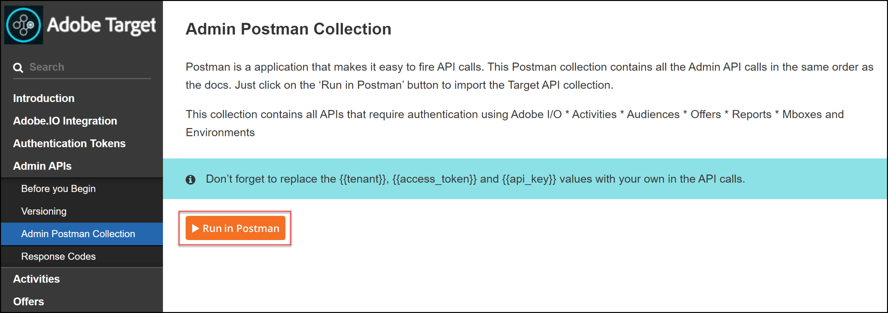

# Konfigurieren der Authentifizierung für [!DNL Adobe Target] APIs

Die [!DNL Adobe Target] Admin-APIs, einschließlich [!DNL Recommendations Admin]-APIs, werden durch Authentifizierung gesichert, um sicherzustellen, dass nur autorisierte Benutzer sie für den Zugriff auf [!DNL Adobe Target] verwenden. Verwenden Sie die [Adobe Developer Console](https://developer.adobe.com/console/home), um diese Authentifizierung für alle [!DNL Adobe Experience Cloud solutions] zu verwalten, einschließlich [!DNL Adobe Target].

>[!IMPORTANT]
>
>Die in diesem Artikel beschriebenen Anmeldeinformationen für das Service-Konto (JWT) werden zugunsten der neuen OAuth Server-zu-Server-Anmeldeinformationen veraltet sein.
>
>Die Anmeldeinformationen für das Service-Konto (JWT) funktionieren bis zum 1. Januar 2025 weiterhin. Sie müssen Ihre Anwendung oder Integration migrieren, um die neuen OAuth Server-zu-Server-Anmeldedaten vor dem 1. Januar 2025 zu verwenden.
>
>Weitere Informationen und schrittweise Anweisungen zum Migrieren Ihrer Integration finden Sie unter [Migration von JWT-Anmeldedaten (Service Account) zu OAuth-Server-zu-Server-Anmeldedaten](https://developer.adobe.com/developer-console/docs/guides/authentication/ServerToServerAuthentication/migration/){target=_blank} in der Dokumentation zu *Developer Console*.
>
>Informationen zum Einrichten neuer OAuth-Anmeldeinformationen finden Sie unter [OAuth-Implementierung von Server-zu-Server-Anmeldeinformationen](https://developer.adobe.com/developer-console/docs/guides/authentication/ServerToServerAuthentication/implementation/){target=_blank} in der Dokumentation zu *Developer Console*.

Im Folgenden finden Sie die ersten Schritte, die erforderlich sind, um die veralteten JWT-Authentifizierungstoken zu generieren, die für die erfolgreiche Interaktion mit [!DNL Adobe Target]-APIs erforderlich sind:

1. Erstellen Sie ein Projekt (früher als Integration bezeichnet) in der [!DNL Adobe Developer Console].
1. Projektdetails nach Postman exportieren.
1. Generieren Sie ein Bearer-Zugriffstoken.
1. Testen Sie das Bearer-Zugriffstoken.

## Voraussetzungen

| Ressource | Details |
| --- | --- |
| Postman | Um diese Schritte erfolgreich durchzuführen, rufen Sie die [Postman-App](https://www.postman.com/downloads/) für Ihr Betriebssystem ab. Postman Basic ist bei der Kontoerstellung kostenlos. Postman ist zwar nicht erforderlich, um [!DNL Adobe Target]-APIs im Allgemeinen zu verwenden, erleichtert aber API-Workflows und bietet [!DNL Adobe Target] mehrere Postman-Sammlungen, die die Ausführung der APIs und deren Funktionsweise erleichtern. Im weiteren Verlauf dieses Handbuchs werden Kenntnisse über Postman vorausgesetzt. Weitere Informationen finden Sie in der Dokumentation zu [Postman](https://learning.getpostman.com/). |
| Verweise | Im weiteren Verlauf dieses Handbuchs wird von der Vertrautheit mit den folgenden Ressourcen ausgegangen:<ul><li>[Adobe I/O GitHub](https://github.com/adobeio)</li><li>[Target Admin- und Profil-API-Dokumentation](../administer/admin-api/admin-api-overview-new.md)</li><li>[Dokumentation zur Recommendations-API](https://developer.adobe.com/target/administer/recommendations-api/)</li></ul> |

## Erstellen eines Adobe I/O-Projekts

In diesem Abschnitt greifen Sie auf die [!DNL Adobe Developer Console] zu und erstellen ein Projekt für [!DNL Adobe Target]. Weitere Informationen finden Sie in der [Dokumentation zu Projekten](https://developer.adobe.com/developer-console/docs/guides/projects/).

&lt;!—(1) Generieren Sie Ihren privaten Schlüssel und Ihr öffentliches Zertifikat gemäß der [Dokumentation zur Authentifizierung](https://developer.adobe.com/developer-console/docs/guides/authentication/). // [//]: # (wie in **Schritt 1** von [Einrichten von Adobe-IO: Authentifizierung - Schritt für Schritt](https://helpx.adobe.com/marketing-cloud-core/kb/adobe-io-authentication-step-by-step.html). Kehren Sie nach Abschluss von Schritt 1 zu diesem Handbuch zurück und setzen Sie den Vorgang mit Schritt 2 fort. // The result of this step should be the creation of a `private.key` file and a `certificate_pub.crt` file. Kehren Sie zu diesem Handbuch zurück, sobald Sie diese beiden Dateien generiert haben.)—>

1. Stellen Sie in der [Adobe Admin Console](https://adminconsole.adobe.com/) sicher, dass Ihrem [!DNL Adobe]-Benutzerkonto sowohl [Produktadministrator](https://helpx.adobe.com/de/enterprise/using/admin-roles.html) als auch [Entwickler](https://helpx.adobe.com/de/enterprise/using/manage-developers.html) Zugriff auf [!DNL Target] gewährt wurde.

1. Wählen Sie in der [Adobe Developer Console](https://developer.adobe.com/console/home) die [!UICONTROL Experience Cloud Organization] aus, für die Sie diese Integration erstellen möchten. (Beachten Sie, dass Sie wahrscheinlich nur Zugriff auf eine einzige [!UICONTROL Experience Cloud Organization] haben.)

   

1. Klicken Sie auf **[!UICONTROL Create new project]**.

   

1. Klicken Sie auf **[!UICONTROL Add API]** , um Ihrem Projekt eine REST-API für den Zugriff auf [!DNL Adobe] Services und Produkte hinzuzufügen.

   

1. Wählen Sie **[!DNL Adobe Target]** als den [!DNL Adobe]-Service aus, mit dem Sie eine Integration vornehmen möchten. Klicken Sie auf die **[!UICONTROL Next]**.

   

1. Wählen Sie eine Option aus, um öffentliche und private Schlüssel mit der Service-Kontointegration zu verknüpfen, die Sie für [!DNL Target] erstellen. Wählen Sie für dieses Beispiel **[!UICONTROL Option 1: Generate a key pair]** aus und klicken Sie auf **[!UICONTROL Generate keypair]**.

   

1. Notieren Sie sich wie angewiesen die automatisch heruntergeladene Konfigurationsdatei (`config`), die Ihren privaten Schlüssel enthält. Klicken Sie auf **[!UICONTROL Next]**.

   

1. Überprüfen Sie in Ihrem Dateisystem den Speicherort von `config`, bei dem es sich um die im vorherigen Schritt erstellte komprimierte Konfigurationsdatei handelt. Diese `config` enthält Ihren privaten Schlüssel, den Sie später benötigen werden. Der genaue Speicherort in Ihrem Dateisystem kann von dem hier gezeigten abweichen.

   

1. Zurück in der Adobe Developer Console wählen Sie [Produktprofil(e](https://helpx.adobe.com/de/enterprise/using/manage-products-and-profiles.html) aus, die den Eigenschaften entsprechen, in denen Sie Adobe Recommendations verwenden. (Wenn Sie keine Eigenschaften verwenden, wählen Sie die Option Standard-Workspace aus.) Klicken Sie auf **[!UICONTROL Save configured API]**.

   

1. Klicken Sie auf **[!UICONTROL Create Integration]**. Sie sollten eine temporäre Meldung erhalten, die angibt, dass Ihre API erfolgreich konfiguriert wurde.
1. Benennen Sie in einem letzten Schritt Ihr Projekt um, sodass es einen aussagekräftigeren Namen hat als das ursprüngliche `Project 1`. Navigieren Sie dazu mithilfe des angezeigten Navigationspfads zum Projekt, klicken Sie auf **[!UICONTROL Edit project]** , um auf das **[!UICONTROL Edit Project]** Modal zuzugreifen, und benennen Sie das Projekt um.

   

>[!NOTE]
>
>In diesem Beispiel nennen wir unser Projekt &quot;[!DNL Target] Integration“. Wenn Sie davon ausgehen, dass Sie Ihr Projekt länger als [!DNL Adobe Target] verwenden werden, sollten Sie es entsprechend benennen. Beispielsweise können Sie den Namen &quot;Adobe-APIs“ oder &quot;Experience Cloud-APIs“ wählen, da er mit anderen Lösungen in der Adobe Experience Cloud verwendet werden kann.

## Projektdetails exportieren

Nachdem Sie nun über ein Adobe-Projekt verfügen, mit dem Sie auf [!DNL Target] zugreifen können, müssen Sie sicherstellen, dass Sie Details zu diesem Projekt zusammen mit Ihren Adobe-API-Anfragen senden. Diese Details sind erforderlich, um mit mehreren Adobe-APIs, einschließlich mehrerer [!DNL Target]-APIs, zu interagieren. Die Integrationsdetails enthalten beispielsweise Autorisierungs- und Authentifizierungsinformationen, die für die [!DNL Target] Admin-APIs erforderlich sind. Um die APIs mit Postman verwenden zu können, müssen Sie diese Informationen daher in Postman importieren.

Es gibt viele Möglichkeiten, die Details Ihres Projekts in Postman anzugeben, aber in diesem Abschnitt nutzen wir einige vordefinierte Funktionen und Sammlungen. Zunächst (in diesem Abschnitt) exportieren Sie die Details Ihrer Integration in eine Postman-Umgebung. Als Nächstes generieren Sie (im folgenden Abschnitt) ein Bearer-Zugriffstoken, um Ihnen Zugriff auf die erforderlichen Adobe-Ressourcen zu gewähren.

>[!NOTE]
>
>Videoanweisungen für alle Experience Cloud-Lösungen, einschließlich [!DNL Target], finden Sie unter [Verwenden von Postman mit Experience Platform-APIs](https://experienceleague.adobe.com/docs/platform-learn/tutorials/platform-api-authentication.html?lang=de). Die folgenden Abschnitte sind für die [!DNL Target]-APIs relevant: 1. Erstellen und Exportieren der Experience Platform-API nach Postman 2. Erstellen eines Zugriffs-Tokens mit Postman. Diese Schritte werden ebenfalls unten beschrieben.

1. Navigieren Sie noch in der {0[&#128279;](https://developer.adobe.com/console/home)Adobe Developer Console}, um die **[!UICONTROL Service Account (JWT)]** Anmeldedaten Ihres neuen Projekts anzuzeigen.  Verwenden Sie entweder den linken Navigationsbereich oder den **[!UICONTROL Credentials]**, wie abgebildet.

   

   Beachten Sie **[!UICONTROL Credential details]**, dass Sie Ihre **[!UICONTROL Public key(s)]**, **[!UICONTROL Client ID]** und andere Informationen zu Ihrem Service-Konto anzeigen können.

   

1. Klicken Sie, um zu Informationen über die **[!DNL Adobe Target]**-API zu navigieren. Verwenden Sie entweder die linke Navigation oder den Abschnitt **Verbundene Produkte und Services** wie abgebildet.

   

1. Klicken Sie auf **[!UICONTROL Download for Postman]** > **[!UICONTROL Service Account (JWT)]** , um eine JSON-Datei zu erstellen, die Ihre Authentifizierungsinformationen für eine Postman-Umgebung erfasst.

   

   Notieren Sie die JSON-Datei in Ihrem Dateisystem.

   

1. Klicken Sie in Postman auf das Zahnradsymbol, um Ihre Umgebungen zu verwalten, und klicken Sie dann auf **[!UICONTROL Import]** , um die JSON-Datei (Umgebung) zu importieren.

   

1. Wählen Sie Ihre Datei aus und klicken Sie auf **[!UICONTROL Open]**.

   

1. Postman Klicken Sie im **„Umgebungen verwalten** auf den Namen der neu importierten Umgebung, um sie zu überprüfen. (Ihr Umgebungsname kann von dem hier gezeigten abweichen. Bearbeiten Sie den Namen nach Bedarf. Es muss nicht unbedingt mit dem Namen des [!DNL Adobe]-Projekts übereinstimmen.)

   

1. Beachten Sie, dass `CLIENT_SECRET` und `API_KEY` (zusammen mit anderen Variablen) ihre Werte vorab ausgefüllt haben und aus Ihrer Integration stammen, wie in der Adobe Developer Console definiert. (Die Postman-`CLIENT_SECRET`-Variable sollte mit den `CLIENT SECRET` Adobe-Anmeldeinformationen übereinstimmen, wie sie in der Developer Console angezeigt werden, und `API_KEY` in Postman sollten ebenfalls mit den `CLIENT ID` in der Developer Console übereinstimmen.) Beachten Sie dagegen, dass `PRIVATE_KEY`, `JWT_TOKEN` und `ACCESS_TOKEN` leer sind. Beginnen wir mit der Angabe des `PRIVATE_KEY`.

   

1. Öffnen Sie in Ihrem Dateisystem die `config`-Datei und öffnen Sie die `private`.

   

1. Wählen Sie den gesamten Inhalt der `private` aus und kopieren Sie ihn.

   

1. Fügen Sie in Postman Ihren privaten Schlüsselwert in die Felder **[!UICONTROL INITIAL VALUE]** und **[!UICONTROL CURRENT VALUE]** ein.

   

1. Klicken Sie auf **[!UICONTROL Update]** und schließen Sie das Modal Umgebungen .

## Erzeugen des Bearer-Zugriffstoken

In diesem Abschnitt generieren Sie Ihr Bearer-Zugriffstoken, das zum Authentifizieren Ihrer Interaktion mit [!DNL Adobe Target]-APIs erforderlich ist. Um Ihr Bearer-Zugriffstoken zu generieren, müssen Sie Ihre Integrationsdetails (wie in den vorherigen Abschnitten festgelegt) an den [Adobe Identity Management Service (IMS) senden](https://www.adobe.io/authentication/auth-methods.html#!AdobeDocs/adobeio-auth/master/AuthenticationOverview/AuthenticationGuide.md). Es gibt verschiedene Möglichkeiten, dies zu tun, aber in diesem Handbuch nutzen wir eine Postman-Sammlung mit einem vorkonfigurierten IMS-Aufruf, der den Prozess direkt und einfach macht. Nachdem Sie die Sammlung importiert haben, können Sie sie bei Bedarf wiederverwenden, um neue Token nicht nur für [!DNL Adobe Target], sondern auch für andere Adobe-APIs zu generieren.

1. Navigieren Sie zu den Beispielaufrufen zur [Adobe Identity Management Service-API](https://github.com/adobe/experience-platform-postman-samples/tree/master/apis/ims).

   

1. Klicken Sie auf die **[!UICONTROL Adobe I/O Access Token Generation Postman collection]**.

   

1. Rufen Sie die rohe JSON für diese Sammlung ab, indem Sie auf **[!UICONTROL Raw]** klicken und dann die resultierende JSON in Ihre Zwischenablage kopieren. (Sie können die rohe JSON auch als JSON-Datei speichern.)

   

1. Importieren Sie in Postman die Sammlung, indem Sie die rohe JSON aus der Zwischenablage einfügen und senden. (Sie können auch die JSON-Datei hochladen, die Sie gespeichert haben.) Klicken Sie auf **[!UICONTROL Continue]**.

   

1. Wählen Sie die **[!UICONTROL IMS: JWT Generate + Auth via User Token]** Anfrage in der Postman-Sammlung zur Erzeugung von Adobe I/O-Zugriffstoken aus, stellen Sie sicher, dass Ihre Umgebung ausgewählt ist, und klicken Sie auf **[!UICONTROL Send]** , um das Token zu generieren.

   

   >[!NOTE]
   >
   >Dieses Bearer-Zugriffstoken ist 24 Stunden lang gültig. Senden Sie die Anfrage erneut, wenn Sie ein neues Token generieren müssen.

1. Öffnen Sie erneut das Modal Umgebungen verwalten und wählen Sie Ihre Umgebung aus.

   

1. Beachten Sie, dass die Werte für `ACCESS_TOKEN` und `JWT_TOKEN` jetzt ausgefüllt sind.

   

Frage: Muss ich die Postman-Sammlung zur Erzeugung von Adobe I/O-Zugriffstoken verwenden, um das JSON-Web-Token (JWT) und das Bearer-Zugriffstoken zu generieren?

Antwort: Nein. Die Postman-Sammlung zur Erzeugung von Adobe I/O-Zugriffstoken ist als Komfort verfügbar, um das JWT- und Bearer-Zugriffstoken in Postman einfacher zu generieren. Alternativ können Sie Funktionen in der Adobe Developer Console verwenden, um das Bearer-Zugriffstoken manuell zu generieren.

## Testen des Bearer-Zugriffstoken

In dieser Übung verwenden Sie Ihr neues Bearer-Zugriffstoken, indem Sie eine API-Anfrage senden, die eine Liste der Aktivitäten von Ihrem [!DNL Target]-Konto abruft. Eine erfolgreiche Antwort zeigt an, dass Ihr [!DNL Adobe] Projekt und die Authentifizierung erwartungsgemäß funktionieren, um die API verwenden zu können.

1. Importieren Sie die [[!DNL Adobe Target] Admin-APIs in die Postman-Sammlung](https://developers.adobetarget.com/api/#admin-postman-collection). Befolgen Sie alle Eingabeaufforderungen, bis die Sammlung in Postman importiert wurde.

   

1. Erweitern Sie die Sammlung und notieren Sie sich die **[!UICONTROL List activities]**.

   

1. Beachten Sie, dass Variablen wie `{{access_token}}` zunächst nicht aufgelöst werden. Sie können dies auf verschiedene Arten beheben, z. B. indem Sie eine neue Sammlungsvariable mit dem Namen `{{access_token}}` definieren. In diesem Handbuch ändern Sie jedoch die API-Anfrage, um die zuvor verwendete Postman-Umgebung zu nutzen. Dadurch kann die Umgebung weiterhin als eine einzige, konsistente Konsolidierung aller Variablen dienen, die in allen Adobe-APIs verwendet werden.

   

1. Tippen Sie, um `{{access_token}}` durch `{{ACCESS_TOKEN}}` zu ersetzen.

   

1. Tippen Sie, um `{{api_key}}` durch `{{API_KEY}}` zu ersetzen.

   

1. Tippen Sie, um `{{tenant}}` durch `{{TENANT_ID}}` zu ersetzen. Hinweis `{{TENANT_ID}}` wird noch nicht erkannt.

   

1. Öffnen Sie das Modal Umgebungen verwalten und wählen Sie Ihre Umgebung aus.

   

1. Tippen Sie, um eine neue `{{TENANT_ID}}`-Umgebungsvariable hinzuzufügen. Kopieren Sie Ihren Mandanten-ID-Wert und fügen Sie ihn in die Felder **[!UICONTROL INITIAL VALUE]** und **[!UICONTROL CURRENT VALUE]** für Ihre neue `TENANT_ID`-Umgebungsvariable ein.

   

   >[!NOTE]
   >
   >Die Mandanten-ID unterscheidet sich von Ihrer [!DNL Target]-`clientcode`. Die Mandanten-ID ist in der URL vorhanden, wenn Sie bei [!DNL Target] angemeldet sind. Um Ihre Mandanten-ID zu erhalten, melden Sie sich bei der Adobe Experience Cloud an, öffnen Sie [!DNL Target] und klicken Sie auf die Target-Karte. Verwenden Sie den Mandanten-ID-Wert, wie in der URL-Subdomain angegeben. Wenn beispielsweise Ihre URL bei der Anmeldung bei [!DNL Adobe Target] `<https://mycompany.experiencecloud.adobe.com/...>` ist, lautet Ihre Mandanten-ID „mycompany“.

1. Senden Sie die Anfrage, nachdem Sie sichergestellt haben, dass Sie die richtige Umgebung ausgewählt haben. Sie sollten eine Antwort erhalten, die Ihre Liste der Aktivitäten enthält.

   

Nachdem Sie nun Ihre Adobe-Authentifizierung überprüft haben, können Sie sie für die Interaktion mit [!DNL Adobe Target]-APIs (sowie anderen Adobe-APIs) verwenden. Sie können beispielsweise [Recommendations-APIs verwenden](recs-api/overview.md) um Empfehlungen zu erstellen oder zu verwalten, oder Sie können sie mit der [Target-Bereitstellungs-API“ &#x200B;](/help/dev/implement/delivery-api/overview.md).
