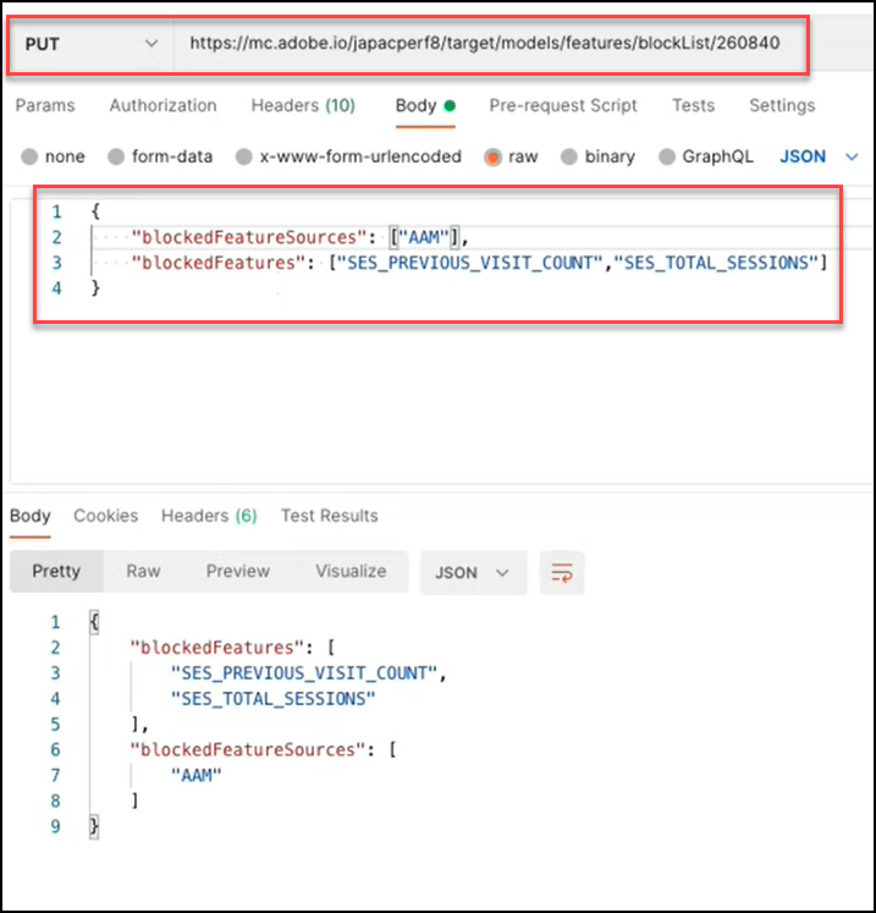

# Übersicht über die Models-API

Die Models-API, auch als Blockierungsliste-API bezeichnet, ermöglicht es Benutzenden, die Liste der Funktionen anzuzeigen und zu verwalten, die in Modellen für maschinelles Lernen für [!UICONTROL Automated Personalization] (AP)- und [!DNL Auto-Target] (AT)-Aktivitäten verwendet werden. Wenn ein(e) Benutzende(r) eine Funktion von der Verwendung durch die Modelle für AP- oder AT-Aktivitäten ausschließen möchte, kann er/sie die Models-API verwenden, um diese Funktion der &quot;Blockierungsliste&quot; hinzuzufügen.

Ein **[!UICONTROL blocklist]** definiert die Reihe von Funktionen, die von [!DNL Adobe Target] aus seinen Modellen für maschinelles Lernen ausgeschlossen werden. Weitere Informationen zu Funktionen finden Sie unter [Von Algorithmen für  [!DNL Target]  maschinelles Lernen verwendete Daten](https://experienceleague.adobe.com/docs/target/using/activities/automated-personalization/ap-data.html).

Blockierungslisten können pro Aktivität (Aktivitätsebene) oder für alle Aktivitäten innerhalb eines [!DNL Target] Kontos (globale Ebene) definiert werden.

<!-- To get started with the Models API in order to create and manage your blocklist, download the Postman Collection [here](https://git.corp.adobe.com/target/ml-configuration-management-service/tree/nextRelease/rest_api_library). Note this is an Adobe internal link. Need to publish this publicly if want to share with customers. -->

## Models-API-Spezifikation

Die Models-API-Spezifikation [hier](../administer/models-api/models-api-overview.md).

## Voraussetzungen 

Um die Models-API zu verwenden, müssen Sie die Authentifizierung mithilfe der [Adobe Developer Console](https://developer.adobe.com/console/home) konfigurieren, genau wie bei der [Target Admin-API](../administer/admin-api/admin-api-overview-new.md). Weitere Informationen finden Sie unter [Konfigurieren der Authentifizierung](../before-administer/configure-authentication.md).

## Richtlinien zur Verwendung der Models-API

Verwalten von Blockierungslisten

[**Schritt 1:**](#step1) Liste der Funktionen für eine Aktivität anzeigen

auf die Blockierungsliste setzen [**Schritt 2:**](#step2) der Aktivität prüfen

[**Schritt 3:**](#step3) Funktionen zur Blockierungsliste der Aktivität hinzufügen

[**Schritt 4:**](#step4) (Optional) Entsperren

[**Schritt 5:**](#step5) (Optional) Verwalten der globalen Blockierungsliste


## Schritt 1: Anzeigen einer Liste der Funktionen einer Aktivität {#step1}

Auf die Blockierungsliste setzen Bevor Sie eine Funktion bearbeiten, zeigen Sie die Liste der Funktionen an, die derzeit in den Modellen für diese Aktivität enthalten sind.

>[!BEGINTABS]

>[!TAB Anfrage]

```json {line-numbers="true"}
GET https://mc.adobe.io/<tenant>/target/models/features/<campaignId>
```

>[!TAB Antwort]

```json {line-numbers="true"}
{
    "features": [
        {
            "externalName": "Visitor Profile - Total Visits to Activity",
            "internalName": "SES_PREVIOUS_VISIT_COUNT",
            "type": "CONTINUOUS"
        },
        {
            "externalName": "Visitor Profile - Total Visits",
            "internalName": "SES_TOTAL_SESSIONS",
            "type": "CONTINUOUS"
        },
        {
            "externalName": "Visitor Profile - Pages Seen Before Activity",
            "internalName": "SES_PREVIOUS_VISIT_COUNT",
            "type": "CONTINUOUS"
        },
        {
            "externalName": "Visitor Profile - Activity Lifetime Time on Site",
            "internalName": "SES_TOTAL_TIME",
            "type": "CONTINUOUS"
        }
    ],
    "reportParameters": {
        "clientCode": <tenant>,
        "campaignId": <campaignId>
    }
}
```

>[!ENDTABS]

<!-- JUDY: Update codeblock above once you have the complete Response. -->

In dem hier gezeigten Beispiel prüft der Benutzer, ob die Liste der Funktionen vorhanden ist, die im Modell für die Aktivität verwendet werden, deren Aktivitäts-ID 260840 ist.


>[!NOTE]
>
>Um die Aktivitäts-ID Ihrer Aktivität zu finden, navigieren Sie in der [!DNL Target]-Benutzeroberfläche zur Liste Aktivitäten . Klicken Sie auf die gewünschte Aktivität. Die Aktivitäts-ID wird im Hauptteil der resultierenden Aktivitätenübersichtsseite sowie am Ende der URL für diese Seite angezeigt.

Der **[!UICONTROL externalName]** ist ein benutzerfreundlicher Name für eine Funktion. Er wird von [!DNL Target] erstellt und es ist möglich, dass sich dieser Wert im Laufe der Zeit ändert. Benutzer können diese benutzerfreundlichen Namen im [Personalization Insights-Bericht anzeigen](https://experienceleague.adobe.com/docs/target/using/reports/insights/personalization-insights-reports.html).

Die **[!UICONTROL internalName]** ist die tatsächliche Kennung der Funktion. Es wird auch von [!DNL Target] erstellt, kann jedoch nicht geändert werden. Auf die Blockierungsliste setzen Dies ist der Wert, auf den Sie verweisen müssen, um die Funktion(en) zu identifizieren, die Sie ändern möchten.

Damit die Funktionsliste mit Werten gefüllt werden kann (d. h. damit sie nicht null ist), muss eine Aktivität sein:

1. Muss Status = Live haben oder zuvor aktiviert worden sein
1. muss lange genug gedauert haben, damit eine Kampagnenaktivität möglich war, sodass das Modell mit Daten ausgeführt werden konnte.

## Schritt 2: Überprüfen Sie die Blockierungsliste der Aktivität {#step2}

Zeigen Sie als Nächstes die Blockierungsliste an. Mit anderen Worten: Überprüfen Sie, welche Funktionen (sofern vorhanden) derzeit von der Aufnahme in die Modelle für diese Aktivität blockiert sind.

>[!ERROR]
>
>Beachten Sie, dass `/blockList/` in der Anfrage zwischen Groß- und Kleinschreibung unterscheidet.

>[!BEGINTABS]

>[!TAB Anfrage]

```json {line-numbers="true"}
GET https://mc.adobe.io/<tenant>/target/models/features/blockList/<campaignId>
```

>[!TAB Antwort]

```json {line-numbers="true"}

```

>[!ENDTABS]

In dem hier gezeigten Beispiel prüft der Benutzer die Liste der blockierten Funktionen für die Aktivität, deren Aktivitäts-ID 260840 ist. Die Ergebnisse sind leer, was bedeutet, dass diese Aktivität derzeit keine auf die Blockierungsliste gesetzt Funktionen aufweist.


>[!NOTE]
>
>Wenn Sie die vollständige Blockierungsliste zum ersten Mal überprüfen, bevor Sie Funktionen hinzufügen, werden möglicherweise leere Ergebnisse wie diese angezeigt. Nachdem Sie jedoch Funktionen zu einer Blockierungsliste hinzugefügt (und anschließend entfernt) haben, werden möglicherweise etwas andere Ergebnisse angezeigt, bei denen ein leeres Array auf die Blockierungsliste gesetzt Funktionen zurückgegeben wird. Lesen Sie weiter, um ein Beispiel dafür in zu sehen [Schritt 4](#step4).

## Schritt 3: Funktionen zur Blockierungsliste der Aktivität hinzufügen {#step3}

Um der Blockierungsliste Funktionen hinzuzufügen, ändern Sie die Anfrage von GET an PUT und ändern Sie den Text der Anfrage, um die `blockedFeatureSources` oder `blockedFeatures` nach Bedarf anzugeben.

* Der Text der Anfrage erfordert entweder `blockedFeatures` oder `blockedFeatureSources`. Beide können enthalten sein.
* Befüllen Sie `blockedFeatures` mit Werten, die aus `internalName` identifiziert wurden. Siehe [Schritt 1](#step1).
* Füllen Sie `blockedFeatureSources` mit Werten aus der folgenden Tabelle.

Beachten Sie, dass `blockedFeatureSources` angibt, woher eine Funktion kam. Zur Blockierungsauflistung dienen sie als Gruppen oder Kategorien von Funktionen, mit denen Benutzende ganze Funktionssätze gleichzeitig blockieren können. Die Werte von `blockedFeatureSources` stimmen mit den ersten Zeichen der Kennung eines KE (`blockedFeatures` oder `internalName` Werte) überein; daher können sie auch als „Feature-Präfixe“ betrachtet werden.

### Tabelle der `blockedFeatureSources` Werte {#table}

| Präfix | Beschreibung |
| --- | --- |
| KASTEN | Parameter „mbox“ |
| URL | Custom - URL Parameter |
| UMSCHLIESSEN | Umgebung |
| SE | Besucherprofil |
| GEO | Geografie - Standort |
| PRO | Benutzerdefiniert - Profil |
| SEG | Benutzerdefiniert - Berichterstellungssegment |
| AAM | Benutzerdefiniert - Experience Cloud-Segment |
| PÖBEL | Mobile |
| CRS | Benutzerdefiniert - Kundenattribute |
| UPA | Benutzerdefiniert - RT-CDP-Profilattribut |
| IAC | Besucherinteressenbereiche |

>[!BEGINTABS]

>[!TAB Anfrage]

```json {line-numbers="true"}
PUT https://mc.adobe.io/<tenant>/target/models/features/blockList/<campaignId>

{
    "blockedFeatureSources": ["AAM"],
    "blockedFeatures": ["SES_PREVIOUS_VISIT_COUNT", "SES_TOTAL_SESSIONS"]
}
```

>[!TAB Antwort]

```json {line-numbers="true"}
{
    "blockedFeatures": [
            "SES_PREVIOUS_VISIT_COUNT",
            "SES_TOTAL_SESSIONS"
        ],
    "blockedFeatureSources": [
            "AAM"
        ]
}
```

>[!ENDTABS]

In dem hier gezeigten Beispiel blockiert der Benutzer zwei Funktionen, `SES_PREVIOUS_VISIT_COUNT` und `SES_TOTAL_SESSIONS`, die er zuvor identifiziert hat, indem er die vollständige Liste der Funktionen für die Aktivität abgefragt hat, deren Aktivitäts-ID 260480 ist, wie in [Schritt 1](#step1) beschrieben. Sie blockieren auch alle Funktionen aus Experience Cloud-Segmenten, was durch die Blockierung von Funktionen mit dem Präfix &quot;AAM&quot; erreicht wird, wie in der [Tabelle](#table) oben beschrieben.



Beachten Sie, dass Sie nach der Blockierungsauflistung auf die Blockierungsliste setzte einer Funktion die aktualisierte Datei überprüfen sollten, indem Sie [Schritt 2](#step2) erneut ausführen (GET auf die Blockierungsliste setzte). Überprüfen Sie, ob die Ergebnisse erwartungsgemäß angezeigt werden (stellen Sie sicher, dass die Ergebnisse die Funktionen enthalten, die von der neuesten PUT-Anfrage hinzugefügt wurden).

## Schritt 4: (Optional) Entsperren {#step4}

Auf die Blockierungsliste setzen Um die Blockierung aller Funktionen aufzuheben, löschen Sie die Werte aus `blockedFeatureSources` oder `blockedFeatures`.

>[!BEGINTABS]

>[!TAB Anfrage]

```json {line-numbers="true"}
PUT https://mc.adobe.io/<tenant>/target/models/features/blockList/<campaignId>

{
    "blockedFeatureSources": [],
    "blockedFeatures": []
}
```

>[!TAB Antwort]

```json {line-numbers="true"}
{
    "blockedFeatures": [],
    "blockedFeatureSources": []
}
```

>[!ENDTABS]

Im hier gezeigten Beispiel löscht der Benutzer seine Blockierungsliste für die Aktivität, deren Aktivitäts-ID 260840 ist. Beachten Sie, dass die Antwort leere Arrays für blockierte Funktionen und ihre Quellen - `blockedFeatureSources` bzw. `blockedFeatures` - bestätigt.


Wie immer wird nach der Änderung der Blockierungsliste empfohlen, [Schritt 2](#step2) erneut auszuführen (die GET-Blockierungsliste zur Überprüfung der Liste enthält Funktionen wie erwartet). In dem hier gezeigten Beispiel verifiziert der Benutzer, dass seine -Blockierungsliste jetzt leer ist.


Frage: Wie kann ich einige, aber nicht alle einer Blockierungsliste löschen?

Antwort: Um eine einzelne Teilmenge auf die Blockierungsliste gesetzt Funktionen aus einer Multi-Feature-Blockierungsliste auf die Blockierungsliste setzen auf die Blockierungsliste setzte zu entfernen, können Benutzende einfach die aktualisierte Liste der Funktionen senden, die sie in [der -Funktionsanfrage](#step3) blockieren möchten, anstatt die gesamte -Datei zu löschen und die gewünschten Funktionen erneut hinzuzufügen. Mit anderen Worten, senden Sie die aktualisierte Funktionsliste (wie in [Schritt 3](#step3)) und stellen Sie sicher, dass Sie die Funktionen, die Sie „löschen“ möchten, aus der Blockierungsliste ausschließen.

## Schritt 5: (Optional) Verwalten der globalen Blockierungsliste {#step5}

Die obigen Beispiele bezogen sich alle auf eine einzige Aktivität. Sie können auch Funktionen für alle Aktivitäten auf einem bestimmten Client (Mandanten) blockieren, anstatt die Blockierungsliste für jede Aktivität einzeln angeben zu müssen. Auf die Blockierungsliste setzen Um eine globale durchzuführen, verwenden Sie den `/blockList/global`-Aufruf anstelle von `blockList/<campaignId>`.

>[!BEGINTABS]

>[!TAB Anfrage]

```json {line-numbers="true"}
PUT https://mc.adobe.io/<tenant>/target/models/features/blockList/global

{
    "blockedFeatureSources": ["AAM", "PRO", "ENV"],
    "blockedFeatures": ["AAM_FEATURE_1", "AAM_FEATURE_2"]
}
```

>[!TAB Antwort]

```json {line-numbers="true"}
{
    "blockedFeatures": [
        "AAM_FEATURE_1",
        "AAM_FEATURE_2"
    ],
    "blockedFeatureSources": [
        "AAM",
        "PRO",
        "ENV"
    ]
}
```

>[!ENDTABS]

In der obigen Beispielanfrage blockiert der Benutzer zwei Funktionen, &quot;AAM_FEATURE_1“ und &quot;AAM_FEATURE_2“, für alle Aktivitäten in seinem [!DNL Target]. Das bedeutet, dass &quot;AAM_FEATURE_1“ und &quot;AAM_FEATURE_2“ unabhängig von der Aktivität nicht in die Modelle für maschinelles Lernen für dieses Konto aufgenommen werden. Darüber hinaus blockiert der Benutzer global alle Funktionen, deren Präfix &quot;AAM&quot;, „PRO“ oder „ENV“ lautet.

Frage: Ist das obige Code-Beispiel nicht redundant?

Antwort: Ja. Es ist redundant, Funktionen zu blockieren, deren Werte mit &quot;AAM&quot; beginnen, während gleichzeitig alle Funktionen blockiert werden, deren Quelle &quot;AAM&quot; ist. In der Folge werden alle Funktionen, die aus AAM (Experience Cloud-Segmente) bezogen werden, blockiert. Wenn das Ziel daher darin besteht, alle Funktionen aus Experience Cloud-Segmenten zu blockieren, ist es im obigen Beispiel nicht erforderlich, bestimmte Funktionen einzeln anzugeben, die mit &quot;AAM&quot; beginnen.

Letzter Schritt: Unabhängig davon, ob auf Aktivitäts- oder globaler Ebene, wird empfohlen, dass Sie Ihre Blockierungsliste nach der Änderung überprüfen, um sicherzustellen, dass sie die erwarteten Werte enthält. Ändern Sie dazu die `PUT` in eine `GET`.

Die folgende Beispielantwort zeigt, [!DNL Target] zwei einzelne Funktionen blockiert sowie alle Funktionen, die von &quot;AAM&quot;, „PRO“ und „ENV“ bezogen werden.


