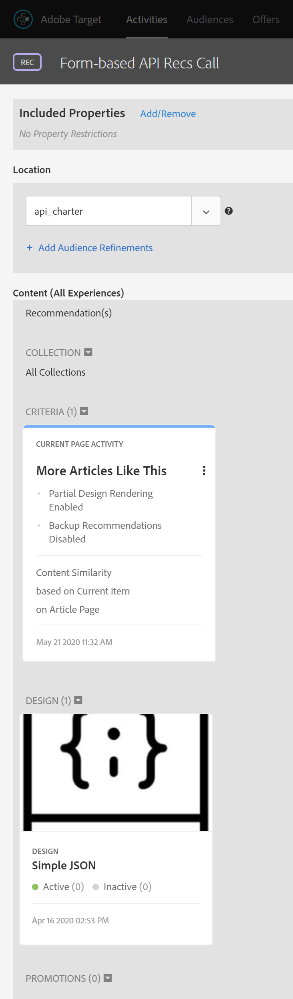

# Abrufen von Recommendations mit der Bereitstellungs-API

Die Adobe Target- und Adobe Target Recommendations-APIs können verwendet werden, um Antworten auf Web-Seiten bereitzustellen, sie können aber auch für nicht-HTML-basierte Erlebnisse wie Apps, Bildschirme, Konsolen, E-Mails, Kiosks und andere Anzeigegeräte verwendet werden. Wenn Target-Bibliotheken und JavaScript nicht verwendet werden können, ermöglicht die [Target-Bereitstellungs-API](/help/dev/implement/delivery-api/overview.md) weiterhin den Zugriff auf die gesamte Bandbreite der Target-Funktionen, um personalisierte Erlebnisse bereitzustellen.

>[!NOTE]
>
>Verwenden Sie beim Anfordern von Inhalten, die tatsächliche Empfehlungen (empfohlene Produkte oder Artikel) enthalten, die Target-Bereitstellungs-API.

Um Empfehlungen abzurufen, senden Sie einen Adobe Target Delivery API-Aufruf mit den entsprechenden Kontextinformationen, der eine Benutzer-ID (zur Verwendung mit profilspezifischen POST wie den kürzlich angezeigten Artikeln des Benutzers), einen relevanten Mbox-Namen, Mbox-Parameter, Profilparametern oder anderen Attributen enthalten kann. Die Antwort enthält empfohlene entity.ids (und kann andere Entitätsdaten enthalten) im JSON- oder HTML-Format, das dann auf dem Gerät angezeigt werden kann.

Die [Bereitstellungs-API](/help/dev/implement/delivery-api/overview.md) für Adobe Target stellt alle vorhandenen Funktionen bereit, die eine standardmäßige Target-Anfrage bereitstellt.

Die Bereitstellungs-API:

* Ermöglicht es Ihnen, Erlebnisse oder Angebote für einen Ort und eine Zielgruppe in RESTful-Weise abzurufen.
* Keine Authentifizierung erforderlich.
* Nur POSTs.
* Verarbeitet keine Cookies oder Umleitungsaufrufe.
* erfordert keine Benutzerrollen oder erkennt sie nicht. Ruft einfach Inhalte ab oder meldet Ereignisse an Target-Edge-Server.

Gehen Sie wie folgt vor, um mithilfe der Bereitstellungs-API Target-Erlebnisse einschließlich Empfehlungen bereitzustellen:

1. Erstellen Sie eine Target-Aktivität (A/B, XT, AP oder Recommendations) mit dem formularbasierten Composer (nicht mit dem Visual Experience Composer).
1. Verwenden Sie die Versand-API, um eine Antwort für die Anfragen zu erhalten, die von der soeben erstellten Target-Aktivität generiert wurden.

&lt;!— F: Warum sind BEIDE Schritte dazu erforderlich? Wenn Sie eine formularbasierte Empfehlung für eine Mbox definiert haben, was ist der Sinn und Nutzen, wenn Sie auch den Schritt der Bereitstellungs-API haben, um Ergebnisse abzurufen? Warum können Sie nicht einfach die Ergebnisse vom formularbasierten Rec auf dem Zielgerät liefern lassen..? A: Siehe Nutzungsszenario unten.. Es ist der Zeitpunkt, an dem Sie die ausstehenden Ergebnisse &quot;abfangen&quot;möchten, um vor der Anzeige der Ergebnisse weitere Dinge zu tun. Dinge wie Echtzeitvergleiche mit Lagerbeständen. —>

## Erstellen einer Empfehlung mit dem formularbasierten Experience Composer

Verwenden Sie den [formularbasierten Composer](https://experienceleague.adobe.com/docs/target/using/experiences/form-experience-composer.html), um Empfehlungen zu erstellen, die mit der Bereitstellungs-API verwendet werden können.

1. Erstellen und speichern Sie zunächst ein JSON-basiertes Design, das in Ihrer Empfehlung verwendet werden soll. Beispiel-JSON sowie Hintergrundinformationen dazu, wie JSON-Antworten beim Konfigurieren einer formularbasierten Aktivität zurückgegeben werden können, finden Sie in der Dokumentation unter [Erstellen von Empfehlungsdesigns](https://experienceleague.adobe.com/docs/target/using/recommendations/recommendations-design/create-design.html). In diesem Beispiel trägt der Entwurf den Namen *Einfache JSON.*
   

1. Navigieren Sie in Target zu **[!UICONTROL Activities]** > **[!UICONTROL Create Activity]** > **[!UICONTROL Recommendations]** und wählen Sie dann **[!UICONTROL Form]** aus.

   

1. Wählen Sie eine Eigenschaft aus und klicken Sie auf **[!UICONTROL Next]**.
1. Definieren Sie den Ort, an den Benutzer die Antwort der Empfehlung erhalten sollen. Im folgenden Beispiel wird ein Speicherort mit dem Namen *api_charter* verwendet. Wählen Sie Ihren zuvor erstellten JSON-basierten Entwurf mit dem Namen *Einfache JSON.* aus.
   
1. Speichern und aktivieren Sie die Empfehlung. Sie generiert Ergebnisse. [Sobald die Ergebnisse fertig sind](https://experienceleague.adobe.com/docs/target/using/recommendations/recommendations-activity/previewing-and-launching-your-recommendations-activity.html), können Sie sie mit der Bereitstellungs-API abrufen.

## Verwenden der Bereitstellungs-API

Die Syntax für die [Bereitstellungs-API](/help/dev/implement/delivery-api/overview.md) lautet:

`POST https://{{CLIENT_CODE}}.tt.omtrdc.net/rest/v1/delivery`

1. Beachten Sie, dass der Clientcode erforderlich ist. Zur Erinnerung: Ihr Clientcode kann in Adobe Target gefunden werden, indem Sie zu **[!UICONTROL Recommendations]** > **[!UICONTROL Settings]** navigieren. Beachten Sie den Wert **Client-Code** im Abschnitt **Empfehlung-API-Token** .
   
1. Sobald Sie Ihren Client-Code haben, erstellen Sie Ihren Bereitstellungs-API-Aufruf. Das folgende Beispiel beginnt mit dem in der [Postman-Sammlung der Bereitstellungs-API](../../implement/delivery-api/overview.md/#section/Getting-Started/Postman-Collection) angegebenen **[!UICONTROL Web Batched Mboxes Delivery API Call]**, der relevante Änderungen vornimmt. Beispiel:
   * Die Objekte **browser** und **address** wurden aus dem **Body** entfernt, da sie für Anwendungsfälle ohne HTML nicht erforderlich sind
   * *api_charter* wird in diesem Beispiel als Ortsname aufgeführt
   * die entity.id angegeben ist, da diese Empfehlung auf der Ähnlichkeit von Inhalten basiert, für die ein aktueller Artikelschlüssel an Target weitergegeben werden muss.
     
Konfigurieren Sie Ihre Abfrageparameter ordnungsgemäß. Geben Sie beispielsweise bei Bedarf `{{CLIENT_CODE}}` an. &lt;!— F: In der aktualisierten Aufrufsyntax wird entity.id als profileParameter anstelle eines mboxParameter aufgeführt, wie in älteren Versionen. —> &lt;!— F: Altes Bild  Alter Begleittext: &quot;Beachten Sie, dass diese Empfehlung auf Content Ähnar-Produkten basiert, die auf der entity.id basieren, die über mboxParameters gesendet wird.&quot; —>
     
1. Senden Sie die Anfrage. Dies wird für den Speicherort *api_charter* ausgeführt, auf dem eine aktive Empfehlung ausgeführt wird, die mit Ihrem JSON-Design definiert wird, das eine Liste der empfohlenen Entitäten ausgibt.
1. Erhalten Sie eine Antwort basierend auf dem JSON-Design.
   
Die Antwort enthält die Schlüssel-ID sowie die Entitäts-IDs der empfohlenen Entitäten.

Durch die Verwendung der Bereitstellungs-API mit Recommendations auf diese Weise können Sie zusätzliche Schritte ausführen, bevor Sie Empfehlungen für den Besucher auf dem Nicht-HTML-Gerät anzeigen. Beispielsweise können Sie die Antwort der Bereitstellungs-API nutzen, um eine zusätzliche Echtzeitsuche von Entitätsattributdetails (Inventar, Preis, Bewertung usw.) aus einem anderen System (z. B. einer CMS-, PIM- oder E-Commerce-Plattform) durchzuführen, bevor Sie die endgültigen Ergebnisse anzeigen.

Mithilfe des in diesem Handbuch beschriebenen Ansatzes können Sie jede Anwendung dazu bringen, die Antwort von Target zu nutzen, um personalisierte Empfehlungen bereitzustellen!

## Beispielimplementierungen

Die folgenden Ressourcen enthalten Beispiele für verschiedene nicht auf HTML fokussierte Implementierungen. Beachten Sie, dass jede Implementierung aufgrund des jeweiligen Systems und der betroffenen Geräte eindeutig sein wird.

| Ressource | Details |
| --- | --- |
| [Adobe Target Überall - Implementieren Sie Server Side oder in das iOS](https://expleague.azureedge.net/labs/L733/index.html) | Adobe Summit 2019 Lab, das praktische Erfahrungen für eine React-Anwendung bietet, die serverseitige APIs von Adobe Target nutzt. |
| [Adobe Target in einer mobilen App ohne Adobe-SDK](https://community.tealiumiq.com/t5/Universal-Data-Hub/Adobe-Target-in-a-Mobile-App-Without-the-Adobe-SDK/ta-p/26753) | In diesem Handbuch erfahren Sie, wie Sie Adobe Target in Ihrer mobilen App einrichten, ohne das Adobe SDK zu installieren. Diese Lösung verwendet die Tealium SDK-Webansicht und das Remote Commands-Modul, um Anfragen an die Adobe Visitor API (Experience Cloud) und die Adobe Target-API zu senden und zu empfangen. |
| [Konfigurieren der Target-Erweiterung im Experience Platform Launch und Implementieren von Target-APIs](https://developer.adobe.com/client-sdks/documentation/adobe-target/) | Schritte zum Konfigurieren der Target-Erweiterung in Experience Platform Launch, Hinzufügen der Target-Erweiterung zu Ihrer App und Implementieren von Target-APIs zum Anfordern von Aktivitäten, Vorabrufen von Angeboten und Wechseln zum visuellen Vorschaumodus. |
| [Adobe Target-Node-Client](https://www.npmjs.com/package/@adobe/target-nodejs-sdk) | Open-Source-Target-SDK 1.0 Node.js |
| [Übersicht über das Server-seitige Asset](../../implement/server-side/server-side-overview.md) | Informationen zu Server-seitigen Adobe Target-Bereitstellungs-APIs, Server-seitigen Batch-Bereitstellungs-APIs, Node.js-SDK und Adobe Target Recommendations-APIs. |
| [Adobe Campaign Content Recommendations in E-Mail](https://medium.com/adobetech/adobe-campaign-content-recommendations-in-email-b51ced771d7f) | Blog, der beschreibt, wie Inhaltsempfehlungen in E-Mails über Adobe Target und Adobe I/O Runtime in Adobe Campaign genutzt werden können. |

## Verwalten der Recommendations-Einrichtung mit APIs

Meistens werden Empfehlungen in der Adobe Target-Benutzeroberfläche konfiguriert und dann über die Target-APIs verwendet oder aufgerufen. Dies ist z. B. aus den oben genannten Gründen der Fall. Diese Koordinierung zwischen Benutzeroberfläche und API ist üblich. Manchmal möchten Benutzer jedoch möglicherweise alle Aktionen über APIs durchführen - sowohl die Einrichtung als auch die Verwendung von Ergebnissen. Weniger häufig kommt es vor, dass Benutzer die Ergebnisse von Empfehlungen absolut konfigurieren, ausführen, *und* nutzen können, und zwar ausschließlich über die APIs.

In einem [vorherigen Abschnitt](manage-catalog.md) haben wir erfahren, wie Adobe Target Recommendations-Entitäten verwaltet und serverseitig bereitgestellt werden. Auf ähnliche Weise können Sie mit dem [Adobe Developer Console](https://developer.adobe.com/console/home) Kriterien, Promotions, Sammlungen und Designvorlagen verwalten, ohne sich bei Adobe Target anmelden zu müssen. Eine vollständige Liste aller Recommendations-APIs finden Sie [hier](https://developer.adobe.com/target/administer/recommendations-api/), hier finden Sie jedoch eine Zusammenfassung zur Referenz.

| Ressource | Details |
| --- | --- |
| [Sammlungen](https://developer.adobe.com/target/administer/recommendations-api/#tag/Collections) | Auflisten, Erstellen, Abrufen, Bearbeiten und Löschen von Sammlungen. |
| [Kriterien](https://developer.adobe.com/target/administer/recommendations-api/#tag/Criteria) | Kriterien auflisten und abrufen. |
| [Designs](https://developer.adobe.com/target/administer/recommendations-api/#tag/Designs) | Auflisten, Erstellen, Abrufen, Bearbeiten, Löschen und Überprüfen von Designs. |
| [Entitäten](https://developer.adobe.com/target/administer/recommendations-api/#tag/Entities) | Speichern, löschen und rufen Sie Entitäten ab. |
| [Promotions](https://developer.adobe.com/target/administer/recommendations-api/#tag/Promotions) | Auflisten, Erstellen, Abrufen, Bearbeiten und Löschen von Promotions. |
| [Kategoriekriterien](https://developer.adobe.com/target/administer/recommendations-api/#tag/Category-Criteria) | Kategoriekriterien auflisten, erstellen, abrufen, bearbeiten und löschen. |
| [Benutzerdefinierte Kriterien](https://developer.adobe.com/target/administer/recommendations-api/#tag/Custom-Criteria) | Benutzerdefinierte Kriterien auflisten, erstellen, abrufen, bearbeiten und löschen. |
| [Elementkriterien](https://developer.adobe.com/target/administer/recommendations-api/#tag/Item-Criteria) | Auflisten, Erstellen, Abrufen, Bearbeiten und Löschen von Elementkriterien. |
| [Beliebtheitskriterien](https://developer.adobe.com/target/administer/recommendations-api/#tag/Popularity-Criteria) | Beliebtheitskriterien auflisten, erstellen, abrufen, bearbeiten und löschen. |
| [Profilattributkriterien](https://developer.adobe.com/target/administer/recommendations-api/#tag/Profile-Attribute-Criteria) | Profilattributkriterien auflisten, erstellen, abrufen, bearbeiten und löschen. |
| [Letzte Kriterien](https://developer.adobe.com/target/administer/recommendations-api/#tag/Recent-Criteria) | Letzte Kriterien auflisten, erstellen, abrufen, bearbeiten und löschen. |
| [Sequenzkriterien](https://developer.adobe.com/target/administer/recommendations-api/#tag/Sequence-Criteria) | Auflisten, Erstellen, Abrufen, Bearbeiten und Löschen von Sequenzkriterien. |

## Referenzdokumentation

* [Dokumentation zur Adobe Target-Bereitstellungs-API](/help/dev/implement/delivery-api/overview.md)
* [Integration von Recommendations in E-Mail](https://experienceleague.adobe.com/docs/target/using/recommendations/recommendations-faq/integrating-recs-email.html)

## Zusammenfassung und Überprüfung

Herzlichen Glückwunsch! In diesem Handbuch haben Sie Folgendes gelernt:
* [Verwalten Ihres Katalogs mithilfe der Recommendations-API](manage-catalog.md)
* [Benutzerdefinierte Kriterien mit der Recommendations-API verwalten](manage-custom-criteria.md)
* [Verwenden der Bereitstellungs-API mit Recommendations](fetch-recs-server-side-delivery-api.md)
