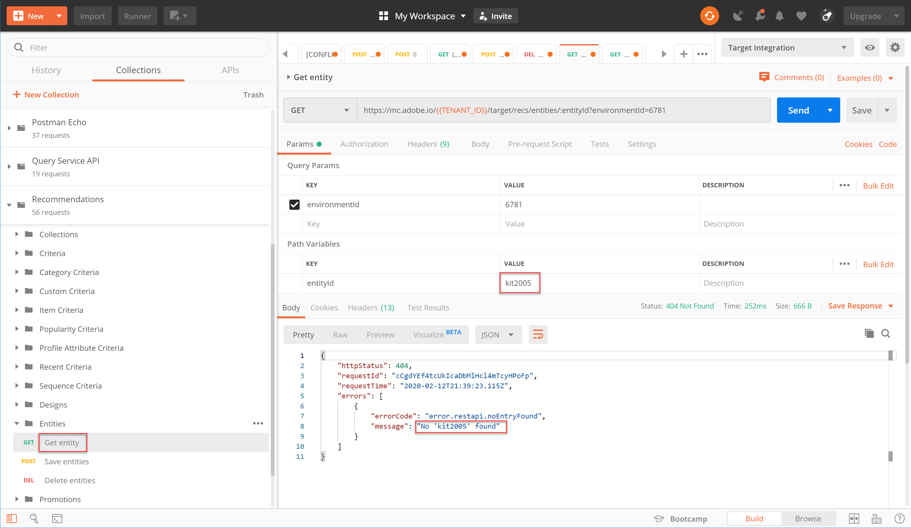

# Verwalten Ihres Recommendations-Katalogs mithilfe von APIs

Sie stellen sicher, dass Sie die [Anforderungen für die Verwendung der Recommendations-API](/help/dev/before-administer/recs-api/overview.md#prerequisites), haben Sie gelernt, wie [Zugriffstoken generieren](/help/dev/before-administer/configure-authentication.md) Verwenden des JWT-Authentifizierungsflusses zur Verwendung der [!DNL Adobe Target] Admin-APIs auf der [Adobe Developer-Konsole](https://developer.adobe.com/console/home).

Sie können jetzt die [Recommendations-APIs](https://developers.adobetarget.com/api/recommendations/) , um Artikel in Ihrem Empfehlungskatalog hinzuzufügen, zu aktualisieren oder zu löschen. Wie bei den anderen Adobe Target Admin-APIs erfordern auch die Recommendations-APIs eine Authentifizierung.

>[!NOTE]
>
>Senden Sie die **[!UICONTROL IMS: JWT-Generierung + Auth über Benutzer-Token]** immer dann anfordern, wenn Sie Ihr Zugriffstoken zur Authentifizierung aktualisieren müssen, da es nach 24 Stunden abläuft. Siehe [Adobe API-Authentifizierung konfigurieren](../configure-authentication.md) für Anweisungen.


Bevor Sie fortfahren, rufen Sie die [Recommendations Postman-Sammlung](https://developers.adobetarget.com/api/recommendations/#section/Postman).

## Erstellen und Aktualisieren von Elementen mit der API &quot;Entitäten speichern&quot;

Um Ihre Recommendations-Produktdatenbank mit der API anstatt mit CSV-Produkt-Feed- oder Target-Anforderungen zu füllen, die auf Produktseiten ausgelöst werden, verwenden Sie die [Entitäten-API speichern](https://developers.adobetarget.com/api/recommendations/#operation/saveEntities). Diese Anfrage fügt ein Element in einer einzelnen Target-Umgebung hinzu oder aktualisiert es. Die Syntax lautet:

```
POST https://mc.adobe.io/{{TENANT_ID}}/target/recs/entities
```

So können beispielsweise &quot;Save Entities&quot;verwendet werden, um Artikel zu aktualisieren, wenn bestimmte Schwellenwerte erreicht werden (z. B. Werte für Inventar oder Preis), um diese Elemente zu kennzeichnen und zu verhindern, dass sie empfohlen werden.

1. Navigieren Sie zu **[!UICONTROL Target]** > **[!UICONTROL Einrichtung]** > **[!UICONTROL Hosts]** > **[!UICONTROL CONTROL Environments]** , um die Target-Umgebungs-ID abzurufen, in der Sie ein Element hinzufügen oder aktualisieren möchten.

   

1. Überprüfen `TENANT_ID` und `API_KEY` referenzieren Sie die zuvor erstellten Postman-Umgebungsvariablen. Verwenden Sie das folgende Bild zum Vergleich. Ändern Sie bei Bedarf die Kopfzeilen und den Pfad in Ihrer API-Anfrage so, dass sie mit denen in der Abbildung unten übereinstimmen.

   

1. Geben Sie Ihre JSON als ein **raw** -Code in **body**. Vergessen Sie nicht, Ihre Umgebungs-ID mithilfe der `environment` -Variable. (Im folgenden Beispiel ist die Umgebungs-ID 6781.)

   

   Nachfolgend finden Sie ein Beispiel-JSON, das entity.id kit2001 mit den zugehörigen Entitätswerten für ein Toaster Oven-Produkt in die Umgebung 6781 hinzufügt.

   ```
       {
       "entities": [{
               "name": "Toaster Oven",
               "id": "kit2001",
               "environment": 6781,
               "categories": [
                   "housewares:appliances"
               ],
               "attributes": {
                   "inventory": 77,
                   "margin": 23,
                   "message": "crashing helicopter",
                   "pageUrl": "www.foobar.foo.com/helicopter.html",
                   "thumbnailUrl": "www.foobar.foo.com/helicopter.jpg",
                  "value": 19.2
               }
           }]
       }
   ```

1. Klicken Sie auf **[!UICONTROL Senden]**. Sie sollten die folgende Antwort erhalten.

   

   Das JSON-Objekt kann skaliert werden, um mehrere Produkte zu senden. Diese JSON gibt beispielsweise zwei Entitäten an.

   ```
       {
           "entities": [{
                   "name": "Toaster Oven",
                   "id": "kit2001",
                   "environment": 6781,
                   "categories": [
                       "housewares:appliances"
                   ],
                   "attributes": {
                       "inventory": 89,
                       "margin": 11,
                       "message": "Toaster Oven",
                       "pageUrl": "www.foobar.foo.com/helicopter.html",
                       "thumbnailUrl": "www.foobar.foo.com/helicopter.jpg",
                       "value": 102.5
                   }
               },
               {
                   "name": "Blender",
                   "id": "kit2002",
                   "environment": 6781,
                   "categories": [
                       "housewares:appliances"
                   ],
                   "attributes": {
                       "inventory": 36,
                       "margin": 5,
                       "message": "Blender",
                       "pageUrl": "www.foobar.foo.com/helicopter.html",
                       "thumbnailUrl": "www.foobar.foo.com/helicopter.jpg",
                       "value": 54.5
                   }
               }
           ]
       }
   ```

1. Jetzt bist du dran! Verwenden Sie die **[!UICONTROL Entitäten speichern]** API zum Hinzufügen der folgenden Elemente zu Ihrem Katalog. Verwenden Sie die obige JSON-Beispieldatei als Ausgangspunkt. (Sie müssen die JSON-Datei um weitere Entitäten erweitern.)

   

Sieht so aus, als gehören die letzten beiden Dinge nicht. Untersuchen wir sie mithilfe des **[!UICONTROL Entität abrufen]** APIs erstellen und diese bei Bedarf mithilfe der **[!UICONTROL Entitäten löschen]** API.

## Abrufen von Elementdetails mit der Get Entity API

Um die Details eines vorhandenen Elements abzurufen, verwenden Sie die [Entitäts-API abrufen](https://developers.adobetarget.com/api/recommendations/#operation/getEntity). Die Syntax lautet:

```
GET https://mc.adobe.io/{{TENANT_ID}}/target/recs/entities/[entity.id]
```

Entitätsdetails können jeweils nur für eine Entität abgerufen werden. Sie können &quot;Entität abrufen&quot;verwenden, um zu bestätigen, dass im Katalog Aktualisierungen wie erwartet vorgenommen wurden, oder um anderweitig den Inhalt des Katalogs zu überprüfen.

1. Geben Sie in der API-Anfrage mithilfe der -Variablen die Entitäts-ID an `entityId`. Im folgenden Beispiel werden Details für die Entität zurückgegeben, deren entityId=kit2004 lautet.

   

1. Überprüfen `TENANT_ID` und `API_KEY` referenzieren Sie die zuvor erstellten Postman-Umgebungsvariablen. Verwenden Sie das folgende Bild zum Vergleich. Ändern Sie bei Bedarf die Kopfzeilen und den Pfad in Ihrer API-Anfrage so, dass sie mit denen in der Abbildung unten übereinstimmen.

   

1. Senden Sie die Anfrage.

   
Wenn Sie eine Fehlermeldung erhalten, dass die Entität nicht gefunden wurde (wie im Beispiel oben gezeigt), überprüfen Sie, ob Sie die Anforderung an die richtige Target-Umgebung senden.


   >[!NOTE]
   >
   >Wenn keine Umgebung explizit angegeben ist, versucht &quot;Get Entity&quot;, die Entität von Ihrer [Standardumgebung](https://experienceleague.adobe.com/docs/target/using/administer/environments.html) nur. Wenn Sie von einer anderen Umgebung als der Standardumgebung abrufen möchten, müssen Sie die Umgebungs-ID angeben.

1. Fügen Sie bei Bedarf die `environmentId` und senden Sie die Anfrage erneut.

   

1. Senden einer weiteren **[!UICONTROL Entität abrufen]** dieses Mal die Entität überprüfen, deren entityId=kit2005.

   

Angenommen, Sie entscheiden, dass diese Entitäten aus Ihrem Katalog entfernt werden müssen. Verwenden wir die **[!UICONTROL Entitäten löschen]** API.

## Löschen von Elementen mit der API &quot;Entitäten löschen&quot;

Um Elemente aus Ihrem Katalog zu entfernen, verwenden Sie die [Entitäten-API löschen](https://developers.adobetarget.com/api/recommendations/#operation/deleteEntities). Die Syntax lautet:

```
DELETE https://mc.adobe.io/{{TENANT_ID}}/target/recs/entities?ids=[comma-delimited-entity-ids]&environment=[environmentId]
```

>[!WARNING]
>
>Die API Entitäten löschen löscht Entitäten, die von Ihnen angegebenen IDs referenziert werden. Wenn keine Entitäts-IDs bereitgestellt werden, werden alle Entitäten in der angegebenen Umgebung gelöscht. Wenn keine Umgebungs-ID angegeben wird, werden Entitäten aus allen Umgebungen gelöscht. Seien Sie vorsichtig!

1. Navigieren Sie zu **[!UICONTROL Target]** > **[!UICONTROL Einrichtung]** > **[!UICONTROL Hosts]** > **[!UICONTROL Umgebungen]** , um die Target-Umgebungs-ID abzurufen, aus der Sie Elemente löschen möchten.

   

1. Geben Sie in der API-Anfrage mithilfe der Syntax die Entitäts-IDs der Entitäten an, die Sie löschen möchten `&ids=[comma-delimited-entity-ids]` (Abfrageparameter). Trennen Sie beim Löschen mehrerer Entitäten die IDs durch Kommas.

   

1. Geben Sie die Umgebungs-ID mithilfe der Syntax an. `&environment=[environmentId]`, andernfalls werden Entitäten in allen Umgebungen gelöscht.

   

1. Überprüfen `TENANT_ID` und `API_KEY` referenzieren Sie die zuvor erstellten Postman-Umgebungsvariablen. Verwenden Sie das folgende Bild zum Vergleich. Ändern Sie bei Bedarf die Kopfzeilen und den Pfad in Ihrer API-Anfrage so, dass sie mit denen in der Abbildung unten übereinstimmen.

   

1. Senden Sie die Anfrage.

   

1. Überprüfen Sie die Ergebnisse mit **[!UICONTROL Entität abrufen]**, der nun angibt, dass die gelöschten Entitäten nicht gefunden werden können.

   

   

Herzlichen Glückwunsch! Sie können jetzt die Recommendations-APIs verwenden, um Details zu den Entitäten in Ihrem Katalog zu erstellen, zu aktualisieren, zu löschen und abzurufen. Im nächsten Abschnitt erfahren Sie, wie Sie benutzerdefinierte Kriterien verwalten.

&lt;!— [Weiter mit &quot;Benutzerdefinierte Kriterien verwalten&quot;>](manage-custom-criteria.md) —>
