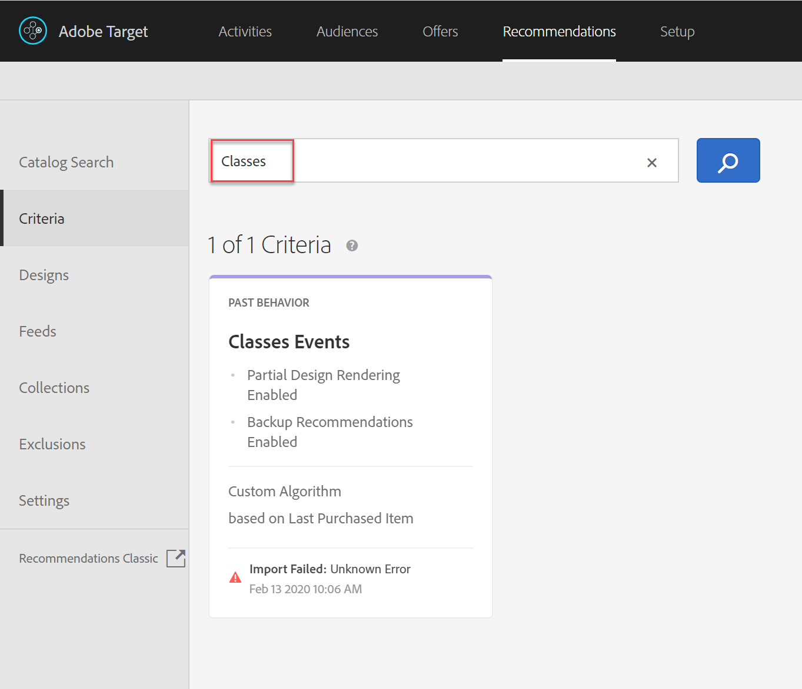
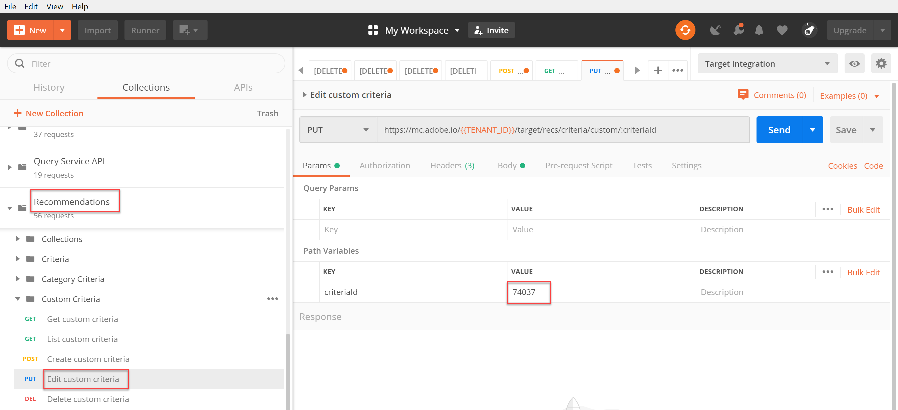

# Benutzerdefinierte Kriterien verwalten

Manchmal können die von Recommendations bereitgestellten Algorithmen bestimmte Artikel, die beworben werden sollen, nicht aufdecken. In einem solchen Fall bieten benutzerdefinierte Kriterien eine Möglichkeit, einen bestimmten Satz empfohlener Artikel für ein bestimmtes Schlüsselelement oder eine bestimmte Kategorie bereitzustellen.

Um benutzerdefinierte Kriterien zu erstellen, definieren und importieren Sie die gewünschte Zuordnung zwischen dem Schlüsselelement oder der Schlüsselkategorie und den empfohlenen Elementen. Dieser Vorgang wird in der Dokumentation zu [benutzerdefinierten Kriterien](https://experienceleague.adobe.com/docs/target/using/recommendations/criteria/recommendations-csv.html) beschrieben. Wie in dieser Dokumentation beschrieben, können Sie benutzerdefinierte Kriterien über die Target-Benutzeroberfläche erstellen, bearbeiten und löschen. Target bietet jedoch auch eine Reihe benutzerspezifischer Kriterien-APIs, die eine detailliertere Verwaltung Ihrer benutzerspezifischen Kriterien ermöglichen.

>[!WARNING]
>
>Führen Sie für benutzerdefinierte Kriterien entweder alle Aktionen (Erstellen, Bearbeiten, Löschen) für ein bestimmtes benutzerdefiniertes Kriterium mithilfe der APIs durch oder führen Sie alle Aktionen (Erstellen, Bearbeiten, Löschen) über die Benutzeroberfläche durch. Die Verwaltung benutzerdefinierter Kriterien durch eine Kombination aus Benutzeroberfläche und API kann zu widersprüchlichen Informationen oder unerwarteten Ergebnissen führen. Beispielsweise spiegelt das Erstellen eines benutzerdefinierten Kriteriums in der Benutzeroberfläche und dessen anschließende Bearbeitung über die API Ihre Aktualisierungen in der Benutzeroberfläche nicht wider, obwohl sie im Backend aktualisiert werden, wie über die API sichtbar.

## Erstellen benutzerdefinierter Kriterien

Um mithilfe der API [Benutzerdefinierte Kriterien erstellen](https://developer.adobe.com/target/administer/recommendations-api/#operation/createCriteriaCustom) benutzerdefinierte Kriterien zu erstellen, lautet die Syntax:

`POST https://mc.adobe.io/{{TENANT_ID}}/target/recs/criteria/custom`

>[!WARNING]
>
>Benutzerdefinierte Kriterien, die mit der API Benutzerdefinierte Kriterien erstellen erstellt wurden, wie in dieser Übung beschrieben, werden in der Benutzeroberfläche angezeigt, wo sie beibehalten werden. Sie können sie nicht in der Benutzeroberfläche bearbeiten oder löschen. Sie können sie **über API** bearbeiten oder löschen, aber auf beide Weise werden sie weiterhin in der Target-Benutzeroberfläche angezeigt. Um die Option zum Bearbeiten oder Löschen aus der Benutzeroberfläche beizubehalten, erstellen Sie die benutzerdefinierten Kriterien mithilfe der Benutzeroberfläche pro [Dokumentation](https://experienceleague.adobe.com/docs/target/using/recommendations/criteria/recommendations-csv.html), anstatt die API Benutzerdefinierte Kriterien erstellen zu verwenden.

Fahren Sie erst dann mit den folgenden Schritten fort, nachdem Sie die oben stehende Warnung gelesen haben, und erstellen Sie bequem neue benutzerdefinierte Kriterien, die später nicht aus der Benutzeroberfläche gelöscht werden können.

1. Überprüfen Sie, ob `TENANT_ID` und `API_KEY` für **[!UICONTROL Create custom criteria]** auf die zuvor festgelegten Postman-Umgebungsvariablen verweisen. Verwenden Sie das folgende Bild zum Vergleich.

   

1. Fügen Sie Ihren **Hauptteil** als JSON-Datei **raw** hinzu, die den Speicherort Ihrer CSV-Datei für benutzerdefinierte Kriterien definiert. Verwenden Sie das Beispiel in der Dokumentation [Benutzerdefinierte Kriterien-API erstellen](https://developer.adobe.com/target/administer/recommendations-api/#operation/getAllCriteriaCustom) als Vorlage und geben Sie dabei Ihren `environmentId` und andere Werte nach Bedarf an. Für dieses Beispiel verwenden wir LAST_PURCHASED als Schlüssel.

   

1. Senden Sie die Anfrage und beobachten Sie die Antwort, die die Details der soeben erstellten benutzerdefinierten Kriterien enthält.

   

1. Um sicherzustellen, dass Ihre benutzerdefinierten Kriterien erstellt wurden, navigieren Sie in Adobe Target zu &quot;**[!UICONTROL Recommendations > Criteria]**&quot;, suchen Sie nach Ihren Kriterien nach Namen oder verwenden Sie im nächsten Schritt die &quot;**[!UICONTROL List Custom Criteria API]**&quot;.

   

In diesem Fall haben wir einen Fehler. Untersuchen wir den Fehler, indem wir die benutzerdefinierten Kriterien genauer untersuchen und den **[!UICONTROL List Custom Criteria API]** verwenden.

## Benutzerdefinierte Kriterien auflisten

Um eine Liste aller benutzerdefinierten Kriterien zusammen mit Details zu jedem abzurufen, verwenden Sie die API [Benutzerdefinierte Kriterien auflisten ](https://developer.adobe.com/target/administer/recommendations-api/#operation/getAllCriteriaCustom) . Die Syntax lautet:

`GET https://mc.adobe.io/{{TENANT_ID}}/target/recs/criteria/custom`

1. Überprüfen Sie `TENANT_ID` und `API_KEY` wie zuvor und senden Sie die Anfrage. Beachten Sie in der Antwort die benutzerdefinierte Kriterien-ID sowie Details zur zuvor genannten Fehlermeldung.
   

In diesem Fall ist der Fehler aufgetreten, weil die Serverinformationen falsch sind. Das bedeutet, dass Target nicht auf die CSV-Datei zugreifen kann, die die benutzerdefinierte Kriteriendefinition enthält. Bearbeiten wir die benutzerdefinierten Kriterien, um dies zu korrigieren.

## Benutzerdefinierte Kriterien bearbeiten

Um die Details einer benutzerdefinierten Kriteriendefinition zu ändern, verwenden Sie die [API zum Bearbeiten benutzerdefinierter Kriterien](https://developer.adobe.com/target/administer/recommendations-api/#operation/updateCriteriaCustom). Die Syntax lautet:

`POST https://mc.adobe.io/{{TENANT_ID}}/target/recs/criteria/custom/:criteriaId`

1. Überprüfen Sie `TENANT_ID` und `API_KEY` wie zuvor.
   

1. Geben Sie die Kriterien-ID der (einzelnen) benutzerdefinierten Kriterien an, die Sie bearbeiten möchten.
   

1. Geben Sie im Hauptteil aktualisierte JSON-Dateien mit den richtigen Serverinformationen ein. (Geben Sie für diesen Schritt den FTP-Zugriff auf einen Server an, auf den Sie zugreifen können.)
   

1. Senden Sie die Anfrage und notieren Sie die Antwort.
   

Überprüfen wir mithilfe des **[!UICONTROL Get Custom Criteria API]**, ob die aktualisierten benutzerdefinierten Kriterien erfolgreich sind.

## Abrufen benutzerdefinierter Kriterien

Um benutzerdefinierte Kriteriendetails für ein bestimmtes benutzerdefiniertes Kriterium anzuzeigen, verwenden Sie die API [Benutzerdefinierte Kriterien abrufen](https://developer.adobe.com/target/administer/recommendations-api/#operation/getCriteriaCustom) . Die Syntax lautet:

`GET https://mc.adobe.io/{{TENANT_ID}}/target/recs/criteria/custom/:criteriaId`

1. Geben Sie die Kriterien-ID der benutzerdefinierten Kriterien an, deren Details Sie erhalten möchten. Senden Sie die Anfrage und überprüfen Sie die Antwort.
   
1. Überprüfen Sie den Erfolg. (Überprüfen Sie in diesem Fall, ob keine weiteren FTP-Fehler mehr vorliegen.)
   
1. (Optional) Überprüfen Sie, ob die Aktualisierung in der Benutzeroberfläche korrekt angezeigt wird.
   

## Benutzerdefinierte Kriterien löschen

Löschen Sie mithilfe der zuvor angegebenen Kriterien-ID Ihre benutzerdefinierten Kriterien mithilfe der API [Benutzerdefinierte Kriterien löschen](https://developer.adobe.com/target/administer/recommendations-api/#operation/deleteCriteriaCustom). Die Syntax lautet:

`DELETE https://mc.adobe.io/{{TENANT_ID}}/target/recs/criteria/custom/:criteriaId`

1. Geben Sie die Kriterien-ID des (einzelnen) benutzerdefinierten Kriteriums an, das Sie löschen möchten. Klicken Sie auf **[!UICONTROL Send]**.
   

1. Vergewissern Sie sich, dass die Kriterien mit &quot;Benutzerdefinierte Kriterien abrufen&quot;gelöscht wurden.
   
In diesem Fall zeigt der erwartete 404-Fehler an, dass die gelöschten Kriterien nicht gefunden werden können.

>[!NOTE]
>
>Zur Erinnerung: Die Kriterien werden nicht aus der Target-Benutzeroberfläche entfernt, obwohl sie gelöscht wurden, da sie mit der API Benutzerdefinierte Kriterien erstellen erstellt wurden.

Herzlichen Glückwunsch! Sie können jetzt mithilfe der Recommendations-API Details zu benutzerdefinierten Kriterien erstellen, auflisten, bearbeiten, löschen und abrufen. Im nächsten Abschnitt verwenden Sie die Target-Bereitstellungs-API, um Empfehlungen abzurufen.

&lt;!— [Weiter mit &quot;Recommendations mit der serverseitigen Bereitstellungs-API abrufen&quot;>](fetch-recs-server-side-delivery-api.md) —>
