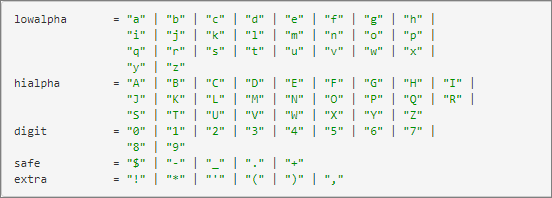
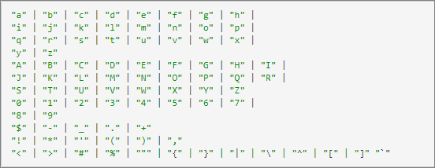

# Seitenparameter

Seitenparameter (auch „Mbox-Parameter“ genannt) sind Name/Wert-Paare, die direkt durch den Seiten-Code übergeben werden und nicht im Besucherprofil für die zukünftige Verwendung gespeichert werden.

Seitenparameter sind nützlich, um Seitendaten an [!DNL Adobe Target] zu senden, die nicht im Besucherprofil gespeichert werden müssen, damit sie in Zukunft für das Targeting verwendet werden können. Diese Werte werden stattdessen verwendet, um die Seite oder die Aktion zu beschreiben, die der Benutzer auf der jeweiligen Seite ausgeführt hat.

## Format

Seitenparameter werden über einen Server-Aufruf als Zeichenfolgennamen/Wert-Paar an [!DNL Target] übergeben. Parameternamen und -werte sind anpassbar (obwohl es einige „reservierte Namen“ für spezifische Anwendungen gibt).

Im Folgenden finden Sie einige Beispiele für Seitenparameter

* `page=productPage`

* `categoryId=homeLoans`

## Anwendungsbeispiele

* **Produktseiten**: Senden Sie Informationen über das jeweilige angezeigte Produkt (diese Methode funktioniert wie Recommendations).
* **Bestelldetails**: Senden der Auftrags-ID, „orderTotal“ usw. für die Auftragserfassung
* **Kategorieaffinität**: Senden Sie kategoriebezogene Informationen an [!DNL Target], um Kenntnisse über die Affinität des Benutzers zu bestimmten Site-Kategorien zu erlangen
* **Daten von Drittanbietern:** Informationen aus Drittanbieter-Datenquellen, wie Wetter-Targeting-Anbieter, Kontodaten (z. B. DemandBase), demographische Daten (z. B. Experian) und mehr senden.

## Vorteile der -Methode

Daten werden in Echtzeit an [!DNL Target] gesendet und können auf demselben Server-Aufruf für die eingehenden Daten verwendet werden.

## Einschränkungen

* Erfordert ein Seiten-Code-Update (direkt oder über ein Tag-Management-System).
* Wenn die Daten für das Targeting bei einem nachfolgenden Seiten-/Server-Aufruf verwendet werden müssen, müssen sie in ein Profilskript übersetzt werden.
* Abfragezeichenfolgen dürfen nur Zeichen gemäß dem Standard [Internet Engineering Task Force (IETF)) ](https://www.ietf.org/rfc/rfc3986.txt).

  Zusätzlich zu den auf der IETF-Website erwähnten Zeichen lässt [!DNL Target] die folgenden Zeichen in Abfragezeichenfolgen zu:

  `< > # % " { } | \ ^ [ ] `

  Alle anderen Zeichen müssen URL-codiert sein. Der Standard gibt das folgende Format an ( [https://www.ietf.org/rfc/rfc1738.txt](https://www.ietf.org/rfc/rfc1738.txt) ), wie unten dargestellt:

  

  Hier auch die vollständige Liste:

  

## Code-Beispiele

targetPageParamsAll (hängt die Parameter an alle Mbox-Aufrufe auf der Seite an):

`function targetPageParamsAll() { return "param1=value1&param2=value2&p3=hello%20world";`

targetPageParams (hängt die Parameter an die globale Mbox auf der Seite an):

`function targetPageParams() { return "param1=value1&param2=value2&p3=hello%20world";`

## Links zu relevanten Informationen

Recommendations: [Implementierung nach Seitentyp](https://experienceleague.adobe.com/docs/target/using/recommendations/plan-implement.html)

Bestellbestätigung: [Konversions-Tracking](../../implement/client-side/atjs/how-to-deployatjs/implement-target-without-a-tag-manager.md#track-conversions)

Kategorieaffinität: [Kategorieaffinität](https://experienceleague.adobe.com/docs/target/using/audiences/visitor-profiles/category-affinity.html)
