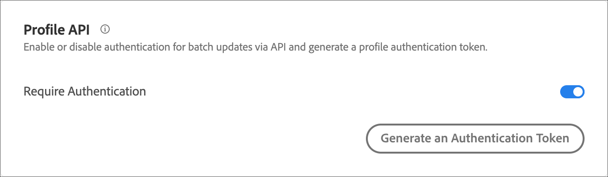
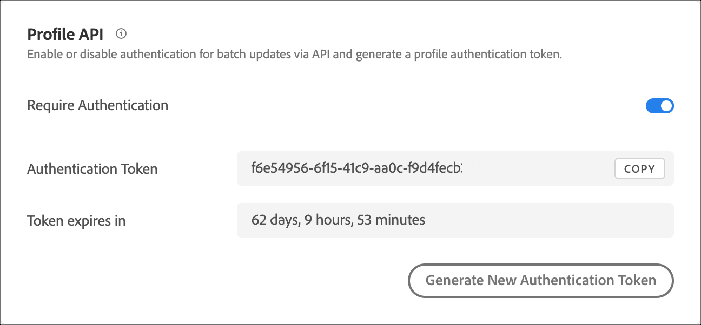

# Profil-API-Einstellungen

Aktivieren oder deaktivieren Sie die Authentifizierung für Batch-Aktualisierungen über [!DNL Adobe Target] APIs und generieren Sie ein Profil-Authentifizierungstoken.

[!DNL Adobe Target] erstellt und verwaltet ein Profil für jeden einzelnen Benutzer. Dieses Profil wird im [!DNL Target] Edge-Cluster gespeichert und nach jedem Besuch in Echtzeit aktualisiert. Sie können ein Profil auch einzeln oder stapelweise über die API aktualisieren.

Für noch mehr Sicherheit können Sie festlegen, dass beim API-Aufruf für die Massenaktualisierung ein gültiges Zugriffstoken im Header der Anforderung übergeben werden muss.

**So erfordern Sie eine Authentifizierung und generieren ein Zugriffs-Token über die [!DNL Target] Benutzeroberfläche:**

1. Klicken Sie **[!UICONTROL Administration]** > **[!UICONTROL Implementierung]**.
1. Schieben **[!UICONTROL unter „Profil]** API“ den **[!UICONTROL Authentifizierung erforderlich]** in die Position „Aktiviert“ oder „Deaktiviert“.

   

1. (Bedingt) Wenn Sie die Authentifizierungspflicht aktiviert haben, klicken Sie auf **[!UICONTROL Neues Profilauthentifizierungstoken erstellen]**.

   

   Das Token läuft gemäß der im Feld „Läuft ab in“ angegebenen Zeit ab.

   Für die Generierung eines Authentifizierungstokens benötigen Sie eine der folgenden Benutzerberechtigungen:

   * Administratorrolle oder mindestens über Rechte als genehmigende Person verfügen

     Weitere Informationen für Target Standard-Kunden finden Sie unter [Festlegen von Rollen und Berechtigungen](https://experienceleague.adobe.com/docs/target/using/administer/manage-users/users/user-management.html#roles-permissions) in *Benutzer*. Weitere Informationen für [!DNL Target Premium]-Kunden finden Sie unter [Konfigurieren von Enterprise-Berechtigungen](https://experienceleague.adobe.com/docs/target/using/administer/manage-users/enterprise/properties-overview.html).

   * Administratorrolle auf der Ebene Arbeitsbereich/Produktprofil

     Arbeitsbereiche stehen nur [!DNL Target Premium]-Kunden zur Verfügung. Weitere Informationen finden Sie unter [Konfigurieren von Enterprise-Berechtigungen](https://experienceleague.adobe.com/docs/target/using/administer/manage-users/enterprise/properties-overview.html).

   * Administratorrechte (Berechtigung „Sysadmin“) auf der [!DNL Adobe Target]-Produktebene

Sie können auch per API ein Profilauthentifizierungstoken generieren. Weitere Informationen finden Sie unter „Profile“ im [Adobe Target Admin- und Profil-API-Handbuch](../../administer/admin-api/admin-api-overview-new.md).

1. Kopieren Sie das Token und fügen Sie es in die Kopfzeile der Anfrage im Format „Autorisierung“ : „Inhaber“ ein.

1. Klicken Sie **[!UICONTROL Neues Profil-Authentifizierungstoken erstellen]**, um das Token nach Bedarf neu zu generieren.

>[!WARNING]
>
>Wenn Sie dieses Token zurücksetzen, schlagen API-Aufrufe mit dem aktuellen Token fehl. Dies erfordert eine Aktualisierung von Skripten oder Apps, die dieses Token verwenden.
