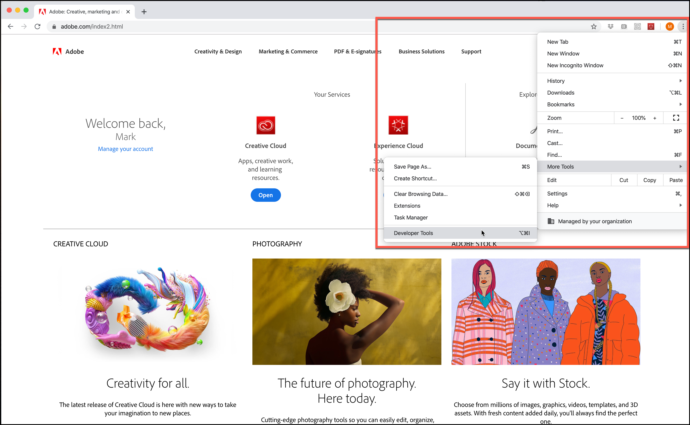

# Änderungen der TLS-Verschlüsselung (Transport Layer Security)

Informationen über Änderungen bei der Verwendung von TLS (Transport Layer Security) durch [!DNL Adobe] und [!DNL Adobe Target], um die höchsten Sicherheitsstandards aufrechtzuerhalten und die Sicherheit von Kundendaten zu fördern.

Transport Layer Security (TLS) ist das am weitesten verbreitete Sicherheitsprotokoll, das aktuell in Webbrowsern und anderen Anwendungen Verwendung findet, bei denen über ein Netzwerk übertragene Daten geschützt werden müssen. Adobe verfügt über Sicherheitsstandards, die das Ende des Lebenszyklus älterer Protokolle erfordern, und schreibt die Verwendung von TLS 1.2 vor, um die aktuellste und sicherste Version verwenden zu können.

>[!WARNING]
>
>Seit dem 1. März 2020 unterstützt [!DNL Target] keine TLS 1.1-Verschlüsselung mehr für Visual Experience Composer (VEC), Enhanced Experience Composer (EEC), Aktivitätsbereitstellung, APIs usw. Bitte aktualisieren Sie auf TLS 1.2, um Probleme zu vermeiden.

Wir gehen davon aus, dass dies keine wesentlichen Auswirkungen auf Kundendaten oder die Berichterstattung haben wird.

## Visual Experience Composer (VEC) mit aktiviertem Enhanced Experience Composer (EEC)

TLS 1.2 ist seit dem 1. März 2020 der Standard und TLS 1.1 wird nicht mehr unterstützt.

Adobe führt TLS 1.2 schrittweise ein. Kunden, deren Domänen bereits mit 1.2 konform sind, müssen beim Übergang zu TLS 1.2 keine Änderungen vornehmen. Die meisten Kunden-Domains unterstützen TLS 1.2 bereits. Wenn Ihre Domain TLS 1.2 jedoch nicht unterstützt, behalten wir diese Domains wie heute (bis März 2020) auf TLS 1.1 bei.

In dieser Übergangsphase sollten keine Probleme auftreten. Wenn der VEC das Laden einer zuvor funktionierenden Site beendet hat, [Öffnen Sie ein Ticket für die Kundenunterstützung](https://experienceleague.adobe.com/docs/target/using/cmp-resources-and-contact-information.html?#reference_ACA3391A00EF467B87930A450050077C) und geben Sie diese Migration als mögliche Ursache an.

Wenn Sie zu den Kunden gehören, deren Domain/Infrastruktur nur TSL 1.1 unterstützt, nicht jedoch TLS 1.2, sollten Sie eine Umstellung auf TLS 1.2 planen. Das Protokoll TLS 1.1 wird noch bis zum Montag, 1. März 2020 unterstützt. Ab dem 1. März 2020 unterstützt [!DNL Target] das TLS 1.1-Protokoll nicht mehr, das für den VEC über die Enhanced Experience Composer-Funktion verwendet werden soll.

Auch wenn allen Kunden der Umstieg auf TLS 1.2 empfohlen wird – falls Sie als neuer Kunde TLS 1.2 *NICHT* unterstützen, teilen Sie dem Kundendienst mit, dass Sie TLS 1.1 für Enhanced Experience Composer verwenden müssen. Planen Sie jedoch den Übergang zu TLS 1.2 ein, da TLS 1.0 nur noch bis zum Montag, 1. März 2020 unterstützt wird.

## Aktivitätsversand

Ab dem 1. März 2020 unterstützen [!DNL Target]-Server TLS 1.1 nicht mehr. Mit dieser Änderung akzeptieren [!DNL Target]-Server keine Anfragen mehr von Besuchern mit älteren Geräten oder Webbrowsern, die TLS 1.2 (oder höher) nicht unterstützen. Daher erhalten ältere Geräte und Browser, die nur TLS 1.1 unterstützen (oder standardmäßig TLS 1.1 unterstützen), keine Aktivitätsinhalte von Adobe Target. Standardinhalte der Site werden gerendert.

Zu den betroffenen älteren Geräten und Browsern gehören:

* Google Chrome (Chrome for Android), Version 29 und früher
* Opera Browser (Opera Mobile) Versionen 12.17 und früher
* Mozilla Firefox (Firefox für Mobile) Versionen 26 und früher
* Android 4.3 und frühere Versionen
* Internet Explorer 8 bis 10 unter Windows 7 und frühere Versionen
* Internet Explorer 10 unter Windows Phone 8.0
* Safari 6.0.4/OS X 10.8.4 und frühere Versionen

Berücksichtigen Sie Folgendes bei der Planung für diese Änderung (beachten Sie, dass der Termin am Montag, 1. März 2020 für alle Punkte gilt):

* Sie müssen sicherstellen, dass Ihre Standardsite vorbereitet ist und auf kompatiblen Geräten und Browsern genutzt werden kann.
* Beachten Sie, dass die Anzahl der Besucher in Ihren [!DNL Target] möglicherweise einen unbedeutenden Rückgang der Besucherzahl verzeichnen kann.
* Möglicherweise müssen Sie Zielgruppen ändern, die speziell für ältere Geräte oder Browser erstellt wurden, die TLS 1.2 nicht unterstützen. Der Versand an diese Geräte und Browser funktioniert nicht mehr.

Weitere Informationen zu unterstützten Browsern und ihren Versionen finden Sie unter [Unterstützte Browser](supported-browsers.md).

## [!DNL Adobe Target]-APIs

Ab dem 1. März 2020 unterstützen [!DNL Target] APIs keine TLS 1.1-Verschlüsselung mehr. Kunden, die auf die API zugreifen, sollten sicherstellen, dass sie nicht von den Auswirkungen betroffen sind.

* API-Clients, die Java 7 mit Standardeinstellungen verwenden, müssen geändert werden, um TLS 1.2 zu unterstützen. Weitere Informationen finden Sie unter &quot;[Ändern der standardmäßigen TLS-Protokollversion für Client-Endpunkte: TLS 1.0 in TLS 1.2](https://www.java.com/en/configure_crypto.html)&quot; auf der Java-Website.
* API-Clients, die Java 8 verwenden, sollten nicht beeinträchtigt werden, da die Standardeinstellung TLS 1.2 ist.
* Bei API-Clients, die andere Frameworks verwenden, müssen Sie die Details zur Unterstützung von TLS 1.2 beim jeweiligen Anbieter erfragen.

## Zugriff auf Experience Cloud Solutions-Schnittstellen

Da die Benutzeroberfläche von [!DNL Target] Standard/Premium bereits einen [modernen Webbrowser](supported-browsers.md) erfordert, gehen wir von Problemen nicht aus. Wenn Sie keine Verbindung zu Target herstellen können, sollten Sie Ihren Browser auf die neueste Version aktualisieren.

## Überprüfen, welche TLS-Version Ihr Browser verwendet

So überprüfen Sie die TLS-Version auf Ihrer Website mit Google Chrome:

1. Öffnen Sie die betroffene Website in Chrome.
1. Klicken Sie im Chrome-Menü (mit den drei senkrechten Auslassungspunkten) auf Weitere Tools > Entwickler-Tools .

   

1. Öffnen Sie die Registerkarte Sicherheit und überprüfen Sie dann die TLS-Versionsinformationen unter Verbindung:

   

>[!NOTE]
>
>Diese Anleitungen sind zum Zeitpunkt der Veröffentlichung aktuell und können sich ändern. Eine schnelle Internet-Suche sollte helfen, falls sich diese Anweisungen ändern. Andere Browser weisen ähnliche Schritte auf.

## Erwartetes Verhalten bei Browsern, die TLS-Versionen unter 1.2 unterstützen

In diesem Abschnitt wird beschrieben, was bei Browsern zu erwarten ist, die TLS-Versionen unter 1.2 nur bei Verwendung einer at.js-Implementierung unterstützen. Zu Vergleichszwecken wird in diesem Abschnitt auch beschrieben, was bei Browsern zu erwarten ist, die TLS 1.2 unterstützen.

### Zentrale Endpunkte

| [!DNL Target] JavaScript-Implementierung | Details |
|--- |--- |
| at.js | Bei aktiviertem TLS 1.0 oder TLS 1.1:<ul><li>Mit Browser-Entwicklungstools wird auf der Registerkarte „Netzwerk“ die Meldung „200 OK“ angezeigt. Das bedeutet, dass die Anfrage erfolgreich war.</li><li>Benutzer sehen die Meldung „Keine sichere Verbindung zu dieser Seite möglich“. In der Nachricht wird erläutert, dass dies möglicherweise daran liegt, dass die Site veraltete oder unsichere TLS-Sicherheitseinstellungen verwendet.</li><li>Es wird kein Konsolenfehler angezeigt.</li></ul>Bei aktiviertem TLS 1.2:<ul><li>Die „at.js“-Datei wird heruntergeladen.</li></ul> |

### Edge-Endpunkte

| [!DNL Target] JavaScript-Implementierung | Details |
|--- |--- |
| Adobe Experience Platform Web SDK | Bei aktiviertem TLS 1.0 oder TLS 1.1:<ul><li>Mit Browser-Entwicklungstools wird auf der Registerkarte „Netzwerk“ die Meldung „200 OK“ angezeigt. Das bedeutet, dass die Anfrage erfolgreich war.</li><li>Benutzer sehen die Meldung „Keine sichere Verbindung zu dieser Seite möglich“. In der Nachricht wird erläutert, dass dies möglicherweise daran liegt, dass die Site veraltete oder unsichere TLS-Sicherheitseinstellungen verwendet.</li><li>Es wird kein Konsolenfehler angezeigt.</li><li>Der Standardinhalt wird bereitgestellt.</li></ul>Bei aktiviertem TLS 1.2:<ul><li>Der Angebotsinhalt wird bereitgestellt.</li></ul> |
| at.js | Bei aktiviertem TLS 1.0 oder TLS 1.1:<ul><li>Mit Browser-Entwicklungstools wird auf der Registerkarte „Netzwerk“ die Meldung „200 OK“ angezeigt. Das bedeutet, dass die Anfrage erfolgreich war.</li><li>Benutzer sehen die Meldung „Keine sichere Verbindung zu dieser Seite möglich“. In der Nachricht wird erläutert, dass dies möglicherweise daran liegt, dass die Site veraltete oder unsichere TLS-Sicherheitseinstellungen verwendet.</li><li>Es wird kein Konsolenfehler angezeigt.</li><li>Der Standardinhalt wird bereitgestellt.</li></ul>Bei aktiviertem TLS 1.2:<ul><li>Der Angebotsinhalt wird bereitgestellt.</li></ul> |

### Aktivität, die auf die Zielgruppe der Browser-Version ausgerichtet ist (Internet Explorer, Versionen 6, 7 oder 8)

Zielgruppen funktionieren nicht mehr.

| [!DNL Target] JavaScript-Implementierung | Details |
|--- |--- |
| Adobe Experience Platform Web SDK | Die Platform SDK wird in Internet Explorer-Versionen vor Version 10 nicht unterstützt. |
| at.js | „at.js“ wird erst ab Internet Explorer 10 unterstützt. |
