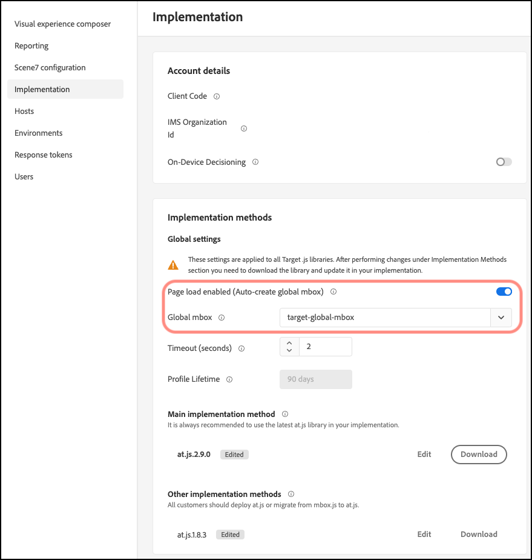

# Anpassen einer globalen Mbox

Informationen zum Anpassen einer [!DNL Adobe Target] globalen Mbox für at.js.

1. Klicken Sie auf **[!UICONTROL Administration]** > **[!UICONTROL Implementation]**.

1. Deaktivieren Sie **[!UICONTROL Page load enabled (Auto create global mbox)]** und fügen Sie dann den Namen der benutzerdefinierten globalen Mbox hinzu, die Sie zum Bereitstellen von Aktivitäten aus [!DNL Target] verwenden möchten.

>[!WARNING]
>
>Die Änderung wird automatisch gespeichert, wenn Sie eine andere globale Mbox auswählen.

Die globale Mbox wird auch für Klick-Tracking eingesetzt.

1. Implementieren Sie die at.js-Bibliothek auf Ihrer Site.

   Weitere Informationen finden [ unter „Bereitstellen von ](/help/dev/implement/client-side/atjs/how-to-deployatjs/how-to-deployatjs.md).js“ .

1. Stimmen Sie die Umstellung mit Ihrer Veröffentlichung zeitlich ab.

   Wenn Sie bereit sind, [!DNL Target] Ihre globale Mbox für alle zukünftigen Aktivitäten zu verwenden, können Sie mit diesem Schritt fortfahren.

   Aktualisieren Sie den Namen der globalen mbox, sodass er dem in Schritt 2 (siehe oben) verwendeten Namen entspricht.

>[!WARNING]
>
>Alle Aktivitäten in Ihrem Konto werden mit dieser Mbox synchronisiert. Stellen Sie sicher, dass die globale Mbox auf Ihrer Site vorhanden ist, damit die Aktivitäten weiterhin funktionieren. Achten Sie darauf, die betroffenen Aktivitäten zu bearbeiten und erneut zu speichern, die mit dem [!UICONTROL Visual Experience Composer] (VEC) erstellt wurden, der mit dieser Mbox synchronisiert wird. Es ist nicht erforderlich, in der [!UICONTROL Form-Based Experience Composer] oder über die API erstellte Aktivitäten erneut zu speichern.
