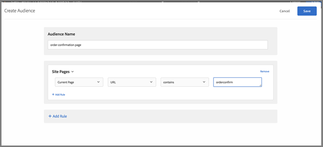
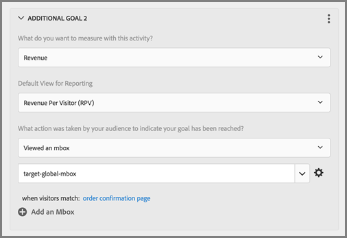

# Häufig gestellte Fragen zu globalen Mboxes

Liste der häufig gestellten Fragen (FAQs) zu globalen Mboxes.

## Kann ich mehr als eine globale Mbox haben, wenn mein [!DNL Target]-Konto über mehrere Domains hinweg eingerichtet ist?

Für Ihr Konto wird nur eine globale Mbox unterstützt.

Sie können den Ausführungsort Ihrer Aktivitäten beschränken, indem Sie Ihren Aktivitäten URL-Regeln hinzufügen. Weitere Informationen finden Sie unter [Gleiches Erlebnis auf ähnlichen Seiten](https://experienceleague.adobe.com/docs/target/using/experiences/vec/temtest.html).

Sie können auch mit [targetPageParams](/help/dev/implement/client-side/atjs/atjs-functions/targetpageparams.md) einen Parameter auf der Seite übergeben und diese Parameter dann im Abschnitt „URL konfigurieren“ im [!UICONTROL Visual Experience Composer] (VEC) auswählen oder indem Sie die Parameter im [!UICONTROL Form-Based Experience Composer] als „Verfeinerungen“ hinzufügen.

## Wie gebe ich Umsatzdaten an eine [!DNL Target] globale Mbox weiter?

Um Umsatz- und Bestellinformationen auf der target-global-mbox zu erfassen, müssen „mbox-Parameter“ an [!DNL Target] gesendet werden. Bei diesen Parametern handelt es sich um Name/Wert-Paare, die zum Senden weiterer Informationen an [!DNL Target] verwendet werden. [!DNL Target] sucht automatisch nach diesen Parametern (reservierte Namen), um Umsatzdaten auszufüllen.

Für die `orderConfirmPage` sollten Sie `orderTotal`, `orderId` und `productPurchasedId` übergeben.

Diese Parameter müssen über `targetPageParams()` an die target-global-mbox gesendet werden. Weitere Informationen finden Sie unter [Übergeben von Parametern an eine globale Mbox](/help/dev/implement/client-side/atjs/global-mbox/pass-parameters-to-global-mbox.md).

Es empfiehlt sich außerdem, dem Konversionsteil eine Zielgruppenbestimmung hinzuzufügen, sodass [!DNL Target] nur Konversionen auf der target-global-mbox zählt, wenn die Bestellbestätigungsseite aufgerufen wurde, wie unten dargestellt:

Der oben abgebildete Abschnitt „Webseiten“ enthält die folgenden Auswahlmöglichkeiten: „Aktuelle Seite“, „URL“, „contains“, „orderconfirm“.

Die Optionen in der oben gezeigten Abbildung umfassen die folgenden Einstellungen:

* **Was möchten Sie mit dieser Aktivität messen:** Umsatz
* **Standardansicht für Berichte:** Umsatz pro Besucher
* **Welche Aktion wurde von Ihrer Zielgruppe unternommen, um anzuzeigen, dass Ihr Ziel erreicht wurde?** hat eine mbox, target-global-mbox angezeigt
