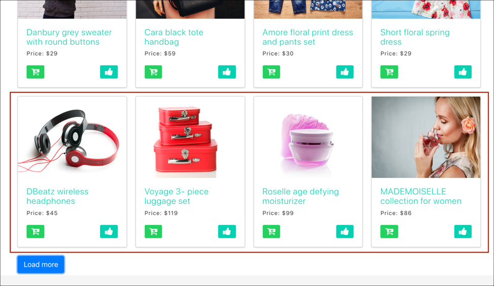

# Implementieren von Einzelseiten-Apps

Herkömmliche Websites arbeiteten auf Basis von Page-to-Page-Navigationsmodellen (auch als Multi-Page-Anwendungen bekannt), bei denen Website-Designs eng an URLs gekoppelt waren und Übergänge von einer Webseite zu einer anderen einen Seitenladevorgang benötigten. Moderne Webanwendungen wie z. B. Einzelseiten-Apps (SPAs) nutzen stattdessen ein Modell, das die Rendering-Funktion der Browseroberfläche beschleunigt, wodurch oft keine Neuladungen der Seite erforderlich sind. Diese Erlebnisse werden oft durch Kundeninteraktionen wie Bildläufe, Klicks und Cursorbewegungen ausgelöst. Mit der Entwicklung neuer Ideen im modernen Web hat sich auch die Relevanz herkömmlicher allgemeiner Ereignisse (z. B. das Laden der Seite) zur Bereitstellung von Personalisierung und Experimenten verringert.


at.js 2.x bietet umfassende Funktionen, mit denen Ihr Unternehmen mithilfe von Client-seitigen Technologien der neuesten Generation Personalisierungen ausführen kann. Diese Version konzentriert sich auf die Verbesserung von at.js, um harmonische Interaktionen mit SPAs zu ermöglichen.

Hier einige Vorteile der Verwendung von at.js 2.x, die in früheren Versionen nicht verfügbar sind:

* Möglichkeit zur Zwischenspeicherung aller Angebote beim Seitenladen, um mehrere Server-Aufrufe auf einen einzelnen Server-Aufruf zu reduzieren
* Drastische Verbesserung der Erlebnisse Ihrer Endbenutzer auf Ihrer Site, da Angebote sofort über den Cache angezeigt werden, ohne dass durch herkömmliche Server-Aufrufe Latenz entsteht
* Einfache Einrichtung mit einmaliger, einzeiliger Codeeingabe und Entwicklerunterstützung, sodass Ihre Marketing-Experten A/B- und Erlebnis-Targeting(XT)-Aktivitäten über VEC in Ihrer SPA erstellen und ausführen können

## [!DNL Adobe Target] und Einzelseitenanwendungen

Das [!DNL Adobe Target] VEC für SPA nutzt ein neues Konzept namens „Ansichten“: eine logische Gruppe visueller Elemente, die zusammen ein SPA-Erlebnis bilden. Eine SPA kann also als eine Reihe von Ansichten anstelle von URLs betrachtet werden, die je nach Benutzerinteraktion aufgerufen werden. Eine Ansicht umfasst in der Regel eine ganze Site oder eine Gruppe visueller Elemente innerhalb einer Site.

Um weiter zu erklären, was Ansichten sind, gehen wir zu dieser hypothetischen Online-E-Commerce-Site, die in React implementiert ist, und sehen uns einige Beispielansichten an. Klicken Sie auf die folgenden Links, um diese Website auf einer neuen Browser-Registerkarte zu öffnen.

**Link: [Startseite](https://target.enablementadobe.com/react/demo/#/)**


Wenn wir zur Homepage navigieren, können wir sofort ein Hero-Bild sehen, das einen Osterverkauf bewirbt, sowie die neuesten Produkte, die auf der Site verkauft werden. In diesem Fall kann die gesamte Homepage als Ansicht definiert werden. Dies sollte beachtet werden, da wir darauf im Abschnitt Implementieren von [!DNL Adobe Target] weiter unten näher eingehen werden.

**Link: [Produktseite](https://target.enablementadobe.com/react/demo/#/products)**


Da uns die Produkte dieses Unternehmens interessieren, klicken wir auf den Link zu den Produkten. Ähnlich wie die Homepage kann die gesamte Produktseite als Ansicht definiert werden. Wir können diese Ansicht „Produkte“ nennen, genau wie der Pfadname in `https://target.enablementadobe.com/react/demo/#/products)`.


Am Anfang dieses Abschnitts haben wir Ansichten als ganze Site oder sogar als eine Gruppe visueller Elemente auf der Site definiert. Wie oben gezeigt, können die vier auf der Site angezeigten Produkte auch gruppiert und als Ansicht betrachtet werden. Als Name für diese Ansicht käme „Produkte“ in Frage.



Klicken Sie auf die Schaltfläche „Mehr laden“, um weitere Produkte auf der Site zu erkunden. In diesem Fall ändert sich die Website-URL nicht. Hier kann auch nur die zweite Zeile der oben gezeigten Produkte als Ansicht angesehen werden. Der Name der Ansicht könnte also „PRODUKTSEITE-2“ lauten.

**link: [Checkout](https://target.enablementadobe.com/react/demo/#/checkout)**


Da uns einige Produkte auf der Site gefallen haben, beschließen wir, ein paar zu kaufen. Auf der Checkout-Site erhalten wir die Möglichkeit, zwischen dem normalen Versand oder der Expresszustellung zu wählen. Da eine beliebige Gruppe visueller Elemente auf einer Site als Ansicht definiert werden kann, können wir diese Ansicht „Versand-Voreinstellungen“ nennen.

Das Konzept Ansichten aber kann noch viel mehr ausgeweitet werden. Für Marketing-Experten, die den Inhalt einer Site je nach Versandpräferenz personalisieren möchten, gibt es die Möglichkeit, eine Ansicht für jede Versandpräferenz zu erstellen. Wenn wir in diesem Fall den normalen Versand auswählen, kann die Ansicht „Normaler Versand“ heißen. Wenn die Expresszustellung ausgewählt wird, kann die Ansicht „Expresszustellung“ lauten.

Ihre Marketing-Experten können auch einen A/B-Test durchführen, um zu sehen, ob die Änderung der Farbe von Blau auf Rot nach Auswahl der Expresszustellung die Konversion im Vergleich zu gleichbleibend blauer Button-Farbe für beide Versandoptionen steigert.

## Implementieren von [!DNL Adobe Target]

Nachdem wir nun die [!DNL Adobe Target] Ansichten behandelt haben, können wir dieses Konzept nutzen, [!DNL Target] es Marketing-Experten zu ermöglichen, A/B- und XT-Tests über den VEC auf SPA durchzuführen. Dies erfordert eine einmalige Einrichtung durch den Entwickler. Führen wir die Schritte zur Einrichtung durch.

1. Installieren Sie at.js 2.*x*.

   Zunächst müssen wir at.js 2 installieren.*x*. Diese Version von at.js wurde mit Blick auf SPA entwickelt. Frühere Versionen von at.js unterstützen keine [!DNL Adobe Target] Views und VEC für SPA.

   Herunterladen von at.js 2.*x* über die [!DNL Adobe Target]-Benutzeroberfläche unter **[!UICONTROL Administration]** > **[!UICONTROL Implementation]**. at.js 2.*x* kann auch über Tags in [!DNL Adobe Experience Platform] bereitgestellt werden.

1. Implementieren von at.js 2.*x*-Funktion, `[triggerView()](/help/dev/implement/client-side/atjs/atjs-functions/adobe-target-triggerview-atjs-2.md)` auf Ihren Sites.

   Nachdem Sie die Ansichten Ihrer SPA definiert haben, in denen Sie einen A/B- oder XT-Test ausführen möchten, implementieren Sie at.js 2.*x* `triggerView()` Funktion mit den als Parameter übergebenen Ansichten. Dadurch können Marketing-Experten VEC zum Entwerfen und Ausführen der A/B- und XT-Tests für diese Ansichten verwenden. Wenn die `triggerView()`-Funktion für diese Ansichten nicht definiert wurde, erkennt VEC die Ansichten nicht, sodass Marketing-Experten den VEC nicht zum Entwerfen und Ausführen von A/B- und XT-Tests verwenden können.

   >[!NOTE]
   >
   >Für die Ansichtsunterstützung in at.js muss [viewsEnabled](/help/dev/implement/client-side/atjs/atjs-functions/targetglobalsettings.md#viewsenbabled) auf „true“ gesetzt sein, da ansonsten alle Ansichtsfunktionen deaktiviert sind.

   **`adobe.target.triggerView(viewName, options)`**

   | Parameter | Typ | Erforderlich? | Validierung | Beschreibung |
   | --- | --- | --- | --- | --- |
   | viewName | Zeichenfolge | Ja | 1. Keine nachfolgenden Leerzeichen.<br />2. Darf nicht leer sein.<br />3. Der Name der Ansicht sollte für alle Seiten eindeutig sein.<br />4. **Warnung:** Der Anzeigename sollte nicht mit „`/`“ beginnen oder enden. Dies liegt daran, dass der Kunde den Anzeigenamen im Allgemeinen aus dem URL-Pfad entnimmt. Für uns sind „home“ und „`/home`“ unterschiedlich.<br />5. **Warnung:** Dieselbe Ansicht sollte nicht mehrmals hintereinander mit der Option `{page: true}` ausgelöst werden. | Geben Sie eine beliebige Zeichenfolge als Namen für Ihre Ansicht an. Dieser Ansichtsname wird im **[!UICONTROL Modifications]** des VEC angezeigt, damit Marketer Aktionen erstellen und ihre A/B- und XT-Aktivitäten ausführen können. |
   | options | Objekt | Nein |  |  |
   | Optionen > Seite | Boolesch | Nein |  | **TRUE**: Der Standardwert der Seite ist „wahr“. Bei `page=true` werden Benachrichtigungen zur Erhöhung der Impressions-Anzahl an die Edge-Server gesendet.<br />**FALSE**: Bei der `page=false` werden keine Benachrichtigungen gesendet, um die Anzahl der Impressionen zu erhöhen. Dies sollte verwendet werden, wenn Sie nur eine Komponente auf einer Seite mit einem Angebot neu rendern möchten. |

   Sehen wir uns nun einige Beispielanwendungsfälle an, in denen beschrieben wird, wie die `triggerView()` in React für unsere hypothetische E-Commerce-SPA aufgerufen wird:

   **Link: [Startseite](https://target.enablementadobe.com/react/demo/#/)**

   

   Wenn wir als Marketer A/B-Tests auf der gesamten Homepage durchführen möchten, bietet es sich an, die Ansicht „Home“ zu nennen:

```
 function targetView() {
   var viewName = window.location.hash; // or use window.location.pathName if router works on path and not hash

   viewName = viewName || 'home'; // view name cannot be empty

   // Sanitize viewName to get rid of any trailing symbols derived from URL
   if (viewName.startsWith('#') || viewName.startsWith('/')) {
     viewName = viewName.substr(1);
   }

   // Validate if the Target Libraries are available on your website
   if (typeof adobe != 'undefined' && adobe.target && typeof adobe.target.triggerView === 'function') {
     adobe.target.triggerView(viewName);
   }
 }

 // react router v4
 const history = syncHistoryWithStore(createBrowserHistory(), store);
 history.listen(targetView);

 // react router v3
 <Router history={hashHistory} onUpdate={targetView} >
```

**Link: [Produktseite](https://target.enablementadobe.com/react/demo/#/products)**

Sehen wir uns ein Beispiel an, das etwas komplizierter ist. Angenommen, wir möchten als Marketing-Experten die zweite Zeile der Produkte personalisieren, indem wir die Farbe des Preisschilds in Rot ändern, nachdem ein Benutzer auf die Schaltfläche Mehr laden geklickt hat.


```
 function targetView(viewName) {
   // Validate if the Target Libraries are available on your website
   if (typeof adobe != 'undefined' && adobe.target && typeof adobe.target.triggerView === 'function') {
     adobe.target.triggerView(viewName);
   }
 }

 class Products extends Component {
   render() {
     return (
       <button type="button" onClick={this.handleLoadMoreClicked}>Load more</button>
     );
   }

   handleLoadMoreClicked() {
     var page = this.state.page + 1; // assuming page number is derived from component's state
     this.setState({page: page});
     targetView('PRODUCTS-PAGE-' + page);
   }
 }
```

**link: [Checkout](https://target.enablementadobe.com/react/demo/#/checkout)**


Für Marketing-Experten, die den Inhalt einer Site je nach Versandpräferenz personalisieren möchten, gibt es die Möglichkeit, eine Ansicht für jede Versandpräferenz zu erstellen. Wenn wir in diesem Fall den normalen Versand auswählen, kann die Ansicht „Normaler Versand“ heißen. Wenn die Expresszustellung ausgewählt wird, kann die Ansicht „Expresszustellung“ lauten.

Ihre Marketing-Experten können auch einen A/B-Test durchführen, um zu sehen, ob die Änderung der Farbe von Blau auf Rot nach Auswahl der Expresszustellung die Konversion im Vergleich zu gleichbleibend blauer Button-Farbe für beide Versandoptionen steigert.

```
 function targetView(viewName) {
   // Validate if the Target Libraries are available on your website
   if (typeof adobe != 'undefined' && adobe.target && typeof adobe.target.triggerView === 'function') {
     adobe.target.triggerView(viewName);
   }
 }

 class Checkout extends Component {
   render() {
     return (
       <div onChange={this.onDeliveryPreferenceChanged}>
         <label>
           <input type="radio" id="normal" name="deliveryPreference" value={"Normal Delivery"} defaultChecked={true}/>
           <span> Normal Delivery (7-10 business days)</span>
         </label>

         <label>
           <input type="radio" id="express" name="deliveryPreference" value={"Express Delivery"}/>
           <span> Express Delivery* (2-3 business days)</span>
         </label>
       </div>
     );
   }
   onDeliveryPreferenceChanged(evt) {
     var selectedPreferenceValue = evt.target.value;
     targetView(selectedPreferenceValue);
   }
 }
```

## Systemdiagramme in at.js 2.x

Die folgenden Diagramme helfen Ihnen dabei, den Arbeitsablauf von at.js 2.x mit Ansichten zu verstehen und wie dieser die Integration der SPAs verbessert. Eine bessere Einführung in die in at.js 2.x verwendeten Konzepte finden Sie unter [Implementieren von Einzelseiten-Apps](/help/dev/implement/client-side/atjs/how-to-deployatjs/target-atjs-single-page-application.md).


| Schritt | Details |
| --- | --- |
| 1 | Ein Aufruf gibt die Experience Cloud-ID zurück, wenn der Benutzer authentifiziert ist; ein anderer Aufruf synchronisiert die Kunden-ID. |
| 2 | Die Bibliothek at.js wird synchron geladen und im Dokumentenkörper verborgen.<br />at.js kann auch asynchron mit einem optionalen Pre-hiding-Snippet geladen werden, das auf der Seite implementiert wird. |
| 3 | Es wird eine Seitenlade-Anfrage durchgeführt, in der alle konfigurierten Parameter (MCID, SDID und Kunden-ID) enthalten sind. |
| 4 | Profilskripte werden ausgeführt und anschließend in den Profilspeicher eingespeist. Der Speicher ruft geeignete Zielgruppen aus der Zielgruppenbibliothek ab (beispielsweise über Adobe Analytics, Zielgruppen-Management etc. bereitgestellte Zielgruppen).<br />Kundenattribute werden in einem Batch-Prozess an den Profilspeicher übermittelt. |
| 5 | Basierend auf den URL-Anfrageparametern und den Profildaten entscheidet [!DNL Target], welche Aktivitäten und Erlebnisse für die aktuelle Seite und zukünftige Ansichten an den Besucher zurückgegeben werden sollen. |
| 6 | Zielgerichteter Inhalt wird zurück an die Seite übermittelt. Dieser enthält optional Profilwerte für eine weitere Personalisierung.<br />Die zielgerichteten Inhalte auf der aktuellen Seite werden so schnell wie möglich bereitgestellt, ohne dass Standardinhalte aufflackern.<br />Zielgerichtete Inhalte für Ansichten, die als Ergebnis von Benutzeraktionen in einer SPA, die im Browser zwischengespeichert wird, angezeigt werden. Die SPA kann sofort ohne zusätzlichen Serveraufruf angewendet werden, wenn die Ansichten durch `triggerView()` ausgelöst werden. |
| 7 | Analytics-Daten werden an Datenerfassungsserver übermittelt. |
| 8 | Zielgruppendaten werden über die SDID mit [!DNL Analytics] abgeglichen und in den [!DNL Analytics]-Reporting-Speicher verarbeitet.<br />Analytics-Daten können dann sowohl in [!DNL Analytics] als auch [!DNL Target] über [!DNL Analytics] für [!DNL Target] (A4T)-Berichte angezeigt werden. |

Egal, wo `triggerView()` in Ihrer SPA implementiert ist, werden die Ansichten und Aktionen aus dem Cache abgerufen und dem Benutzer ohne Serveraufruf gezeigt. `triggerView()` sendet außerdem eine Benachrichtigungsanfrage an das [!DNL Target]-Backend, um Impressions-Zählungen zu erhöhen und aufzuzeichnen.


| Schritt | Details |
| --- | --- |
| 1 | `triggerView()` wird in der Einzelseiten-App aufgerufen, um eine Ansicht wiederzugeben und Aktionen anzuwenden, die visuelle Elemente ändern. |
| 2 | Gezielte Inhalte für die Ansicht werden aus dem Cache gelesen. |
| 3 | Die zielgerichteten Inhalte werden so schnell wie möglich bereitgestellt, ohne dass Standardinhalte aufflackern. |
| 4 | Die Benachrichtigungsanfrage wird an den [!DNL Target]-Profilspeicher gesendet, damit der Besucher in der Aktivität erfasst und die Metrik erhöht wird. |
| 5 | Analysedaten werden an den Datenerfassungsserver gesendet. |
| 6 | Zieldaten werden über die SDID mit [!DNL Analytics] abgeglichen und in den [!DNL Analytics]-Reporting-Speicher verarbeitet. [!DNL Analytics] Daten können dann sowohl in [!DNL Analytics] als auch [!DNL Target] über A4T-Berichte angezeigt werden. |

## Visual Experience Composer für Einzelseiten-Apps (SPAs)

Nachdem Sie die Installation von at.js 2.x abgeschlossen und `triggerView()` zu Ihrer Site hinzugefügt haben, führen Sie mit dem VEC A/B- und XT-Aktivitäten aus. Weitere Informationen finden Sie unter [Visual Experience Composer für Einzelseiten-Apps (SPAs)](https://experienceleague.adobe.com/docs/target/using/experiences/spa-visual-experience-composer.html?lang=de).

>[!NOTE]
>
>VEC für SPAs ist eigentlich derselbe VEC, den Sie auch auf normalen Webseiten verwenden. Es sind jedoch einige zusätzliche Funktionen verfügbar, wenn Sie eine Einzelseiten-App öffnen, bei der `triggerView()` implementiert ist.

## Verwenden Sie TriggerView, um sicherzustellen, dass A4T ordnungsgemäß mit at.js 2.x und SPA funktioniert

Um sicherzustellen, [ „Analytics for Target](https://experienceleague.adobe.com/docs/target/using/integrate/a4t/a4t.html?lang=de) (A4T) ordnungsgemäß mit at.js 2.x funktioniert, müssen Sie dieselbe SDID in der [!DNL Target]-Anfrage und in der [!DNL Analytics]-Anfrage senden.

Best Practices in Bezug auf SPAs:

* Verwenden Sie benutzerspezifische Ereignisse für Benachrichtigungen, wenn in der Anwendung interessante Ereignisse auftreten.
* Auslösen eines benutzerspezifischen Ereignisses vor dem Start der Ansicht
* Auslösen eines benutzerspezifischen Ereignisses, wenn die Anzeige abgeschlossen wird

Zu at.js 2.x wurde eine neue API[-TriggerView ()](/help/dev/implement/client-side/atjs/atjs-functions/adobe-target-triggerview-atjs-2.md)-Funktion hinzugefügt. Sie sollten at.js `triggerView()` darüber informieren, dass eine Ansicht beginnt.

Um zu sehen, wie benutzerspezifische Ereignisse kombiniert werden, sehen wir uns in at.js 2.x und Analytics ein Beispiel an. In diesem Beispiel wird davon ausgegangen, dass die HTML-Seite die Besucher-API gefolgt von at.js 2.x und AppMeasurement enthält.

Nehmen wir an, dass die folgenden benutzerspezifischen Ereignisse vorhanden sind:

* `at-view-start` - Wenn die Ansicht beginnt
* `at-view-end` - Wenn die Ansicht abgeschlossen wird

Um sicherzustellen, dass A4T mit at.js 2.x arbeitet, vergewissern Sie sich von Folgendem:

Der Starthandler für die Ansicht sollte wie folgt aussehen:

```jsx {line-numbers="true"}
document.addEventListener("at-view-start", function(e) {
  var visitor = Visitor.getInstance("<your Adobe Org ID>");
  
  visitor.resetState();
  adobe.target.triggerView("<view name>");
});
```

Der Endhandler für die Ansicht sollte etwa wie folgt aussehen:

```jsx {line-numbers="true"}
document.addEventListener("at-view-end", function(e) {
  // s - is the AppMeasurement tracker object
  s.t();
});
```

>[!NOTE]
>
>Sie müssen die Ereignisse `at-view-start` und `at-view-end` auslösen. Diese Ereignisse sind nicht Teil von benutzerspezifischen at.js-Ereignissen.

Obwohl diese Beispiele JavaScript-Code verwenden, kann all dies vereinfacht werden, wenn Sie einen Tag-Manager verwenden, z. B. Tags in [Adobe Experience Platform](/help/dev/implement/client-side/atjs/how-to-deployatjs/implement-target-using-adobe-launch.md).

Wenn die vorhergehenden Schritte eingehalten werden, sollten Sie eine robuste A4T-Lösung für SPAs haben.

## Best Practices für die Implementierung

Mit den at.js 2.x-APIs können Sie Ihre [!DNL Target] auf viele Arten anpassen. Dabei ist es jedoch wichtig, die richtige Reihenfolge der Vorgänge zu befolgen.

In den folgenden Informationen wird die Reihenfolge der Vorgänge beschrieben, die Sie beim ersten Laden einer Einzelseitenanwendung in einem Browser und bei jeder Ansichtsänderung, die danach erfolgt, befolgen müssen.

### Reihenfolge der Vorgänge beim ersten Laden der Seite {#order}

| Schritt | Aktion | Details |
| --- | --- | --- |
| 1 | VisitorAPI JS laden | Diese Bibliothek ist für die Zuweisung einer ECID zum Besucher verantwortlich. Diese ID wird später von anderen Adobe-Lösungen auf der Web-Seite genutzt. |
| 2 | Laden von at.js 2.x | at.js 2.x lädt alle erforderlichen APIs, die Sie zum Implementieren von [!DNL Target]-Anfragen und -Ansichten verwenden. |
| 3 | [!DNL Target] ausführen | Wenn Sie über eine Datenschicht verfügen, empfehlen wir, wichtige Daten, die an [!DNL Target] gesendet werden müssen, zu laden, bevor Sie die [!DNL Target] ausführen. Auf diese Weise können Sie `targetPageParams` verwenden, um alle Daten einzubeziehen, die Sie für die Zielgruppenbestimmung verwenden möchten.<P>Wenn `pageLoadEnabled` und `viewsEnabled` in „targetGlobalSettings[ auf „true“ gesetzt sind](/help/dev/implement/client-side/atjs/atjs-functions/targetglobalsettings.md) fordert at.js in Schritt 2 automatisch alle VEC-[!DNL Target] an.<P>Beachten Sie, dass `getOffers` auch zum Abrufen von VEC-Angeboten nach dem Laden der Seite verwendet werden kann. Stellen Sie dazu sicher, dass die Anfrage `execute>pageLoad` und `prefetch>views` im API-Aufruf enthält. |
| 4 | `triggerView()` | Da die in Schritt 3 initiierte [!DNL Target] sowohl für die Seitenladeausführung als auch für Ansichten Erlebnisse zurückgeben kann, stellen Sie sicher, dass `triggerView()` aufgerufen wird, nachdem die [!DNL Target]-Anfrage zurückgegeben wurde, und die Anwendung der Angebote auf den Cache abgeschlossen ist. Sie müssen diesen Schritt nur einmal pro Ansicht ausführen. |
| 5 | Rufen Sie den Beacon für die [!DNL Analytics] Seitenansicht auf | Dieses Beacon sendet die mit den Schritten 3 und 4 verknüpfte SDID zum Daten-Stitching an [!DNL Analytics]. |
| 6 | Aufrufen zusätzlicher `triggerView({"page": false})` | Dies ist ein optionaler Schritt für SPA-Frameworks, die bestimmte Komponenten auf der Seite möglicherweise erneut rendern können, ohne dass eine Änderung der Ansicht erfolgt. In solchen Fällen ist es wichtig, dass Sie diese API aufrufen, um sicherzustellen, dass [!DNL Target] Erlebnisse erneut angewendet werden, nachdem das SPA-Framework die Komponenten erneut gerendert hat. Sie können diesen Schritt so oft ausführen, wie Sie sicherstellen möchten, dass [!DNL Target] Erlebnisse in Ihren SPA-Ansichten bestehen bleiben. |

### Reihenfolge der Vorgänge bei Änderung der SPA-Ansicht (kein vollständiges Neuladen der Seite)

| Schritt | Aktion | Details |
| --- | --- | --- |
| 1 | `visitor.resetState()` | Diese API stellt sicher, dass die SDID beim Laden für die neue Ansicht neu generiert wird. |
| 2 | Aktualisieren des Cache durch Aufrufen der `getOffers()`-API | Dies ist ein optionaler Schritt, der ausgeführt werden muss, wenn diese Änderung der Ansicht das Potenzial hat, den aktuellen Besucher für [!DNL Target] Aktivitäten zu qualifizieren oder ihn für Aktivitäten zu disqualifizieren. An dieser Stelle können Sie auch zusätzliche Daten zur Aktivierung weiterer Targeting-Funktionen an [!DNL Target] senden. |
| 3 | `triggerView()` | Wenn Sie Schritt 2 ausgeführt haben, müssen Sie auf die [!DNL Target] warten und die Angebote anwenden, die zwischengespeichert werden sollen, bevor Sie diesen Schritt ausführen. Sie müssen diesen Schritt nur einmal pro Ansicht ausführen. |
| 4 | `triggerView()` | Wenn Sie Schritt 2 nicht ausgeführt haben, können Sie diesen Schritt ausführen, sobald Sie Schritt 1 abgeschlossen haben. Wenn Sie Schritt 2 und Schritt 3 ausgeführt haben, sollten Sie diesen Schritt überspringen. Sie müssen diesen Schritt nur einmal pro Ansicht ausführen. |
| 5 | Rufen Sie den Beacon für die [!DNL Analytics] Seitenansicht auf | Dieses Beacon sendet die mit den Schritten 2, 3 und 4 verknüpfte SDID zum Daten-Stitching an [!DNL Analytics]. |
| 6 | Aufrufen zusätzlicher `triggerView({"page": false})` | Dies ist ein optionaler Schritt für SPA-Frameworks, die bestimmte Komponenten auf der Seite möglicherweise erneut rendern können, ohne dass eine Änderung der Ansicht erfolgt. In solchen Fällen ist es wichtig, dass Sie diese API aufrufen, um sicherzustellen, dass [!DNL Target] Erlebnisse erneut angewendet werden, nachdem das SPA-Framework die Komponenten erneut gerendert hat. Sie können diesen Schritt so oft ausführen, wie Sie sicherstellen möchten, dass [!DNL Target] Erlebnisse in Ihren SPA-Ansichten bestehen bleiben. |

## Schulungsvideos

Weitere Informationen dazu finden Sie in den folgenden Videos:

### Funktionsweise von at.js 2.x

>[!VIDEO](https://video.tv.adobe.com/v/26250/?quality=12)

Weitere Informationen finden Sie unter [Funktionsweise von at.js 2.x](https://experienceleague.adobe.com/docs/target-learn/tutorials/implementation/understanding-how-atjs-20-works.html?lang=de).

### Implementieren von at.js 2.x in einer SPA

>[!VIDEO](https://video.tv.adobe.com/v/34771/?quality=12&captions=ger)

Weitere Informationen finden [ unter „Implementieren von at.js 2.x von Adobe Target in einer Einzelseiten](https://experienceleague.adobe.com/docs/target-learn/tutorials/experiences/use-the-visual-experience-composer-for-single-page-applications.html?lang=de)Anwendung (SPA)“.

### Verwenden des VEC für SPA in [!DNL Adobe Target]

>[!VIDEO](https://video.tv.adobe.com/v/34777/?quality=12&captions=ger)

Weitere [ finden Sie unter „Verwenden des Visual Experience Composer für Einzelseitenanwendungen (SPA VEC) ](https://experienceleague.adobe.com/docs/target-learn/tutorials/experiences/use-the-visual-experience-composer-for-single-page-applications.html?lang=de) Adobe Target&quot;.
