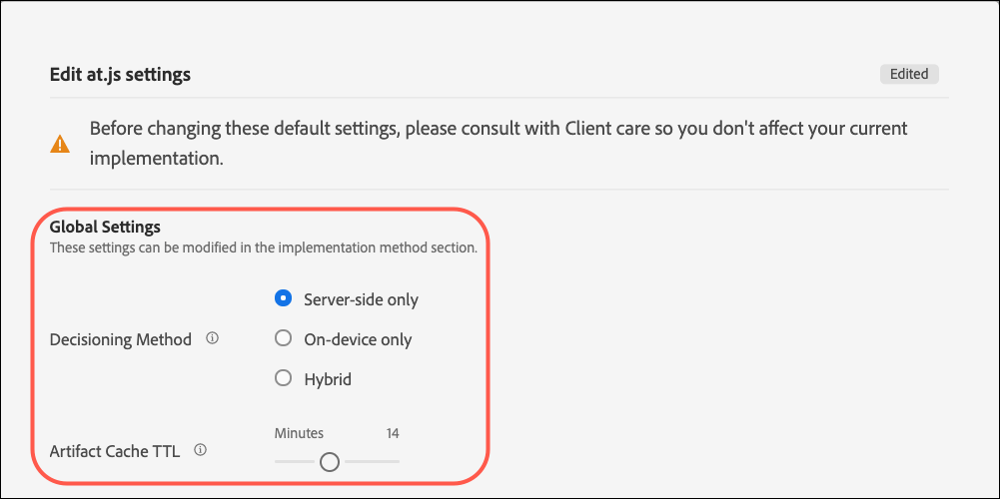

# [!UICONTROL Gerätebezogene Entscheidungsfindung] für at.js

Ab Version 2.5.0 bietet at.js [!UICONTROL on-device decisioning]. [!UICONTROL Gerätebezogene Entscheidungsfindung] ermöglicht Ihnen, Ihre [A/B-Test](https://experienceleague.adobe.com/docs/target/using/activities/abtest/test-ab.html) und [Erlebnis-Targeting](https://experienceleague.adobe.com/docs/target/using/activities/experience-targeting/experience-target.html) (XT) -Aktivitäten im Browser, um speicherinterne Entscheidungen ohne blockierende Netzwerkanforderung für die [!DNL Adobe Target] Edge Network.

>[!NOTE]
>
>[!UICONTROL Gerätebezogene Entscheidungsfindung] ist sowohl für Client-seitige als auch für Server-seitige Implementierungen verfügbar. Dieser Artikel beschreibt [!UICONTROL on-device decisioning] Client-seitig. Informationen über [!UICONTROL on-device decisioning] Informationen zur serverseitigen Implementierung finden Sie in der Dokumentation zur serverseitigen Implementierung . [here](../../../server-side/sdk-guides/on-device-decisioning/overview.md).

[!DNL Target] bietet außerdem die Flexibilität, das relevanteste und aktuellste Erlebnis aus Ihren Experimentierungs- und maschinell lernfähigen (ML-gesteuerten) Personalisierungsaktivitäten über einen Live-Server-Aufruf bereitzustellen. Mit anderen Worten: Wenn die Leistung am wichtigsten ist, können Sie [!UICONTROL on-device decisioning]. Wenn jedoch das relevanteste, aktuellste und ML-gesteuerte Erlebnis benötigt wird, kann stattdessen ein Server-Aufruf durchgeführt werden.

## Welche Vorteile hat das [!UICONTROL on-device decisioning]?

Die Vorteile von [!UICONTROL on-device decisioning] include:

* **Schnelle Entscheidungen und Erlebnisse bieten.** Bucketing- und Entscheidungsfindung werden im Arbeitsspeicher und im Browser durchgeführt, um zu verhindern, dass Netzwerkanforderungen blockiert werden.
* **Verbessern der Anwendungsleistung.** Führen Sie Experimente durch und liefern Sie Ihren Kunden und Benutzern Personalisierung, ohne die Benutzererfahrungen der Endbenutzer zu beeinträchtigen.
* **Verbessern der Google-Site-Qualitätsbewertung.** Wenn Entscheidungen im Speicher getroffen werden, verbessern Sie die Google Site Quality-Bewertung Ihres Onlinegeschäfts, um ihn für die Verbraucher leichter zu finden.
* **Erfahren Sie mehr über Echtzeitanalysen.** Erhalten Sie Einblicke aus Ihrer Aktivitätsleistung in Echtzeit über [Analytics for Target](https://experienceleague.adobe.com/docs/target/using/integrate/a4t/a4t.html) Berichterstellung (A4T). Mit A4T können Sie Ihre Strategie in kritischen Momenten umdrehen.

## Unterstützte Funktionen

Die [!DNL Adobe Target] Das JS-SDK bietet Kunden die Möglichkeit, für Entscheidungen zwischen Leistung und Aktualisierung von Daten zu wählen. Sollte Ihnen also die Bereitstellung der relevantesten und ansprechendsten personalisierten Inhalte über maschinelles Lernen am wichtigsten sein, sollte ein Live-Server-Aufruf durchgeführt werden. Wenn die Leistung jedoch kritischer ist, sollte eine Entscheidung auf dem Gerät und im Speicher getroffen werden. Für [!UICONTROL on-device decisioning] Informationen zu den unterstützten Funktionen finden Sie in der Liste der unterstützten Funktionen:

* Aktivitätstypen 
* Zielgruppen-Targeting
* Zuordnungsmethode

Weitere Informationen finden Sie unter [Unterstützte Funktionen für [!UICONTROL on-device decisioning]](/help/dev/implement/client-side/atjs/on-device-decisioning/supported-features.md).

## Wie funktioniert [!UICONTROL on-device decisioning] arbeiten?

Wenn Sie at.js bereitstellen und initialisieren mit [!UICONTROL on-device decisioning] aktiviert ist, [Regelartefakt](/help/dev/implement/client-side/atjs/on-device-decisioning/rule-artifact.md) , die Folgendes umfasst: [!UICONTROL on-device decisioning] für A/B- und XT-Aktivitäten werden Zielgruppen und Assets vom nächsten Akamai-CDN auf Ihren Besucher heruntergeladen und lokal im Browser Ihres Besuchers zwischengespeichert. Wenn von at.js eine Anfrage zum Abrufen eines Erlebnisses gestellt wird, wird die Entscheidung darüber, welches Erlebnis zurückgegeben werden soll, im Arbeitsspeicher getroffen, basierend auf den im zwischengespeicherten Regelartefakt kodierten Metadaten.

## Entscheidungsmethode

Mit [!UICONTROL on-device decisioning], [!DNL Target] führt eine neue Einstellung mit der Bezeichnung Entscheidungsmethode ein. Die Einstellung der Entscheidungsmethode bestimmt, wie at.js Ihre Erlebnisse bereitstellt. Die Entscheidungsmethode hat drei Werte:

* Nur Server-seitig
* Nur auf dem Gerät
* Hybrid

### Nur Server-seitig

Nur Server-seitig ist die standardmäßige Entscheidungsmethode, die vorkonfiguriert ist, wenn at.js 2.5.0+ implementiert und in Ihren Web-Eigenschaften bereitgestellt wird.

Die Verwendung von Nur Server-seitig als Standardkonfiguration bedeutet, dass alle Entscheidungen im [!DNL Target]-Edge-Netzwerk getroffen werden, was einen blockierenden Server-Aufruf beinhaltet. Dieser Ansatz kann zu einer inkrementellen Latenz führen, bietet aber auch erhebliche Vorteile, wie z. B. die Möglichkeit, [!DNL Target]der maschinellen Lernfunktionen, zu denen [Recommendations](https://experienceleague.adobe.com/docs/target/using/recommendations/recommendations.html), [Automated Personalization](https://experienceleague.adobe.com/docs/target/using/activities/automated-personalization/automated-personalization.html) (AP) und [Automatisches Targeting](https://experienceleague.adobe.com/docs/target/using/activities/auto-target/auto-target-to-optimize.html) Aktivitäten.

Darüber hinaus können Sie Ihre personalisierten Erlebnisse durch Verwendung von [!DNL Target]Das Benutzerprofil von kann leistungsstarke Ergebnisse für Ihr Unternehmen liefern, das sitzungs- und kanalübergreifend beibehalten wird.

Schließlich erlaubt Ihnen Nur Server-seitig, die Adobe Experience Cloud zu verwenden und Zielgruppen anzupassen, die über Audience Manager- und Adobe Analytics-Segmente angesprochen werden können.

Die folgende Abbildung zeigt die Interaktion zwischen Ihrem Besucher, dem Browser, at.js 2.5.0+ und dem [!DNL Adobe Target] Edge-Netzwerk. Dieses Flussdiagramm erfasst neue Besucher und wiederkehrende Besucher.

(Klicken Sie auf Bild , um die volle Breite zu vergrößern.)

{zoomable=&quot;yes&quot;}

Die folgende Liste entspricht den Zahlen im Diagramm:

| Schritt | Beschreibung |
| --- | --- |
| 1 | Die Experience Cloud-Besucher-ID wird aus dem [Adobe Experience Cloud Identity-Dienst](https://experienceleague.adobe.com/docs/id-service/using/home.html?). |
| 2 | Die Bibliothek at.js wird synchron geladen und im Dokumentenkörper verborgen.<br />   Die at.js-Bibliothek kann auch asynchron mit einem optionalen Pre-hiding-Snippet geladen werden, das auf der Seite implementiert ist. |
| 3 | Die at.js-Bibliothek blendet den Text aus, um Flackern zu verhindern. |
| 4 | Es wird eine Seitenladeanforderung durchgeführt, die alle konfigurierten Parameter enthält, z. B. (ECID, Kunden-ID, benutzerdefinierte Parameter, Benutzerprofil usw.). |
| 5 | Profilskripte werden ausgeführt und anschließend in den Profilspeicher eingespeist.<br />Der Profilspeicher ruft geeignete Zielgruppen aus der Zielgruppenbibliothek ab (z. B. über Adobe Analytics, Adobe Audience Manager usw. freigegebene Zielgruppen).<br />Kundenattribute werden in einem Batch-Prozess an den Profilspeicher übermittelt. |
| 6 | Der Profilspeicher wird für die Zielgruppenqualifizierung und -zusammenfassung verwendet, um Aktivitäten zu filtern. |
| 7 | Der resultierende Inhalt wird ausgewählt, nachdem das Erlebnis aus der Live-Umgebung ermittelt wurde. [!DNL Target] Aktivitäten. |
| 8 | Die at.js-Bibliothek blendet die entsprechenden Elemente auf der Seite aus, die mit dem Erlebnis verknüpft sind, das gerendert werden muss. |
| 9 | Die at.js-Bibliothek zeigt den Hauptteil an, sodass der Rest der Seite geladen werden kann, damit der Besucher ihn anzeigen kann. |
| 10 | Die at.js-Bibliothek bearbeitet das DOM, um das Erlebnis aus der [!DNL Target] Edge Network. |
| 11 | Das Erlebnis wird für den Besucher gerendert. |
| 12 | Die gesamte Webseite wird geladen. |
| 13 | Analytics-Daten werden an Datenerfassungsserver übermittelt. |
| 14 | Zielgerichtete Daten werden über die SDID mit Analytics-Daten abgeglichen und im Analytics-Berichtspeicher abgelegt. Analytics-Daten können dann sowohl in Analytics als auch in [!DNL Target] eingesehen werden. Möglich ist dies mithilfe von Berichten des Typs [!UICONTROL Analytics for Target] (A4T). |

### Nur auf dem Gerät

Nur auf dem Gerät ist die Entscheidungsmethode, die in at.js 2.5.0+ festgelegt werden muss, wenn [!UICONTROL on-device decisioning] sollte nur auf allen Webseiten verwendet werden.

[!UICONTROL Gerätebezogene Entscheidungsfindung] Sie können Ihre Erlebnisse und Personalisierungsaktivitäten schnell bereitstellen, da die Entscheidungen aus einem zwischengespeicherten Regelartefakt getroffen werden, das alle Aktivitäten enthält, für die qualifiziert sind [!UICONTROL on-device decisioning].

Weitere Informationen darüber, für welche Aktivitäten [!UICONTROL on-device decisioning], siehe [Unterstützte Funktionen in [!UICONTROL on-device decisioning]](/help/dev/implement/client-side/atjs/on-device-decisioning/supported-features.md).

Diese Entscheidungsmethode sollte nur verwendet werden, wenn die Leistung auf allen Seiten, für die Entscheidungen von Target erforderlich sind, äußerst kritisch ist. Beachten Sie außerdem, dass bei Auswahl dieser Entscheidungsmethode Ihre [!DNL Target]-Aktivitäten, die nicht für die Entscheidungsfindung auf dem Gerät qualifiziert sind, nicht bereitgestellt bzw. ausgeführt werden.  Die Bibliothek at.js 2.5.0+ ist so konfiguriert, dass nur nach dem zwischengespeicherten Regelartefakt gesucht wird, um Entscheidungen zu treffen.

Das folgende Diagramm zeigt die Interaktion zwischen Ihrem Besucher, dem Browser, at.js 2.5.0+ und dem Akamai-CDN. Das Akamai-CDN speichert das Regelartefakt für den ersten Besuch des Besuchers zwischen. Beim ersten Seitenbesuch eines neuen Besuchers muss das JSON-Regelartefakt vom Akamai-CDN heruntergeladen werden, damit es lokal im Browser des Besuchers zwischengespeichert werden kann. Nachdem das JSON-Regelartefakt heruntergeladen wurde, wird die Entscheidung sofort ohne blockierenden Netzwerkaufruf getroffen. Das folgende Flussdiagramm erfasst neue Besucher.

(Klicken Sie auf Bild , um die volle Breite zu vergrößern.)

{zoomable=&quot;yes&quot;}

Die folgende Liste entspricht den Zahlen im Diagramm:

>[!NOTE]
>
>[!DNL Adobe Target] Admin-Server qualifizieren alle Aktivitäten, die für [!UICONTROL on-device decisioning], generieren Sie das JSON-Regelartefakt und übertragen es an das Akamai-CDN. Ihre Aktivitäten werden kontinuierlich auf Aktualisierungen überwacht, um ein neues JSON-Regelartefakt auszugeben, das an das Akamai-CDN weitergeleitet wird.

| Schritt | Beschreibung |
| --- | --- |
| 1 | Die Experience Cloud-Besucher-ID wird aus dem [Adobe Experience Cloud Identity-Dienst](https://experienceleague.adobe.com/docs/id-service/using/home.html). |
| 2 | Die Bibliothek at.js wird synchron geladen und im Dokumentenkörper verborgen.<br />Die at.js-Bibliothek kann auch asynchron mit einem optionalen Pre-hiding-Snippet geladen werden, das auf der Seite implementiert ist. |
| 3 | Die at.js-Bibliothek blendet den Text aus, um Flackern zu verhindern. |
| 4 | Die at.js-Bibliothek stellt eine Anfrage, das JSON-Regelartefakt vom nächsten Akamai-CDN an den Besucher abzurufen. |
| 5 | Das Akamai-CDN reagiert mit dem JSON-Regelartefakt. |
| 6 | Das JSON-Regelartefakt wird lokal im Browser des Besuchers zwischengespeichert. |
| 7 | Die at.js-Bibliothek interpretiert das JSON-Regelartefakt, führt die Entscheidung zum Abrufen des Erlebnisses aus und blendet die getesteten Elemente aus. |
| 8 | Die at.js-Bibliothek zeigt den Hauptteil an, sodass der Rest der Seite geladen werden kann, damit der Besucher ihn anzeigen kann. |
| 9 | Die at.js-Bibliothek bearbeitet das DOM, um das Erlebnis aus dem zwischengespeicherten JSON-Regelartefakt zu rendern. |
| 10 | Das Erlebnis wird für den Besucher gerendert. |
| 11 | Die gesamte Webseite wird geladen. |
| 12 | Analytics-Daten werden an Datenerfassungsserver übermittelt. Zielgerichtete Daten werden über die SDID mit Analytics-Daten abgeglichen und im Analytics-Berichtspeicher abgelegt. Analytics-Daten können dann sowohl in Analytics als auch in [!DNL Target] eingesehen werden. Möglich ist dies mithilfe von Berichten des Typs [!UICONTROL Analytics for Target] (A4T). |

Das folgende Diagramm zeigt die Interaktion zwischen Ihrem Besucher, dem Browser, at.js 2.5.0+ und dem zwischengespeicherten JSON-Regelartefakt für den nachfolgenden Seitenaufruf oder den wiederkehrenden Besuch des Besuchers. Da das JSON-Regelartefakt bereits zwischengespeichert und im Browser verfügbar ist, wird die Entscheidung sofort ohne blockierenden Netzwerkaufruf getroffen. Dieses Flussdiagramm erfasst nachfolgende Seitennavigation oder wiederkehrende Besucher.

(Klicken Sie auf Bild , um die volle Breite zu vergrößern.)

{zoomable=&quot;yes&quot;}

Die folgende Liste entspricht den Zahlen im Diagramm:

>[!NOTE]
>
>[!DNL Adobe Target] Admin-Server qualifizieren alle Aktivitäten, die für [!UICONTROL on-device decisioning], generieren Sie das JSON-Regelartefakt und übertragen es an das Akamai-CDN. Ihre Aktivitäten werden kontinuierlich auf Aktualisierungen überwacht, um ein neues JSON-Regelartefakt auszugeben, das an das Akamai-CDN weitergeleitet wird.

| Schritt | Beschreibung |
| --- | --- |
| 1 | Die Experience Cloud-Besucher-ID wird aus dem [Adobe Experience Cloud Identity-Dienst](https://experienceleague.adobe.com/docs/id-service/using/home.html). |
| 2 | Die Bibliothek at.js wird synchron geladen und im Dokumentenkörper verborgen.<br />Die at.js-Bibliothek kann auch asynchron mit einem optionalen Pre-hiding-Snippet geladen werden, das auf der Seite implementiert ist. |
| 3 | Die at.js-Bibliothek blendet den Text aus, um Flackern zu verhindern. |
| 4 | Die at.js-Bibliothek interpretiert das JSON-Regelartefakt und führt die Entscheidung im Speicher aus, das Erlebnis abzurufen. |
| 5 | Die getesteten Elemente sind ausgeblendet. |
| 6 | Die at.js-Bibliothek zeigt den Hauptteil an, sodass der Rest der Seite geladen werden kann, damit der Besucher ihn anzeigen kann. |
| 7 | Die at.js-Bibliothek bearbeitet das DOM, um das Erlebnis aus dem zwischengespeicherten JSON-Regelartefakt zu rendern. |
| 8 | Das Erlebnis wird für den Besucher gerendert. |
| 9 | Die gesamte Webseite wird geladen. |
| 10 | Analytics-Daten werden an Datenerfassungsserver übermittelt. Zielgerichtete Daten werden über die SDID mit Analytics-Daten abgeglichen und im Analytics-Berichtspeicher abgelegt. Analytics-Daten können dann sowohl in Analytics als auch in [!DNL Target] eingesehen werden. Möglich ist dies mithilfe von Berichten des Typs [!UICONTROL Analytics for Target] (A4T). |

### Hybrid

Hybrid ist die Entscheidungsmethode, die in at.js 2.5.0+ festgelegt werden muss, wenn beide [!UICONTROL on-device decisioning] und Aktivitäten, die einen Netzwerkaufruf an die [!DNL Adobe Target] Das Edge-Netzwerk muss ausgeführt werden.

Wenn Sie beide [!UICONTROL on-device decisioning] Aktivitäten und serverseitigen Aktivitäten zu implementieren, kann es bei der Bereitstellung und Bereitstellung ein wenig kompliziert und mühsam sein. [!DNL Target] auf Ihren Seiten. Bei „Hybrid“ als Entscheidungsmethode weiß [!DNL Target], wann ein Server-Aufruf an das Edge-Netzwerk für Aktivitäten durchgeführt werden muss, für die eine Server-seitige Ausführung erforderlich ist, und wann nur Entscheidungen auf dem Gerät ausgeführt werden sollen.[!DNL Adobe Target]

Das JSON-Regelartefakt enthält Metadaten, die at.js darüber informieren, ob eine Mbox eine serverseitige Aktivität oder eine [!UICONTROL on-device decisioning] -Aktivität. Diese Entscheidungsmethode stellt sicher, dass Aktivitäten, die Sie schnell bereitstellen möchten, über [!UICONTROL on-device decisioning] und für Aktivitäten, die eine leistungsfähigere ML-gesteuerte Personalisierung erfordern, werden diese Aktivitäten über die [!DNL Adobe Target] Edge-Netzwerk.

Die folgende Abbildung zeigt die Interaktion zwischen Ihrem Besucher, dem Browser, at.js 2.5.0+, dem Akamai-CDN und dem [!DNL Adobe Target] Edge Network für einen neuen Besucher, der Ihre Seite zum ersten Mal besucht. Der Nachteil dieses Diagramms besteht darin, dass das JSON-Regelartefakt asynchron heruntergeladen wird, während die Entscheidungen über das [!DNL Adobe Target] Edge-Netzwerk.

Dieser Ansatz stellt sicher, dass die Größe des Artefakts, das viele Aktivitäten umfassen kann, die Latenz der Entscheidung nicht negativ beeinflusst. Das synchrone Herunterladen des JSON-Regelartefakts und die anschließende Entscheidungsfindung können sich ebenfalls nachteilig auf die Latenz auswirken und inkonsistent sein. Daher ist die hybride Entscheidungsmethode eine Best Practice-Empfehlung, immer einen serverseitigen Aufruf für die Entscheidung für einen neuen Besucher durchzuführen, da das JSON-Regelartefakt parallel zwischengespeichert wird. Bei nachfolgenden Seitenbesuchen und erneuten Besuchen werden die Entscheidungen aus dem Cache und im Speicher über das JSON-Regelartefakt getroffen.

(Klicken Sie auf Bild , um die volle Breite zu vergrößern.)

{zoomable=&quot;yes&quot;}

Die folgende Liste entspricht den Zahlen im Diagramm:

>[!NOTE]
>
>[!DNL Adobe Target] Admin-Server qualifizieren alle Aktivitäten, die für [!UICONTROL on-device decisioning], generieren Sie das JSON-Regelartefakt und übertragen es an das Akamai-CDN. Ihre Aktivitäten werden kontinuierlich auf Aktualisierungen überwacht, um ein neues JSON-Regelartefakt auszugeben, das an das Akamai-CDN weitergeleitet wird.

| Schritt | Beschreibung |
| --- | --- |
| 1 | Die Experience Cloud-Besucher-ID wird aus dem [Adobe Experience Cloud Identity-Dienst](https://experienceleague.adobe.com/docs/id-service/using/home.html). |
| 2 | Die Bibliothek at.js wird synchron geladen und im Dokumentenkörper verborgen.<br />Die at.js-Bibliothek kann auch asynchron mit einem optionalen Pre-hiding-Snippet geladen werden, das auf der Seite implementiert ist. |
| 3 | Die at.js-Bibliothek blendet den Text aus, um Flackern zu verhindern. |
| 4 | Eine Seitenladeanforderung wird an die [!DNL Adobe Target] Edge Network, einschließlich aller konfigurierten Parameter wie (ECID, Kunden-ID, benutzerdefinierte Parameter, Benutzerprofil usw.) |
| 5 | Parallel dazu sendet at.js eine Anfrage zum Abrufen des JSON-Regel-Artefakts vom nächsten Akamai-CDN an den Besucher. |
| 6 | ([!DNL Adobe Target] Edge Network) Profilskripte werden ausgeführt und dann in den Profilspeicher eingespeist. Der Profilspeicher ruft geeignete Zielgruppen aus der Zielgruppenbibliothek ab (z. B. über Adobe Analytics, Adobe Audience Manager usw. freigegebene Zielgruppen). |
| 7 | Das Akamai-CDN reagiert mit dem JSON-Regelartefakt. |
| 8 | Der Profilspeicher wird für die Zielgruppenqualifizierung und -zusammenfassung verwendet, um Aktivitäten zu filtern. |
| 9 | Der resultierende Inhalt wird ausgewählt, nachdem das Erlebnis aus der Live-Umgebung ermittelt wurde. [!DNL Target] Aktivitäten. |
| 10 | Die at.js-Bibliothek blendet die entsprechenden Elemente auf der Seite aus, die mit dem Erlebnis verknüpft sind, das gerendert werden muss. |
| 11 | Die at.js-Bibliothek zeigt den Hauptteil an, sodass der Rest der Seite geladen werden kann, damit der Besucher ihn anzeigen kann. |
| 12 | Die at.js-Bibliothek bearbeitet das DOM, um das Erlebnis aus der [!DNL Target] Edge Network. |
| 13 | Das Erlebnis wird für den Besucher gerendert. |
| 14 | Die gesamte Webseite wird geladen. |
| 15 | Analytics-Daten werden an Datenerfassungsserver übermittelt. Zielgerichtete Daten werden über die SDID mit Analytics-Daten abgeglichen und im Analytics-Berichtspeicher abgelegt. Analytics-Daten können dann sowohl in Analytics als auch in [!DNL Target] eingesehen werden. Möglich ist dies mithilfe von Berichten des Typs [!UICONTROL Analytics for Target] (A4T). |

Das folgende Diagramm zeigt die Interaktion zwischen Ihrem Besucher, dem Browser, at.js 2.5.0+ und dem zwischengespeicherten JSON-Regelartefakt für eine nachfolgende Seitennavigation oder einen wiederkehrenden Besuch. In diesem Diagramm konzentrieren Sie sich nur auf den Anwendungsfall, dass eine geräteübergreifende Entscheidung für die nachfolgende Seitennavigation oder den nachfolgenden wiederkehrenden Besuch getroffen wird. Beachten Sie, dass je nachdem, welche Aktivitäten für bestimmte Seiten live sind, ein Server-seitiger Aufruf durchgeführt werden kann, um serverseitige Entscheidungen auszuführen.

(Klicken Sie auf Bild , um die volle Breite zu vergrößern.)

{zoomable=&quot;yes&quot;}

Die folgende Liste entspricht den Zahlen im Diagramm:

>[!NOTE]
>
>[!DNL Adobe Target] Admin-Server qualifizieren alle Aktivitäten, die für [!UICONTROL on-device decisioning], generieren Sie das JSON-Regelartefakt und übertragen es an das Akamai-CDN. Ihre Aktivitäten werden kontinuierlich auf Aktualisierungen überwacht, um ein neues JSON-Regelartefakt auszugeben, das an das Akamai-CDN weitergeleitet wird.

| Schritt | Beschreibung |
| --- | --- |
| 1 | Die Experience Cloud-Besucher-ID wird aus dem [Adobe Experience Cloud Identity-Dienst](https://experienceleague.adobe.com/docs/id-service/using/home.html). |
| 2 | Die Bibliothek at.js wird synchron geladen und im Dokumentenkörper verborgen.<br />Die at.js-Bibliothek kann auch asynchron mit einem optionalen Pre-hiding-Snippet geladen werden, das auf der Seite implementiert ist. |
| 3 | Die at.js-Bibliothek blendet den Text aus, um Flackern zu verhindern. |
| 4 | Es wird eine Anfrage zum Abrufen eines Erlebnisses gesendet. |
| 5 | Die at.js-Bibliothek bestätigt, dass das JSON-Regelartefakt bereits zwischengespeichert wurde, und führt die Entscheidung im Speicher aus, das Erlebnis abzurufen. |
| 6 | Die getesteten Elemente sind ausgeblendet. |
| 7 | Die at.js-Bibliothek zeigt den Hauptteil an, sodass der Rest der Seite geladen werden kann, damit der Besucher ihn anzeigen kann. |
| 8 | Die at.js-Bibliothek bearbeitet das DOM, um das Erlebnis aus dem zwischengespeicherten JSON-Regelartefakt zu rendern. |
| 9 | Das Erlebnis wird für den Besucher gerendert. |
| 10 | Die gesamte Webseite wird geladen. |
| 11 | Analytics-Daten werden an Datenerfassungsserver übermittelt. Zielgerichtete Daten werden über die SDID mit Analytics-Daten abgeglichen und im Analytics-Berichtspeicher abgelegt. Analytics-Daten können dann sowohl in Analytics als auch in [!DNL Target] eingesehen werden. Möglich ist dies mithilfe von Berichten des Typs [!UICONTROL Analytics for Target] (A4T). |

## Wie aktiviere ich [!UICONTROL on-device decisioning]?

[!UICONTROL Gerätebezogene Entscheidungsfindung] ist für alle verfügbar [!DNL Target] Kunden, die at.js 2.5.0 oder höher verwenden.

Aktivieren [!UICONTROL on-device decisioning]:

>[!NOTE]
>
>Sie müssen über einen Administrator oder Genehmiger verfügen. [Benutzerrolle](https://experienceleague.adobe.com/docs/target/using/administer/manage-users/user-management.html) , um den Umschalter On-Device Decisioning zu aktivieren oder zu deaktivieren.

1. Klicks **[!UICONTROL Administration]** > **[!UICONTROL Implementierung]** > **[!UICONTROL Kontodetails]**.
1. under **[!UICONTROL Kontodetails]**, schieben Sie die **[!UICONTROL On-Device Decisioning]** Umschalten auf die Position &quot;Ein&quot;.

   ![[!UICONTROL Gerätebezogene Entscheidungsfindung] Umschalten](assets/on-device-decisioning-toggle.png)

   &quot;Alle vorhandenen einschließen&quot; [!UICONTROL on-device decisioning] Die Option &quot;qualifizierte Aktivitäten im Artefakt&quot;wird angezeigt, wenn Sie [!UICONTROL on-device decisioning].
1. (Bedingt) Schieben Sie den Umschalter in die &quot;Ein&quot;-Position, wenn Sie alle Live-Nachrichten [!DNL Target] Aktivitäten, die für [!UICONTROL on-device decisioning] automatisch in das Artefakt aufgenommen werden.

   Wenn Sie diesen Umschalter deaktivieren, müssen Sie alle [!UICONTROL on-device decisioning] -Aktivitäten, damit sie in das generierte Regelartefakt einbezogen werden. Mit anderen Worten: Aktivitäten, die sich im Live-Status befinden, bevor der Umschalter &quot;On-Device Decisioning&quot;aktiviert wird, sind nicht im Regelartefakt enthalten.

Nach Aktivierung des Umschalters &quot;On-Device Decisioning&quot;, [!DNL Target] beginnt mit der Erzeugung und Verbreitung [ruleArtefakte](/help/dev/implement/client-side/atjs/on-device-decisioning/rule-artifact.md) für Ihren Client.

>[!WARNING]
>
>Stellen Sie sicher, dass Sie den Umschalter aktivieren, bevor Sie die [!DNL Adobe Target] Zu verwendendes SDK [!UICONTROL on-device decisioning]. Die Regelartefakte müssen zuerst generiert und an die Akamai-CDNs für [!UICONTROL on-device decisioning] zu arbeiten. Es kann fünf bis zehn Minuten dauern, bis das erste Regelartefakt generiert und an das Akamai-CDN übertragen wird.

## So konfiguriere ich at.js 2.5.0+ für die Verwendung [!UICONTROL on-device decisioning]?

1. Klicks **[!UICONTROL Administration]** > **[!UICONTROL Implementierung]** > **[!UICONTROL Kontodetails]**.
1. under **[!UICONTROL Implementierungsmethoden]** > **[!UICONTROL Hauptimplementierungsmethode]** klicken **[!UICONTROL Bearbeiten]** neben Ihrer at.js-Version (at.js 2.5.0 oder höher).

   

   >[!WARNING]
   >
   >Wenden Sie sich vor dem Ändern dieser Standardeinstellungen an den Kundendienst, um Auswirkungen auf Ihre aktuelle Implementierung zu vermeiden.

1. Wählen Sie die gewünschte Entscheidungsmethode aus:

   * Nur Server-seitig
   * Nur auf dem Gerät
   * Hybrid

   

### Globale Einstellungen

Sie können eine standardmäßige Entscheidungsmethode für alle [!DNL Target] Entscheidungen. Die verschiedenen Entscheidungsmethoden sind nur serverseitig, nur auf dem Gerät und Hybrid. Die Entscheidungsmethode, die im [!DNL Target] Die Benutzeroberfläche wird in konfiguriert `window.targetGlobalSettings` unter `decisioningMethod` -Feld. Weitere Informationen zum `decisioningMethod` in [targetGlobalSettings()](/help/dev/implement/client-side/atjs/atjs-functions/targetglobalsettings.md#decisioningmethod).

```javascript {line-numbers="true"}
<head> 
    <script type="text/javascript">

        window.targetGlobalSettings = { 
            clientCode: "yourClientCodeHere", 
            imsOrgId: "imsOrgId@AdobeOrg", 
            decisioningMethod: "on-device"

        }; 
    </script>

    <script type="text/javascript" src="at.js"></script> 
</head>
```

### Benutzerdefinierte Einstellung

Wenn Sie die `decisioningMethod` in `window.targetGlobalSettings`, aber die `decisioningMethod` für jeden [!DNL Adobe Target] Entscheidung nach Anwendungsfall können Sie dieses Verfahren durch Angabe von `decisioningMethod` in at.js2.5.0+ [getOffers()](/help/dev/implement/client-side/atjs/atjs-functions/adobe-target-getoffers-atjs-2.md) aufrufen.

```javascript {line-numbers="true"}
adobe.target.getOffers({ 

  decisioningMethod:"on-device", 
  request: { 
    execute: { 
      mboxes: [ 
        { 
          index: 0, 
          name: "homepage" 
        } 
      ] 
    } 
 } 
});
```

>[!NOTE]
>
>Um &quot;on-device&quot;oder &quot;hybrid&quot;als Entscheidungsmethode im getOffers()-Aufruf zu verwenden, stellen Sie sicher, dass die globale Einstellung `decisioningMethod` als &quot;auf dem Gerät&quot;oder &quot;Hybrid&quot;bezeichnet. Die Bibliothek at.js 2.5.0+ muss wissen, ob das JSON-Regelartefakt unmittelbar nach dem Laden auf der Seite heruntergeladen und zwischengespeichert werden soll. Wenn die Entscheidungsmethode für die globale Einstellung auf &quot;Server-seitig&quot;festgelegt ist und die Entscheidungsmethode &quot;auf dem Gerät&quot;oder &quot;Hybrid&quot;an den getOffers()-Aufruf übergeben wird, wird für at.js 2.5.0+ das JSON-Regelartefakt nicht zwischengespeichert, um Ihre Entscheidungen auf dem Gerät auszuführen.

### Artifact Cache TTL

Target stellt Ihre Aktivitäten dar, für die [!UICONTROL on-device decisioning] als ein Artefakt, das aus Metadaten, Regeln und Bedingungen besteht. Dieses Artefakt wird im Akamai-CDN zwischengespeichert. Während des ersten Besuchs Ihres Benutzers lädt der Browser des Benutzers das Artefakt herunter und speichert es zwischen, das Ihre [!UICONTROL on-device decisioning] Aktivitäten.

Bei nachfolgenden Besuchen Ihrer Site prüft der Browser automatisch, ob eine neuere Version des Artefakts heruntergeladen werden muss. Durch diese Prüfung wird Latenz hinzugefügt. Die Artefakt-Cache-TTL definiert die Anzahl der Minuten, die der Browser seit dem letzten erfolgreichen Download nicht auf ein aktualisiertes Artefakt überprüfen soll. Je länger der Zeitrahmen, desto besser die Leistung. Je kürzer der Zeitrahmen ist, desto besser ist die Aktualisierung der Daten, jedoch auf Kosten zusätzlicher Latenz.

## Woher weiß ich, dass eine Aktivität [!UICONTROL on-device decisioning] förderfähig?

Nachdem Sie eine Aktivität erstellt haben, die [!UICONTROL on-device decisioning] Eine qualifizierte Beschriftung, die On-Device Decisioning Eligible lautet, ist auf der Übersichtsseite der Aktivität sichtbar.


Diese Bezeichnung bedeutet nicht, dass die Aktivität immer über bereitgestellt wird. [!UICONTROL on-device decisioning]. Nur wenn at.js 2.5.0 oder höher für die Verwendung konfiguriert ist [!UICONTROL on-device decisioning] wird diese Aktivität auf dem Gerät ausgeführt. Wenn at.js 2.5.0 oder höher nicht für die Verwendung auf dem Gerät konfiguriert ist, wird diese Aktivität weiterhin über einen Server-Aufruf von at.js bereitgestellt.

Sie können nach allen Aktivitäten filtern, die [!UICONTROL on-device decisioning] auf der Seite &quot;Aktivitäten&quot;über den Filter Eignung für On-Device Decisioning.


>[!NOTE]
>
>Nach dem Erstellen und Aktivieren einer Aktivität, die [!UICONTROL on-device decisioning] zulässig ist, kann es fünf bis zehn Minuten dauern, bis es im Regelartefakt enthalten ist, das generiert und an den Akamai CDN-Punkt der Präsenzen übertragen wird.

## Zusammenfassung der Schritte, die erforderlich sind, um [!UICONTROL on-device decisioning] -Aktivitäten werden über at.js 2.5.0 oder höher bereitgestellt?

1. Zugriff auf [!DNL Adobe Target] Benutzeroberfläche und Navigation **[!UICONTROL Administration]** > **[!UICONTROL Implementierung]** > **[!UICONTROL Kontodetails]** um die **[!UICONTROL On-Device Decisioning]** umschalten.
1. Aktivieren Sie die **[!UICONTROL &quot;Alle vorhandenen einschließen [!UICONTROL on-device decisioning] qualifizierte Tätigkeiten im Artefakt&quot;]** umschalten.

   Die erste Generierung von JSON-Regeln-Artefakten kann bis zu 10 Minuten dauern.

1. Erstellen und Aktivieren einer [Aktivitätstyp, der von [!UICONTROL on-device decisioning]](/help/dev/implement/client-side/atjs/on-device-decisioning/supported-features.md)und überprüfen Sie, ob [!UICONTROL on-device decisioning] förderfähig.
1. Legen Sie die **[!UICONTROL Entscheidungsmethode]** entweder **[!UICONTROL &quot;Hybrid&quot;]** oder **[!UICONTROL &quot;Nur auf Gerät&quot;]** über die Benutzeroberfläche für at.js-Einstellungen.
1. Laden Sie at.js 2.5.0+ herunter und stellen Sie es auf Ihren Seiten bereit.
