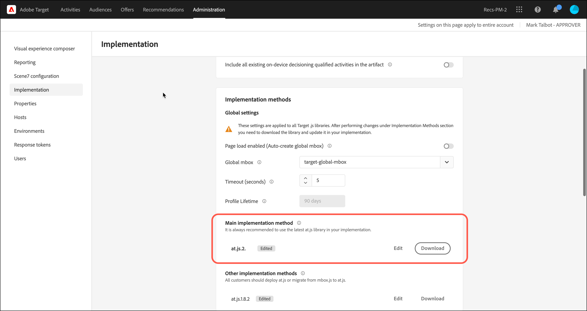
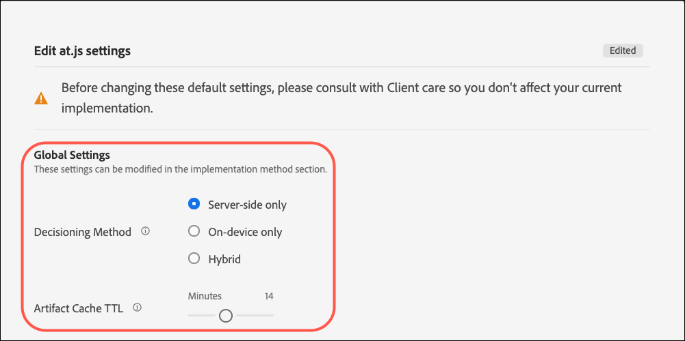
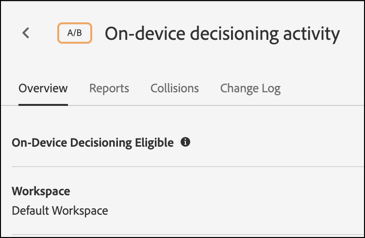
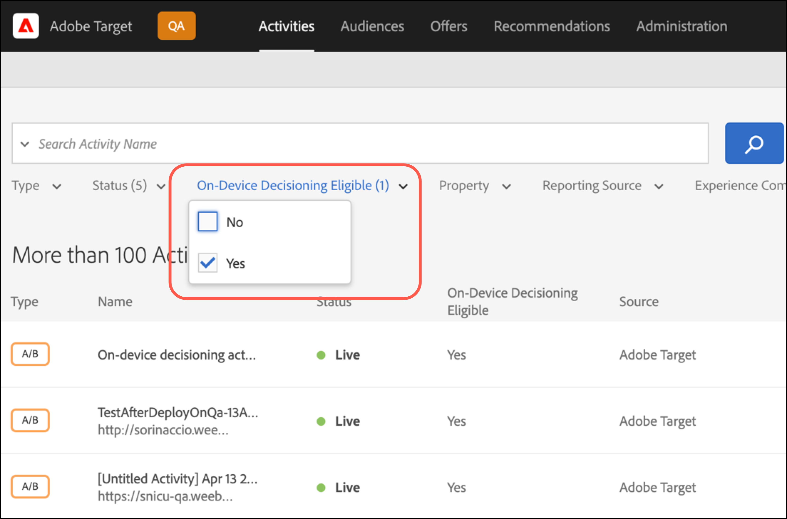

# [!UICONTROL On-Device Decisioning] für at.js

Ab Version 2.5.0 bietet at.js [!UICONTROL On-Device Decisioning]. [!UICONTROL Geräteinterne Entscheidungsfindung] Ermöglicht das Zwischenspeichern Ihrer [A/B-Test](https://experienceleague.adobe.com/docs/target/using/activities/abtest/test-ab.html)- und [Experience Targeting](https://experienceleague.adobe.com/docs/target/using/activities/experience-targeting/experience-target.html)-Aktivitäten im Browser, um speicherinterne Entscheidungsfindungen durchzuführen, ohne eine Blockierung der Netzwerkanfrage an [!DNL Adobe Target] Edge Network.

>[!NOTE]
>
>[!UICONTROL On-Device Decisioning] ist sowohl für Client- als auch für Server-seitige Implementierungen verfügbar. In diesem Artikel wird [!UICONTROL On-Device Decisioning] für Client-seitig beschrieben. Informationen zu [!UICONTROL On-Device Decisioning] für Server-seitig finden Sie in der Dokumentation zur Server-seitigen Implementierung [hier](../../../server-side/sdk-guides/on-device-decisioning/overview.md).

[!DNL Target] bietet außerdem die Flexibilität, über einen Live-Server-Aufruf das relevanteste und aktuellste Erlebnis aus Ihren experimentellen und auf maschinellem Lernen (ML-gesteuert) basierenden Personalisierungsaktivitäten bereitzustellen. Mit anderen Worten: Wenn die Leistung am wichtigsten ist, können Sie die [!UICONTROL geräteinterne Entscheidungsfindung“ &#x200B;]. Wenn jedoch das relevanteste, aktuellste und ML-gesteuerte Erlebnis benötigt wird, kann stattdessen ein Server-Aufruf durchgeführt werden.

## Was sind die Vorteile [!UICONTROL On-Device Decisioning]?

Die Vorteile [!UICONTROL &#x200B; geräteinternen Entscheidungsfindung &#x200B;]:

* **Schnelle Entscheidungen und Erlebnisse.** Bucketing und Entscheidungsfindung werden im Arbeitsspeicher und im Browser durchgeführt, um das Blockieren von Netzwerkanfragen zu vermeiden.
* **Verbesserung der Anwendungsleistung.** Führen Sie Experimente durch und stellen Sie Ihren Kunden und Benutzern Personalisierung bereit, ohne die Erlebnisse der Endbenutzer zu beeinträchtigen.
* **Google Site-Qualitätsbewertung verbessern.** Da die Entscheidungsfindung im Arbeitsspeicher stattfindet, verbessern Sie den Google-Site-Qualitätsindex Ihres Online-Unternehmens, damit es von Verbrauchern besser gefunden werden kann.
* **Lernen aus der Echtzeit-Analyse.** Erkenntnisse aus Ihrer Aktivitätsleistung in Echtzeit über die Berichterstellung von [Analytics for Target](https://experienceleague.adobe.com/docs/target/using/integrate/a4t/a4t.html) (A4T) gewinnen. Mit A4T können Sie Ihre Strategie in kritischen Momenten umstellen.

## Unterstützte Funktionen

Die [!DNL Adobe Target] JS-SDK bietet Kundinnen und Kunden die Flexibilität, bei Entscheidungen zwischen Leistung und Aktualität der Daten zu wählen. Mit anderen Worten: Wenn die Bereitstellung der relevantesten und ansprechendsten personalisierten Inhalte über maschinelles Lernen für Sie am wichtigsten ist, sollte ein Live-Server-Aufruf erfolgen. Wenn die Leistung jedoch kritischer ist, sollte eine Entscheidung auf dem Gerät und im Arbeitsspeicher getroffen werden. Informationen [!UICONTROL &#x200B; Funktionsweise von &#x200B;]On-Device Decisioning“ finden Sie in der Liste der unterstützten Funktionen:

* Aktivitätstypen
* Zielgruppen-Targeting
* Zuordnungsmethode

Weitere Informationen finden Sie unter [Unterstützte Funktionen für die [!UICONTROL geräteinterne Entscheidungsfindung]](/help/dev/implement/client-side/atjs/on-device-decisioning/supported-features.md).

## Wie funktioniert [!UICONTROL On-Device Decisioning]?

Wenn Sie at.js mit aktiviertem [!UICONTROL On-Device Decisioning] bereitstellen und initialisieren, wird ein [Regelartefakt](/help/dev/implement/client-side/atjs/on-device-decisioning/rule-artifact.md) das Ihre [!UICONTROL On-Device Decisioning] für A/B- und XT-Aktivitäten, Zielgruppen und Assets enthält, vom nächstgelegenen Akamai-CDN für Ihren Besucher heruntergeladen und lokal im Browser Ihres Besuchers zwischengespeichert. Wenn at.js den Abruf eines Erlebnisses anfordert, wird die Entscheidung, welches Erlebnis zurückgegeben werden soll, basierend auf den im zwischengespeicherten Regelartefakt codierten Metadaten speicherintern getroffen.

## Entscheidungsmethode

Mit [!UICONTROL On-Device Decisioning] führt [!DNL Target] eine neue Einstellung namens Entscheidungsmethode ein. Die Einstellung Entscheidungsmethode bestimmt, wie at.js Ihre Erlebnisse bereitstellt. Die Entscheidungsmethode hat drei Werte:

* Nur Server-seitig
* Nur auf dem Gerät
* Hybrid

### Nur Server-seitig

Nur Server-seitig ist die standardmäßige Entscheidungsmethode, die vorkonfiguriert ist, wenn at.js 2.5.0+ implementiert und in Ihren Web-Eigenschaften bereitgestellt wird.

Die Verwendung von Nur Server-seitig als Standardkonfiguration bedeutet, dass alle Entscheidungen im [!DNL Target] Edge Network getroffen werden, was einen blockierenden Server-Aufruf beinhaltet. Dieser Ansatz kann zu einer inkrementellen Latenz führen, bietet aber auch erhebliche Vorteile, z. B. die Möglichkeit, die maschinellen Lernfunktionen von [!DNL Target] anzuwenden, zu denen die Aktivitäten [Recommendations](https://experienceleague.adobe.com/docs/target/using/recommendations/recommendations.html), [Automated Personalization](https://experienceleague.adobe.com/docs/target/using/activities/automated-personalization/automated-personalization.html) (AP) und [Automatisches Targeting](https://experienceleague.adobe.com/docs/target/using/activities/auto-target/auto-target-to-optimize.html) gehören.

Darüber hinaus kann die Verbesserung Ihrer personalisierten Erlebnisse mithilfe des Benutzerprofils von [!DNL Target], das sitzungs- und kanalübergreifend beibehalten wird, leistungsstarke Ergebnisse für Ihr Unternehmen liefern.

Schließlich erlaubt Ihnen Nur Server-seitig , die Adobe Experience Cloud zu verwenden und Zielgruppen anzupassen, die über Audience Manager- und Adobe Analytics-Segmente angesprochen werden können.

Das folgende Diagramm veranschaulicht die Interaktion zwischen dem Besucher, dem Browser, at.js 2.5.0+ und dem [!DNL Adobe Target] Edge-Netzwerk. Dieses Flussdiagramm erfasst neue Besucher und wiederkehrende Besucher.

(Klicken Sie auf das Bild, um es auf die volle Breite zu erweitern.)

{zoomable="yes"}

Die folgende Liste entspricht den Zahlen im Diagramm:

| Schritt | Beschreibung |
| --- | --- |
| 1 | Die Experience Cloud-Besucher-ID wird vom [Adobe Experience Cloud Identity Service](https://experienceleague.adobe.com/docs/id-service/using/home.html?) abgerufen. |
| 2 | Die at.js-Bibliothek wird synchron geladen und blendet den Hauptteil des Dokuments aus.<br />   Die at.js-Bibliothek kann auch asynchron geladen werden, wobei ein optionales pre-hiding-Snippet auf der Seite implementiert ist. |
| 3 | Die at.js-Bibliothek blendet den Hauptteil aus, um Flackern zu verhindern. |
| 4 | Es wird eine Seitenladeanfrage gestellt, die alle konfigurierten Parameter wie (ECID, Kunden-ID, benutzerdefinierte Parameter, Benutzerprofil usw.) enthält. |
| 5 | Profilskripte werden ausgeführt und fließen dann in den Profilspeicher ein.<br />Der Profilspeicher fordert qualifizierte Zielgruppen aus der Zielgruppenbibliothek an (z. B. aus Adobe Analytics, Adobe Audience Manager freigegebene Zielgruppen usw.).<br />Kundenattribute werden in einem Batch-Prozess an den Profilspeicher gesendet. |
| 6 | Der Profilspeicher wird für die Zielgruppen-Qualifizierung und Bucketing zum Filtern von Aktivitäten verwendet. |
| 7 | Der resultierende Inhalt wird ausgewählt, nachdem das Erlebnis aus Live-[!DNL Target]-Aktivitäten ermittelt wurde. |
| 8 | Die at.js-Bibliothek blendet die entsprechenden Elemente auf der Seite aus, die mit dem Erlebnis verknüpft sind, das gerendert werden muss. |
| 9 | Die at.js-Bibliothek zeigt den Hauptteil an, sodass der Rest der Seite geladen werden kann, damit der Besucher ihn anzeigen kann. |
| 10 | Die at.js-Bibliothek bearbeitet das DOM, um das Erlebnis aus der [!DNL Target] Edge Network zu rendern. |
| 11 | Das Erlebnis wird für den Besucher dargestellt. |
| 12 | Die gesamte Webseite wird geladen. |
| 13 | Analytics-Daten werden an Datenerfassungsserver übermittelt. |
| 14 | Zielgruppendaten werden über die SDID mit den Analytics-Daten abgeglichen und in den Analytics-Reporting-Speicher verarbeitet. Analysedaten können dann sowohl in Analytics als auch in [!DNL Target] über Berichte [!UICONTROL Analytics for Target] (A4T) angezeigt werden. |

### Nur auf dem Gerät

Nur auf dem Gerät ist die Entscheidungsmethode, die in at.js 2.5.0 oder höher festgelegt werden muss, wenn [!UICONTROL Entscheidungsfindung auf dem Gerät] nur auf Ihren Web-Seiten verwendet werden sollte.

[!UICONTROL On-Device Decisioning] kann Ihre Erlebnisse und Personalisierungsaktivitäten schnell bereitstellen, da die Entscheidungen aus einem zwischengespeicherten Regelartefakt getroffen werden, das alle Ihre Aktivitäten enthält, die für die Entscheidungsfindung [!UICONTROL &#x200B; Gerät qualifiziert &#x200B;].

Weitere Informationen dazu, welche Aktivitäten für die [!UICONTROL On-Device Decisioning] qualifiziert sind, finden Sie unter [Unterstützte Funktionen in [!UICONTROL On-Device Decisioning]](/help/dev/implement/client-side/atjs/on-device-decisioning/supported-features.md).

Diese Entscheidungsmethode sollte nur verwendet werden, wenn die Leistung auf allen Seiten, für die Entscheidungen von Target erforderlich sind, äußerst kritisch ist. Beachten Sie außerdem, dass bei Auswahl dieser Entscheidungsmethode Ihre [!DNL Target] Aktivitäten, die nicht für die [!UICONTROL Entscheidungsfindung auf dem Gerät] qualifiziert sind, nicht bereitgestellt oder ausgeführt werden. Die at.js-Bibliothek 2.5.0+ ist so konfiguriert, dass nur nach dem zwischengespeicherten Regelartefakt gesucht wird, um Entscheidungen zu treffen.

Das folgende Diagramm veranschaulicht die Interaktion zwischen Ihrem Besucher, dem Browser, at.js 2.5.0+ und dem Akamai-CDN. Das Akamai-CDN speichert das Regelartefakt für den ersten Besuch des Besuchers im Zwischenspeicher. Für den ersten Seitenbesuch eines neuen Besuchers muss das JSON-Regelartefakt vom Akamai-CDN heruntergeladen werden, damit es lokal im Browser des Besuchers zwischengespeichert wird. Nachdem das JSON-Regelartefakt heruntergeladen wurde, wird die Entscheidung sofort ohne einen blockierenden Netzwerkaufruf getroffen. Das folgende Flussdiagramm erfasst neue Besucher.

(Klicken Sie auf das Bild, um es auf die volle Breite zu erweitern.)

{zoomable="yes"}

Die folgende Liste entspricht den Zahlen im Diagramm:

>[!NOTE]
>
>[!DNL Adobe Target]-Admin-Server qualifizieren alle Ihre Aktivitäten, die für die [!UICONTROL Entscheidungsfindung auf dem Gerät] infrage kommen, generieren das JSON-Regelartefakt und übertragen es an das Akamai-CDN. Ihre Aktivitäten werden kontinuierlich auf Aktualisierungen überwacht, um ein neues JSON-Regelartefakt auszugeben, das an das Akamai-CDN weitergegeben wird.

| Schritt | Beschreibung |
| --- | --- |
| 1 | Die Experience Cloud-Besucher-ID wird vom [Adobe Experience Cloud Identity Service](https://experienceleague.adobe.com/docs/id-service/using/home.html) abgerufen. |
| 2 | Die Bibliothek at.js wird synchron geladen und im Dokumentenkörper verborgen.<br />Die at.js-Bibliothek kann auch asynchron geladen werden, wobei ein optionales pre-hiding-Snippet auf der Seite implementiert ist. |
| 3 | Die at.js-Bibliothek blendet den Hauptteil aus, um Flackern zu verhindern. |
| 4 | Die at.js-Bibliothek stellt eine Anfrage, um das JSON-Regelartefakt vom nächsten Akamai-CDN für den Besucher abzurufen. |
| 5 | Das Akamai-CDN antwortet mit dem JSON-Regel-Artefakt. |
| 6 | Das JSON-Regelartefakt wird lokal im Browser des Besuchers zwischengespeichert. |
| 7 | Die at.js-Bibliothek interpretiert das JSON-Regelartefakt und führt die Entscheidung zum Abrufen des Erlebnisses aus und blendet die getesteten Elemente aus. |
| 8 | Die at.js-Bibliothek zeigt den Hauptteil an, sodass der Rest der Seite geladen werden kann, damit der Besucher ihn anzeigen kann. |
| 9 | Die at.js-Bibliothek bearbeitet das DOM, um das Erlebnis aus dem zwischengespeicherten JSON-Regel-Artefakt zu rendern. |
| 10 | Das Erlebnis wird für den Besucher dargestellt. |
| 11 | Die gesamte Webseite wird geladen. |
| 12 | Analytics-Daten werden an Datenerfassungsserver übermittelt. Zielgruppendaten werden über die SDID mit den Analytics-Daten abgeglichen und in den Analytics-Reporting-Speicher verarbeitet. Analysedaten können dann sowohl in Analytics als auch in [!DNL Target] über Berichte [!UICONTROL Analytics for Target] (A4T) angezeigt werden. |

Das folgende Diagramm veranschaulicht die Interaktion zwischen Ihrem Besucher, dem Browser, at.js 2.5.0+ und dem zwischengespeicherten JSON-Regel-Artefakt für den nachfolgenden Seitenaufruf oder wiederkehrenden Besuch des Besuchers. Da das JSON-Regelartefakt bereits zwischengespeichert und im Browser verfügbar ist, wird die Entscheidung sofort ohne einen blockierenden Netzwerkaufruf getroffen. Dieses Flussdiagramm erfasst die nachfolgende Seitennavigation oder wiederkehrende Besucher.

(Klicken Sie auf das Bild, um es auf die volle Breite zu erweitern.)

{zoomable="yes"}

Die folgende Liste entspricht den Zahlen im Diagramm:

>[!NOTE]
>
>[!DNL Adobe Target]-Admin-Server qualifizieren alle Ihre Aktivitäten, die für die [!UICONTROL Entscheidungsfindung auf dem Gerät] infrage kommen, generieren das JSON-Regelartefakt und übertragen es an das Akamai-CDN. Ihre Aktivitäten werden kontinuierlich auf Aktualisierungen überwacht, um ein neues JSON-Regelartefakt auszugeben, das an das Akamai-CDN weitergegeben wird.

| Schritt | Beschreibung |
| --- | --- |
| 1 | Die Experience Cloud-Besucher-ID wird vom [Adobe Experience Cloud Identity Service](https://experienceleague.adobe.com/docs/id-service/using/home.html) abgerufen. |
| 2 | Die Bibliothek at.js wird synchron geladen und im Dokumentenkörper verborgen.<br />Die at.js-Bibliothek kann auch asynchron geladen werden, wobei ein optionales pre-hiding-Snippet auf der Seite implementiert ist. |
| 3 | Die at.js-Bibliothek blendet den Hauptteil aus, um Flackern zu verhindern. |
| 4 | Die at.js-Bibliothek interpretiert das JSON-Regelartefakt und führt die Entscheidung im Speicher aus, um das Erlebnis abzurufen. |
| 5 | Die getesteten Elemente sind ausgeblendet. |
| 6 | Die at.js-Bibliothek zeigt den Hauptteil an, sodass der Rest der Seite geladen werden kann, damit der Besucher ihn anzeigen kann. |
| 7 | Die at.js-Bibliothek bearbeitet das DOM, um das Erlebnis aus dem zwischengespeicherten JSON-Regel-Artefakt zu rendern. |
| 8 | Das Erlebnis wird für den Besucher dargestellt. |
| 9 | Die gesamte Webseite wird geladen. |
| 10 | Analytics-Daten werden an Datenerfassungsserver übermittelt. Zielgruppendaten werden über die SDID mit den Analytics-Daten abgeglichen und in den Analytics-Reporting-Speicher verarbeitet. Analysedaten können dann sowohl in Analytics als auch in [!DNL Target] über Berichte [!UICONTROL Analytics for Target] (A4T) angezeigt werden. |

### Hybrid

Hybrid ist die Entscheidungsmethode, die in at.js 2.5.0+ festgelegt werden muss, wenn sowohl [!UICONTROL On-Device Decisioning] als auch Aktivitäten, die einen Netzwerkaufruf an das [!DNL Adobe Target] Edge-Netzwerk erfordern, ausgeführt werden müssen.

Wenn Sie sowohl [!UICONTROL Entscheidungsaktivitäten auf dem Gerät] als auch Server-seitige Aktivitäten verwalten, kann es bei der Bereitstellung von [!DNL Target] auf Ihren Seiten etwas kompliziert und mühsam werden. Bei „Hybrid“ als Entscheidungsmethode weiß [!DNL Target], wann ein Server-Aufruf an das [!DNL Adobe Target] Edge-Netzwerk für Aktivitäten durchgeführt werden muss, für die eine Server-seitige Ausführung erforderlich ist, und wann nur Entscheidungen auf dem Gerät ausgeführt werden sollen.

Das JSON-Regelartefakt enthält Metadaten, die at.js darüber informieren, ob eine Mbox eine Server-seitige Aktivität ausführt oder eine [!UICONTROL On-Device Decisioning]-Aktivität aufweist. Diese Entscheidungsmethode stellt sicher, dass Aktivitäten, die Sie schnell bereitstellen möchten, über [!UICONTROL On-Device Decisioning] durchgeführt werden. Für Aktivitäten, die eine leistungsfähigere ML-gesteuerte Personalisierung erfordern, werden diese Aktivitäten über das [!DNL Adobe Target] Edge-Netzwerk ausgeführt.

Das folgende Diagramm veranschaulicht die Interaktion zwischen Ihrem Besucher, dem Browser, at.js 2.5.0+, dem Akamai-CDN und dem [!DNL Adobe Target] Edge Network für einen neuen Besucher, der Ihre Seite zum ersten Mal besucht. Aus diesem Diagramm geht hervor, dass das JSON-Regelartefakt asynchron heruntergeladen wird, während die Entscheidungen über das [!DNL Adobe Target] Edge-Netzwerk getroffen werden.

Dadurch wird sichergestellt, dass die Größe des Artefakts, die viele Aktivitäten enthalten kann, die Latenz der Entscheidung nicht negativ beeinflusst. Das synchrone Herunterladen des JSON-Regelartefakts und das anschließende Treffen der Entscheidung können sich auch negativ auf die Latenz auswirken und inkonsistent sein. Daher ist die hybride Entscheidungsmethode eine Best-Practice-Empfehlung, für einen neuen Besucher immer einen Server-seitigen Aufruf für die Entscheidung durchzuführen, da das JSON-Regelartefakt parallel zwischengespeichert wird. Bei allen nachfolgenden Seitenbesuchen und wiederkehrenden Besuchen werden die Entscheidungen aus dem Cache und im Arbeitsspeicher über das JSON-Regelartefakt getroffen.

(Klicken Sie auf das Bild, um es auf die volle Breite zu erweitern.)

{zoomable="yes"}

Die folgende Liste entspricht den Zahlen im Diagramm:

>[!NOTE]
>
>[!DNL Adobe Target]-Admin-Server qualifizieren alle Ihre Aktivitäten, die für die [!UICONTROL Entscheidungsfindung auf dem Gerät] infrage kommen, generieren das JSON-Regelartefakt und übertragen es an das Akamai-CDN. Ihre Aktivitäten werden kontinuierlich auf Aktualisierungen überwacht, um ein neues JSON-Regelartefakt auszugeben, das an das Akamai-CDN weitergegeben wird.

| Schritt | Beschreibung |
| --- | --- |
| 1 | Die Experience Cloud-Besucher-ID wird vom [Adobe Experience Cloud Identity Service](https://experienceleague.adobe.com/docs/id-service/using/home.html) abgerufen. |
| 2 | Die Bibliothek at.js wird synchron geladen und im Dokumentenkörper verborgen.<br />Die at.js-Bibliothek kann auch asynchron geladen werden, wobei ein optionales pre-hiding-Snippet auf der Seite implementiert ist. |
| 3 | Die at.js-Bibliothek blendet den Hauptteil aus, um Flackern zu verhindern. |
| 4 | Eine Seitenladeanfrage wird an die [!DNL Adobe Target] Edge Network gesendet, einschließlich aller konfigurierten Parameter wie (ECID, Kunden-ID, benutzerdefinierte Parameter, Benutzerprofil usw.). |
| 5 | Parallel dazu fordert at.js den Besucher auf, das JSON-Regelartefakt vom nächsten Akamai-CDN abzurufen. |
| 6 | ([!DNL Adobe Target] Edge Network) Profilskripte werden ausgeführt und dann in den Profilspeicher übertragen. Der Profilspeicher fordert qualifizierte Zielgruppen aus der Zielgruppenbibliothek an (z. B. aus Adobe Analytics, Adobe Audience Manager freigegebene Zielgruppen usw.). |
| 7 | Das Akamai-CDN antwortet mit dem JSON-Regel-Artefakt. |
| 8 | Der Profilspeicher wird für die Zielgruppen-Qualifizierung und Bucketing zum Filtern von Aktivitäten verwendet. |
| 9 | Der resultierende Inhalt wird ausgewählt, nachdem das Erlebnis aus Live-[!DNL Target]-Aktivitäten ermittelt wurde. |
| 10 | Die at.js-Bibliothek blendet die entsprechenden Elemente auf der Seite aus, die mit dem Erlebnis verknüpft sind, das gerendert werden muss. |
| 11 | Die at.js-Bibliothek zeigt den Hauptteil an, sodass der Rest der Seite geladen werden kann, damit der Besucher ihn anzeigen kann. |
| 12 | Die at.js-Bibliothek bearbeitet das DOM, um das Erlebnis aus der [!DNL Target] Edge Network zu rendern. |
| 13 | Das Erlebnis wird für den Besucher dargestellt. |
| 14 | Die gesamte Webseite wird geladen. |
| 15 | Analytics-Daten werden an Datenerfassungsserver übermittelt. Zielgruppendaten werden über die SDID mit den Analytics-Daten abgeglichen und in den Analytics-Reporting-Speicher verarbeitet. Analysedaten können dann sowohl in Analytics als auch in [!DNL Target] über Berichte [!UICONTROL Analytics for Target] (A4T) angezeigt werden. |

Das folgende Diagramm veranschaulicht die Interaktion zwischen Ihrem Besucher, dem Browser, at.js 2.5.0+ und dem zwischengespeicherten JSON-Regelartefakt für eine nachfolgende Seitennavigation oder einen erneuten Besuch. In diesem Diagramm sollten Sie sich nur auf den Anwendungsfall konzentrieren, dass eine geräteinterne Entscheidung für die nachfolgende Seitennavigation oder den erneuten Besuch getroffen wird. Beachten Sie, dass je nachdem, welche Aktivitäten für bestimmte Seiten aktiv sind, ein Server-seitiger Aufruf erfolgen kann, um Server-seitige Entscheidungen auszuführen.

(Klicken Sie auf das Bild, um es auf die volle Breite zu erweitern.)

{zoomable="yes"}

Die folgende Liste entspricht den Zahlen im Diagramm:

>[!NOTE]
>
>[!DNL Adobe Target]-Admin-Server qualifizieren alle Ihre Aktivitäten, die für die [!UICONTROL Entscheidungsfindung auf dem Gerät] infrage kommen, generieren das JSON-Regelartefakt und übertragen es an das Akamai-CDN. Ihre Aktivitäten werden kontinuierlich auf Aktualisierungen überwacht, um ein neues JSON-Regelartefakt auszugeben, das an das Akamai-CDN weitergegeben wird.

| Schritt | Beschreibung |
| --- | --- |
| 1 | Die Experience Cloud-Besucher-ID wird vom [Adobe Experience Cloud Identity Service](https://experienceleague.adobe.com/docs/id-service/using/home.html) abgerufen. |
| 2 | Die Bibliothek at.js wird synchron geladen und im Dokumentenkörper verborgen.<br />Die at.js-Bibliothek kann auch asynchron geladen werden, wobei ein optionales pre-hiding-Snippet auf der Seite implementiert ist. |
| 3 | Die at.js-Bibliothek blendet den Hauptteil aus, um Flackern zu verhindern. |
| 4 | Es wird eine Anfrage zum Abrufen eines Erlebnisses gestellt. |
| 5 | Die at.js-Bibliothek bestätigt, dass das JSON-Regelartefakt bereits zwischengespeichert wurde, und führt die Entscheidung im Speicher aus, um das Erlebnis abzurufen. |
| 6 | Die getesteten Elemente sind ausgeblendet. |
| 7 | Die at.js-Bibliothek zeigt den Hauptteil an, sodass der Rest der Seite geladen werden kann, damit der Besucher ihn anzeigen kann. |
| 8 | Die at.js-Bibliothek bearbeitet das DOM, um das Erlebnis aus dem zwischengespeicherten JSON-Regel-Artefakt zu rendern. |
| 9 | Das Erlebnis wird für den Besucher dargestellt. |
| 10 | Die gesamte Webseite wird geladen. |
| 11 | Analytics-Daten werden an Datenerfassungsserver übermittelt. Zielgruppendaten werden über die SDID mit den Analytics-Daten abgeglichen und in den Analytics-Reporting-Speicher verarbeitet. Analysedaten können dann sowohl in Analytics als auch in [!DNL Target] über Berichte [!UICONTROL Analytics for Target] (A4T) angezeigt werden. |

## Wie aktiviere ich [!UICONTROL On-Device Decisioning]?

[!UICONTROL On-Device Decisioning] ist für alle [!DNL Target]-Kunden verfügbar, die at.js 2.5.0 oder höher verwenden.

So aktivieren Sie [!UICONTROL On-Device Decisioning]:

>[!NOTE]
>
>Sie müssen über die Admin- oder Genehmiger[Benutzerrolle verfügen, &#x200B;](https://experienceleague.adobe.com/docs/target/using/administer/manage-users/user-management.html) den Umschalter Geräteinterne Entscheidungsfindung zu aktivieren oder zu deaktivieren.

1. Klicken Sie **[!UICONTROL Administration]** > **[!UICONTROL Implementierung]** > **[!UICONTROL Kontodetails]**.
1. Schieben **[!UICONTROL unter &quot;]**&quot; den Umschalter **[!UICONTROL On-Device Decisioning]** auf die Position „Ein“.

   ![[!UICONTROL On-Device Decisioning]-Umschalter](assets/on-device-decisioning-toggle.png)

   Die Option „Alle vorhandenen [!UICONTROL geräteinternen Entscheidungsfindung] qualifizierten Aktivitäten in das Artefakt einbeziehen“ wird angezeigt, wenn Sie [!UICONTROL geräteinterne Entscheidungsfindung“ &#x200B;].
1. (Bedingt) Schieben Sie den Umschalter auf die Position „Ein“, wenn alle Ihre Live [!DNL Target]-Aktivitäten, die für die [!UICONTROL Entscheidungsfindung auf dem Gerät] qualifiziert sind, automatisch in das Artefakt aufgenommen werden sollen.

   Wenn Sie diesen Umschalter deaktiviert lassen, müssen Sie alle [!UICONTROL Entscheidungsaktivitäten auf dem Gerät] neu erstellen und aktivieren, damit sie in das generierte Regelartefakt aufgenommen werden. Mit anderen Worten: Aktivitäten, die sich vor dem Aktivieren des Umschalters Geräteinterne Entscheidungsfindung im Live-Status befinden, sind nicht im Regelartefakt enthalten.

Nach der Aktivierung des Umschalters „Geräteinterne Entscheidungsfindung“ beginnt [!DNL Target] mit der Generierung und Verbreitung [Regelartefakte](/help/dev/implement/client-side/atjs/on-device-decisioning/rule-artifact.md) für Ihren Client.

>[!WARNING]
>
>Stellen Sie sicher, dass Sie den Umschalter aktivieren, bevor Sie die [!DNL Adobe Target] SDK für die Verwendung [!UICONTROL On-Device Decisioning] initialisieren. Die Regelartefakte müssen zunächst generiert und an die Akamai-CDNs weitergegeben werden[!UICONTROL &#x200B; damit die &#x200B;] Entscheidungsfindung auf dem Gerät funktioniert. Es kann fünf bis zehn Minuten dauern, bis das erste Regelartefakt generiert und an das Akamai-CDN weitergegeben wird.

## Wie konfiguriere ich at.js 2.5.0+ für die Verwendung [!UICONTROL On-Device Decisioning]?

1. Klicken Sie **[!UICONTROL Administration]** > **[!UICONTROL Implementierung]** > **[!UICONTROL Kontodetails]**.
1. Klicken **[!UICONTROL unter „Implementierungsmethoden]** > **[!UICONTROL Hauptimplementierungsmethode]** auf **[!UICONTROL Bearbeiten]** neben Ihrer at.js-Version (muss at.js 2.5.0 oder höher sein).

   

   >[!WARNING]
   >
   >Bevor Sie diese Standardeinstellungen ändern, wenden Sie sich an die Kundenunterstützung, um zu vermeiden, dass Ihre aktuelle Implementierung beeinträchtigt wird.

1. Wählen Sie die gewünschte Entscheidungsmethode aus:

   * Nur Server-seitig
   * Nur auf dem Gerät
   * Hybrid

   

### Globale Einstellungen

Sie können eine standardmäßige Entscheidungsmethode für alle [!DNL Target] Entscheidungen konfigurieren. Die verschiedenen Entscheidungsmethoden sind nur Server-seitig, nur auf dem Gerät und Hybrid. Die in der [!DNL Target] Benutzeroberfläche ausgewählte Entscheidungsmethode wird in `window.targetGlobalSettings` unter dem Feld `decisioningMethod` konfiguriert. Weitere Informationen zum `decisioningMethod` finden Sie unter [targetGlobalSettings()](/help/dev/implement/client-side/atjs/atjs-functions/targetglobalsettings.md#decisioningmethod).

```javascript {line-numbers="true"}
<head> 
    <script type="text/javascript">

        window.targetGlobalSettings = { 
            clientCode: "yourClientCodeHere", 
            imsOrgId: "imsOrgId@AdobeOrg", 
            decisioningMethod: "on-device"

        }; 
    </script>

    <script type="text/javascript" src="at.js"></script> 
</head>
```

### Benutzerdefinierte Einstellung

Wenn Sie die `decisioningMethod` in `window.targetGlobalSettings` festlegen, aber die `decisioningMethod` für jede [!DNL Adobe Target] Entscheidung entsprechend Ihrem Anwendungsfall überschreiben möchten, können Sie dieses Verfahren durchführen, indem Sie `decisioningMethod` im Aufruf [getOffers()](/help/dev/implement/client-side/atjs/atjs-functions/adobe-target-getoffers-atjs-2.md) von at.js2.5.0+ angeben.

```javascript {line-numbers="true"}
adobe.target.getOffers({ 

  decisioningMethod:"on-device", 
  request: { 
    execute: { 
      mboxes: [ 
        { 
          index: 0, 
          name: "homepage" 
        } 
      ] 
    } 
 } 
});
```

>[!NOTE]
>
>Um „On-Device“ oder „Hybrid“ als Entscheidungsmethode im Aufruf von getOffers() zu verwenden, stellen Sie sicher, dass die globale Einstellung als „On-Device“ oder „Hybrid“ `decisioningMethod`. Die at.js-Bibliothek 2.5.0+ muss wissen, ob das JSON-Regelartefakt sofort nach dem Laden auf der Seite heruntergeladen und zwischengespeichert werden soll. Wenn die Entscheidungsmethode für die globale Einstellung auf „Server-seitig“ festgelegt ist und die Entscheidungsmethode „On-Device“ oder „Hybrid“ an den Aufruf „getOffers()“ übergeben wird, würde at.js 2.5.0+ nicht das JSON-Regel-Artefakt zwischengespeichert haben, um Ihre Entscheidungen auf dem Gerät auszuführen.

### Artefakt-Cache-TTL

Target stellt Ihre Aktivitäten dar, die für [!UICONTROL On-Device Decisioning] qualifiziert sind, als Artefakt, das aus Metadaten, Regeln und Bedingungen besteht. Dieses Artefakt wird im Akamai-CDN zwischengespeichert. Beim ersten Besuch Ihres Benutzers lädt der Browser des Benutzers das Artefakt herunter und speichert es zwischen, das Ihre [!UICONTROL &#x200B; Entscheidungsaktivitäten &#x200B;] Gerät darstellt.

Bei nachfolgenden Besuchen Ihrer Site prüft der Browser automatisch, ob er eine neuere Version des Artefakts herunterladen muss. Diese Prüfung erhöht die Latenz. Die TTL für den Artefaktcache definiert die Anzahl der Minuten, die der Browser nicht auf ein aktualisiertes Artefakt seit dem letzten erfolgreichen Download überprüfen soll. Je länger der Zeitrahmen ist, desto besser ist die Leistung. Je kürzer der Zeitrahmen, desto besser die Datenfrische, aber auf Kosten der zusätzlichen Latenz.

## Woher weiß ich, dass eine Aktivität [!UICONTROL On-Device Decisioning] geeignet ist?

Nachdem Sie eine Aktivität erstellt haben, die [!UICONTROL Entscheidungsfindung auf dem Gerät] geeignet ist, wird eine Beschriftung, die Entscheidungsfindung auf dem Gerät ermöglicht, auf der Übersichtsseite der Aktivität angezeigt.



Diese Beschriftung bedeutet nicht, dass die Aktivität immer über [!UICONTROL On-Device Decisioning“ bereitgestellt &#x200B;]. Nur wenn at.js 2.5.0+ für die Verwendung [!UICONTROL On-Device Decisioning] konfiguriert ist, wird diese Aktivität auf dem Gerät ausgeführt. Wenn at.js 2.5.0+ nicht für die Verwendung auf dem Gerät konfiguriert ist, wird diese Aktivität weiterhin über einen Server-Aufruf von at.js bereitgestellt.

Sie können über den Filter [!UICONTROL &#x200B; On-Device Decisioning nach allen Aktivitäten filtern, &#x200B;] auf der Seite „Aktivitäten“ geeignet sind.



>[!NOTE]
>
>Nachdem Sie eine Aktivität erstellt und aktiviert haben, die [!UICONTROL Entscheidungsfindung auf dem Gerät] geeignet ist, kann es fünf bis zehn Minuten dauern, bis sie in das Regelartefakt aufgenommen wird, das generiert und an den Akamai-CDN-Punkt der Präsenzen übertragen wird.

## Zusammenfassung der Schritte zur Sicherstellung, dass [!UICONTROL On-Device Decisioning]-Aktivitäten über at.js 2.5.0 bereitgestellt werden+?

1. Rufen Sie die [!DNL Adobe Target]-Benutzeroberfläche auf und navigieren Sie **[!UICONTROL Administration]** > **[!UICONTROL Implementierung]** > **[!UICONTROL Kontodetails]**, um den Umschalter **[!UICONTROL Geräteinterne Entscheidungsfindung]** zu aktivieren.
1. Aktivieren Sie den **[!UICONTROL -Umschalter „Alle vorhandenen [!UICONTROL geräteinternen Entscheidungsfindung] qualifizierten Aktivitäten im Artefakt einschließen]**.

   Die erste Generierung eines JSON-Regelartefakts kann bis zu 10 Minuten dauern.

1. Erstellen und aktivieren Sie einen [Aktivitätstyp, der von [!UICONTROL On-Device Decisioning]](/help/dev/implement/client-side/atjs/on-device-decisioning/supported-features.md) unterstützt wird, und stellen Sie sicher, dass er [!UICONTROL On-Device Decisioning] geeignet ist.
1. Legen Sie die **[!UICONTROL Entscheidungsmethode]** über die Benutzeroberfläche „at.js **[!UICONTROL Einstellungen entweder auf &quot;]**„oder **[!UICONTROL „Nur auf dem Gerät“]** fest.
1. Laden Sie at.js 2.5.0+ herunter und stellen Sie es auf Ihren Seiten bereit.


