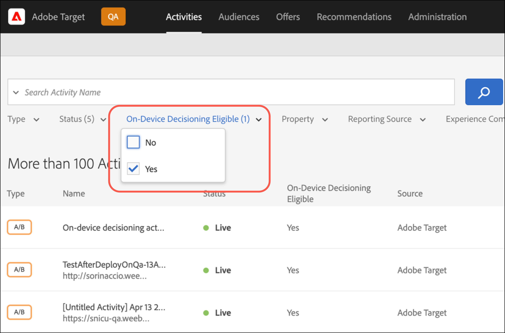

# [!UICONTROL On-device decisioning] für at.js

Ab Version 2.5.0 bietet at.js [!UICONTROL on-device decisioning]. Mit [!UICONTROL On-device decisioning] können Sie Ihre [A/B-Test](https://experienceleague.adobe.com/docs/target/using/activities/abtest/test-ab.html) - und [Erlebnis-Targeting](https://experienceleague.adobe.com/docs/target/using/activities/experience-targeting/experience-target.html) -Aktivitäten (XT) im Browser zwischenspeichern, um speicherinterne Entscheidungen zu treffen, ohne dass eine blockierende Netzwerkanforderung an das Edge Network [!DNL Adobe Target] gesendet wird.

>[!NOTE]
>
>[!UICONTROL On-device decisioning] ist sowohl für Client- als auch für Server-seitige Implementierungen verfügbar. In diesem Artikel wird [!UICONTROL on-device decisioning] für Client-seitig beschrieben. Informationen zu [!UICONTROL on-device decisioning] für Server-seitig finden Sie in der Dokumentation zur serverseitigen Implementierung [hier](../../../server-side/sdk-guides/on-device-decisioning/overview.md).

[!DNL Target] bietet außerdem die Flexibilität, mithilfe eines Live-Server-Aufrufs das relevanteste und aktuellste Erlebnis aus Ihren Erlebnis- und maschinellen Lernaktivitäten (ML-gesteuert) bereitzustellen. Mit anderen Worten: Wenn die Leistung am wichtigsten ist, können Sie [!UICONTROL on-device decisioning] verwenden. Wenn jedoch das relevanteste, aktuellste und ML-gesteuerte Erlebnis benötigt wird, kann stattdessen ein Server-Aufruf durchgeführt werden.

## Welche Vorteile hat [!UICONTROL on-device decisioning]?

Die Vorteile von [!UICONTROL on-device decisioning] sind:

* **Schnelle Entscheidungen und Erlebnisse liefern.** Bucketing und Entscheidungsfindung werden im Arbeitsspeicher und im Browser durchgeführt, um zu verhindern, dass Netzwerkanforderungen blockiert werden.
* **Erhöhen Sie die Anwendungsleistung.** Führen Sie Experimente aus und stellen Sie Ihren Kunden und Benutzern Personalisierungen bereit, ohne die Erlebnisse der Endbenutzer zu beeinträchtigen.
* **Verbessern der Google-Site-Qualitätsbewertung.** Wenn Entscheidungen im Arbeitsspeicher getroffen werden, verbessern Sie die Google Site Quality-Bewertung Ihres Online-Geschäfts, um es für die Verbraucher leichter zu erkennen.
* **Erfahren Sie aus Echtzeitanalysen.** Erhalten Sie Einblicke aus Ihrer Aktivitätsleistung in Echtzeit über die Berichterstellung von [Analytics for Target](https://experienceleague.adobe.com/docs/target/using/integrate/a4t/a4t.html) (A4T). Mit A4T können Sie Ihre Strategie in kritischen Momenten umdrehen.

## Unterstützte Funktionen

Das JS-SDK [!DNL Adobe Target] gibt Kunden die Möglichkeit, für Entscheidungen zwischen Leistung und Aktualisierung von Daten zu wählen. Sollte Ihnen also die Bereitstellung der relevantesten und ansprechendsten personalisierten Inhalte über maschinelles Lernen am wichtigsten sein, sollte ein Live-Server-Aufruf durchgeführt werden. Wenn die Leistung jedoch kritischer ist, sollte eine Entscheidung auf dem Gerät und im Speicher getroffen werden. Damit [!UICONTROL on-device decisioning] funktioniert, lesen Sie die Liste der unterstützten Funktionen:

* Aktivitätstypen 
* Zielgruppen-Targeting
* Zuordnungsmethode

Weitere Informationen finden Sie unter [Unterstützte Funktionen für [!UICONTROL on-device decisioning]](/help/dev/implement/client-side/atjs/on-device-decisioning/supported-features.md).

## Wie wirkt [!UICONTROL on-device decisioning]?

Wenn Sie at.js mit aktiviertem [!UICONTROL on-device decisioning] bereitstellen und initialisieren, wird ein [Regel-Artefakt](/help/dev/implement/client-side/atjs/on-device-decisioning/rule-artifact.md) heruntergeladen, das Ihre [!UICONTROL on-device decisioning] für A/B- und XT-Aktivitäten, Zielgruppen und Assets enthält. Dieses Artefakt wird dann vom nächsten Akamai-CDN an Ihren Besucher heruntergeladen und lokal im Browser Ihres Besuchers zwischengespeichert. Wenn von at.js eine Anfrage zum Abrufen eines Erlebnisses gestellt wird, wird die Entscheidung darüber, welches Erlebnis zurückgegeben werden soll, im Arbeitsspeicher getroffen, basierend auf den im zwischengespeicherten Regelartefakt kodierten Metadaten.

## Entscheidungsmethode

Mit [!UICONTROL on-device decisioning] führt [!DNL Target] eine neue Einstellung namens &quot;Entscheidungsmethode&quot;ein. Die Einstellung der Entscheidungsmethode bestimmt, wie at.js Ihre Erlebnisse bereitstellt. Die Entscheidungsmethode hat drei Werte:

* Nur serverseitig
* Nur auf Gerät
* Hybrid

### Nur serverseitig

Nur serverseitig ist die standardmäßige Entscheidungsmethode, die vorkonfiguriert ist, wenn at.js 2.5.0+ implementiert und in Ihren Webeigenschaften bereitgestellt wird.

Die Verwendung von nur serverseitig als Standardkonfiguration bedeutet, dass alle Entscheidungen im Edge-Netzwerk [!DNL Target] getroffen werden, was einen blockierenden Server-Aufruf beinhaltet. Dieser Ansatz kann zu einer inkrementellen Latenz führen, bietet aber auch erhebliche Vorteile, z. B. die Möglichkeit, die maschinellen Lernfunktionen von [!DNL Target] anzuwenden, zu denen die Aktivitäten [Recommendations](https://experienceleague.adobe.com/docs/target/using/recommendations/recommendations.html), [Automated Personalization](https://experienceleague.adobe.com/docs/target/using/activities/automated-personalization/automated-personalization.html) (AP) und [Automatisches Targeting](https://experienceleague.adobe.com/docs/target/using/activities/auto-target/auto-target-to-optimize.html) gehören.

Darüber hinaus kann die Verbesserung Ihrer personalisierten Erlebnisse mithilfe des Benutzerprofils von [!DNL Target], das sitzungs- und kanalübergreifend beibehalten wird, leistungsstarke Ergebnisse für Ihr Unternehmen liefern.

Schließlich können Sie nur serverseitig die Adobe Experience Cloud verwenden und Zielgruppen anpassen, die über Audience Manager- und Adobe Analytics-Segmente angesprochen werden können.

Das folgende Diagramm zeigt die Interaktion zwischen Ihrem Besucher, dem Browser, at.js 2.5.0+ und dem Edge-Netzwerk [!DNL Adobe Target] . Dieses Flussdiagramm erfasst neue Besucher und wiederkehrende Besucher.

(Klicken Sie auf Bild , um die volle Breite zu vergrößern.)

{zoomable="yes"}

Die folgende Liste entspricht den Zahlen im Diagramm:

| Schritt | Beschreibung |
| --- | --- |
| 1 | Die Experience Cloud-Besucher-ID wird vom [Adobe Experience Cloud Identity Service](https://experienceleague.adobe.com/docs/id-service/using/home.html?) abgerufen. |
| 2 | Die Bibliothek at.js wird synchron geladen und im Dokumentenkörper verborgen.<br />   Die at.js-Bibliothek kann auch asynchron mit einem optionalen Pre-hiding-Snippet geladen werden, das auf der Seite implementiert ist. |
| 3 | Die at.js-Bibliothek blendet den Text aus, um Flackern zu verhindern. |
| 4 | Es wird eine Seitenladeanforderung durchgeführt, die alle konfigurierten Parameter enthält, z. B. (ECID, Kunden-ID, benutzerdefinierte Parameter, Benutzerprofil usw.). |
| 5 | Profilskripte werden ausgeführt und dann in den Profilspeicher eingespeist.<br />Der Profilspeicher ruft geeignete Zielgruppen aus der Zielgruppenbibliothek ab (z. B. über Adobe Analytics, Adobe Audience Manager usw. freigegebene Zielgruppen).<br />Kundenattribute werden in einem Batch-Prozess an den Profilspeicher übermittelt. |
| 6 | Der Profilspeicher wird für die Zielgruppenqualifizierung und -zusammenfassung verwendet, um Aktivitäten zu filtern. |
| 7 | Der resultierende Inhalt wird ausgewählt, nachdem das Erlebnis aus Live-Aktivitäten mit dem Wert [!DNL Target] ermittelt wurde. |
| 8 | Die at.js-Bibliothek blendet die entsprechenden Elemente auf der Seite aus, die mit dem Erlebnis verknüpft sind, das gerendert werden muss. |
| 9 | Die at.js-Bibliothek zeigt den Hauptteil an, sodass der Rest der Seite geladen werden kann, damit der Besucher ihn anzeigen kann. |
| 10 | Die Bibliothek at.js bearbeitet das DOM, um das Erlebnis aus dem Edge Network [!DNL Target] zu rendern. |
| 11 | Das Erlebnis wird für den Besucher gerendert. |
| 12 | Die gesamte Webseite wird geladen. |
| 13 | Analytics-Daten werden an Datenerfassungsserver übermittelt. |
| 14 | Zielgruppendaten werden über die SDID mit Analytics-Daten abgeglichen und im Analytics-Berichtspeicher verarbeitet. Analysedaten können dann sowohl in Analytics als auch in [!DNL Target] über [!UICONTROL Analytics for Target] (A4T)-Berichte angezeigt werden. |

### Nur auf Gerät

Nur auf dem Gerät ist die Entscheidungsmethode, die in at.js 2.5.0 oder höher festgelegt werden muss, wenn [!UICONTROL on-device decisioning] nur auf allen Webseiten verwendet werden soll.

[!UICONTROL On-device decisioning] kann Ihre Erlebnisse und Personalisierungsaktivitäten schnell bereitstellen, da die Entscheidungen aus einem zwischengespeicherten Regel-Artefakt getroffen werden, das all Ihre Aktivitäten enthält, die für [!UICONTROL on-device decisioning] qualifiziert sind.

Weitere Informationen darüber, welche Aktivitäten für [!UICONTROL on-device decisioning] qualifiziert sind, finden Sie unter [Unterstützte Funktionen in [!UICONTROL on-device decisioning]](/help/dev/implement/client-side/atjs/on-device-decisioning/supported-features.md).

Diese Entscheidungsmethode sollte nur verwendet werden, wenn die Leistung auf allen Seiten, für die Entscheidungen von Target erforderlich sind, äußerst kritisch ist. Beachten Sie außerdem, dass bei Auswahl dieser Entscheidungsmethode Ihre [!DNL Target] -Aktivitäten, die nicht für [!UICONTROL on-device decisioning] qualifiziert sind, nicht bereitgestellt oder ausgeführt werden. Die Bibliothek at.js 2.5.0+ ist so konfiguriert, dass nur nach dem zwischengespeicherten Regelartefakt gesucht wird, um Entscheidungen zu treffen.

Das folgende Diagramm zeigt die Interaktion zwischen Ihrem Besucher, dem Browser, at.js 2.5.0+ und dem Akamai-CDN. Das Akamai-CDN speichert das Regelartefakt für den ersten Besuch des Besuchers zwischen. Beim ersten Seitenbesuch eines neuen Besuchers muss das JSON-Regelartefakt vom Akamai-CDN heruntergeladen werden, damit es lokal im Browser des Besuchers zwischengespeichert werden kann. Nachdem das JSON-Regelartefakt heruntergeladen wurde, wird die Entscheidung sofort ohne blockierenden Netzwerkaufruf getroffen. Das folgende Flussdiagramm erfasst neue Besucher.

(Klicken Sie auf Bild , um die volle Breite zu vergrößern.)

{zoomable="yes"}

Die folgende Liste entspricht den Zahlen im Diagramm:

>[!NOTE]
>
>[!DNL Adobe Target] Admin-Server qualifizieren alle Aktivitäten, die für [!UICONTROL on-device decisioning] infrage kommen, generieren das JSON-Regelartefakt und übertragen es an das Akamai-CDN. Ihre Aktivitäten werden kontinuierlich auf Aktualisierungen überwacht, um ein neues JSON-Regelartefakt auszugeben, das an das Akamai-CDN weitergeleitet wird.

| Schritt | Beschreibung |
| --- | --- |
| 1 | Die Experience Cloud-Besucher-ID wird vom [Adobe Experience Cloud Identity Service](https://experienceleague.adobe.com/docs/id-service/using/home.html) abgerufen. |
| 2 | Die Bibliothek at.js wird synchron geladen und im Dokumentenkörper verborgen.<br />Die at.js-Bibliothek kann auch asynchron mit einem optionalen Pre-hiding-Snippet geladen werden, das auf der Seite implementiert ist. |
| 3 | Die at.js-Bibliothek blendet den Text aus, um Flackern zu verhindern. |
| 4 | Die at.js-Bibliothek stellt eine Anfrage, das JSON-Regelartefakt vom nächsten Akamai-CDN an den Besucher abzurufen. |
| 5 | Das Akamai-CDN reagiert mit dem JSON-Regelartefakt. |
| 6 | Das JSON-Regelartefakt wird lokal im Browser des Besuchers zwischengespeichert. |
| 7 | Die at.js-Bibliothek interpretiert das JSON-Regelartefakt, führt die Entscheidung zum Abrufen des Erlebnisses aus und blendet die getesteten Elemente aus. |
| 8 | Die at.js-Bibliothek zeigt den Hauptteil an, sodass der Rest der Seite geladen werden kann, damit der Besucher ihn anzeigen kann. |
| 9 | Die at.js-Bibliothek bearbeitet das DOM, um das Erlebnis aus dem zwischengespeicherten JSON-Regelartefakt zu rendern. |
| 10 | Das Erlebnis wird für den Besucher gerendert. |
| 11 | Die gesamte Webseite wird geladen. |
| 12 | Analytics-Daten werden an Datenerfassungsserver gesendet. Zielgruppendaten werden über die SDID mit Analytics-Daten abgeglichen und im Analytics-Berichtspeicher verarbeitet. Analysedaten können dann sowohl in Analytics als auch in [!DNL Target] über [!UICONTROL Analytics for Target] (A4T)-Berichte angezeigt werden. |

Das folgende Diagramm zeigt die Interaktion zwischen Ihrem Besucher, dem Browser, at.js 2.5.0+ und dem zwischengespeicherten JSON-Regelartefakt für den nachfolgenden Seitenaufruf oder den wiederkehrenden Besuch des Besuchers. Da das JSON-Regelartefakt bereits zwischengespeichert und im Browser verfügbar ist, wird die Entscheidung sofort ohne blockierenden Netzwerkaufruf getroffen. Dieses Flussdiagramm erfasst nachfolgende Seitennavigation oder wiederkehrende Besucher.

(Klicken Sie auf Bild , um die volle Breite zu vergrößern.)

{zoomable="yes"}

Die folgende Liste entspricht den Zahlen im Diagramm:

>[!NOTE]
>
>[!DNL Adobe Target] Admin-Server qualifizieren alle Aktivitäten, die für [!UICONTROL on-device decisioning] infrage kommen, generieren das JSON-Regelartefakt und übertragen es an das Akamai-CDN. Ihre Aktivitäten werden kontinuierlich auf Aktualisierungen überwacht, um ein neues JSON-Regelartefakt auszugeben, das an das Akamai-CDN weitergeleitet wird.

| Schritt | Beschreibung |
| --- | --- |
| 1 | Die Experience Cloud-Besucher-ID wird vom [Adobe Experience Cloud Identity Service](https://experienceleague.adobe.com/docs/id-service/using/home.html) abgerufen. |
| 2 | Die Bibliothek at.js wird synchron geladen und im Dokumentenkörper verborgen.<br />Die at.js-Bibliothek kann auch asynchron mit einem optionalen Pre-hiding-Snippet geladen werden, das auf der Seite implementiert ist. |
| 3 | Die at.js-Bibliothek blendet den Text aus, um Flackern zu verhindern. |
| 4 | Die at.js-Bibliothek interpretiert das JSON-Regelartefakt und führt die Entscheidung im Speicher aus, das Erlebnis abzurufen. |
| 5 | Die getesteten Elemente sind ausgeblendet. |
| 6 | Die at.js-Bibliothek zeigt den Hauptteil an, sodass der Rest der Seite geladen werden kann, damit der Besucher ihn anzeigen kann. |
| 7 | Die at.js-Bibliothek bearbeitet das DOM, um das Erlebnis aus dem zwischengespeicherten JSON-Regelartefakt zu rendern. |
| 8 | Das Erlebnis wird für den Besucher gerendert. |
| 9 | Die gesamte Webseite wird geladen. |
| 10 | Analytics-Daten werden an Datenerfassungsserver gesendet. Zielgruppendaten werden über die SDID mit Analytics-Daten abgeglichen und im Analytics-Berichtspeicher verarbeitet. Analysedaten können dann sowohl in Analytics als auch in [!DNL Target] über [!UICONTROL Analytics for Target] (A4T)-Berichte angezeigt werden. |

### Hybrid

Hybrid ist die Entscheidungsmethode, die in at.js 2.5.0 und höher festgelegt werden muss, wenn sowohl [!UICONTROL on-device decisioning] als auch Aktivitäten, die einen Netzwerkaufruf an das Edge-Netzwerk erfordern, ausgeführt werden müssen.[!DNL Adobe Target]

Wenn Sie sowohl [!UICONTROL on-device decisioning] -Aktivitäten als auch serverseitige Aktivitäten verwalten, kann es bei der Implementierung und Bereitstellung von [!DNL Target] auf Ihren Seiten etwas kompliziert und mühsam sein. Mit Hybrid als Entscheidungsmethode weiß [!DNL Target], wann ein Server-Aufruf an das Edge-Netzwerk für Aktivitäten erforderlich ist, die eine serverseitige Ausführung erfordern, und wann nur Entscheidungen auf dem Gerät ausgeführt werden sollen.[!DNL Adobe Target]

Das JSON-Regelartefakt enthält Metadaten, die at.js darüber informieren, ob eine Mbox eine serverseitige Aktivität oder eine [!UICONTROL on-device decisioning] -Aktivität ausführt. Diese Entscheidungsmethode stellt sicher, dass Aktivitäten, die Sie schnell bereitstellen möchten, über [!UICONTROL on-device decisioning] ausgeführt werden und für Aktivitäten, die eine leistungsfähigere ML-gesteuerte Personalisierung erfordern, diese Aktivitäten über das Edge-Netzwerk ausgeführt werden.[!DNL Adobe Target]

Das folgende Diagramm zeigt die Interaktion zwischen Ihrem Besucher, dem Browser, at.js 2.5.0+, dem Akamai-CDN und dem Edge Network [!DNL Adobe Target] für einen neuen Besucher, der Ihre Seite zum ersten Mal besucht. Der Nachteil dieses Diagramms besteht darin, dass das JSON-Regelartefakt asynchron heruntergeladen wird, während die Entscheidungen über das Edge-Netzwerk [!DNL Adobe Target] getroffen werden.

Dieser Ansatz stellt sicher, dass die Größe des Artefakts, das viele Aktivitäten umfassen kann, die Latenz der Entscheidung nicht negativ beeinflusst. Das synchrone Herunterladen des JSON-Regelartefakts und die anschließende Entscheidungsfindung können sich ebenfalls nachteilig auf die Latenz auswirken und inkonsistent sein. Daher ist die hybride Entscheidungsmethode eine Best Practice-Empfehlung, immer einen serverseitigen Aufruf für die Entscheidung für einen neuen Besucher durchzuführen, da das JSON-Regelartefakt parallel zwischengespeichert wird. Bei nachfolgenden Seitenbesuchen und erneuten Besuchen werden die Entscheidungen aus dem Cache und im Speicher über das JSON-Regelartefakt getroffen.

(Klicken Sie auf Bild , um die volle Breite zu vergrößern.)

{zoomable="yes"}

Die folgende Liste entspricht den Zahlen im Diagramm:

>[!NOTE]
>
>[!DNL Adobe Target] Admin-Server qualifizieren alle Aktivitäten, die für [!UICONTROL on-device decisioning] infrage kommen, generieren das JSON-Regelartefakt und übertragen es an das Akamai-CDN. Ihre Aktivitäten werden kontinuierlich auf Aktualisierungen überwacht, um ein neues JSON-Regelartefakt auszugeben, das an das Akamai-CDN weitergeleitet wird.

| Schritt | Beschreibung |
| --- | --- |
| 1 | Die Experience Cloud-Besucher-ID wird vom [Adobe Experience Cloud Identity Service](https://experienceleague.adobe.com/docs/id-service/using/home.html) abgerufen. |
| 2 | Die Bibliothek at.js wird synchron geladen und im Dokumentenkörper verborgen.<br />Die at.js-Bibliothek kann auch asynchron mit einem optionalen Pre-hiding-Snippet geladen werden, das auf der Seite implementiert ist. |
| 3 | Die at.js-Bibliothek blendet den Text aus, um Flackern zu verhindern. |
| 4 | Eine Seitenladeanforderung wird an das Edge Network [!DNL Adobe Target] gesendet, einschließlich aller konfigurierten Parameter wie (ECID, Kunden-ID, benutzerdefinierte Parameter, Benutzerprofil usw.). |
| 5 | Parallel dazu sendet at.js eine Anfrage zum Abrufen des JSON-Regel-Artefakts vom nächsten Akamai-CDN an den Besucher. |
| 6 | ([!DNL Adobe Target] Edge Network) Profilskripte werden ausgeführt und dann in den Profilspeicher eingespeist. Der Profilspeicher ruft geeignete Zielgruppen aus der Zielgruppenbibliothek ab (z. B. über Adobe Analytics, Adobe Audience Manager usw. freigegebene Zielgruppen). |
| 7 | Das Akamai-CDN reagiert mit dem JSON-Regelartefakt. |
| 8 | Der Profilspeicher wird für die Zielgruppenqualifizierung und -zusammenfassung verwendet, um Aktivitäten zu filtern. |
| 9 | Der resultierende Inhalt wird ausgewählt, nachdem das Erlebnis aus Live-Aktivitäten mit dem Wert [!DNL Target] ermittelt wurde. |
| 10 | Die at.js-Bibliothek blendet die entsprechenden Elemente auf der Seite aus, die mit dem Erlebnis verknüpft sind, das gerendert werden muss. |
| 11 | Die at.js-Bibliothek zeigt den Hauptteil an, sodass der Rest der Seite geladen werden kann, damit der Besucher ihn anzeigen kann. |
| 12 | Die Bibliothek at.js bearbeitet das DOM, um das Erlebnis aus dem Edge Network [!DNL Target] zu rendern. |
| 13 | Das Erlebnis wird für den Besucher gerendert. |
| 14 | Die gesamte Webseite wird geladen. |
| 15 | Analytics-Daten werden an Datenerfassungsserver gesendet. Zielgruppendaten werden über die SDID mit Analytics-Daten abgeglichen und im Analytics-Berichtspeicher verarbeitet. Analysedaten können dann sowohl in Analytics als auch in [!DNL Target] über [!UICONTROL Analytics for Target] (A4T)-Berichte angezeigt werden. |

Das folgende Diagramm zeigt die Interaktion zwischen Ihrem Besucher, dem Browser, at.js 2.5.0+ und dem zwischengespeicherten JSON-Regelartefakt für eine nachfolgende Seitennavigation oder einen wiederkehrenden Besuch. In diesem Diagramm konzentrieren Sie sich nur auf den Anwendungsfall, dass eine geräteübergreifende Entscheidung für die nachfolgende Seitennavigation oder den nachfolgenden wiederkehrenden Besuch getroffen wird. Beachten Sie, dass je nachdem, welche Aktivitäten für bestimmte Seiten live sind, ein Server-seitiger Aufruf durchgeführt werden kann, um serverseitige Entscheidungen auszuführen.

(Klicken Sie auf Bild , um die volle Breite zu vergrößern.)

{zoomable="yes"}

Die folgende Liste entspricht den Zahlen im Diagramm:

>[!NOTE]
>
>[!DNL Adobe Target] Admin-Server qualifizieren alle Aktivitäten, die für [!UICONTROL on-device decisioning] infrage kommen, generieren das JSON-Regelartefakt und übertragen es an das Akamai-CDN. Ihre Aktivitäten werden kontinuierlich auf Aktualisierungen überwacht, um ein neues JSON-Regelartefakt auszugeben, das an das Akamai-CDN weitergeleitet wird.

| Schritt | Beschreibung |
| --- | --- |
| 1 | Die Experience Cloud-Besucher-ID wird vom [Adobe Experience Cloud Identity Service](https://experienceleague.adobe.com/docs/id-service/using/home.html) abgerufen. |
| 2 | Die Bibliothek at.js wird synchron geladen und im Dokumentenkörper verborgen.<br />Die at.js-Bibliothek kann auch asynchron mit einem optionalen Pre-hiding-Snippet geladen werden, das auf der Seite implementiert ist. |
| 3 | Die at.js-Bibliothek blendet den Text aus, um Flackern zu verhindern. |
| 4 | Es wird eine Anfrage zum Abrufen eines Erlebnisses gesendet. |
| 5 | Die at.js-Bibliothek bestätigt, dass das JSON-Regelartefakt bereits zwischengespeichert wurde, und führt die Entscheidung im Speicher aus, das Erlebnis abzurufen. |
| 6 | Die getesteten Elemente sind ausgeblendet. |
| 7 | Die at.js-Bibliothek zeigt den Hauptteil an, sodass der Rest der Seite geladen werden kann, damit der Besucher ihn anzeigen kann. |
| 8 | Die at.js-Bibliothek bearbeitet das DOM, um das Erlebnis aus dem zwischengespeicherten JSON-Regelartefakt zu rendern. |
| 9 | Das Erlebnis wird für den Besucher gerendert. |
| 10 | Die gesamte Webseite wird geladen. |
| 11 | Analytics-Daten werden an Datenerfassungsserver gesendet. Zielgruppendaten werden über die SDID mit Analytics-Daten abgeglichen und im Analytics-Berichtspeicher verarbeitet. Analysedaten können dann sowohl in Analytics als auch in [!DNL Target] über [!UICONTROL Analytics for Target] (A4T)-Berichte angezeigt werden. |

## Wie aktiviere ich [!UICONTROL on-device decisioning]?

[!UICONTROL On-device decisioning] ist für alle [!DNL Target] -Kunden verfügbar, die at.js 2.5.0 oder höher verwenden.

So aktivieren Sie [!UICONTROL on-device decisioning]:

>[!NOTE]
>
>Sie müssen über die Benutzerrolle &quot;Admin&quot;oder &quot;Genehmiger&quot;[Benutzer](https://experienceleague.adobe.com/docs/target/using/administer/manage-users/user-management.html) verfügen, um den Umschalter &quot;On-Device Decisioning&quot;zu aktivieren oder zu deaktivieren.

1. Klicken Sie auf **[!UICONTROL Administration]** > **[!UICONTROL Implementation]** > **[!UICONTROL Account details]**.
1. Schieben Sie unter **[!UICONTROL Account details]** den Umschalter **[!UICONTROL On-Device Decisioning]** in die Position &quot;Ein&quot;.

   ![[!UICONTROL On-device decisioning] Umschalter](assets/on-device-decisioning-toggle.png)

   Wenn Sie [!UICONTROL on-device decisioning] aktivieren, wird die Option &quot;Alle vorhandenen [!UICONTROL on-device decisioning] qualifizierten Aktivitäten in das Artefakt einschließen&quot;angezeigt.
1. (Bedingt) Schalten Sie den Umschalter in die &quot;Ein&quot;-Position, wenn Sie möchten, dass alle Ihre aktiven [!DNL Target] -Aktivitäten, die für [!UICONTROL on-device decisioning] qualifiziert sind, automatisch in das Artefakt aufgenommen werden.

   Wenn Sie diesen Umschalter deaktivieren, müssen Sie alle [!UICONTROL on-device decisioning] -Aktivitäten neu erstellen und aktivieren, damit sie in das generierte Regelartefakt aufgenommen werden. Mit anderen Worten: Aktivitäten, die sich im Live-Status befinden, bevor der Umschalter &quot;On-Device Decisioning&quot;aktiviert wird, sind nicht im Regelartefakt enthalten.

Nach Aktivierung des Umschalters &quot;Entscheidungsfindung auf dem Gerät&quot;beginnt [!DNL Target] mit der Generierung und Weitergabe von [Regelartefakten](/help/dev/implement/client-side/atjs/on-device-decisioning/rule-artifact.md) für Ihren Client.

>[!WARNING]
>
>Stellen Sie sicher, dass Sie den Umschalter aktivieren, bevor Sie das [!DNL Adobe Target] SDK für die Verwendung von [!UICONTROL on-device decisioning] initialisieren. Die Regelartefakte müssen zuerst generiert und an die Akamai-CDNs übertragen werden, damit [!UICONTROL on-device decisioning] funktioniert. Es kann fünf bis zehn Minuten dauern, bis das erste Regelartefakt generiert und an das Akamai-CDN übertragen wird.

## Wie konfiguriere ich at.js 2.5.0+ für die Verwendung von [!UICONTROL on-device decisioning]?

1. Klicken Sie auf **[!UICONTROL Administration]** > **[!UICONTROL Implementation]** > **[!UICONTROL Account details]**.
1. Klicken Sie unter **[!UICONTROL Implementation Methods]** > **[!UICONTROL Main Implementation Method]** neben Ihrer at.js-Version auf **[!UICONTROL Edit]** (at.js 2.5.0 oder höher).

   

   >[!WARNING]
   >
   >Wenden Sie sich vor dem Ändern dieser Standardeinstellungen an den Kundendienst, um Auswirkungen auf Ihre aktuelle Implementierung zu vermeiden.

1. Wählen Sie die gewünschte Entscheidungsmethode aus:

   * Nur serverseitig
   * Nur auf Gerät
   * Hybrid

   

### Globale Einstellungen

Sie können eine standardmäßige Entscheidungsmethode für alle [!DNL Target] -Entscheidungen konfigurieren. Die verschiedenen Entscheidungsmethoden sind nur serverseitig, nur auf dem Gerät und Hybrid. Die in der Benutzeroberfläche von [!DNL Target] ausgewählte Entscheidungsmethode wird in `window.targetGlobalSettings` unter dem Feld `decisioningMethod` konfiguriert. Erfahren Sie mehr über die `decisioningMethod` in [targetGlobalSettings()](/help/dev/implement/client-side/atjs/atjs-functions/targetglobalsettings.md#decisioningmethod).

```javascript {line-numbers="true"}
<head> 
    <script type="text/javascript">

        window.targetGlobalSettings = { 
            clientCode: "yourClientCodeHere", 
            imsOrgId: "imsOrgId@AdobeOrg", 
            decisioningMethod: "on-device"

        }; 
    </script>

    <script type="text/javascript" src="at.js"></script> 
</head>
```

### Benutzerdefinierte Einstellung

Wenn Sie die `decisioningMethod` in `window.targetGlobalSettings` festlegen, aber die `decisioningMethod` für jede [!DNL Adobe Target] -Entscheidung gemäß Ihrem Anwendungsfall überschreiben möchten, können Sie dieses Verfahren durchführen, indem Sie den `decisioningMethod` -Aufruf in at.js2.5.0+ [getOffers()](/help/dev/implement/client-side/atjs/atjs-functions/adobe-target-getoffers-atjs-2.md) angeben.

```javascript {line-numbers="true"}
adobe.target.getOffers({ 

  decisioningMethod:"on-device", 
  request: { 
    execute: { 
      mboxes: [ 
        { 
          index: 0, 
          name: "homepage" 
        } 
      ] 
    } 
 } 
});
```

>[!NOTE]
>
>Um &quot;on-device&quot;oder &quot;hybrid&quot;als Entscheidungsmethode im getOffers()-Aufruf zu verwenden, stellen Sie sicher, dass die globale Einstellung `decisioningMethod` als &quot;on-device&quot;oder &quot;hybrid&quot;hat. Die Bibliothek at.js 2.5.0+ muss wissen, ob das JSON-Regelartefakt unmittelbar nach dem Laden auf der Seite heruntergeladen und zwischengespeichert werden soll. Wenn die Entscheidungsmethode für die globale Einstellung auf &quot;Server-seitig&quot;festgelegt ist und die Entscheidungsmethode &quot;auf dem Gerät&quot;oder &quot;Hybrid&quot;an den getOffers()-Aufruf übergeben wird, wird für at.js 2.5.0+ das JSON-Regelartefakt nicht zwischengespeichert, um Ihre Entscheidungen auf dem Gerät auszuführen.

### Artifact Cache TTL

Target stellt Ihre Aktivitäten dar, die für [!UICONTROL on-device decisioning] als Artefakt qualifiziert sind, das aus Metadaten, Regeln und Bedingungen besteht. Dieses Artefakt wird im Akamai-CDN zwischengespeichert. Während des ersten Besuchs Ihres Benutzers lädt der Browser des Benutzers das Artefakt herunter und speichert es zwischen, das Ihre [!UICONTROL on-device decisioning] -Aktivitäten darstellt.

Bei nachfolgenden Besuchen Ihrer Site prüft der Browser automatisch, ob eine neuere Version des Artefakts heruntergeladen werden muss. Durch diese Prüfung wird Latenz hinzugefügt. Die Artefakt-Cache-TTL definiert die Anzahl der Minuten, die der Browser seit dem letzten erfolgreichen Download nicht auf ein aktualisiertes Artefakt überprüfen soll. Je länger der Zeitrahmen, desto besser die Leistung. Je kürzer der Zeitrahmen ist, desto besser ist die Aktualisierung der Daten, jedoch auf Kosten zusätzlicher Latenz.

## Woher weiß ich, dass eine Aktivität [!UICONTROL on-device decisioning] berechtigt ist?

Nachdem Sie eine Aktivität erstellt haben, die für [!UICONTROL on-device decisioning] infrage kommt, wird auf der Übersichtsseite der Aktivität eine Beschriftung mit der Bezeichnung On-Device Decisioning Eligible angezeigt.


Diese Bezeichnung bedeutet nicht, dass die Aktivität immer über [!UICONTROL on-device decisioning] bereitgestellt wird. Nur wenn at.js 2.5.0 oder höher für die Verwendung von [!UICONTROL on-device decisioning] konfiguriert ist, wird diese Aktivität auf dem Gerät ausgeführt. Wenn at.js 2.5.0 oder höher nicht für die Verwendung auf dem Gerät konfiguriert ist, wird diese Aktivität weiterhin über einen Server-Aufruf von at.js bereitgestellt.

Sie können über den Filter &quot;Entscheidungsfindung auf dem Gerät&quot;nach allen Aktivitäten filtern, die für [!UICONTROL on-device decisioning] auf der Seite &quot;Aktivitäten&quot;infrage kommen.



>[!NOTE]
>
>Nachdem Sie eine Aktivität erstellt und aktiviert haben, für die [!UICONTROL on-device decisioning] berechtigt ist, kann es fünf bis zehn Minuten dauern, bis sie im Regelartefakt enthalten ist, das generiert und an den Akamai CDN-Punkt der Präsenzen übertragen wird.

## Zusammenfassung der Schritte, die sicherstellen, dass meine [!UICONTROL on-device decisioning] -Aktivitäten über at.js 2.5.0+ bereitgestellt werden?

1. Rufen Sie die [!DNL Adobe Target] -Benutzeroberfläche auf und navigieren Sie zu **[!UICONTROL Administration]** > **[!UICONTROL Implementation]** > **[!UICONTROL Account Details]** , um den Umschalter **[!UICONTROL On-Device Decisioning]** zu aktivieren.
1. Aktivieren Sie den Umschalter **[!UICONTROL "Include all existing [!UICONTROL on-device decisioning] qualified activities in the artifact"]** .

   Die erste Generierung von JSON-Regeln-Artefakten kann bis zu 10 Minuten dauern.

1. Erstellen und aktivieren Sie einen [Aktivitätstyp, der von [!UICONTROL on-device decisioning]](/help/dev/implement/client-side/atjs/on-device-decisioning/supported-features.md) unterstützt wird, und stellen Sie sicher, dass er [!UICONTROL on-device decisioning] geeignet ist.
1. Setzen Sie die **[!UICONTROL Decisioning Method]** über die Benutzeroberfläche der at.js-Einstellungen auf **[!UICONTROL "Hybrid"]** oder **[!UICONTROL "On-device only"]**.
1. Laden Sie at.js 2.5.0+ herunter und stellen Sie es auf Ihren Seiten bereit.
