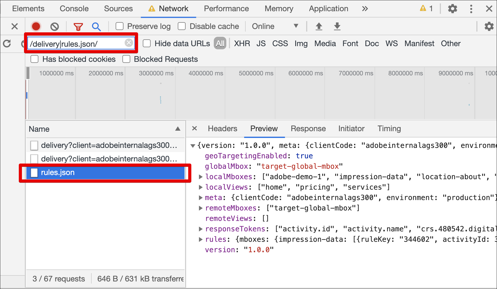

# Fehlerbehebung bei [!UICONTROL on-device decisioning] für at.js

Führen Sie die folgenden Schritte aus, um [!UICONTROL on-device decisioning] in [!UICONTROL Adobe Target] mit der at.js-JavaScript-Bibliothek zu beheben:

## Schritt 1: Konsolenprotokoll für at.js aktivieren

Durch Anhängen des URL-Parameters `mboxDebug=1` kann at.js Nachrichten in der Konsole Ihres Browsers drucken.

Alle Nachrichten enthalten das Präfix „AT:“ für einen praktischen Überblick. Um sicherzustellen, dass ein Artefakt erfolgreich geladen wurde, sollte Ihr Konsolenprotokoll Meldungen ähnlich den folgenden enthalten:

```
AT: LD.ArtifactProvider fetching artifact - https://assets.adobetarget.com/your-client-cide/production/v1/rules.json
AT: LD.ArtifactProvider artifact received - status=200
```

Die folgende Abbildung zeigt diese Meldungen im Konsolenprotokoll:

(Klicken Sie auf das Bild, um es auf die volle Breite zu erweitern.)

{zoomable="yes"}

## Schritt 2: Überprüfen Sie das Herunterladen des Regelartefakts auf der Registerkarte „Netzwerk“ Ihres Browsers

Öffnen Sie im Browser die Registerkarte Netzwerk .

So öffnen Sie beispielsweise DevTools in Google Chrome:

1. Drücken Sie Strg+Umschalt+J (Windows) oder Befehl+Option+J (Mac).
1. Navigieren Sie zur Registerkarte Netzwerk .
1. Filtern Sie Ihre Aufrufe nach dem Schlüsselwort „rules.json“, um sicherzustellen, dass nur die Artefaktregeldatei angezeigt wird.

   Darüber hinaus können Sie nach &quot;/delivery|rules.json/&quot; filtern, um alle Target-Aufrufe und artefaktregeln.json anzuzeigen.

   

## Schritt 3: Überprüfen des Download-Regelartefakts mithilfe von benutzerdefinierten at.js-Ereignissen

Die at.js-Bibliothek sendet zwei neue benutzerdefinierte Ereignisse, um [!UICONTROL on-device decisioning] zu unterstützen.

* `adobe.target.event.ARTIFACT_DOWNLOAD_SUCCEEDED`
* `adobe.target.event.ARTIFACT_DOWNLOAD_FAILED`

Sie können abonnieren, um diese benutzerdefinierten Ereignisse in Ihrer Anwendung zu überwachen und nach Erfolg oder Misserfolg des Herunterladens der Artefaktregeldatei eine Aktion auszuführen.

Das folgende Beispiel zeigt ein Beispiel für Code, der auf Erfolgs- und Fehlerereignisse beim Herunterladen von Artefakten wartet:

```javascript {line-numbers="true"}
document.addEventListener(adobe.target.event.ARTIFACT_DOWNLOAD_SUCCEEDED, function(e) { 
  console.log("Artifact successfully downloaded", e.detail);
}, false);

document.addEventListener(adobe.target.event.ARTIFACT_DOWNLOAD_FAILED, function(e) { 
  console.log("Artifact failed to download", e.detail);
}, false);
```
