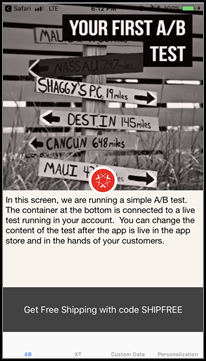

# Mobile Vorschau [!DNL Target]

Verwenden Sie Vorschau-Links auf Mobilgeräten, um eine einfache End-to-End-QA für Aktivitäten in Mobile Apps durchzuführen, und registrieren Sie sich ohne spezielle Testgeräte für verschiedene Erlebnisse auf Ihrem Gerät.

Mit der Mobile-Vorschau-Funktion können Sie Ihre Mobile-App-Aktivitäten vollständig testen, bevor Sie sie live starten.

## Voraussetzungen 

1. **Unterstützte Version von SDK verwenden:** Die Mobile-Vorschaufunktion erfordert, dass Sie die entsprechende Version des [!DNL Adobe Mobile SDK] in Ihre entsprechenden Apps herunterladen und installieren.

   Anweisungen zum Herunterladen der entsprechenden SDK finden Sie unter [Aktuelle SDK](https://developer.adobe.com/client-sdks/documentation/current-sdk-versions/){target=_blank} in der *[!DNL Adobe Experience Platform Mobile SDK]*.

1. **URL-Schema einrichten:** Der Vorschau-Link öffnet Ihre App über ein URL-Schema. Geben Sie ein eindeutiges URL-Schema für die Vorschau an.

   Weitere Informationen finden Sie unter [Visuelle Vorschau](https://developer.adobe.com/client-sdks/documentation/adobe-target/#visual-preview){target=_blank} in *Konfigurieren der Target-Erweiterung in der Datenverbindungs-* in der *[!DNL Mobile SDK]*.

   Die folgenden Links enthalten weitere Informationen:

   * **iOS**: Weitere Informationen zum Festlegen von URL-Schemata für iOS finden Sie [Definieren eines benutzerdefinierten URL-Schemas für Ihre App](https://developer.apple.com/documentation/xcode/defining-a-custom-url-scheme-for-your-app){target=_blank} auf der *Apple Developer*-Website.
   * **Android**: Weitere Informationen zum Festlegen von URL-Schemata für Android finden Sie unter [Erstellen von Deep-Links zu App](https://developer.android.com/training/app-links/deep-linking){target=_blank}Inhalten auf der *Android Developers*-Website.

1. **Einrichten der `collectLaunchInfo`-API (nur i0S)**

   Weitere Informationen finden Sie unter [Visuelle Vorschau](https://developer.adobe.com/client-sdks/documentation/adobe-target/#visual-preview){target=_blank} in *Konfigurieren der Target-Erweiterung in der Datenverbindungs-* in der *[!DNL Mobile SDK]*.

## Einen Vorschau-Link erstellen

1. Klicken Sie in der [!DNL Target]-Benutzeroberfläche auf das Symbol **[!UICONTROL More Options]** (das vertikale Auslassungszeichen) und wählen Sie dann **[!UICONTROL Create Mobile Preview Link]** aus.

   

1. Wählen Sie die Aktivitäten aus, die Sie in der Vorschau anzeigen möchten, und klicken Sie dann auf **[!UICONTROL Generate Mobile Preview Link]**.

   >[!NOTE]
   >
   >Sie können nur formularbasierte [!UICONTROL A/B Test] und [!UICONTROL Experience Targeting] (XT)-Aktivitäten auswählen.

   

1. Legen Sie das URL-Schema Ihrer App fest.

   Das URL-Schema muss mit dem in Ihrer iOS- oder Android-App übereinstimmen. Wiederholen Sie diesen Vorgang bei Bedarf für iOS und Android separat.

   

1. Klicken Sie auf **[!UICONTROL Generate Mobile Preview Link]** und kopieren Sie dann den Link.

   

## Vorschau auf Ihrem Gerät

Öffnen Sie den Link in einem mobilen Browser auf einem Gerät, auf dem Ihre App installiert ist. Bei dieser App kann es sich um die Produktions-App handeln, die Sie von der [!DNL Apple App Store] oder der [!DNL Google Play Store] heruntergeladen haben. Die App muss kein spezieller Build sein. Wenn Sie über einen aktiven Vorschau-Link verfügen, können Sie die Erlebnisse auf dem Gerät anzeigen.

1. Öffnen Sie den Link in Ihrem mobilen Browser.

   Geben Sie den Link, den Sie im vorherigen Abschnitt aus der [!DNL Target]-Benutzeroberfläche kopiert haben, auf praktische Weise für Ihr Mobilgerät frei, z. B. per Text, E-Mail oder [!DNL Slack].

   |||

   Ihre App wird geöffnet und startet die [!DNL Target] [!UICONTROL Mobile Preview Mode].

1. Wählen Sie die gewünschte Erlebniskombination aus und klicken Sie dann auf **[!UICONTROL Launch Experiences]**.

   ||||
||||

## Einschränkungen  

* Die Ansicht muss erneut geladen werden, damit der neue Inhalt angezeigt wird, nachdem auf die Schaltfläche **[!UICONTROL Launch Experiences]** geklickt wurde. Die einfachste Möglichkeit ist, zu einem anderen Bildschirm zu wechseln und danach zu dem Bildschirm zurückzukehren, auf dem die Änderung bewirkt werden soll.
* Die mobile Vorschau wird nicht für frühere Android-Versionen als API-19 (KitKat) unterstützt.
