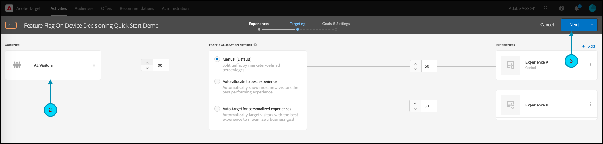

# Erste Schritte mit [!DNL Target] SDKs

Um loszulegen, empfehlen wir Ihnen, Ihre erste [On-Device Decisioning](../on-device-decisioning/overview.md) Feature Flag-Aktivität in der Sprache Ihrer Wahl zu erstellen:

* Node.js
* Java
* .NET
* Python

## Zusammenfassung der Schritte

1. Aktivieren der geräteinternen Entscheidungsfindung für Ihre Organisation
1. Installieren von SDK
1. SDK initialisieren
1. Richten Sie die Feature Flags in einer [!DNL Adobe Target] [!UICONTROL A/B Test] ein
1. Implementieren und Rendern der Funktion in der Anwendung
1. Implementieren des Trackings für Ereignisse in der Anwendung
1. Aktivieren der [!UICONTROL A/B Test] Aktivität

## 1. Aktivieren der geräteinternen Entscheidungsfindung für Ihre Organisation

Durch die Aktivierung der geräteinternen Entscheidungsfindung wird sichergestellt, dass eine [!UICONTROL A/B Test] Aktivität mit einer Latenz von nahezu null ausgeführt wird. Um diese Funktion zu aktivieren, navigieren Sie zu **[!UICONTROL Administration]** > **[!UICONTROL Implementation]** > **[!UICONTROL Account details]** und aktivieren Sie den Umschalter **[!UICONTROL On-Device Decisioning]** .


>[!NOTE]
>
>Sie müssen über die **[!UICONTROL Admin]** oder **[!UICONTROL Approver]** Benutzerrolle[ verfügen, ](https://experienceleague.adobe.com/docs/target/using/administer/manage-users/user-management.html?lang=de) den **[!UICONTROL On-Device Decisioning]**-Umschalter zu aktivieren oder zu deaktivieren.

Nach der Aktivierung des **[!UICONTROL On-Device Decisioning]**-Umschalters beginnt [!DNL Adobe Target] mit der Generierung [Regelartefakte](../on-device-decisioning/rule-artifact-overview.md) für Ihren Client.

## 2. Installieren des SDKS

Führen Sie für Node.js, Java und Python den folgenden Befehl in Ihrem Projektverzeichnis im Terminal aus. Für .NET fügen Sie es als Abhängigkeit hinzu, indem Sie [von NuGet installieren](https://www.nuget.org/packages/Adobe.Target.Client).

>[!BEGINTABS]

>[!TAB Node.js (NPM)]

```js {line-numbers="true"}
npm i @adobe/target-nodejs-sdk -P
```

>[!TAB Java (Maven)]

```javascript {line-numbers="true"}
<dependency>
   <groupId>com.adobe.target</groupId>
   <artifactId>java-sdk</artifactId>
   <version>2.0</version>
</dependency>
```

>[!TAB .NET (Bash)]

```bash {line-numbers="true"}
dotnet add package Adobe.Target.Client
```

>[!TAB Python (pip)]

```python {line-numbers="true"}
pip install target-python-sdk
```

>[!ENDTABS]

## 3. SDK initialisieren

Das Regelartefakt wird während des SDK-Initialisierungsschritts heruntergeladen. Sie können den Initialisierungsschritt anpassen, um zu bestimmen, wie das Artefakt heruntergeladen und verwendet wird.

>[!BEGINTABS]

>[!TAB Node.js]

```js {line-numbers="true"}
const TargetClient = require("@adobe/target-nodejs-sdk");

const CONFIG = {
   client: "<your target client code>",
   organizationId: "your EC org id",
   decisioningMethod: "on-device",
   events: {
      clientReady: targetClientReady
      }
};

const tClient = TargetClient.create(CONFIG);

function targetClientReady() {
   //Adobe Target SDK has now downloaded the JSON artifact locally, which contains the activity details.
   //We will see how to use the artifact here very soon.
}
```

>[!TAB Java (Maven)]

```javascript {line-numbers="true"}
ClientConfig config = ClientConfig.builder()
   .client("testClient")
   .organizationId("ABCDEF012345677890ABCDEF0@AdobeOrg")
   .build();
TargetClient targetClient = TargetClient.create(config);
```

>[!TAB .NET (C#)]

```csharp {line-numbers="true"}
var targetClientConfig = new TargetClientConfig.Builder("testClient", "ABCDEF012345677890ABCDEF0@AdobeOrg")
   .Build();
this.targetClient.Initialize(targetClientConfig);
```

>[!TAB Python]

```python {line-numbers="true"}
from target_python_sdk import TargetClient

def target_client_ready():
   # Adobe Target SDK has now downloaded the JSON artifact locally, which contains the activity details.
   # We will see how to use the artifact here very soon.

CONFIG = {
   "client": "<your target client code>",
   "organization_id": "your EC org id",
   "decisioning_method": "on-device",
   "events": {
      "client_ready": target_client_ready
   }
}

target_client = TargetClient.create(CONFIG)
```

>[!ENDTABS]

## 4. Richten Sie die Feature Flags in einer [!DNL Adobe Target] [!UICONTROL A/B Test] ein

1. Navigieren Sie in [!DNL Target] zur Seite **[!UICONTROL Activities]** und wählen Sie dann **[!UICONTROL Create Activity]** > **[!UICONTROL A/B test]** aus.

   

1. Lassen Sie im **[!UICONTROL Create A/B Test Activity]**-Modal die Standard-Web-Option ausgewählt (1), wählen Sie **[!UICONTROL Form]** als Experience Composer (2) aus, wählen Sie **[!UICONTROL Default Workspace]** mit **[!UICONTROL No Property Restrictions]**(3) aus und klicken Sie dann auf **[!UICONTROL Next]** (4).

   

1. Geben Sie im **[!UICONTROL Experiences]** Schritt der Aktivitätserstellung einen Namen für Ihre Aktivität ein (1) und fügen Sie ein zweites Erlebnis, Erlebnis B, hinzu, indem Sie auf **[!UICONTROL Add Experience]** (2) klicken. Geben Sie den gewünschten Speicherort ein (3). Beispielsweise sind `ondevice-featureflag` oder `homepage-addtocart-featureflag` Ortsnamen, die die Ziele für Feature Flag-Tests angeben.  Im folgenden Beispiel ist `ondevice-featureflag` der für Erlebnis B definierte Speicherort. Optional können Sie Zielgruppenverfeinerungen (4) hinzufügen, um die Qualifizierung auf die Aktivität zu beschränken.

   

1. Wählen Sie im Abschnitt **[!UICONTROL CONTENT]** auf derselben Seite in der Dropdown-Liste (1) die Option **[!UICONTROL Create JSON Offer]** aus, wie dargestellt.

   

1. Geben Sie im angezeigten Textfeld **[!UICONTROL JSON Data]** Ihre Feature Flag-Variablen für jedes Erlebnis ein (1), wobei Sie ein gültiges JSON-Objekt verwenden (2).

   Geben Sie die Feature Flag-Variablen für Erlebnis A ein.

   

   **(Beispiel-JSON für Erlebnis A, oben)**

   ```json {line-numbers="true"}
   {
      "enabled" : true,
      "flag" : "expA"
   }
   ```

   Geben Sie die Feature Flag-Variablen für Erlebnis B ein.

   

   **(Beispiel-JSON für Erlebnis B, oben)**

   ```json {line-numbers="true"}
   {
      "enabled" : true,
      "flag" : "expB"
   }
   ```

1. Klicken Sie auf **[!UICONTROL Next]** (1), um zum **[!UICONTROL Targeting]** Schritt der Aktivitätserstellung zu gelangen.

   

1. Im **[!UICONTROL Targeting]** unten gezeigten Beispiel bleibt Zielgruppen-Targeting (2) der Einfachheit halber auf der Standardgruppe „Alle Besucher“. Dies bedeutet, dass die Aktivität nicht zielgerichtet ist. Beachten Sie jedoch, dass Adobe empfiehlt, Ihre Zielgruppen immer für Produktionsaktivitäten anzusprechen. Klicken Sie auf **[!UICONTROL Next]** (3), um zum **[!UICONTROL Goals & Settings]** Schritt der Aktivitätserstellung zu gelangen.

   

1. Legen Sie im **[!UICONTROL Goals & Settings]** Schritt **[!UICONTROL Reporting Source]** auf **[!UICONTROL Adobe Target]** (1) fest. Definieren Sie die **[!UICONTROL Goal Metric]** als **[!UICONTROL Conversion]** und geben Sie die Details basierend auf den Konversionsmetriken Ihrer Site an (2). Klicken Sie auf **[!UICONTROL Save & Close]** (3), um die Aktivität zu speichern.

   

## 5. Implementieren und rendern der Funktion in der Anwendung

Nachdem Sie die Feature Flag-Variablen in [!DNL Target] eingerichtet haben, ändern Sie den Anwendungs-Code, um sie zu verwenden. Nachdem Sie beispielsweise das Feature Flag in der Anwendung erhalten haben, können Sie es verwenden, um Funktionen zu aktivieren und das Erlebnis zu rendern, für das sich der Besucher qualifiziert hat.

>[!BEGINTABS]

>[!TAB Node.js]

```js {line-numbers="true"}
//... Code removed for brevity
​
let featureFlags = {};
​
function targetClientReady() {
   tClient.getAttributes(["ondevice-featureflag"]).then(function(response) {
      const featureFlags = response.asObject("ondevice-featureflag");
      if(featureFlags.enabled && featureFlags.flag !== "expA") { //Assuming "expA" is control
         console.log("Render alternate experience" + featureFlags.flag);
      }
      else {
         console.log("Render default experience");
      }
   });
}
```

>[!TAB Java (Maven)]

```javascript {line-numbers="true"}
MboxRequest mbox = new MboxRequest().name("ondevice-featureflag").index(0);
TargetDeliveryRequest request = TargetDeliveryRequest.builder()
   .context(new Context().channel(ChannelType.WEB))
   .execute(new ExecuteRequest().mboxes(Arrays.asList(mbox)))
   .build();
Attributes attributes = targetClient.getAttributes(request, "ondevice-featureflag");
String flag = attributes.getString("ondevice-featureflag", "flag");
```

>[!TAB .NET (C#)]

```csharp {line-numbers="true"}
var mbox = new MboxRequest(index: 0, name: "ondevice-featureflag");
var deliveryRequest = new TargetDeliveryRequest.Builder()
   .SetContext(new Context(ChannelType.Web))
   .SetExecute(new ExecuteRequest(mboxes: new List<MboxRequest> { mbox }))
   .Build();
var attributes = targetClient.GetAttributes(request, "ondevice-featureflag");
var flag = attributes.GetString("ondevice-featureflag", "flag");
```

>[!TAB Python]

```python {line-numbers="true"}
# ... Code removed for brevity

feature_flags = {}

def target_client_ready():
   attribute_provider = target_client.get_attributes(["ondevice-featureflag"])
   feature_flags = attribute_provider.as_object(mbox_name="ondevice-featureflag")
   if feature_flags.get("enabled") and feature_flags.get("flag") != "expA": # Assuming "expA" is control
      print("Render alternate experience {}".format(feature_flags.get("flag")))
   else:
      print("Render default experience")
```

>[!ENDTABS]

## 6. Implementieren des zusätzlichen Trackings für Ereignisse in der Anwendung

Optional können Sie mit der Funktion sendNotification() zusätzliche Ereignisse zum Tracking von Konversionen senden.

>[!BEGINTABS]

>[!TAB Node.js]

```js {line-numbers="true"}
//... Code removed for brevity
​
//When a conversion happens
TargetClient.sendNotifications({
   targetCookie,
   "request" : {
      "notifications" : [
      {
         type: "display",
         timestamp : Date.now(),
         id: "conversion",
         mbox : {
            name : "orderConfirm"
         },
         order : {
            id: "BR9389",
            total : 98.93,
            purchasedProductIds : ["J9393", "3DJJ3"]
         }
      }
      ]
   }
})
```

>[!TAB Java (Maven)]

```javascript {line-numbers="true"}
Notification notification = new Notification();
notification.setId("conversion");
notification.setImpressionId(UUID.randomUUID().toString());
notification.setType(MetricType.DISPLAY);
notification.setTimestamp(System.currentTimeMillis());
Order order = new Order("BR9389");
order.total(98.93);
order.purchasedProductIds(["J9393", "3DJJ3"]);
notification.setOrder(order);

TargetDeliveryRequest notificationRequest =
   TargetDeliveryRequest.builder()
      .context(new Context().channel(ChannelType.WEB))
      .notifications(Collections.singletonList(notification))
      .build();

NotificationDeliveryService notificationDeliveryService = new NotificationDeliveryService();
notificationDeliveryService.sendNotification(notificationRequest);
```

>[!TAB .NET (C#)]

```csharp {line-numbers="true"}
var order = new Order
{
   Id = "BR9389",
   Total = 98.93M,
   PurchasedProductIds = new List<string> { "J9393", "3DJJ3" },
};
​
var notification = new Notification
{
   Id = "conversion",
   ImpressionId = Guid.NewGuid().ToString(),
   Type = MetricType.Display,
   Timestamp = DateTimeOffset.UtcNow.ToUnixTimeMilliseconds(),
   Order = order,
};
​
var notificationRequest = new TargetDeliveryRequest.Builder()
   .SetContext(new Context(ChannelType.Web))
   .SetNotifications(new List<Notification> {notification})
   .Build();
​
targetClient.SendNotifications(notificationRequest);
```

>[!TAB Python]

```python {line-numbers="true"}
# ... Code removed for brevity

# When a conversion happens
notification_mbox = NotificationMbox(name="orderConfirm")
order = Order(id="BR9389, total=98.93, purchased_product_ids=["J9393", "3DJJ3"])
notification = Notification(
   id="conversion",
   type=MetricType.DISPLAY,
   timestamp=1621530726000,  # Epoch time in milliseconds
   mbox=notification_mbox,
   order=order
)
notification_request = DeliveryRequest(notifications=[notification])


target_client.send_notifications({
   "target_cookie": target_cookie,
   "request" : notification_request
})
```

>[!ENDTABS]

## 7. Aktivieren der [!UICONTROL A/B Test] Aktivität

1. Klicken Sie auf **[!UICONTROL Activate]** (1), um Ihre [!UICONTROL A/B Test] zu aktivieren.

   >[!NOTE]
   >
   >Sie müssen über die **[!UICONTROL Approver]** oder **[!UICONTROL Publisher]** Benutzerrolle[ verfügen, ](https://experienceleague.adobe.com/docs/target/using/administer/manage-users/user-management.html?lang=de) diesen Schritt auszuführen.

   
