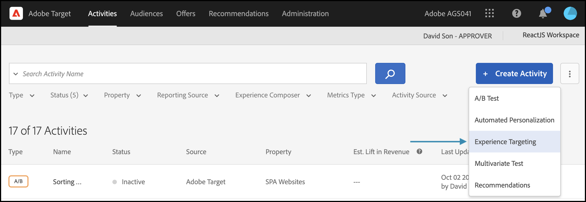
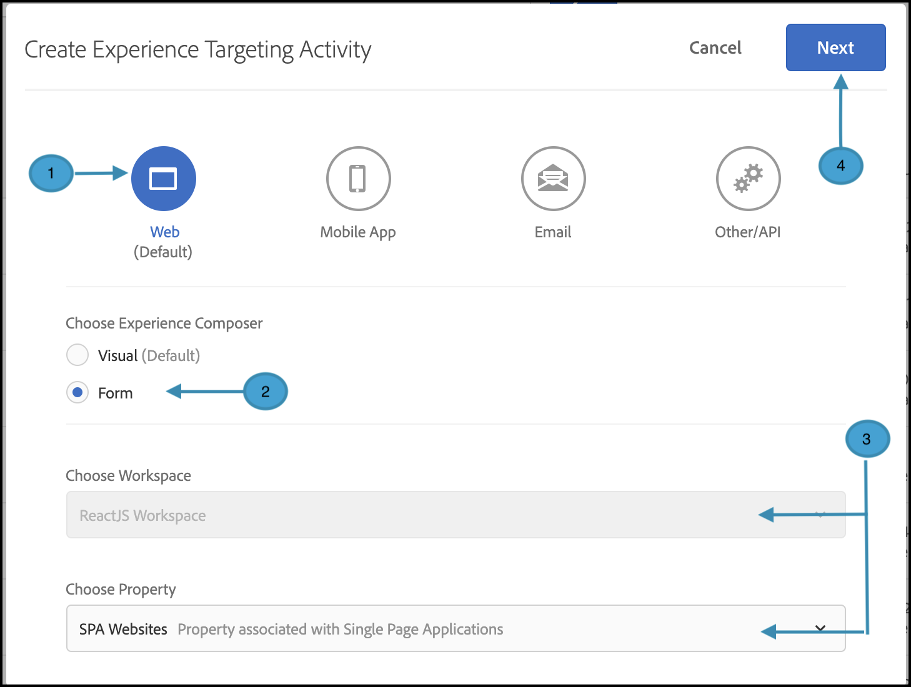
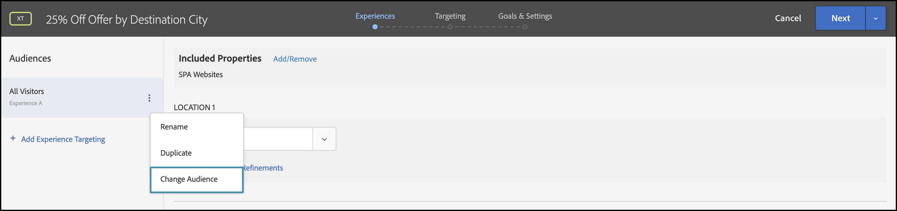
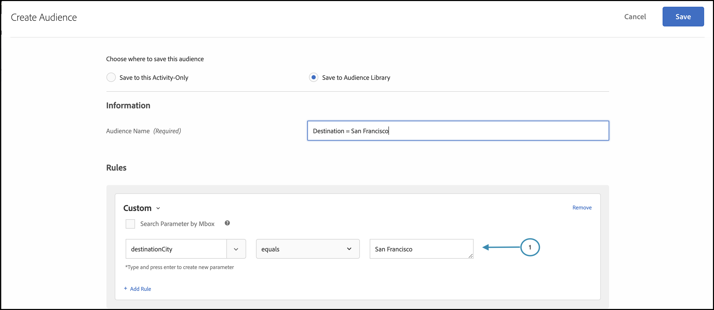
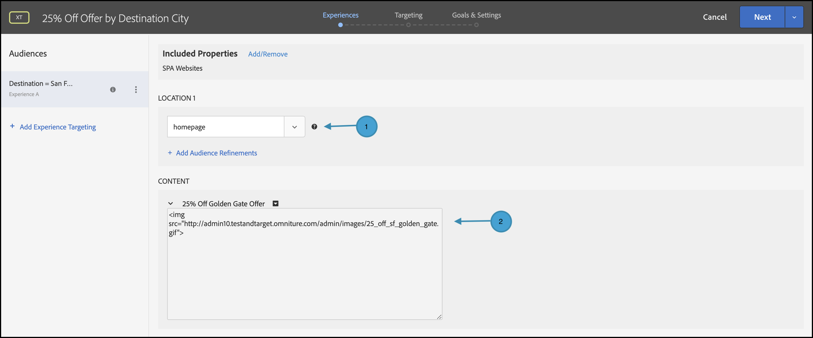
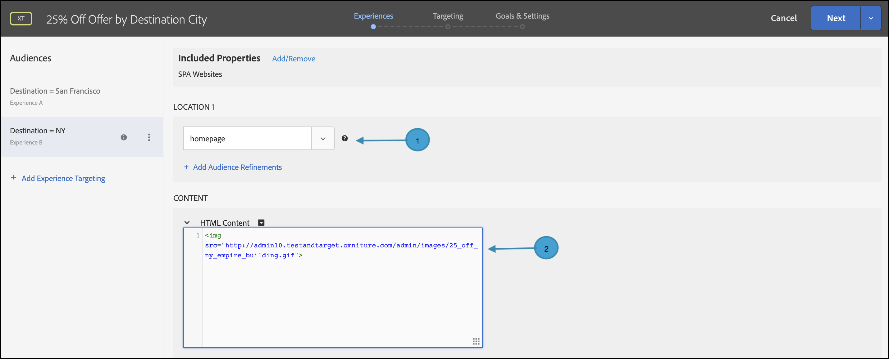
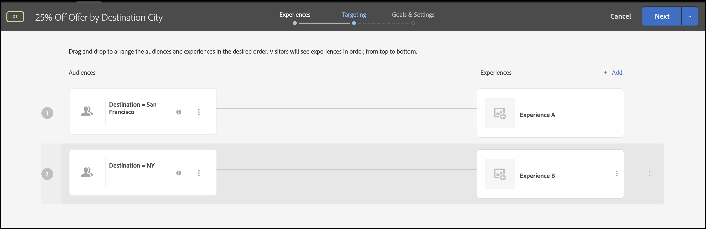
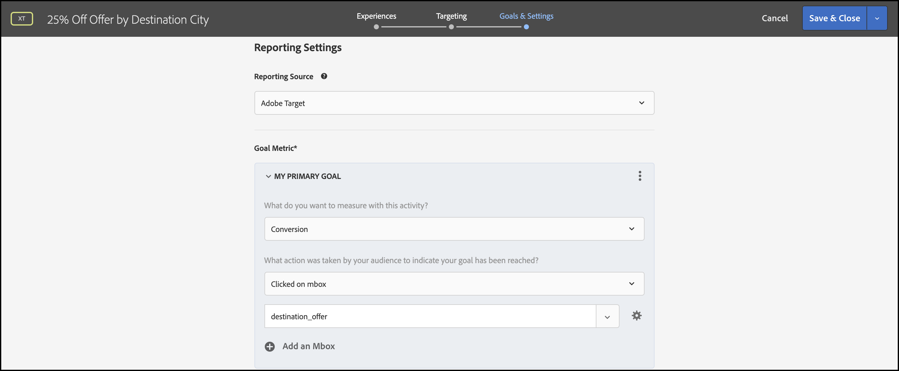
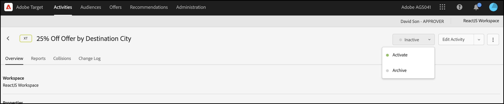

# Personalisierung bereitstellen

## Zusammenfassung der Schritte

1. Aktivieren [!UICONTROL On-Device Decisioning] für Ihre Organisation
1. Erstellen einer [!UICONTROL Experience Targeting]-Aktivität (XT)
1. Definieren personalisierter Erlebnisse pro Zielgruppe
1. Überprüfen personalisierter Erlebnisse pro Zielgruppe
1. Einrichten von Berichten
1. Metriken für Tracking-KPIs hinzufügen
1. Personalisierte Angebote in Ihrer Anwendung implementieren
1. Implementieren von Code zum Tracking von Konversionsereignissen
1. Aktivieren [!UICONTROL &#x200B; Personalisierungsaktivität &#x200B;]Experience Targeting) (XT)

Angenommen, Sie sind ein Reiseunternehmen. Sie möchten ein personalisiertes Angebot von 25% Rabatt auf bestimmte Reisepakete anbieten. Damit das Angebot bei Ihren Nutzern Anklang findet, entscheiden Sie sich, ein Wahrzeichen der Zielstadt anzuzeigen. Sie sollten auch sicherstellen, dass die Bereitstellung Ihrer personalisierten Angebote mit einer Latenz nahe null erfolgt, damit die Benutzererlebnisse nicht beeinträchtigt werden und die Ergebnisse nicht verzerrt werden.

## &#x200B;1. Aktivieren [!UICONTROL On-Device Decisioning] für Ihre Organisation

1. Durch die Aktivierung der geräteinternen Entscheidungsfindung wird sichergestellt, dass eine A/B-Aktivität mit einer Latenz von nahezu null ausgeführt wird. Um diese Funktion zu aktivieren, navigieren Sie **[!UICONTROL [!DNL Adobe Target] zu]** > **[!UICONTROL Implementierung]** > **[!UICONTROL Kontodetails]** und aktivieren Sie den Umschalter **[!UICONTROL On-Device Decisioning]**.

   

   >[!NOTE]
   >
   >Sie müssen über die Admin- oder Genehmiger[Benutzerrolle verfügen, &#x200B;](https://experienceleague.adobe.com/docs/target/using/administer/manage-users/user-management.html?lang=de) den Umschalter [!UICONTROL On-Device Decisioning] zu aktivieren oder zu deaktivieren.

   Nach der Aktivierung **[!UICONTROL Umschalters]** On-Device Decisioning“ beginnt [!DNL Adobe Target] mit der Erstellung *Regelartefakte* für Ihren Client.

## &#x200B;2. Erstellen einer [!UICONTROL Experience Targeting]-Aktivität (XT)

1. Navigieren Sie in [!DNL Adobe Target] zur Seite **[!UICONTROL Aktivitäten]** und wählen Sie dann **[!UICONTROL Aktivität erstellen]** > **[!UICONTROL Erlebnis-Targeting]**.

   

1. Lassen Sie im Modal **[!UICONTROL Experience Targeting-Aktivität erstellen]** die Standardoption **[!UICONTROL Web]** ausgewählt (1), wählen Sie **[!UICONTROL Form]** als Experience Composer (2) aus, wählen Sie einen Arbeitsbereich und eine Eigenschaft aus (3) und klicken Sie auf **[!UICONTROL Weiter]** (4).

   

## &#x200B;3. Definieren eines personalisierten Erlebnisses pro Zielgruppe

1. Klicken Sie im **[!UICONTROL Erlebnisse]** Schritt der Aktivitätserstellung auf **[!UICONTROL Zielgruppe ändern]**, um eine Zielgruppe der Besucher zu erstellen, die nach San Francisco, Kalifornien reisen möchten.

   

1. Definieren Sie **[!UICONTROL Modal &quot;]** erstellen“ eine benutzerdefinierte Regel, in der `destinationCity = San Francisco` wird. Diese Gruppe definiert die Benutzenden, die nach San Francisco reisen möchten.

   

1. Geben Sie noch im **[!UICONTROL Erlebnisse]** den Namen des Speicherorts (1) in Ihrer Anwendung ein, an dem Sie ein Sonderangebot für das Golden Gate Bridge unterbreiten möchten, jedoch nur für diejenigen, die nach San Francisco fahren. In dem hier gezeigten Beispiel ist die Homepage der für das HTML-Angebot (2) ausgewählte Ort, der im Bereich **[!UICONTROL Inhalt]** definiert ist.

   

1. Fügen Sie eine weitere Zielgruppe hinzu, indem **[!UICONTROL Erlebnis-Targeting hinzufügen]** klicken. Dieses Mal sollten Sie eine Zielgruppe ansprechen, die nach New York reisen möchte, indem Sie eine Zielgruppenregel definieren, bei der `destinationCity = New York` gilt. Definieren Sie in Ihrem Programm den Ort, an dem Sie ein Sonderangebot für das Empire State Building unterbreiten möchten. In dem hier gezeigten Beispiel ist `homepage` der für das HTML-Angebot (2) ausgewählte Ort, der im Bereich **[!UICONTROL Inhalt]** definiert ist.

   

## &#x200B;4. Überprüfen personalisierter Erlebnisse pro Zielgruppe

Vergewissern Sie **[!UICONTROL Schritt &quot;]**&quot;, dass Sie das gewünschte personalisierte Erlebnis pro Zielgruppe konfiguriert haben.



## &#x200B;5. Einrichten von Berichten

Wählen Sie im Schritt **[!UICONTROL Ziele und Einstellungen]** die Option **[!UICONTROL Adobe Target]** als **[!UICONTROL Reporting-Source]** aus, um Aktivitätsergebnisse in der [!DNL Adobe Target]-Benutzeroberfläche anzuzeigen, oder wählen Sie **[!UICONTROL Adobe Analytics]** aus, um sie in der Adobe Analytics-Benutzeroberfläche anzuzeigen.



## &#x200B;6. Metriken für Tracking-KPIs hinzufügen

Wählen Sie eine **[!UICONTROL Zielmetrik]**, um den Erfolg der Aktivität zu messen. In diesem Beispiel basiert eine erfolgreiche Konversion darauf, ob der Benutzer auf das personalisierte Zielangebot klickt.

## &#x200B;7. Personalisierte Angebote in der Anwendung implementieren

>[!BEGINTABS]

>[!TAB Node.js]

```js {line-numbers="true"}
const TargetClient = require("@adobe/target-nodejs-sdk");

const CONFIG = {
  client: "acmeclient",
  organizationId: "1234567890@AdobeOrg"
};

const targetClient = TargetClient.create(CONFIG);

targetClient.getOffers({
  request: {      
    execute: {
      pageLoad: {
        parameters: {
          destinationCity: "San Francisco"
        }
      }
    }       
  }
})
.then(console.log)
.catch(console.error);
```

>[!TAB Java]

```java {line-numbers="true"}
ClientConfig config = ClientConfig.builder()
  .client("acmeclient")
  .organizationId("1234567890@AdobeOrg")
  .build();
TargetClient targetClient = TargetClient.create(config);

Context context = new Context().channel(ChannelType.WEB);

ExecuteRequest executeRequest = new ExecuteRequest();

RequestDetails pageLoad = new RequestDetails();
pageLoad.setParameters(
    new HashMap<String, String>() {
      {
        put("destinationCity", "San Francisco");
      }
    });

executeRequest.setPageLoad(pageLoad);

TargetDeliveryRequest request = TargetDeliveryRequest.builder()
  .context(context)
  .execute(executeRequest)
  .build();

TargetDeliveryResponse offers = targetClient.getOffers(request);
```

>[!ENDTABS]

## &#x200B;8. Implementieren von Code zum Tracking von Konversionsereignissen

>[!BEGINTABS]

>[!TAB Node.js]

```js {line-numbers="true"}
//... Code removed for brevity

//When a conversion happens
TargetClient.sendNotifications({
    targetCookie,
    "request" : {
      "notifications" : [
        {
          type: "click",
          timestamp : Date.now(),
          id: "conversion",
          mbox : {
            name : "destinationOffer"
          }
        }
      ]
    }
})
```

>[!TAB Java]

```java {line-numbers="true"
ClientConfig config = ClientConfig.builder()
  .client("acmeclient")
  .organizationId("1234567890@AdobeOrg")
  .build();
TargetClient targetClient = TargetClient.create(config);

Context context = new Context().channel(ChannelType.WEB);

ExecuteRequest executeRequest = new ExecuteRequest();

RequestDetails pageLoad = new RequestDetails();
pageLoad.setParameters(
    new HashMap<String, String>() {
      {
        put("destinationCity", "San Francisco");
      }
    });

executeRequest.setPageLoad(pageLoad);
NotificationDeliveryService notificationDeliveryService = new NotificationDeliveryService();

Notification notification = new Notification();
notification.setId("conversion");
notification.setImpressionId(UUID.randomUUID().toString());
notification.setType(MetricType.CLICK);
notification.setTimestamp(System.currentTimeMillis());
notification.setTokens(
    Collections.singletonList(
        "IbG2Jz2xmHaqX7Ml/YRxRGqipfsIHvVzTQxHolz2IpSCnQ9Y9OaLL2gsdrWQTvE54PwSz67rmXWmSnkXpSSS2Q=="));

TargetDeliveryRequest targetDeliveryRequest =
    TargetDeliveryRequest.builder()
        .context(context)
        .execute(executeRequest)
        .notifications(Collections.singletonList(notification))
        .build();

TargetDeliveryResponse offers = targetClient.getOffers(request);
notificationDeliveryService.sendNotification(request);
```

>[!ENDTABS]

## &#x200B;9. Aktivieren der Experience Targeting-(XT)-Aktivität


