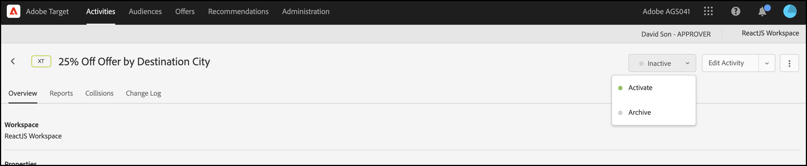

# Personalisierung bereitstellen

## Zusammenfassung der Schritte

1. [!UICONTROL on-device decisioning] für Ihre Organisation aktivieren
1. Erstellen einer [!UICONTROL Experience Targeting] -Aktivität (XT)
1. Definieren eines personalisierten Erlebnisses pro Zielgruppe
1. Überprüfen des personalisierten Erlebnisses pro Zielgruppe
1. Berichterstellung einrichten
1. Metriken zur Verfolgung von KPIs hinzufügen
1. Personalisierte Angebote in Ihre Anwendung implementieren
1. Implementieren von Code zur Verfolgung von Konversionsereignissen
1. Aktivieren Sie Ihre [!UICONTROL Experience Targeting] (XT)-Personalisierungsaktivität.

Nehmen wir an, Sie sind ein Tourenunternehmen. Sie möchten ein personalisiertes Angebot mit 25 % Rabatt auf bestimmte Reisepakete anbieten. Damit das Angebot bei Ihren Benutzern ankommt, möchten Sie ein Wahrzeichen der Zielstadt anzeigen. Sie möchten auch sicherstellen, dass die Bereitstellung Ihrer personalisierten Angebote mit einer Latenz von nahezu null ausgeführt wird, damit sich dies nicht negativ auf Benutzererlebnisse auswirkt und die Ergebnisse verfälscht.

## 1. Aktivieren Sie [!UICONTROL on-device decisioning] für Ihre Organisation

1. Durch die Aktivierung der Entscheidungsfindung auf dem Gerät wird sichergestellt, dass eine A/B-Aktivität mit nahezu Nulllatenz ausgeführt wird. Um diese Funktion zu aktivieren, navigieren Sie in [!DNL Adobe Target] zu **[!UICONTROL Administration]** > **[!UICONTROL Implementation]** > **[!UICONTROL Account details]** und aktivieren Sie den Umschalter **[!UICONTROL On-Device Decisioning]** .

   

   >[!NOTE]
   >
   >Sie müssen über die Benutzerrolle &quot;Admin&quot;oder &quot;Genehmiger&quot;[Benutzer](https://experienceleague.adobe.com/docs/target/using/administer/manage-users/user-management.html) verfügen, um den Umschalter [!UICONTROL On-Device Decisioning] zu aktivieren oder zu deaktivieren.

   Nachdem Sie den Umschalter **[!UICONTROL On-Device Decisioning]** aktiviert haben, beginnt [!DNL Adobe Target] mit der Generierung von *Regel-Artefakten* für Ihren Client.

## 2. Erstellen Sie eine [!UICONTROL Experience Targeting] -Aktivität (XT)

1. Navigieren Sie in [!DNL Adobe Target] zur Seite **[!UICONTROL Activities]** und wählen Sie dann **[!UICONTROL Create Activity]** > **[!UICONTROL Experience Targeting]** aus.

   

1. Behalten Sie im Modal **[!UICONTROL Create Experience Targeting Activity]** die Standardoption **[!UICONTROL Web]** bei (1), wählen Sie **[!UICONTROL Form]** als Ihren Experience Composer (2), wählen Sie einen Arbeitsbereich und eine Eigenschaft (3) aus und klicken Sie auf **[!UICONTROL Next]** (4).

   

## 3. Personalisierte Erlebnisse pro Zielgruppe definieren

1. Klicken Sie im Schritt **[!UICONTROL Experiences]** der Aktivitätserstellung auf **[!UICONTROL Change Audience]** , um eine Audience der Besucher zu erstellen, die nach San Francisco, Kalifornien, reisen möchten.

   

1. Definieren Sie im Modal **[!UICONTROL Create Audience]** eine benutzerdefinierte Regel mit dem Wert `destinationCity = San Francisco`. Dies definiert die Gruppe von Benutzern, die nach San Francisco reisen möchten.

   

1. Geben Sie im Schritt **[!UICONTROL Experiences]** den Namen des Orts (1) in Ihrer Anwendung ein, an dem Sie ein Sonderangebot zum Golden Gate Bridge rendern möchten, jedoch nur für diejenigen, die nach San Francisco fahren. In dem hier gezeigten Beispiel ist Startseite der für das HTML-Angebot (2) ausgewählte Ort, der im Bereich **[!UICONTROL Content]** definiert ist.

   

1. Fügen Sie durch Klicken auf **[!UICONTROL Add Experience Targeting]** eine weitere Zielgruppe hinzu. Legen Sie diesmal eine Zielgruppe, die nach New York reisen möchte, mit `destinationCity = New York` als Zielgruppenregel fest. Definieren Sie den Ort in Ihrer Anwendung, an dem Sie ein Sonderangebot zum Empire State Building unterbreiten möchten. In dem hier gezeigten Beispiel ist `homepage` der für das HTML-Angebot (2) ausgewählte Ort, der im Bereich **[!UICONTROL Content]** definiert ist.

   

## 4. Überprüfen des personalisierten Erlebnisses pro Zielgruppe

Überprüfen Sie im Schritt **[!UICONTROL Targeting]** , ob Sie das gewünschte personalisierte Erlebnis pro Zielgruppe konfiguriert haben.


## 5. Einrichten von Berichten

Wählen Sie im Schritt **[!UICONTROL Goals & Settings]** die Option **[!UICONTROL Adobe Target]** als den Wert **[!UICONTROL Reporting Source]**, um die Aktivitätsergebnisse in der Benutzeroberfläche von [!DNL Adobe Target] anzuzeigen, oder wählen Sie **[!UICONTROL Adobe Analytics]**, um sie in der Adobe Analytics-Benutzeroberfläche anzuzeigen.


## 6. Hinzufügen von Metriken zur Verfolgung von KPIs

Wählen Sie **[!UICONTROL Goal Metric]** aus, um den Erfolg der Aktivität zu messen. In diesem Beispiel basiert eine erfolgreiche Konversion darauf, ob der Benutzer auf das personalisierte Zielangebot klickt.

## 7. Personalisierte Angebote in Ihre Anwendung implementieren

>[!BEGINTABS]

>[!TAB node.js]

```js {line-numbers="true"}
const TargetClient = require("@adobe/target-nodejs-sdk");

const CONFIG = {
  client: "acmeclient",
  organizationId: "1234567890@AdobeOrg"
};

const targetClient = TargetClient.create(CONFIG);

targetClient.getOffers({
  request: {      
    execute: {
      pageLoad: {
        parameters: {
          destinationCity: "San Francisco"
        }
      }
    }       
  }
})
.then(console.log)
.catch(console.error);
```

>[!TAB Java]

```java {line-numbers="true"}
ClientConfig config = ClientConfig.builder()
  .client("acmeclient")
  .organizationId("1234567890@AdobeOrg")
  .build();
TargetClient targetClient = TargetClient.create(config);

Context context = new Context().channel(ChannelType.WEB);

ExecuteRequest executeRequest = new ExecuteRequest();

RequestDetails pageLoad = new RequestDetails();
pageLoad.setParameters(
    new HashMap<String, String>() {
      {
        put("destinationCity", "San Francisco");
      }
    });

executeRequest.setPageLoad(pageLoad);

TargetDeliveryRequest request = TargetDeliveryRequest.builder()
  .context(context)
  .execute(executeRequest)
  .build();

TargetDeliveryResponse offers = targetClient.getOffers(request);
```

>[!ENDTABS]

## 8. Implementieren Sie Code zur Verfolgung von Konversionsereignissen

>[!BEGINTABS]

>[!TAB node.js]

```js {line-numbers="true"}
//... Code removed for brevity

//When a conversion happens
TargetClient.sendNotifications({
    targetCookie,
    "request" : {
      "notifications" : [
        {
          type: "click",
          timestamp : Date.now(),
          id: "conversion",
          mbox : {
            name : "destinationOffer"
          }
        }
      ]
    }
})
```

>[!TAB Java]

```java {line-numbers="true"
ClientConfig config = ClientConfig.builder()
  .client("acmeclient")
  .organizationId("1234567890@AdobeOrg")
  .build();
TargetClient targetClient = TargetClient.create(config);

Context context = new Context().channel(ChannelType.WEB);

ExecuteRequest executeRequest = new ExecuteRequest();

RequestDetails pageLoad = new RequestDetails();
pageLoad.setParameters(
    new HashMap<String, String>() {
      {
        put("destinationCity", "San Francisco");
      }
    });

executeRequest.setPageLoad(pageLoad);
NotificationDeliveryService notificationDeliveryService = new NotificationDeliveryService();

Notification notification = new Notification();
notification.setId("conversion");
notification.setImpressionId(UUID.randomUUID().toString());
notification.setType(MetricType.CLICK);
notification.setTimestamp(System.currentTimeMillis());
notification.setTokens(
    Collections.singletonList(
        "IbG2Jz2xmHaqX7Ml/YRxRGqipfsIHvVzTQxHolz2IpSCnQ9Y9OaLL2gsdrWQTvE54PwSz67rmXWmSnkXpSSS2Q=="));

TargetDeliveryRequest targetDeliveryRequest =
    TargetDeliveryRequest.builder()
        .context(context)
        .execute(executeRequest)
        .notifications(Collections.singletonList(notification))
        .build();

TargetDeliveryResponse offers = targetClient.getOffers(request);
notificationDeliveryService.sendNotification(request);
```

>[!ENDTABS]

## 9. Aktivität &quot;Erlebnis-Targeting&quot;(XT) aktivieren


