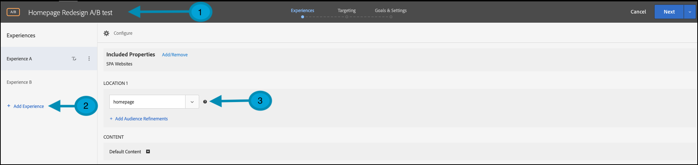
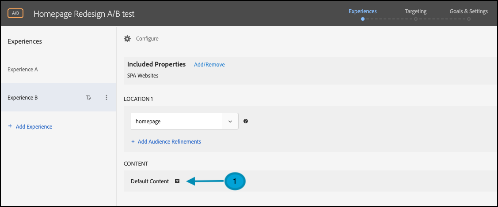
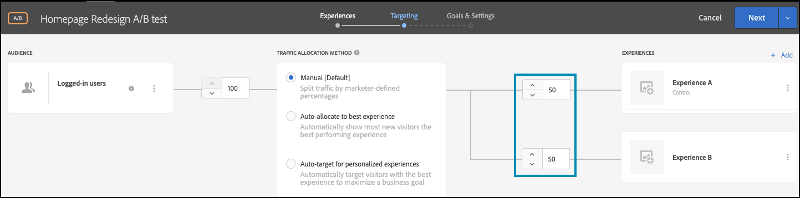

# Ausführen von A/B-Tests mit Feature Flags

## Zusammenfassung der Schritte

1. Aktivieren von [!UICONTROL on-device decisioning] für Ihr Unternehmen
1. [!UICONTROL A/B Test] erstellen
1. A und B definieren
1. Hinzufügen einer Audience
1. Traffic-Zuordnung festlegen
1. Festlegen der Traffic-Verteilung auf Varianten
1. Einrichten von Berichten
1. Metriken für Tracking-KPIs hinzufügen
1. Implementieren von Code zum Ausführen von A/B-Tests mit Feature Flags
1. Aktivieren von A/B-Tests mit Feature Flags

>[!NOTE]
>
>Angenommen, Sie möchten ermitteln, ob Ihre Herbstumgestaltung Ihrer Homepage bei Ihren Nutzern gut ankommt. Sie können sie testen, indem Sie ein A/B-Experiment in [!DNL Adobe Target] durchführen. Sie sollten auch sicherstellen, dass das Experiment mit hoher Leistung durchgeführt wird, damit die Ergebnisse bei einem negativen oder langsamen Benutzererlebnis nicht verzerrt werden.

## 1. Aktivieren von [!UICONTROL on-device decisioning] für Ihr Unternehmen

Durch die Aktivierung der geräteinternen Entscheidungsfindung wird sichergestellt, dass eine A/B-Aktivität mit einer Latenz von nahezu null ausgeführt wird. Um diese Funktion zu aktivieren, navigieren Sie in [!DNL Adobe Target] zu **[!UICONTROL Administration]** > **[!UICONTROL Implementation]** > **[!UICONTROL Account details]** und aktivieren Sie den Umschalter **[!UICONTROL On-Device Decisioning]** .

&lt;!— insert image-odd4.png —>


>[!NOTE]
>
>Sie müssen über die Admin- oder Genehmiger[Benutzerrolle verfügen, ](https://experienceleague.adobe.com/docs/target/using/administer/manage-users/user-management.html) den Umschalter Geräteinterne Entscheidungsfindung zu aktivieren oder zu deaktivieren.

Nach der Aktivierung des **[!UICONTROL On-Device Decisioning]**-Umschalters beginnt [!DNL Adobe Target] mit der Generierung von Regelartefakten für Ihren Client.

## 2. Erstellen einer [!UICONTROL A/B Test] Aktivität

Navigieren Sie in [!DNL Adobe Target] zur Seite **[!UICONTROL Activities]** und wählen Sie dann **[!UICONTROL Create Activity]** > **[!UICONTROL A/B test]** aus.


Lassen Sie im **[!UICONTROL Create A/B Test Activity]**-Modal die Option **[!UICONTROL Web]** ausgewählt (1), wählen Sie **[!UICONTROL Form]** als Experience Composer (2), wählen Sie **[!UICONTROL Default Workspace]** ohne **[!UICONTROL Property Restrictions]** (3) und klicken Sie auf **[!UICONTROL Next]** (4).


## 3. Definieren Sie A und B

1. Geben Sie im **[!UICONTROL Experiences]** Schritt der Aktivitätserstellung einen Namen für Ihre Aktivität ein (1) und fügen Sie ein zweites Erlebnis, Erlebnis B, hinzu, indem Sie auf die Schaltfläche **[!UICONTROL Add Experience]** (2) klicken. Geben Sie den Namen des Speicherorts (3) in Ihrer Anwendung ein, an dem Sie Ihren A/B-Test durchführen möchten. Im folgenden Beispiel ist „homepage“ der für Erlebnis A definierte Speicherort. (Es ist auch der für Erlebnis B definierte Speicherort.)

   Erlebnis A definiert das Steuerelement, d. h. das aktuelle Homepage-Design.

   

   Erlebnis B definiert den Challenger, der eine neu gestaltete Homepage darstellt. Klicken, um Standardinhalt zu ändern (1).

   

1. Klicken Sie in Erlebnis B auf , um den Inhalt von **[!UICONTROL Default Content]** in den neu gestalteten Inhalt zu ändern, indem Sie **[!UICONTROL Create JSON Offer]** wie unten dargestellt auswählen (1).

   

1. Definieren Sie die JSON-Datei mit Attributen, die als Flags verwendet werden, damit Ihre Geschäftslogik die neu gestaltete Homepage anstatt die aktuelle Homepage in der Produktion rendern kann.


   >[!NOTE]
   >
   >Wenn [!DNL Adobe Target] einen Benutzer gruppiert, um Erlebnis B (die neu gestaltete Homepage) zu sehen, wird die JSON mit den im Beispiel definierten Attributen zurückgegeben. In Ihrem Code müssen Sie die Attributwerte überprüfen, um zu entscheiden, ob die Geschäftslogik zum Rendern der neu gestalteten Homepage ausgeführt werden soll. Sie können die Namen, Werte und die Anzahl der Attribute in dieser JSON-Antwort definieren.

   

## 4. Hinzufügen einer Audience

Angenommen, Sie möchten das Redesign zunächst an Ihren treuen Kunden testen, die Sie identifizieren können, je nachdem, ob sie angemeldet sind oder nicht.

1. Klicken Sie im **[!UICONTROL Targeting]** Schritt wie abgebildet auf , um die **[!UICONTROL All Visitors]** Zielgruppe zu ersetzen.

   

1. Definieren Sie im **[!UICONTROL Create Audience]**-Modal eine benutzerdefinierte Regel, in der `logged-in = true` ist. Dies definiert die Gruppe der angemeldeten Benutzer. Diese Zielgruppe in Ihrer Aktivität verwenden.

   

## 5. Festlegen der Traffic-Zuordnung

Definieren Sie den Prozentsatz der angemeldeten Benutzer, mit denen Sie Ihr neues Homepage-Redesign testen möchten. Mit anderen Worten, zu welchem Prozentsatz der Benutzer möchten Sie diesen Test durchführen? Um diesen Test in diesem Beispiel für alle angemeldeten Benutzer bereitzustellen, sollten Sie die Traffic-Zuordnung bei 100 % belassen.


## 6. Festlegen der Traffic-Verteilung auf Varianten

Definieren Sie den Prozentsatz Ihrer angemeldeten Benutzer, die das aktuelle Design der Homepage oder das komplett neue Redesign sehen werden. Behalten Sie in diesem Beispiel die Traffic-Verteilung als 50/50-Aufteilung zwischen den Erlebnissen A und B bei.



## 7. Einrichten von Berichten

Wählen Sie im **[!UICONTROL Goals & Settings]** Schritt **[!UICONTROL Adobe Target]** als **[!UICONTROL Reporting Source]** aus, um die Aktivitätsergebnisse in der [!DNL Adobe Target] Benutzeroberfläche anzuzeigen, oder wählen Sie **[!UICONTROL Adobe Analytics]** aus, um sie in der Benutzeroberfläche von Adobe Analytics anzuzeigen.


## 8. Hinzufügen von Metriken für Tracking-KPIs

Wählen Sie eine **[!UICONTROL Goal Metric]** aus, um den A/B-Test zu messen. In diesem Beispiel basiert eine erfolgreiche Konversion darauf, ob der Benutzer das Seitenende erreicht, was auf eine Interaktion hinweist. Daher wird **[!UICONTROL Conversion]** davon abhängig bestimmt, ob der Benutzer den Ort mit dem Namen „Seitenende“ angesehen hat.

## 9. Implementieren Sie Code zum Ausführen von A/B-Tests mit Feature Flags in Ihrer Anwendung

>[!BEGINTABS]

>[!TAB Node.js]

```js {line-numbers="true"}
const TargetClient = require("@adobe/target-nodejs-sdk");
const options = {
  client: "testClient",
  organizationId: "ABCDEF012345677890ABCDEF0@AdobeOrg",
  decisioningMethod: "on-device",
  events: {
    clientReady: targetClientReady
  }
};
const targetClient = TargetClient.create(options);

function targetClientReady() {
  return targetClient.getAttributes(["homepage"]).then(function(attributes) {
    const flag = attributes.getValue("homepage", "feature-flag");
    // ...
  });
}
```

>[!TAB Java]

```java {line-numbers="true"}
import com.adobe.target.edge.client.ClientConfig;
import com.adobe.target.edge.client.TargetClient;
import com.adobe.target.delivery.v1.model.ChannelType;
import com.adobe.target.delivery.v1.model.Context;
import com.adobe.target.delivery.v1.model.ExecuteRequest;
import com.adobe.target.delivery.v1.model.MboxRequest;
import com.adobe.target.edge.client.entities.TargetDeliveryRequest;
import com.adobe.target.edge.client.model.TargetDeliveryResponse;

ClientConfig config = ClientConfig.builder()
    .client("testClient")
    .organizationId("ABCDEF012345677890ABCDEF0@AdobeOrg")
    .build();
TargetClient targetClient = TargetClient.create(config);
MboxRequest mbox = new MboxRequest().name("homepage").index(0);
TargetDeliveryRequest request = TargetDeliveryRequest.builder()
    .context(new Context().channel(ChannelType.WEB))
    .execute(new ExecuteRequest().mboxes(Arrays.asList(mbox)))
    .build();
Attributes attributes = targetClient.getAttributes(request, "homepage");
String flag = attributes.getString("homepage", "feature-flag");
```

>[!ENDTABS]

## 10. Aktivieren Sie Ihren A/B-Test mit Feature Flag


