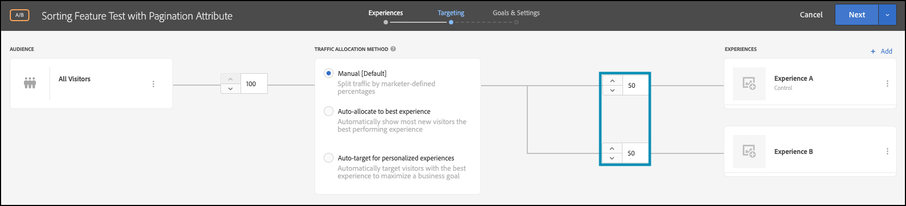

# Ausführen von Funktionstests mit Attributen

## Zusammenfassung der Schritte

1. Aktivieren von [!UICONTROL on-device decisioning] für Ihr Unternehmen
1. [!UICONTROL A/B Test] erstellen
1. A und B definieren
1. Hinzufügen einer Audience
1. Traffic-Zuordnung festlegen
1. Festlegen der Traffic-Verteilung auf Varianten
1. Einrichten von Berichten
1. Metriken für Tracking-KPIs hinzufügen
1. Implementieren von Code zum Ausführen von Funktionstests mit Attributen
1. Implementieren von Code zum Tracking von Konversionsereignissen
1. Aktivieren von Funktionstests mit Attributen

>[!NOTE]
>
>Angenommen, Sie sind ein E-Commerce-Einzelhandelsunternehmen. Sie möchten die Konversionsrate erhöhen, wenn Kunden Ihren Produktkatalog durchsuchen und sortieren. Sie haben die Hypothese, dass bestimmte Sortieralgorithmen und Paginierungsstrategien bessere Ergebnisse liefern als andere. Um diese Theorie zu testen, führen Sie einen Funktionstest durch, bei dem das Sortier-Widget mit verschiedenen Sortieroptionen für Ihre Endbenutzenden neu gestaltet wird. Sie sollten sicherstellen, dass dieser Funktionstest mit einer Latenz nahe null ausgeführt wird, damit die Benutzererfahrung nicht beeinträchtigt wird und die Ergebnisse nicht verzerrt werden.

## 1. Aktivieren von [!UICONTROL on-device decisioning] für Ihr Unternehmen

Durch die Aktivierung der geräteinternen Entscheidungsfindung wird sichergestellt, dass eine A/B-Aktivität mit einer Latenz von nahezu null ausgeführt wird. Um diese Funktion zu aktivieren, navigieren Sie in [!DNL Adobe Target] zu **[!UICONTROL Administration]** > **[!UICONTROL Implementation]** > **[!UICONTROL Account details]** und aktivieren Sie den Umschalter **[!UICONTROL On-Device Decisioning]** .


>[!NOTE]
>
>Sie müssen über die Rolle Administrator oder Genehmiger [Benutzer) verfügen](https://experienceleague.adobe.com/docs/target/using/administer/manage-users/user-management.html?lang=de) um den Umschalter **[!UICONTROL On-Device Decisioning]** zu aktivieren oder zu deaktivieren.

Nach der Aktivierung des **[!UICONTROL On-Device Decisioning]**-Umschalters beginnt [!DNL Adobe Target] mit der Generierung *Regelartefakte* für Ihren Client.

## 2. Erstellen einer [!UICONTROL A/B Test] Aktivität

1. Navigieren Sie in [!DNL Adobe Target] zur Seite **[!UICONTROL Activities]** und wählen Sie dann **[!UICONTROL Create Activity]** > **[!UICONTROL A/B test]** aus.

   

1. Lassen Sie im **[!UICONTROL Create A/B Test Activity]**-Modal die Option **[!UICONTROL Web]** ausgewählt (1), wählen Sie **[!UICONTROL Form]** als Experience Composer (2) aus, wählen Sie **[!UICONTROL Default Workspace]** mit **[!UICONTROL No Property Restrictions]** (3) aus und klicken Sie auf **[!UICONTROL Next]** (4).

   

## 3. Definieren Sie A und B

1. Geben Sie im **[!UICONTROL Experiences]** Schritt der Aktivitätserstellung einen Namen für Ihre Aktivität ein (1) und fügen Sie ein zweites Erlebnis, Erlebnis B, hinzu, indem Sie auf die Schaltfläche **[!UICONTROL Add Experience]** (2) klicken. Geben Sie den Namen des Speicherorts (3) innerhalb Ihrer Anwendung ein, an dem Sie Ihren Funktionstest mit Attributen ausführen möchten. Im folgenden Beispiel ist `product-results-page` der für Erlebnis A definierte Speicherort. (Es ist auch der für Erlebnis B definierte Speicherort.)

   

   **[!UICONTROL Experience A]** enthält die JSON-Datei, die Ihrer Geschäftslogik signalisiert, Folgendes zu tun:

   * Starten Sie die Sortieralgorithmus-Funktion über das Feature Flag &quot;`test_sorting`&quot;
   * Ausführen des im `sorting_algorithm _**_attribute` definierten empfohlenen Sortieralgorithmus
   * Gibt 50 Produkte pro Seite zurück, wie durch die in der `pagination_limit` definierte Paginierungsstrategie definiert

1. Klicken Sie in Erlebnis A auf , um den Inhalt von **[!UICONTROL Default Content]** in JSON zu ändern, indem Sie **[!UICONTROL Create JSON Offer]** wie unten dargestellt auswählen (1).

   

1. Definieren Sie die JSON-Datei mit `test_sorting`-, `sorting_algorithm`- und `pagination_limit`-Flags und -Attributen, die zum Initiieren des empfohlenen Sortieralgorithmus mit einer Paginierungsgrenze von 50 Produkten verwendet werden.

   >[!NOTE]
   >
   >Wenn ein Benutzer [!DNL Adobe Target] wird, um Erlebnis A zu sehen, wird die JSON mit den im Beispiel definierten Attributen zurückgegeben. In Ihrem Code müssen Sie den Wert der Feature Flag-`test_sorting` überprüfen, um festzustellen, ob die Sortierfunktion aktiviert werden soll. In diesem Fall verwenden Sie den empfohlenen Wert des Attributs `sorting_algorithm` , um empfohlene Produkte in der Produktlistenansicht anzuzeigen. Die maximale Anzahl von Produkten, die für Ihre Anwendung angezeigt werden können, beträgt 50, da dies der Wert des Attributs `pagination_limit` ist.

   

   **[!UICONTROL Experience B]** definieren die JSON-Datei, die Ihrer Geschäftslogik signalisiert, Folgendes zu tun:

   * Starten Sie die Sortieralgorithmusfunktion über das Feature Flag test_sort .
   * Führen Sie den im `sorting_algorithm _**_attribute` definierten `best_sellers` aus
   * Gibt 50 Produkte pro Seite zurück, wie durch die in der `pagination_limit` definierte Paginierungsstrategie definiert

   >[!NOTE]
   >
   >Wenn ein Benutzer [!DNL Adobe Target] wird, um Erlebnis B zu sehen, wird die JSON mit den im Beispiel definierten Attributen zurückgegeben. In Ihrem Code müssen Sie den Wert der Feature Flag-`test_sorting` überprüfen, um festzustellen, ob die Sortierfunktion aktiviert werden soll. In diesem Fall verwenden Sie den `best_sellers` des Attributs `sorting_algorithm` , um die meistverkauften Produkte in der Produktlistenansicht anzuzeigen. Die maximale Anzahl von Produkten, die für Ihre Anwendung angezeigt werden können, beträgt 50, da dies der Wert des Attributs `pagination_limit` ist.

   

## 4. Hinzufügen einer Audience

Behalten Sie im **[!UICONTROL Targeting]** Schritt die **[!UICONTROL All Visitors]** Zielgruppe bei. Auf diese Weise können Sie die Auswirkungen Ihrer Sortierfunktion verstehen und feststellen, welcher Algorithmus und welche Anzahl von Elementen die Ergebnisse am besten beeinflussen.


## 5. Festlegen der Traffic-Zuordnung

Definieren Sie den Prozentsatz Ihrer Besucher, mit denen Sie Ihre Sortieralgorithmen und Ihre Paginierungsstrategie testen möchten. Mit anderen Worten, zu welchem Prozentsatz der Benutzer möchten Sie diesen Test durchführen? Um diesen Test in diesem Beispiel für alle angemeldeten Benutzer bereitzustellen, sollten Sie die Traffic-Zuordnung bei 100 % belassen.


## 6. Festlegen der Traffic-Verteilung auf Varianten

Definieren Sie den Prozentsatz Ihrer Besucher, die den empfohlenen Sortieralgorithmus im Vergleich zum Best-Sellers-Sortieralgorithmus sehen, mit einer Beschränkung von 50 Produkten pro Seite. Behalten Sie in diesem Beispiel die Traffic-Verteilung als 50/50-Aufteilung zwischen den Erlebnissen A und B bei.



## 7. Einrichten von Berichten

Wählen Sie im **[!UICONTROL Goals & Settings]** Schritt **[!UICONTROL Adobe Target]** als **[!UICONTROL Reporting Source]** aus, um Ihre A/B-Testergebnisse in der [!DNL Adobe Target]-Benutzeroberfläche anzuzeigen, oder wählen Sie **[!UICONTROL Adobe Analytics]** aus, um sie in der Adobe Analytics-Benutzeroberfläche anzuzeigen.


## 8. Hinzufügen von Metriken für Tracking-KPIs

Wählen Sie eine **[!UICONTROL Goal Metric]** aus, um den Funktionstest mit Attributen zu messen. In diesem Beispiel hängt der Erfolg davon ab, ob der Benutzer ein Produkt kauft, je nach dem Sortieralgorithmus und der Paginierungsstrategie, die er angezeigt hat.

## 9. Implementieren von Funktionstests mit Attributen in das Programm

>[!BEGINTABS]

>[!TAB Node.js]

```js {line-numbers="true"}
const TargetClient = require("@adobe/target-nodejs-sdk");
const options = {
  client: "testClient",
  organizationId: "ABCDEF012345677890ABCDEF0@AdobeOrg",
  decisioningMethod: "on-device",
  events: {
    clientReady: targetClientReady
  }
};
const targetClient = TargetClient.create(options);

function targetClientReady() {
  return targetClient.getAttributes(["product-results-page"]).then(function(attributes) {
    const test_sorting = attributes.getValue("product-results-page", "test-sorting");
    const sorting_algorithm = attributes.getValue("product-results-page", "sorting_algorithm");
    const pagination_limit = attributes.getValue("product-results-page", "pagination_limit");
  });
}
```

>[!TAB Java]

```java {line-numbers="true"}
import com.adobe.target.edge.client.ClientConfig;
import com.adobe.target.edge.client.TargetClient;
import com.adobe.target.delivery.v1.model.ChannelType;
import com.adobe.target.delivery.v1.model.Context;
import com.adobe.target.delivery.v1.model.ExecuteRequest;
import com.adobe.target.delivery.v1.model.MboxRequest;
import com.adobe.target.edge.client.entities.TargetDeliveryRequest;
import com.adobe.target.edge.client.model.TargetDeliveryResponse;

ClientConfig config = ClientConfig.builder()
    .client("testClient")
    .organizationId("ABCDEF012345677890ABCDEF0@AdobeOrg")
    .build();
TargetClient targetClient = TargetClient.create(config);
MboxRequest mbox = new MboxRequest().name("product-results-page").index(0);
TargetDeliveryRequest request = TargetDeliveryRequest.builder()
    .context(new Context().channel(ChannelType.WEB))
    .execute(new ExecuteRequest().mboxes(Arrays.asList(mbox)))
    .build();
Attributes attributes = targetClient.getAttributes(request, "product-results-page");
String testSorting = attributes.getString("product-results-page", "test-sorting");
String sortingAlgorithm = attributes.getString("product-results-page", "sorting_algorithm");
String paginationLimit = attributes.getString("product-results-page", "pagination_limit");
```

>[!ENDTABS]

## 10. Implementieren von Code zum Tracking von Konversionsereignissen

>[!BEGINTABS]

>[!TAB Node.js]

```js {line-numbers="true"}
//... Code removed for brevity

//When a conversion happens
TargetClient.sendNotifications({
    targetCookie,
    "request" : {
      "notifications" : [
        {
          type: "click",
          timestamp : Date.now(),
          id: "conversion",
          mbox : {
            name : "product-results-page"
          }
        }
      ]
    }
})
```

>[!TAB Java]

```java {line-numbers="true"}
ClientConfig config = ClientConfig.builder()
  .client("acmeclient")
  .organizationId("1234567890@AdobeOrg")
  .build();
TargetClient targetClient = TargetClient.create(config);

Context context = new Context().channel(ChannelType.WEB);

ExecuteRequest executeRequest = new ExecuteRequest();

NotificationDeliveryService notificationDeliveryService = new NotificationDeliveryService();

Notification notification = new Notification();
notification.setId("conversion");
notification.setImpressionId(UUID.randomUUID().toString());
notification.setType(MetricType.CLICK);
notification.setTimestamp(System.currentTimeMillis());
notification.setTokens(
    Collections.singletonList(
        "IbG2Jz2xmHaqX7Ml/YRxRGqipfsIHvVzTQxHolz2IpSCnQ9Y9OaLL2gsdrWQTvE54PwSz67rmXWmSnkXpSSS2Q=="));

TargetDeliveryRequest targetDeliveryRequest =
    TargetDeliveryRequest.builder()
        .context(context)
        .execute(executeRequest)
        .notifications(Collections.singletonList(notification))
        .build();

TargetDeliveryResponse offers = targetClient.getOffers(request);
notificationDeliveryService.sendNotification(request);

Attributes attributes = targetClient.getAttributes(request, "product-results-page");
String testSorting = attributes.getString("product-results-page", "test-sorting");
String sortingAlgorithm = attributes.getString("product-results-page", "sorting_algorithm");
String paginationLimit = attributes.getString("product-results-page", "pagination_limit");
```

>[!ENDTABS]

## 11. Aktivieren Sie Ihre Funktionstests mit Attributen


