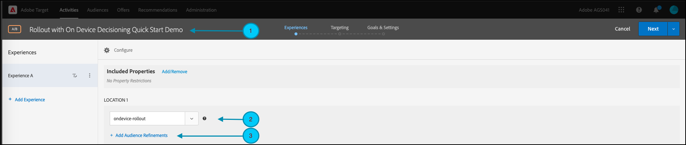
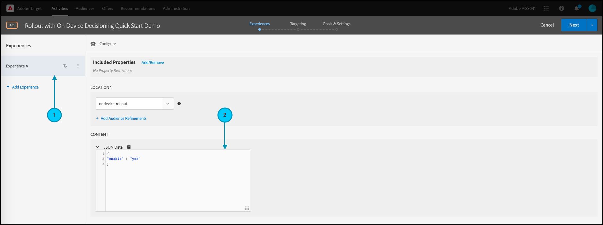
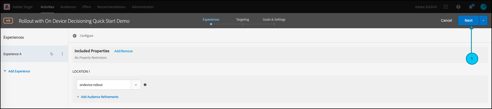
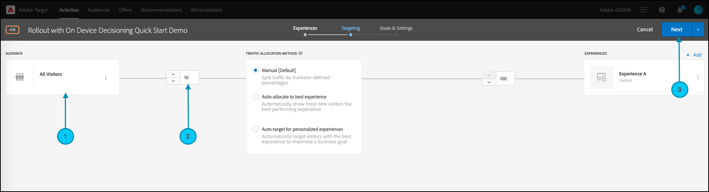
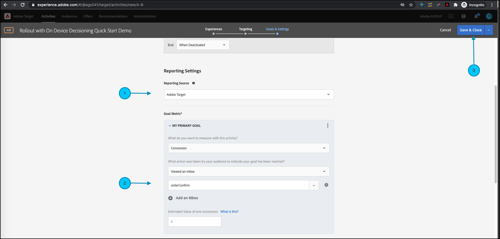
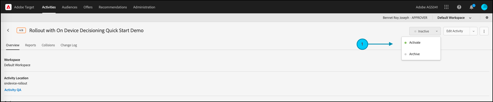
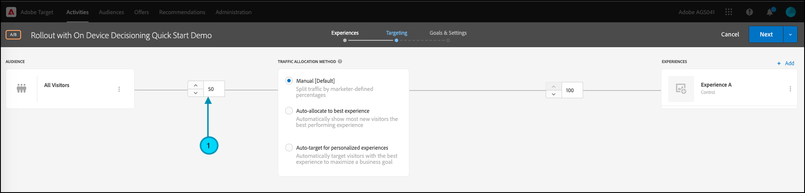

# Verwalten von Rollouts für Funktionstests

## Zusammenfassung der Schritte

1. Aktivieren [!UICONTROL On-Device Decisioning] für Ihre Organisation
1. Erstellen einer [!UICONTROL A/B-Test]-Aktivität
1. Definieren der Funktions- und Rollout-Einstellungen
1. Implementieren und Rendern der Funktion in der Anwendung
1. Implementieren des Trackings für Ereignisse in der Anwendung
1. Aktivieren von A/B-Aktivitäten
1. Rollout und Traffic-Zuordnung nach Bedarf anpassen

## &#x200B;1. Aktivieren [!UICONTROL On-Device Decisioning] für Ihre Organisation

Durch die Aktivierung der geräteinternen Entscheidungsfindung wird sichergestellt, dass eine A/B-Aktivität mit einer Latenz von nahezu null ausgeführt wird. Um diese Funktion zu aktivieren, navigieren Sie **[!UICONTROL [!DNL Adobe Target] zu]** > **[!UICONTROL Implementierung]** > **[!UICONTROL Kontodetails]** und aktivieren Sie den Umschalter **[!UICONTROL On-Device Decisioning]**.


>[!NOTE]
>
>Sie müssen über die Admin- oder Genehmiger[Benutzerrolle verfügen, ](https://experienceleague.adobe.com/docs/target/using/administer/manage-users/user-management.html) den Umschalter [!UICONTROL On-Device Decisioning] zu aktivieren oder zu deaktivieren.

Nach der Aktivierung [!UICONTROL  Umschalters ]On-Device Decisioning“ beginnt [!DNL Adobe Target] mit der Erstellung *Regelartefakte* für Ihren Client.

## &#x200B;2. Erstellen einer [!UICONTROL A/B-Test]-Aktivität

1. Navigieren Sie in [!DNL Adobe Target] zur Seite **[!UICONTROL Aktivitäten]** und wählen Sie dann **[!UICONTROL Aktivität erstellen]** > **[!UICONTROL A/B-Test]**.

   

1. Lassen Sie im Modal **[!UICONTROL A/B-]** erstellen“ die Standardoption **[!UICONTROL Web]** ausgewählt (1), wählen Sie **[!UICONTROL Form]** als Experience Composer (2) aus, wählen Sie **[!UICONTROL Standard-Workspace]** mit **[!UICONTROL Keine Eigenschaftsbeschränkungen]** (3) aus und klicken Sie auf **[!UICONTROL Weiter]** (4).

   

## &#x200B;3. Definieren der Funktions- und Rollout-Einstellungen

Geben **[!UICONTROL im Schritt]** Erlebnisse“ der Aktivitätserstellung einen Namen für Ihre Aktivität ein (1). Geben Sie den Namen des Speicherorts (2) innerhalb Ihrer Anwendung ein, an dem Sie Rollouts für Ihre Funktion verwalten möchten. Beispielsweise sind `ondevice-rollout` oder `homepage-addtocart-rollout` Ortsnamen, die die Ziele für die Verwaltung von Funktions-Rollouts angeben. Im folgenden Beispiel ist `ondevice-rollout` der für Erlebnis A definierte Speicherort. Sie können optional Zielgruppenverfeinerungen (4) hinzufügen, um die Qualifizierung auf die Aktivität zu beschränken.



1. Wählen Sie **[!UICONTROL Abschnitt]** Inhalt“ auf derselben Seite **[!UICONTROL JSON-Angebot erstellen]** in der Dropdown-Liste (1) aus, wie dargestellt.

   

1. Geben Sie im angezeigten Textfeld **[!UICONTROL JSON]** die Feature Flag-Variable für die Funktion ein, die Sie mit dieser Aktivität in Experience A (1) ausführen möchten. Verwenden Sie dazu ein gültiges JSON-Objekt (2).

   

1. Klicken Sie **[!UICONTROL Weiter]** (1), um zum Schritt **[!UICONTROL Targeting]** der Aktivitätserstellung zu gelangen.

   

1. Behalten Sie im Schritt **[!UICONTROL Targeting]** die Zielgruppe **[!UICONTROL Alle Besucher]** (1) für mehr Einfachheit bei. Passen Sie jedoch die Traffic-Zuordnung (2) auf 10 % an. Dadurch wird die Funktion auf nur 10 % der Besucher Ihrer Site beschränkt. Klicken Sie auf Weiter (3), um zum Schritt **[!UICONTROL Ziele und Einstellungen]** zu gelangen.

   

1. Wählen Sie im Schritt **[!UICONTROL Ziele und Einstellungen]** die Option **[!UICONTROL Adobe Target]** (1) als **[!UICONTROL Reporting-Source]** aus, um Ihre Aktivitätsergebnisse in der [!DNL Adobe Target]-Benutzeroberfläche anzuzeigen.

1. Wählen Sie eine **[!UICONTROL Zielmetrik]**, um die Aktivität zu messen. In diesem Beispiel basiert eine erfolgreiche Konversion darauf, ob der Benutzer ein Element kauft, wie dadurch angegeben, ob der Benutzer den Speicherort „orderConfirm (2)“ erreicht hat.

1. Klicken Sie auf **[!UICONTROL Speichern und schließen]** (3), um die Aktivität zu speichern.

   

## &#x200B;4. Implementieren und Rendern der Funktion in der Anwendung

>[!BEGINTABS]

>[!TAB Node.js]

```js {line-numbers="true"}
targetClient.getAttributes(["ondevice-rollout"]).then(function(attributes) {
      const featureFlags = attributes.asObject("ondevice-rollout");

      // Your flag variables are now available in the featureFlags object variable.
      //If you failed to qualify for the Activity, you will have an empty object.
      console.log(featureFlags);
    });
```

>[!TAB Java]

```java {line-numbers="true"}
    Attributes attrs = targetJavaClient.getAttributes(targetDeliveryRequest, "ondevice-rollout");
    Map<String, Object> featureFlags = attrs.toMboxMap("ondevice-rollout");
​
    // Your flag variables are now available in the featureFlags object variable.
    //If you failed to qualify for the Activity, you will have an empty object.
    System.out.println(featureFlags);
```

>[!ENDTABS]

## &#x200B;5. Implementieren des Trackings für Ereignisse in der Anwendung

Nachdem Sie die Feature Flag-Variable in der Anwendung verfügbar gemacht haben, können Sie damit alle Funktionen aktivieren, die bereits Teil Ihrer Anwendung sind. Wenn ein Besucher nicht für die Aktivität qualifiziert ist, bedeutet dies, dass er nicht in den als Zielgruppe definierten 10-%-Bereich einbezogen wurde.

>[!BEGINTABS]

>[!TAB Node.js]

```js {line-numbers="true"}
//... Code removed for brevity

if(featureFlags.enable == "yes") { //Fell within 10% traffic
    console.log("Render Feature");
}
else {
    console.log("Disable Feature");
}

// alternatively, the getValue method could be used on the Attributes object.

if(attributes.getValue("ondevice-rollout", "enable") === "yes") { //Fell within 10% traffic
    console.log("Render Feature");
}
else {
    console.log("Disable Feature");
}
```

>[!TAB Java]

```java {line-numbers="true"}
//... Code removed for brevity
​
if("yes".equals(String.valueOf(featureFlags.get("enable")))) { //Fell within 10% traffic
    System.out.println("Render Feature");
}
else {
    System.out.println("Disable Feature");
}
​
// alternatively, the getString method could be used on the Attributes object.
​
if("yes".equals(attrs.getString("ondevice-rollout", "enable"))) { //Fell within 10% traffic
    System.out.println("Render Feature");
}
else {
    System.out.println("Disable Feature");
}
```

>[!ENDTABS]

## &#x200B;6. Aktivieren der Rollout-Aktivität



## &#x200B;7. Rollout und Traffic-Zuordnung nach Bedarf anpassen

Nachdem Sie Ihre Aktivität aktiviert haben, können Sie sie jederzeit bearbeiten, um die Traffic-Zuordnung nach Bedarf zu erhöhen oder zu verringern.

Erhöhung der Traffic-Zuordnung von 10 % auf 50 % aufgrund des Erfolgs des ersten Rollouts.


