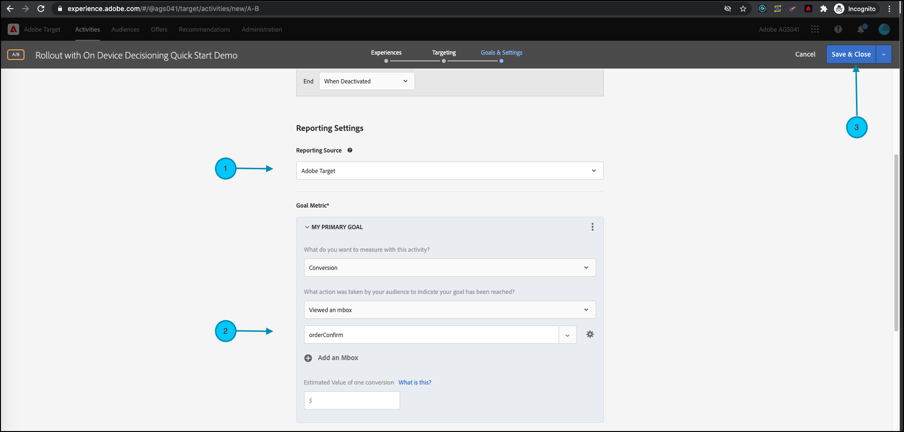

# Verwalten von Rollouts für Funktionstests

## Zusammenfassung der Schritte

1. [!UICONTROL on-device decisioning] für Ihre Organisation aktivieren
1. Erstellen einer [!UICONTROL A/B Test] -Aktivität
1. Definieren Sie Ihre Funktionen und Rollout-Einstellungen
1. Funktion in Ihre Anwendung implementieren und rendern
1. Implementieren des Trackings für Ereignisse in Ihrer Anwendung
1. A/B-Aktivität aktivieren
1. Passen Sie die Rollout- und Traffic-Zuordnung nach Bedarf an

## 1. Aktivieren Sie [!UICONTROL on-device decisioning] für Ihre Organisation

Durch die Aktivierung der Entscheidungsfindung auf dem Gerät wird sichergestellt, dass eine A/B-Aktivität mit nahezu Nulllatenz ausgeführt wird. Um diese Funktion zu aktivieren, navigieren Sie in [!DNL Adobe Target] zu **[!UICONTROL Administration]** > **[!UICONTROL Implementation]** > **[!UICONTROL Account details]** und aktivieren Sie den Umschalter **[!UICONTROL On-Device Decisioning]** .


>[!NOTE]
>
>Sie müssen über die Benutzerrolle &quot;Admin&quot;oder &quot;Genehmiger&quot;[Benutzer](https://experienceleague.adobe.com/docs/target/using/administer/manage-users/user-management.html) verfügen, um den Umschalter [!UICONTROL On-Device Decisioning] zu aktivieren oder zu deaktivieren.

Nachdem Sie den Umschalter [!UICONTROL On-Device Decisioning] aktiviert haben, beginnt [!DNL Adobe Target] mit der Generierung von *Regel-Artefakten* für Ihren Client.

## 2. Erstellen einer [!UICONTROL A/B Test] -Aktivität

1. Navigieren Sie in [!DNL Adobe Target] zur Seite **[!UICONTROL Activities]** und wählen Sie dann **[!UICONTROL Create Activity]** > **[!UICONTROL A/B test]** aus.

   

1. Behalten Sie im Modal **[!UICONTROL Create A/B Test Activity]** die standardmäßig ausgewählte Option **[!UICONTROL Web]** bei (1), wählen Sie **[!UICONTROL Form]** als Ihren Experience Composer (2), wählen Sie **[!UICONTROL Default Workspace]** mit **[!UICONTROL No Property Restrictions]** (3) und klicken Sie auf **[!UICONTROL Next]** (4).

   

## 3. Definieren Sie Ihre Funktionen und Rollout-Einstellungen.

Geben Sie im Schritt **[!UICONTROL Experiences]** der Aktivitätserstellung einen Namen für Ihre Aktivität ein (1). Geben Sie den Namen des Speicherorts (2) in Ihrer Anwendung ein, in dem Sie Rollouts für Ihre Funktion verwalten möchten. Beispielsweise sind `ondevice-rollout` oder `homepage-addtocart-rollout` Standortnamen, die die Ziele für die Verwaltung von Funktions-Rollouts angeben. Im folgenden Beispiel ist `ondevice-rollout` der für Erlebnis A definierte Ort. Sie können optional Zielgruppenverfeinerungen (4) hinzufügen, um die Qualifizierung auf die Aktivität zu beschränken.


1. Wählen Sie im Abschnitt **[!UICONTROL Content]** auf derselben Seite **[!UICONTROL Create JSON Offer]** in der Dropdown-Liste (1) aus, wie unten dargestellt.

   

1. Geben Sie in das angezeigte Textfeld **[!UICONTROL JSON Data]** die Variable für das Feature Flag für die Funktion ein, die Sie für diese Aktivität in Erlebnis A (1) mithilfe eines gültigen JSON-Objekts (2) einführen möchten.

   

1. Klicken Sie auf **[!UICONTROL Next]** (1) , um zum Schritt **[!UICONTROL Targeting]** der Aktivitätserstellung zu gelangen.

   

1. Behalten Sie im Schritt **[!UICONTROL Targeting]** die Zielgruppe **[!UICONTROL All Visitors]** (1) bei, um sie zu vereinfachen. Die Traffic-Zuordnung (2) sollte jedoch auf 10 % angepasst werden. Dadurch wird die Funktion auf nur 10 % der Site-Besucher beschränkt. Klicken Sie auf Weiter (3) , um zum Schritt **[!UICONTROL Goals & Settings]** zu gelangen.

   

1. Wählen Sie im Schritt **[!UICONTROL Goals & Settings]** **[!UICONTROL Adobe Target]** (1) als **[!UICONTROL Reporting Source]** aus, um Ihre Aktivitätsergebnisse in der Benutzeroberfläche von [!DNL Adobe Target] anzuzeigen.

1. Wählen Sie **[!UICONTROL Goal Metric]** aus, um die Aktivität zu messen. In diesem Beispiel basiert eine erfolgreiche Konvertierung darauf, ob der Benutzer einen Artikel kauft, was daran erkennbar ist, ob der Benutzer den Speicherort orderConfirm (2) erreicht hat.

1. Klicken Sie auf **[!UICONTROL Save & Close]** (3) , um die Aktivität zu speichern.

   

## 4. Implementieren und Rendern der Funktion in Ihrer Anwendung

>[!BEGINTABS]

>[!TAB node.js]

```js {line-numbers="true"}
targetClient.getAttributes(["ondevice-rollout"]).then(function(attributes) {
      const featureFlags = attributes.asObject("ondevice-rollout");

      // Your flag variables are now available in the featureFlags object variable.
      //If you failed to qualify for the Activity, you will have an empty object.
      console.log(featureFlags);
    });
```

>[!TAB Java]

```java {line-numbers="true"}
    Attributes attrs = targetJavaClient.getAttributes(targetDeliveryRequest, "ondevice-rollout");
    Map<String, Object> featureFlags = attrs.toMboxMap("ondevice-rollout");
​
    // Your flag variables are now available in the featureFlags object variable.
    //If you failed to qualify for the Activity, you will have an empty object.
    System.out.println(featureFlags);
```

>[!ENDTABS]

## 5. Implementieren des Trackings für Ereignisse in Ihrer Anwendung

Nachdem Sie die Variable &quot;Feature Flag&quot;in der Anwendung verfügbar gemacht haben, können Sie sie verwenden und alle Funktionen aktivieren, die bereits Teil Ihrer Anwendung sind. Wenn ein Besucher nicht für die Aktivität qualifiziert ist, bedeutet dies, dass er nicht Teil der 10-%-Gruppe war, die als Zielgruppe definiert wurde.

>[!BEGINTABS]

>[!TAB node.js]

```js {line-numbers="true"}
//... Code removed for brevity

if(featureFlags.enable == "yes") { //Fell within 10% traffic
    console.log("Render Feature");
}
else {
    console.log("Disable Feature");
}

// alternatively, the getValue method could be used on the Attributes object.

if(attributes.getValue("ondevice-rollout", "enable") === "yes") { //Fell within 10% traffic
    console.log("Render Feature");
}
else {
    console.log("Disable Feature");
}
```

>[!TAB Java]

```java {line-numbers="true"}
//... Code removed for brevity
​
if("yes".equals(String.valueOf(featureFlags.get("enable")))) { //Fell within 10% traffic
    System.out.println("Render Feature");
}
else {
    System.out.println("Disable Feature");
}
​
// alternatively, the getString method could be used on the Attributes object.
​
if("yes".equals(attrs.getString("ondevice-rollout", "enable"))) { //Fell within 10% traffic
    System.out.println("Render Feature");
}
else {
    System.out.println("Disable Feature");
}
```

>[!ENDTABS]

## 6. Aktivieren Sie Ihre Rollout-Aktivität


## 7. Passen Sie bei Bedarf Rollout und Traffic-Zuordnung an

Nachdem Sie Ihre Aktivität aktiviert haben, bearbeiten Sie sie jederzeit, um die Traffic-Zuordnung nach Bedarf zu erhöhen oder zu verringern.

Erhöhung der Traffic-Zuordnung von 10 % auf 50 % aufgrund des Erfolgs des ersten Rollouts.


