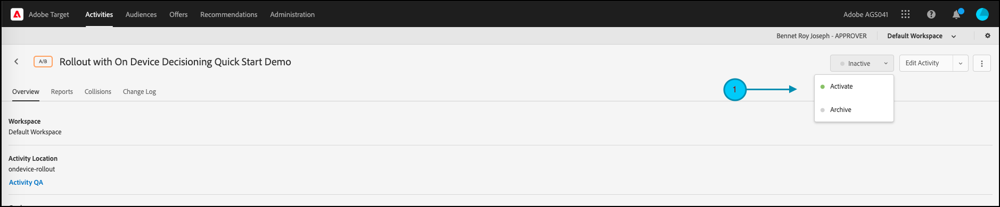

# Verwalten von Rollouts für Funktionstests

## Zusammenfassung der Schritte

1. Aktivieren von [!UICONTROL on-device decisioning] für Ihr Unternehmen
1. [!UICONTROL A/B Test] erstellen
1. Definieren der Funktions- und Rollout-Einstellungen
1. Implementieren und Rendern der Funktion in der Anwendung
1. Implementieren des Trackings für Ereignisse in der Anwendung
1. Aktivieren von A/B-Aktivitäten
1. Rollout und Traffic-Zuordnung nach Bedarf anpassen

## 1. Aktivieren von [!UICONTROL on-device decisioning] für Ihr Unternehmen

Durch die Aktivierung der geräteinternen Entscheidungsfindung wird sichergestellt, dass eine A/B-Aktivität mit einer Latenz von nahezu null ausgeführt wird. Um diese Funktion zu aktivieren, navigieren Sie in [!DNL Adobe Target] zu **[!UICONTROL Administration]** > **[!UICONTROL Implementation]** > **[!UICONTROL Account details]** und aktivieren Sie den Umschalter **[!UICONTROL On-Device Decisioning]** .


>[!NOTE]
>
>Sie müssen über die Rolle Administrator oder Genehmiger [Benutzer) verfügen](https://experienceleague.adobe.com/docs/target/using/administer/manage-users/user-management.html?lang=de) um den Umschalter [!UICONTROL On-Device Decisioning] zu aktivieren oder zu deaktivieren.

Nach der Aktivierung des [!UICONTROL On-Device Decisioning]-Umschalters beginnt [!DNL Adobe Target] mit der Generierung *Regelartefakte* für Ihren Client.

## 2. Erstellen einer [!UICONTROL A/B Test] Aktivität

1. Navigieren Sie in [!DNL Adobe Target] zur Seite **[!UICONTROL Activities]** und wählen Sie dann **[!UICONTROL Create Activity]** > **[!UICONTROL A/B test]** aus.

   

1. Lassen Sie im **[!UICONTROL Create A/B Test Activity]**-Modal die Option **[!UICONTROL Web]** ausgewählt (1), wählen Sie **[!UICONTROL Form]** als Experience Composer (2) aus, wählen Sie **[!UICONTROL Default Workspace]** mit **[!UICONTROL No Property Restrictions]** (3) aus und klicken Sie auf **[!UICONTROL Next]** (4).

   

## 3. Definieren der Funktionen und Rollout-Einstellungen

Geben Sie im **[!UICONTROL Experiences]** Schritt der Aktivitätserstellung einen Namen für Ihre Aktivität ein (1). Geben Sie den Namen des Speicherorts (2) innerhalb Ihrer Anwendung ein, an dem Sie Rollouts für Ihre Funktion verwalten möchten. Beispielsweise sind `ondevice-rollout` oder `homepage-addtocart-rollout` Ortsnamen, die die Ziele für die Verwaltung von Funktions-Rollouts angeben. Im folgenden Beispiel ist `ondevice-rollout` der für Erlebnis A definierte Speicherort. Sie können optional Zielgruppenverfeinerungen (4) hinzufügen, um die Qualifizierung auf die Aktivität zu beschränken.


1. Wählen Sie im Abschnitt **[!UICONTROL Content]** auf derselben Seite in der Dropdown-Liste (1) die Option **[!UICONTROL Create JSON Offer]** aus, wie dargestellt.

   

1. Geben Sie im angezeigten Textfeld **[!UICONTROL JSON Data]** die Feature Flag-Variable für das Feature ein, für das Sie mit dieser Aktivität in Experience A (1) ein Rollout durchführen möchten. Verwenden Sie dazu ein gültiges JSON-Objekt (2).

   

1. Klicken Sie auf **[!UICONTROL Next]** (1), um zum **[!UICONTROL Targeting]** Schritt der Aktivitätserstellung zu gelangen.

   

1. Behalten Sie im **[!UICONTROL Targeting]** Schritt die **[!UICONTROL All Visitors]** Zielgruppe (1) bei, um sie einfacher zu gestalten. Passen Sie jedoch die Traffic-Zuordnung (2) auf 10 % an. Dadurch wird die Funktion auf nur 10 % der Besucher Ihrer Site beschränkt. Klicken Sie auf Weiter (3), um zum Schritt **[!UICONTROL Goals & Settings]** zu gelangen.

   

1. Wählen Sie im **[!UICONTROL Goals & Settings]** Schritt **[!UICONTROL Adobe Target]** (1) als **[!UICONTROL Reporting Source]** aus, um Ihre Aktivitätsergebnisse in der [!DNL Adobe Target]-Benutzeroberfläche anzuzeigen.

1. Wählen Sie eine **[!UICONTROL Goal Metric]** aus, um die Aktivität zu messen. In diesem Beispiel basiert eine erfolgreiche Konversion darauf, ob der Benutzer ein Element kauft, wie dadurch angegeben, ob der Benutzer den Speicherort „orderConfirm (2)“ erreicht hat.

1. Klicken Sie auf **[!UICONTROL Save & Close]** (3), um die Aktivität zu speichern.

   

## 4. Implementieren und rendern der Funktion in der Anwendung

>[!BEGINTABS]

>[!TAB Node.js]

```js {line-numbers="true"}
targetClient.getAttributes(["ondevice-rollout"]).then(function(attributes) {
      const featureFlags = attributes.asObject("ondevice-rollout");

      // Your flag variables are now available in the featureFlags object variable.
      //If you failed to qualify for the Activity, you will have an empty object.
      console.log(featureFlags);
    });
```

>[!TAB Java]

```java {line-numbers="true"}
    Attributes attrs = targetJavaClient.getAttributes(targetDeliveryRequest, "ondevice-rollout");
    Map<String, Object> featureFlags = attrs.toMboxMap("ondevice-rollout");
​
    // Your flag variables are now available in the featureFlags object variable.
    //If you failed to qualify for the Activity, you will have an empty object.
    System.out.println(featureFlags);
```

>[!ENDTABS]

## 5. Implementieren des Trackings für Ereignisse in der Anwendung

Nachdem Sie die Feature Flag-Variable in der Anwendung verfügbar gemacht haben, können Sie damit alle Funktionen aktivieren, die bereits Teil Ihrer Anwendung sind. Wenn ein Besucher nicht für die Aktivität qualifiziert ist, bedeutet dies, dass er nicht in den als Zielgruppe definierten 10-%-Bereich einbezogen wurde.

>[!BEGINTABS]

>[!TAB Node.js]

```js {line-numbers="true"}
//... Code removed for brevity

if(featureFlags.enable == "yes") { //Fell within 10% traffic
    console.log("Render Feature");
}
else {
    console.log("Disable Feature");
}

// alternatively, the getValue method could be used on the Attributes object.

if(attributes.getValue("ondevice-rollout", "enable") === "yes") { //Fell within 10% traffic
    console.log("Render Feature");
}
else {
    console.log("Disable Feature");
}
```

>[!TAB Java]

```java {line-numbers="true"}
//... Code removed for brevity
​
if("yes".equals(String.valueOf(featureFlags.get("enable")))) { //Fell within 10% traffic
    System.out.println("Render Feature");
}
else {
    System.out.println("Disable Feature");
}
​
// alternatively, the getString method could be used on the Attributes object.
​
if("yes".equals(attrs.getString("ondevice-rollout", "enable"))) { //Fell within 10% traffic
    System.out.println("Render Feature");
}
else {
    System.out.println("Disable Feature");
}
```

>[!ENDTABS]

## 6. Aktivieren der Rollout-Aktivität



## 7. Passen Sie Rollout und Traffic-Zuordnung nach Bedarf an

Nachdem Sie Ihre Aktivität aktiviert haben, können Sie sie jederzeit bearbeiten, um die Traffic-Zuordnung nach Bedarf zu erhöhen oder zu verringern.

Erhöhung der Traffic-Zuordnung von 10 % auf 50 % aufgrund des Erfolgs des ersten Rollouts.


