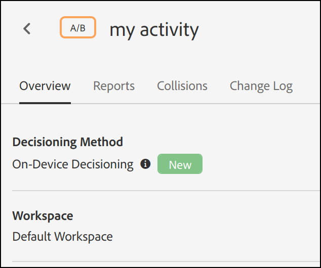
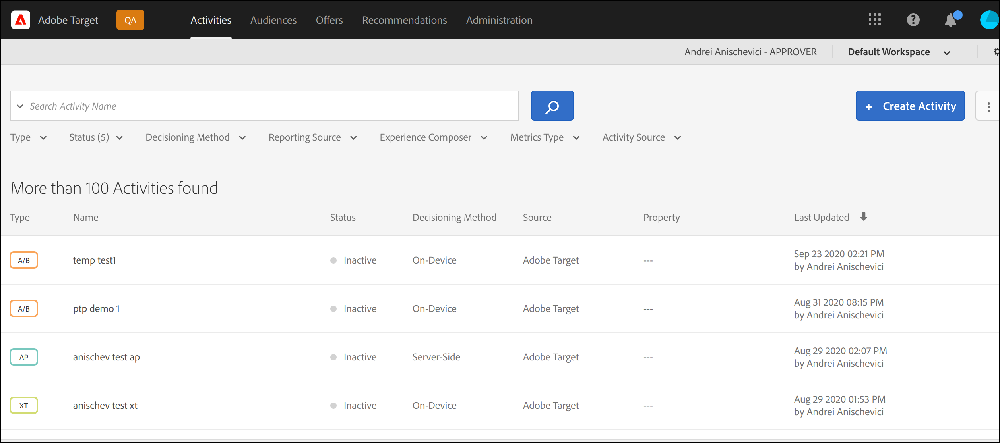

# Übersicht über On-device Decisioning

Die [!DNL Adobe Target]-SDKs der nächsten Generation bieten jetzt [!UICONTROL geräteinterne Entscheidungsfindung], mit der Sie Ihre A/B- und Experience Targeting(XT)-Kampagnen auf Ihrem Server zwischenspeichern und speicherinterne Entscheidungsfindungen mit einer Latenz von nahezu null durchführen können, ohne Netzwerkanfragen an die Edge Network von [!DNL Adobe Target] zu blockieren.

[!DNL Adobe Target] bietet außerdem die Flexibilität, über einen Live-Server-Aufruf das relevanteste und aktuellste Erlebnis aus Ihren Experiment- und ML-basierten Personalisierungskampagnen bereitzustellen. Mit anderen Worten: Wenn die Leistung am wichtigsten ist, können Sie [!UICONTROL On-Device Decisioning] verwenden. Wenn jedoch das relevanteste und aktuellste Erlebnis benötigt wird, kann stattdessen ein Server-Aufruf durchgeführt werden. Siehe [Wann wird die geräteinterne vs. Edge-](../../sdk-guides/on-device-decisioning/supported-features.md) verwendet?, um mehr über Anwendungsfälle zu erfahren, die die Verwendung des einen über den anderen rechtfertigen.

>[!NOTE]
>
>Die geräteinterne Entscheidungsfindung ist sowohl für Client- als auch für Server-seitige Implementierungen verfügbar. In diesem Artikel wird [!UICONTROL On-Device Decisioning] für Server-seitig beschrieben. Informationen zur [!UICONTROL On-Device Decisioning] für Client-seitig finden Sie in der Dokumentation zur Client-seitigen Implementierung [hier](../../../client-side/atjs/on-device-decisioning/on-device-decisioning.md).

## Wie funktioniert das?

Wenn Sie eine [!DNL Adobe Target] SDK mit aktivierter [!UICONTROL On-Device Decisioning] installieren und initialisieren, wird *Regelartefakt* heruntergeladen und lokal von dem Ihrem Server am nächsten gelegenen Akamai-CDN auf Ihren Server zwischengespeichert. Wenn eine Anfrage zum Abrufen eines [!DNL Adobe Target] Erlebnisses innerhalb Ihrer Server-seitigen Anwendung erfolgt, wird die Entscheidung darüber, welcher Inhalt zurückgegeben werden soll, im Arbeitsspeicher getroffen, basierend auf den Metadaten, die im zwischengespeicherten Regelartefakt codiert sind. Dieses Artefakt definiert alle Ihre [!UICONTROL On-Device Decisioning] A/B- und XT-Aktivitäten.

Das folgende Diagramm zeigt die Architektur [!UICONTROL On-Device Decisioning]. Klicken, um das Bild zu erweitern.

(Klicken Sie auf das Bild, um es auf die volle Breite zu erweitern.)

{zoomable="yes"}

## Was sind die Vorteile?

* **Entscheidungen mit nahezu null Latenzen treffen.** Bucketing und Entscheidungsfindung werden im Arbeitsspeicher und auf dem Gerät durchgeführt, um das Blockieren von Netzwerkanfragen zu vermeiden.
* **Verbesserung der Anwendungsleistung.** Führen Sie Experimente durch und stellen Sie Ihren Kunden und Benutzern Personalisierung bereit, ohne die Erlebnisse der Endbenutzer zu beeinträchtigen.
* **Google Site-Qualitätsbewertung verbessern.** Da die Entscheidungsfindung im Arbeitsspeicher und auf der Serverseite erfolgt, verbessern Sie den Google-Site-Qualitätsindex Ihres Online-Unternehmens, damit es von Verbrauchern leichter gefunden werden kann.
* **Lernen aus der Echtzeit-Analyse.** Gewinnen Sie Erkenntnisse aus Ihrer Aktivitätsleistung in Echtzeit über [!DNL Adobe Target]- oder A4T-Berichte, sodass Sie Ihre Strategie in kritischen Momenten umstellen können.

## Unterstützte Funktionen

### Aktivitäten

Die geräteinterne Entscheidungsfindung unterstützt die folgenden Aktivitätstypen, die vom ([-basierten Experience Composer) erstellt ](https://experienceleague.adobe.com/docs/target/using/experiences/form-experience-composer.html):

* [!UICONTROL A/B-Test]
* [!UICONTROL Experience Targeting] (XT)

### Zuordnungsmethode

Die geräteinterne Entscheidungsfindung unterstützt die folgende Zuordnungsmethode:

* Manuell

### Zielgruppen-Targeting

Die geräteinterne Entscheidungsfindung unterstützt die folgenden Zielgruppenregeln:

| Zielgruppenregel | On-device Decisioning |
| --- | --- |
| [Geo](https://experienceleague.adobe.com/docs/target/using/audiences/create-audiences/categories-audiences/geo.html) | Ja
Bei der Verwendung der geräteinternen Entscheidungsfindung werden die folgenden Geoattribute unterstützt:<ul><li>Land/Region</li><li>Stadt</li><li>Breitengrad</li><li>Längengrad</li></ul> |
| [Netzwerk](https://experienceleague.adobe.com/docs/target/using/audiences/create-audiences/categories-audiences/network.html) | Nein |
| [Mobile](https://experienceleague.adobe.com/docs/target/using/audiences/create-audiences/categories-audiences/mobile.html) | Nein |
| [Benutzerdefinierte Parameter](https://experienceleague.adobe.com/docs/target/using/audiences/create-audiences/categories-audiences/custom-parameters.html) | Ja |
| [Betriebssystem](https://experienceleague.adobe.com/docs/target/using/audiences/create-audiences/categories-audiences/operating-system.html) | Ja |
| [Seiten der Site](https://experienceleague.adobe.com/docs/target/using/audiences/create-audiences/categories-audiences/site-pages.html) | Ja |
| [Browser](https://experienceleague.adobe.com/docs/target/using/audiences/create-audiences/categories-audiences/browser.html) | Ja |
| [Besucherprofil](https://experienceleague.adobe.com/docs/target/using/audiences/create-audiences/categories-audiences/visitor-profile.html) | Nein |
| [Traffic-Quellen](https://experienceleague.adobe.com/docs/target/using/audiences/create-audiences/categories-audiences/traffic-sources.html) | Nein |
| [Zeitrahmen](https://experienceleague.adobe.com/docs/target/using/audiences/create-audiences/categories-audiences/time-frame.html) | Ja |
| [Experience Cloud-Zielgruppen](https://experienceleague.adobe.com/docs/target/using/integrate/mmp.html) (Zielgruppen aus Adobe Audience Manager, Adobe Analytics und Adobe Experience Manager | Nein |

## Wie stelle ich meinen Client für die Verwendung von [!UICONTROL On-Device Decisioning] bereit?

Die geräteinterne Entscheidungsfindung ist für alle [!DNL Adobe Target]-Kunden verfügbar, die [!DNL Adobe Target] Server-seitige SDKs verwenden. Um diese Funktion zu aktivieren, navigieren Sie in der [!DNL Adobe Target]-Benutzeroberfläche zu **[!UICONTROL Administration]** > **[!UICONTROL Implementierung]** > **[!UICONTROL Kontodetails]** und aktivieren Sie den Umschalter **[!UICONTROL Geräteinterne Entscheidungsfindung]**.

>[!NOTE]
>
>Sie müssen über die Admin- oder Genehmiger *Benutzerrolle verfügen,* den Umschalter [!UICONTROL On-Device Decisioning] zu aktivieren oder zu deaktivieren.

Nach der Aktivierung des Umschalters „Geräteinterne Entscheidungsfindung“ beginnt [!DNL Adobe Target] mit der Generierung und Verbreitung *Regelartefakte* für Ihren Client.

>[!NOTE]
>
>Stellen Sie sicher, dass Sie den Umschalter aktivieren, bevor Sie [!DNL Adobe Target] SDK für die Verwendung [!UICONTROL On-Device Decisioning] initialisieren. Die Regelartefakte müssen zunächst generiert und an die Akamai-CDNs weitergegeben werden, damit [!UICONTROL On-Device Decisioning] funktioniert.

### Alle vorhandenen ([!UICONTROL  Entscheidungsfindung auf dem Gerät] qualifizierten Aktivitäten in den Artefakt-Umschalter einschließen

Schalten Sie dieses **ein** wenn alle Ihre Live [!DNL Target]-Aktivitäten, die für die [!UICONTROL Entscheidungsfindung auf dem Gerät] qualifiziert sind, automatisch in das Artefakt aufgenommen werden sollen.

Wenn Sie diesen Umschalter **Aus** lassen, müssen Sie alle [!UICONTROL Entscheidungsaktivitäten auf dem Gerät] neu erstellen und aktivieren, damit sie in das generierte Regelartefakt aufgenommen werden.

## Woher weiß ich, dass eine Aktivität [!UICONTROL On-Device Decisioning] fähig ist?

Nachdem Sie eine Aktivität erstellt haben, gibt eine Bezeichnung **[!UICONTROL Entscheidungsmethode]**, die auf der Aktivitätsdetailseite sichtbar ist, an, ob die Aktivität [!UICONTROL Entscheidungsfindung auf dem Gerät] fähig ist.

Sie können auch alle Aktivitäten anzeigen, die [!UICONTROL On-Device Decisioning] auf der Seite **[!UICONTROL Aktivitäten]** möglich sind, indem Sie die Spalte **[!UICONTROL Entscheidungsmethode]** zur Liste der Aktivitäten hinzufügen.

>[!NOTE]
>
>Nach dem Erstellen und Aktivieren einer Aktivität, die [!UICONTROL On-Device Decisioning]-fähig ist, kann es 20 Minuten dauern, bis sie in das Regelartefakt aufgenommen wird, das generiert und an die Akamai CDN-Pos weitergegeben wird.

## Wie lautet die Zusammenfassung der Schritte, die ich ausführen muss, um sicherzustellen, [!UICONTROL  meine ]-Aktivitäten erfolgreich über die Server-seitige SDK von [!DNL Adobe Target] bereitgestellt werden?

1. Rufen Sie die [!DNL Adobe Target]-Benutzeroberfläche auf und navigieren Sie **[!UICONTROL Administration]** > **[!UICONTROL Implementierung]** > **[!UICONTROL Kontodetails]**, um den Umschalter **[!UICONTROL Geräteinterne Entscheidungsfindung]** zu aktivieren.
1. Aktivieren Sie den **[!UICONTROL Alle vorhandenen [!UICONTROL geräteinternen Entscheidungsfindung einbeziehen] qualifizierten Aktivitäten im Artefakt]**.
1. Erstellen und aktivieren Sie einen Aktivitätstyp, der von [!UICONTROL On-Device Decisioning] unterstützt wird, und stellen Sie sicher **[!UICONTROL dass die Entscheidungsmethode]** für diese Aktivität **[!UICONTROL On-Device Decisioning]** ist.
1. Installieren und initialisieren Sie [Node.js](../../node-js/overview.md) oder [Java](../../java/overview.md) SDK mit `decisioningMethod = on-device`.
1. Implementieren Sie `getOffers()` oder `getAttributes()` in Ihrem Code, um ein Erlebnis auf dem Gerät abzurufen.
1. Bereitstellen des Codes.

Beispiele, die die ersten Schritte mit den Schritten 1-3 oben veranschaulichen, finden Sie [ Abschnitt „Erste Schritte](../getting-started/getting-started.md).

## Zusätzliche Ressourcen

### Webinar: Personalisieren und Testen mit Nulllatenz bei geräteinterner Entscheidungsfindung mit [!DNL Adobe Target]

Marketer, Produkteigentümer und Entwickler sind mehr denn je gefordert, die Erlebnisse ihrer Kunden auf Websites, in Apps und überall dort, wo sie mit ihren Kunden in Kontakt treten, zu optimieren. Verschiedene Tools mit Datensilos und komplizierten Implementierungen sind unzureichend.

In diesem aufgezeichneten Webinar besprechen [!DNL Adobe Target] Produktexperten, wie die Verschiebung kritischer Entscheidungen der Erlebnisoptimierung auf das Gerät durch lokale Ausführung mit nahezu Nulllatenz Türen für aufregende neue Anwendungsfälle öffnet, während sich die Site-Performance Ihrer Kunden gleichzeitig verbessert.

>[!VIDEO](https://video.tv.adobe.com/v/328148/?quality=12)

### Tutorial: On-device Decisioning

[!DNL Adobe Target] [!UICONTROL On-Device Decisioning] ermöglicht die Bereitstellung von Inhalten mit nahezu null Latenz.

Dieses 7-minütige Video:

* Beschreibt [!UICONTROL On-Device Decisioning] einschließlich dessen Vergleich mit anderen Methoden [!DNL Target] Implementierung
* Veranschaulicht, wie die [!UICONTROL On-Device Decisioning] in Target aktiviert wird
* Untersucht eine beispielhafte formularbasierte Composer-Aktivität, die mit JSON-Inhalten konfiguriert wurde
* Zeigt beispielhaften Node.js-SDK-Code mit der Schlüsselkonfiguration, die für [!UICONTROL  Entscheidungsfindung auf dem Gerät erforderlich ist]
* Zeigt Ergebnisse in einem Browser an

>[!VIDEO](https://video.tv.adobe.com/v/329032/?quality=12)

Weitere Videos und Tutorials finden Sie unter [[!DNL Adobe Target] Tutorials](https://experienceleague.adobe.com/docs/target-learn/tutorials/overview.html?lang=de).

### Adobe Tech Blog - Part 1: Führen Sie [!DNL Adobe Target] NodeJS SDK zum Experimentieren und Personalisieren auf Edge-Plattformen aus (Akamai Edge Workers)

[Hier klicken, um den Blogpost aufzurufen](https://medium.com/adobetech/part-1-run-adobe-target-nodejs-sdk-for-experimentation-and-personalization-on-edge-platforms-4d8660964ed9).

### Adobe Tech Blog – Part 2: Führen Sie das [!DNL Adobe Target] NodeJS SDK zum Experimentieren und Personalisieren auf Edge-Plattformen aus (AWS Lambda@Edge)

[Hier klicken, um den Blogpost aufzurufen](https://medium.com/adobetech/part-2-run-adobe-target-nodejs-sdk-for-experimentation-and-personalization-on-edge-platforms-aws-4d6bdac24563).
