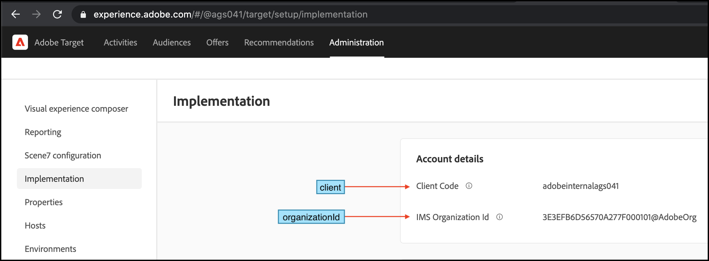

# Herunterladen, Speichern und Aktualisieren des Regelartefakts über die JSON-Payload

Dieser Ansatz empfiehlt sich, wenn die Anwendung so strukturiert ist, dass die SDK für jede Datei initialisiert werden muss, in der sie SDK-Methoden verwendet. Bevor Ihre Web-Anwendung die JSON-Payload des Regelartefakts während der SDK-Initialisierung verwenden kann, sollten Sie sicherstellen, dass die JSON-Payload heruntergeladen wurde und für Ihre Anwendung verfügbar ist.

## Zusammenfassung der Schritte

1. Installieren von SDK
1. SDK initialisieren
1. Speichern und Verwenden der JSON-Payload

## &#x200B;1. Installieren von SDK

>[!BEGINTABS]

>[!TAB NPM]

```javascript {line-numbers="true"}
npm i @adobe/target-nodejs-sdk -P
```

>[!TAB MVN]

```javascript {line-numbers="true"}
<dependency>
    <groupId>com.adobe.target</groupId>
    <artifactId>java-sdk</artifactId>
    <version>1.0</version>
</dependency>
```

>[!ENDTABS]

## &#x200B;2. SDK initialisieren

1. Importieren Sie zunächst die SDK. Importieren Sie in dieselbe Datei, von der aus Sie den Serverstart steuern können.

   **Node.js**

   ```javascript {line-numbers="true"}
   const TargetClient = require("@adobe/target-nodejs-sdk");
   ```

   **Java**

   ```javascript {line-numbers="true"}
   import com.adobe.target.edge.client.ClientConfig;
   import com.adobe.target.edge.client.TargetClient;
   ```

1. Verwenden Sie zum Konfigurieren der SDK die Create-Methode.

   **Node.js**

   ```javascript {line-numbers="true"}
   const CONFIG = {
       client: "<your target client code>",
       organizationId: "your EC org id",
       decisioningMethod: "on-device",
       pollingInterval : 300000,
       events: {
           artifactDownloadSucceeded: onArtifactDownloadSucceeded,
           artifactDownloadFailed: onArtifactDownloadFailed
       }
   };
   
   const TargetClient = TargetClient.create(CONFIG);
   
   function onArtifactDownloadSucceeded(event) {
       //Adobe Target SDK has now downloaded the JSON Artifact/Payload
       console.log(event.artifactLocation) // Location from where the Artifact is downloaded.
       console.log(event.artifactPayload) // JSON Payload which we can store locally.
   }
   
   function onArtifactDownloadFailed(event) {
       //Adobe Target SDK has failed to download the JSON Artifact/Payload.
       console.log(event.artifactLocation) // Location from where the Artifact is downloaded.
       console.log(event.error.message) // Error message
   }
   ```

   **Java**

   ```javascript {line-numbers="true"}
   package com.adobe.target.edge.client.model.ondevice.OnDeviceDecisioningHandler;
   
   ClientConfig config = ClientConfig.builder()
       .client("<you target client code>")
       .organizationId("<your EC org id>")
       .onDeviceDecisioningHandler(
         new OnDeviceDecisioningHandler() {
           void onDeviceDecisioningReady() {
             // On-Device Decision is ready.
           }
           void artifactDownloadSucceeded(byte[] artifactData) {
             // Store artifactData to local disk.        
             // ...
           }
         }
       )
       .build();
   TargetClient targetClient = TargetClient.create(config);
   ```

1. Sowohl der Client als auch die `organizationId` können von abgerufen werden[!DNL Adobe Target] indem Sie zu **[!UICONTROL Administration]** > **[!UICONTROL Implementierung]** navigieren, wie hier dargestellt.

   <!-- Insert image-client-code.png -->
   

## &#x200B;3. Speichern und Wiederverwenden der JSON-Payload

Der Mechanismus zum Speichern der JSON-Payload hängt von Ihrer Systemarchitektur ab. Sie können eine lokale Datei, eine Datenbank oder ein Speicherobjekt-Caching-System wie Memcached verwenden. Sie müssen in der Lage sein, diese JSON aus Ihrer Anwendung für den Verbrauch zu lesen. In diesem Handbuch verwenden wir eine lokale Datei als Speicher.

>[!BEGINTABS]

>[!TAB Node.js]

```javascript {line-numbers="true"}
//... Code removed for brevity

function onArtifactDownloadSucceeded(event) {
    const jsonPath = 'src/config/target-rules.json'
    fs.writeFile(jsonPath, JSON.stringify(event.artifactPayload), 'utf8', (err) => {
        if (err) {
            throw err;
        };
        console.log(`The artifact from '${event.artifactLocation}' is now saved to '${jsonPath}'`);
    });
}


function onArtifactDownloadFailed(event) {
  console.log(`The local decisioning artifact failed to download from '${event.artifactLocation}' with the following error message: ${event.error.message}`);
}

//... Code removed for brevity
```

>[!TAB Java]

```javascript {line-numbers="true"}
MboxRequest mbox = new MboxRequest().name("homepage").index(0);
TargetDeliveryRequest request = TargetDeliveryRequest.builder()
    .context(new Context().channel(ChannelType.WEB))
    .execute(new ExecuteRequest().mboxes(Arrays.asList(mbox)))
    .build();
TargetDeliveryResponse response = targetClient.getOffers(request);
```

>[!ENDTABS]

>[!NOTE]
>
>Durch die Initialisierung der [!DNL Adobe Target]SDK über die JSON-Payload kann Ihr Server Anfragen sofort mit Entscheidungsaktivitäten auf dem Gerät bereitstellen, da die [!DNL Adobe Target]SDK nicht warten muss, bis das Regelartefakt heruntergeladen wird.

Im Folgenden finden Sie ein Beispiel, das die JSON-Payload-Initialisierungsfunktion veranschaulicht.

>[!BEGINTABS]

>[!TAB Node.js]

```javascript {line-numbers="true"}
const express = require("express");
const cookieParser = require("cookie-parser");
const TargetClient = require("@adobe/target-nodejs-sdk");
const CONFIG = {
    client: "<your target client code>",
    organizationId: "your EC org id",
    decisioningMethod: "on-device",
    pollingInterval : 300000,
    events: {
        clientReady : startWebServer,
        artifactDownloadSucceeded : onArtifactDownloadSucceeded,
        artifactDownloadFailed : onArtifactDownloadFailed
    },
};

function onArtifactDownloadSucceeded(event) {
    const jsonPath = 'src/config/target-rules.json'
    fs.writeFile(jsonPath, JSON.stringify(event.artifactPayload), 'utf8', (err) => {
        if (err) {
            throw err;
        };
        console.log(`The artifact from '${event.artifactLocation}' is now saved to '${jsonPath}'`);
    });
}

function onArtifactDownloadFailed(event) {
  console.log(`The on-device decisioning artifact failed to download from '${event.artifactLocation}' with the following error message: ${event.error.message}`);
}

const app = express();
const targetClient = TargetClient.create(CONFIG);

app.use(cookieParser());

function saveCookie(res, cookie) {
  if (!cookie) {
    return;
  }

  res.cookie(cookie.name, cookie.value, {maxAge: cookie.maxAge * 1000});
}

const getResponseHeaders = () => ({
  "Content-Type": "text/html",
  "Expires": new Date().toUTCString()
});

function sendSuccessResponse(res, response) {
  res.set(getResponseHeaders());
  saveCookie(res, response.targetCookie);
  res.status(200).send(response);
}

function sendErrorResponse(res, error) {
  res.set(getResponseHeaders());
  res.status(500).send(error);
}

function startWebServer() {
    app.get('/*', async (req, res) => {
    const targetCookie = req.cookies[TargetClient.TargetCookieName];
    const request = {
        execute: {
        mboxes: [{
            address: { url: req.headers.host + req.originalUrl },
            name: "on-device-homepage-banner" // Ensure that you have a LIVE Activity running on this location
        }]
        }};

    try {
        const response = await targetClient.getOffers({ request, targetCookie });
        sendSuccessResponse(res, response);
    } catch (error) {
        console.error("Target:", error);
        sendErrorResponse(res, error);
    }
    });

    app.listen(3000, function () {
    console.log("Listening on port 3000 and watching!");
    });
}
```

>[!TAB Java]

```javascript {line-numbers="true"}
import com.adobe.target.edge.client.ClientConfig;
import com.adobe.target.edge.client.TargetClient;
import com.adobe.target.delivery.v1.model.ChannelType;
import com.adobe.target.delivery.v1.model.Context;
import com.adobe.target.delivery.v1.model.ExecuteRequest;
import com.adobe.target.delivery.v1.model.MboxRequest;
import com.adobe.target.edge.client.entities.TargetDeliveryRequest;
import com.adobe.target.edge.client.model.TargetDeliveryResponse;

@Controller
public class TargetController {

  private TargetClient targetClient;

  TargetController() {
    // You should instantiate TargetClient in a Bean and inject the instance into this class 
    // but we show the code here for demonstration purpose.
    ClientConfig config = ClientConfig.builder()
        .client("<you target client code>")
        .organizationId("<your EC org id>")
        .onDeviceDecisioningHandler(
          new OnDeviceDecisioningHandler() {
            void onDeviceDecisioningReady() {
              // On-Device Decision is ready.
            }
            void artifactDownloadSucceeded(byte[] artifactData) {
              // Store artifactData to local disk.        
              // ...
            }
          }
        )
        .build();
    targetClient = TargetClient.create(config);
  }

  @GetMapping("/")
  public String homePage() {
    MboxRequest mbox = new MboxRequest().name("homepage").index(0);
    TargetDeliveryRequest request = TargetDeliveryRequest.builder()
        .context(new Context().channel(ChannelType.WEB))
        .execute(new ExecuteRequest().mboxes(Arrays.asList(mbox)))
        .build();
    TargetDeliveryResponse response = targetClient.getOffers(request);
    // ...
  }
}
```

>[!ENDTABS]
