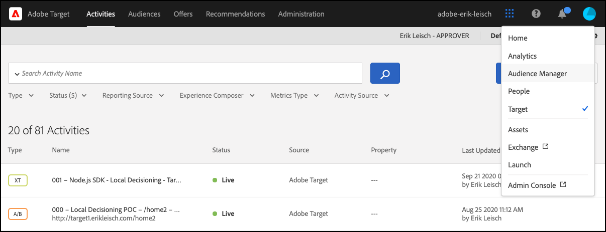
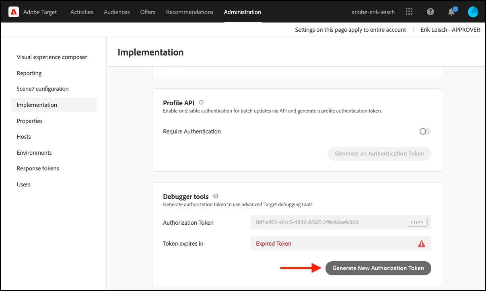

# Übersicht über Regelartefakte

Das Regelartefakt ist eine JSON-Darstellung Ihrer [!DNL Adobe Target]-Aktivitäten [!UICONTROL Entscheidungsfindung auf &#x200B;]. Sie wird von [!DNL Adobe Target] generiert und an das Akamai-CDN weitergegeben, um sicherzustellen, dass ein Regelartefakt so nah wie möglich bei Ihren Endbenutzern verfügbar ist. Sie enthält Metadaten, die eine präzise Ausführung und Bereitstellung Ihrer Aktivitäten sicherstellen und gleichzeitig über die Ereignisverfolgung Echtzeit-Analysen ermöglichen. Die [!DNL Adobe Target] SDKs können so konfiguriert werden, dass das Regelartefakt automatisch verwaltet werden kann. Dabei kann es in einem benutzerdefinierten Zeitintervall heruntergeladen oder aktualisiert werden. Darüber hinaus können Sie auch Ihre eigene lokale Kopie des Regelartefakts mithilfe eines verteilten Arbeitsspeicher-Caching-Systems wie [Memcached](https://memcached.org/) verwalten, um das [!DNL Adobe Target] SDK zu initialisieren, damit Ihre statuslosen Server Anfragen sofort bereitstellen können. Weitere Informationen zu diesen Optionen finden Sie in den folgenden Handbüchern:

* [Automatisches Herunterladen, Speichern und Aktualisieren des Regelartefakts über die  [!DNL Adobe Target] SDK](rule-artifact-sdk.md)
* [Herunterladen, Speichern und Aktualisieren des Regelartefakts über die JSON-Payload](rule-artifact-json.md)

## Beispiel für ein Regelartefakt

Klicken Sie hier, um ein Beispiel für das [Regelartefakt](rule-artifact-example.md) zu sehen.

## Anzeigen des Regelartefakts für Ihren Client

Durch die Aktivierung von Traces werden zusätzliche Informationen aus [!DNL Adobe Target] in Bezug auf das Regelartefakt ausgegeben, insbesondere die URL.

1. Navigieren Sie zur Target-Benutzeroberfläche.

   <!-- Insert image-target-ui-1.png -->
   

1. Navigieren Sie zu **[!UICONTROL Administration]** > **[!UICONTROL Implementierung]** und klicken Sie auf **[!UICONTROL Neues Autorisierungstoken erstellen]**.

   <!-- Insert image-target-ui-2.png -->
   

1. Kopieren Sie das neu generierte Autorisierungs-Token in die Zwischenablage und fügen Sie es Ihrer Target-Anfrage hinzu.

   ```javascript {line-numbers="true"}
   const request = {
     trace: {
       authorizationToken: '88f1a924-6bc5-4836-8560-2f9c86aeb36b'
     },
     execute: {
       mboxes: [{
         address: getAddress(req),
         name: "node-sdk-mbox"
       }]
   }};
   ```

1. Geben Sie den Target-Trace über das Terminal aus, um Details zum Artefakt anzuzeigen. Die URL ist über die Variable `artifactLocation` zugänglich.

   ```
   "trace": {
     "clientCode": "your-client-code",
     "artifact": {
       "artifactLocation": "https://assets.adobetarget.com/your-client-code/production/v1/rules.bin",
       "pollingInterval": 300000,
       "pollingHalted": false,
       "artifactVersion": "1.0.0",
       "artifactRetrievalCount": 10,
       "artifactLastRetrieved": "2020-09-20T00:09:42.707Z",
        "clientCode": "your-client-code",
      "environment": "production",
       "generatedAt": "2020-09-22T17:17:59.783Z"
     },
   ```
