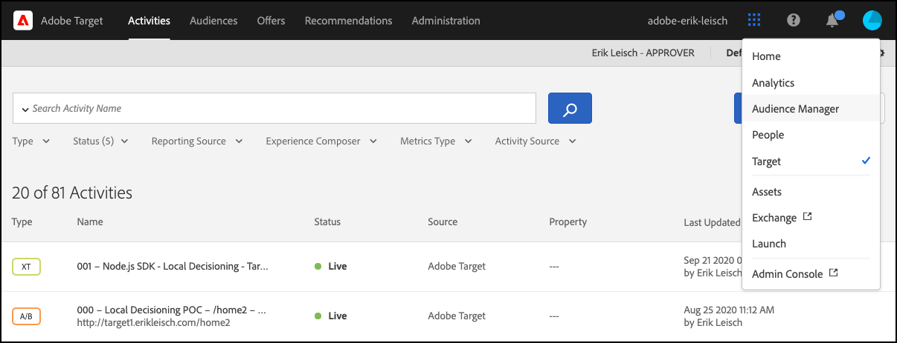

# Fehlerbehebung [!UICONTROL on-device decisioning]

## Konfiguration wird validiert

### Zusammenfassung der Schritte

1. Stellen Sie sicher, dass die `logger` konfiguriert ist
1. Stellen Sie sicher, dass [!DNL Target] Traces aktiviert ist
1. Stellen Sie sicher[!UICONTROL on-device decisioning] dass *Regelartefakt* gemäß dem definierten Abrufintervall abgerufen und zwischengespeichert wurde.
1. Validieren der Inhaltsbereitstellung über das zwischengespeicherte Regelartefakt durch Erstellen einer Test-[!UICONTROL on-device decisioning]-Aktivität über den formularbasierten Experience Composer.
1. Inspect - Fehler beim Senden von Benachrichtigungen

## 1. Stellen Sie sicher, dass der Logger konfiguriert ist

Stellen Sie bei der Initialisierung von SDK sicher, dass Sie die Protokollierung aktivieren.

**Node.js**

Für Node.js-SDK sollte ein `logger`-Objekt angegeben werden.

```js {line-numbers="true"}
const CONFIG = {
  client: "<your client code>",
  organizationId: "<your organization ID>",
  logger: console
};
```

**Java SDK**

Für Java sollte SDK `logRequests` auf dem `ClientConfig` aktiviert sein.

```js {line-numbers="true"}
ClientConfig config = ClientConfig.builder()
  .client("<your client code>")
  .organizationId("<your organization ID>")
  .logRequests(true)
  .build();
```

Außerdem sollte JVM mit dem folgenden Befehlszeilenparameter gestartet werden:

```bash {line-numbers="true"}
java -Dorg.slf4j.simpleLogger.defaultLogLevel=DEBUG ...
```

## 2. Stellen Sie sicher[!DNL Target] dass „Traces“ aktiviert ist

Durch Aktivieren von Traces werden zusätzliche Informationen aus [!DNL Adobe Target] in Bezug auf das Regelartefakt ausgegeben.

1. Navigieren Sie zur [!DNL Target]-Benutzeroberfläche in [!DNL Experience Cloud].

   

1. Navigieren Sie zu **[!UICONTROL Administration]** > **[!UICONTROL Implementation]** und klicken Sie auf **[!UICONTROL Generate New Authorization Token]**.

   

1. Kopieren Sie das neu generierte Autorisierungs-Token in die Zwischenablage und fügen Sie es Ihrer [!DNL Target] hinzu:

   **Node.js**

   ```js {line-numbers="true"}
   const request = {
     trace: {
       authorizationToken: "88f1a924-6bc5-4836-8560-2f9c86aeb36b"
     },
     execute: {
       mboxes: [{
         name: "sdk-mbox"
       }]
   }};
   ```

   **Java**

   ```js {line-numbers="true"}
   Trace trace = new Trace()
     .authorizationToken("88f1a924-6bc5-4836-8560-2f9c86aeb36b");
   Context context = new Context()
     .channel(ChannelType.WEB);
   MboxRequest mbox = new MboxRequest()
     .name("sdk-mbox")
     .index(0);
   ExecuteRequest executeRequest = new ExecuteRequest()
     .mboxes(Arrays.asList(mbox));
   
   TargetDeliveryRequest request = TargetDeliveryRequest.builder()
     .trace(trace)
     .context(context)
     .execute(executeRequest)
     .build();
   ```

1. Starten Sie mit dem Logger und dem Trace Ihre App und überwachen Sie das Server-Terminal. Die folgende Ausgabe der Protokollierung bestätigt, dass das Regelartefakt abgerufen wurde:

   **Node.js-SDK**

   ```text {line-numbers="true"}
     AT: LD.ArtifactProvider fetching artifact - https://assets.adobetarget.com/your-client-code/production/v1/rules.json
     AT: LD.ArtifactProvider artifact received - status=200
   ```

## 3. Stellen Sie sicher[!UICONTROL on-device decisioning] dass *Regelartefakt* gemäß dem definierten Abrufintervall abgerufen und zwischengespeichert wurde.

1. Warten Sie die Dauer des Abrufintervalls (standardmäßig 20 Minuten) und stellen Sie sicher, dass das Artefakt vom SDK abgerufen wird. Dieselben Terminal-Protokolle werden ausgegeben.

   Darüber hinaus sollten Informationen aus dem [!DNL Target]-Trace mit Details zum Regelartefakt an das Terminal ausgegeben werden.

   ```text {line-numbers="true"}
   "trace": {
     "clientCode": "your-client-code",
     "artifact": {
       "artifactLocation": "https://assets.adobetarget.com/your-client-code/production/v1/rules.json",
       "pollingInterval": 300000,
       "pollingHalted": false,
       "artifactVersion": "1.0.0",
       "artifactRetrievalCount": 10,
       "artifactLastRetrieved": "2020-09-20T00:09:42.707Z",
       "clientCode": "your-client-code",
       "environment": "production",
       "generatedAt": "2020-09-22T17:17:59.783Z"
     },
   ```

## 4. Validieren der Inhaltsbereitstellung über das zwischengespeicherte Regelartefakt durch Erstellen einer Test-[!UICONTROL on-device decisioning]-Aktivität über den formularbasierten Experience Composer

1. Navigieren Sie zur [!DNL Target]-Benutzeroberfläche in Experience Cloud

   

1. Erstellen Sie eine neue XT -Aktivität mit dem formularbasierten Experience Composer.

   

1. Geben Sie den in Ihrer -Anfrage [!DNL Target] Mbox-Namen als Speicherort für die XT-Aktivität ein (beachten Sie, dass es sich hierbei um einen eindeutigen Mbox-Namen speziell für Entwicklungszwecke handeln sollte).

   

1. Ändern Sie den Inhalt entweder in ein HTML- oder JSON-Angebot. Dieser wird in der [!DNL Target] an Ihr Programm zurückgegeben. Belassen Sie die Zielgruppenbestimmung für die Aktivität auf „Alle Besucher“ und wählen Sie eine beliebige Metrik aus, die Sie verwenden möchten. Benennen Sie die Aktivität, speichern Sie sie, und aktivieren Sie sie dann, um sicherzustellen, dass die verwendete mbox/location nur für die Entwicklung vorgesehen ist.

   

1. Fügen Sie in Ihrer Anwendung Protokollanweisungen für den Inhalt hinzu, der in der Antwort von Ihrer -[!DNL Target] empfangen wurde

   **Node.js-SDK**

   ```js {line-numbers="true"}
   try {
     const response = await targetClient.getOffers({ request });
     console.log('Response: ', response.response.execute.mboxes[0].options[0].content);
   } catch (error) {
     console.error('Something went wrong', error);
   }
   ```

   **Java SDK**

   ```js {line-numbers="true"}
   try {
     Context context = new Context()
       .channel(ChannelType.WEB);
     MboxRequest mbox = new MboxRequest()
       .name("sdk-mbox")
       .index(0);
     ExecuteRequest executeRequest = new ExecuteRequest()
       .mboxes(Arrays.asList(mbox));
   
     TargetDeliveryRequest request = TargetDeliveryRequest.builder()
       .context(context)
       .decisioningMethod(DecisioningMethod.ON_DEVICE)
       .execute(executeRequest)
       .build();
   
       TargetDeliveryResponse response = targetClient.getOffers(request);
     logger.debug("Response: ", response.getResponse().getExecute().getMboxes().get(0).getOptions().get(0).getContent());
   } catch (Exception exception) {
     logger.error("Something went wrong", exception);
   }
   ```

1. Überprüfen Sie die Protokolle in Ihrem Terminal, um sicherzustellen, dass Ihr Inhalt bereitgestellt wird und dass er über das Regelartefakt auf Ihrem Server bereitgestellt wurde. Das `LD.DeciscionProvider`-Objekt wird ausgegeben, wenn die Aktivitätsqualifizierung und die Entscheidungsfindung auf dem Gerät basierend auf dem Regelartefakt bestimmt wurden. Darüber hinaus sollten Sie aufgrund der Protokollierung der `content` bei der Erstellung der Testaktivität `<div>test</div>` sehen oder aber Sie haben entschieden, wie die Antwort aussehen soll.

   **Logger-Ausgabe**

   ```text {line-numbers="true"}
   AT: LD.DecisionProvider {...}
   AT: Response received {...}
   Response:  <div>test</div>
   ```

## Inspect - Fehler beim Senden von Benachrichtigungen

Bei Verwendung der geräteinternen Entscheidungsfindung werden Benachrichtigungen für GET-Angebote automatisch gesendet, um Anforderungen auszuführen. Diese Anfragen werden im Hintergrund ohne Nachfrage gesendet. Sie können alle Fehler überprüfen, indem Sie ein Ereignis namens `sendNotificationError` abonnieren. Hier ist ein Codebeispiel, das zeigt, wie Benachrichtigungsfehler mit der Node.js-SDK abonniert werden.

```js {line-numbers="true"}
const TargetClient = require("@adobe/target-nodejs-sdk");
let client;

function onSendNotificationError({ notification, error }) {
  console.log(
    `There was an error when sending a notification: ${error.message}`
  );
  console.log(`Notification Payload: ${JSON.stringify(notification, null, 2)}`);
}

async function targetClientReady() {
  const request = {
    context: { channel: "web" },
    execute: {
      mboxes: [{
        name: "a1-serverside-ab",
        index: 1
      }]
    }
  };
  const targetResponse = await client.getOffers({ request });
}

client = TargetClient.create({
  events: {
    clientReady: targetClientReady,
    sendNotificationError: onSendNotificationError
  }
});
```

## Häufige Fehlerbehebungsszenarien

Überprüfen Sie die [unterstützten Funktionen](supported-features.md) auf [!UICONTROL on-device decisioning], wenn Probleme auftreten.

### Entscheidungsaktivitäten auf dem Gerät werden aufgrund von nicht unterstützten Zielgruppen oder Aktivitäten nicht ausgeführt

Ein häufiges Problem besteht darin, dass [!UICONTROL on-device decisioning] Aktivitäten nicht ausgeführt werden, da die verwendete Zielgruppe oder der Aktivitätstyp nicht unterstützt wird.

(1) Überprüfen Sie mithilfe der Logger-Ausgabe die Einträge in der Trace-Eigenschaft in Ihrem Antwortobjekt. Geben Sie insbesondere die Eigenschaft Kampagnen an:

**Trace-Ausgabe**

```text {line-numbers="true"}
  "execute": {
  "mboxes": [
    {
      "name": "your-mbox-name",
      "index": 0,
      "trace": {
        "clientCode": "your-client-code",
        ...
        "campaigns": [],
        ...
      }
    }
```

Sie werden feststellen, dass die Aktivität, für die Sie sich qualifizieren möchten, nicht in der `campaigns`-Eigenschaft enthalten ist, da die Zielgruppe oder der Aktivitätstyp nicht unterstützt wird. Wenn die Aktivität unter der Eigenschaft `campaigns` aufgeführt ist, ist das Problem nicht auf eine nicht unterstützte Zielgruppe oder einen nicht unterstützten Aktivitätstyp zurückzuführen.

(2) Suchen Sie außerdem die `rules.json`-Datei, indem Sie sich die `trace` > `artifact` > `artifactLocation` in Ihrer Logger-Ausgabe ansehen. Sie werden feststellen, dass Ihre Aktivität in der Eigenschaft `rules` > `mboxes` fehlt:

**Logger-Ausgabe**

```text {line-numbers="true"}
 ...
 rules: {
   mboxes: { },
   views: { }
 }
```

Navigieren Sie abschließend zur [!DNL Target]-Benutzeroberfläche und suchen Sie nach der betreffenden Aktivität: [experience.adobe.com/target](https://experience.adobe.com/target)

Überprüfen Sie die in der Zielgruppe verwendeten Regeln und stellen Sie sicher, dass Sie nur die oben genannten verwenden, die unterstützt werden. Stellen Sie außerdem sicher, dass der Aktivitätstyp entweder A/B oder XT ist.


### Entscheidungsaktivitäten auf dem Gerät werden aufgrund nicht qualifizierter Zielgruppe nicht ausgeführt

Wenn eine Entscheidungsaktivität auf dem Gerät nicht ausgeführt wird, Sie jedoch überprüft haben, ob Ihre rules.json-Datei die Aktivität enthält, führen Sie die folgenden Schritte aus:

(1) Stellen Sie sicher, dass die Mbox, die Sie in Ihrer Anwendung ausführen, mit der der Aktivität übereinstimmt:

>[!BEGINTABS]

>[!TAB rule.json]

```text {line-numbers="true"}
 ...
 rules: {
   mboxes: {
    target-only-node-sdk-mbox: [{ // this mbox name must match the mbox in your request
      ...
    }]
   }
 ...
```

>[!TAB Node.js-SDK]

```js {line-numbers="true"}
 const request = {
   trace: {
     authorizationToken: '2dfc1dce-1e58-4e05-bbd6-a6725893d4d6'
   },
   execute: {
     mboxes: [{
       address: getAddress(req),
       name: "target-only-node-sdk-mbox-two" // this mbox name must match the mbox the activity is using
     }]
   }};
```

>[!TAB Java SDK]

```js {line-numbers="true"}
Context context = new Context()
  .channel(ChannelType.WEB);
MboxRequest mbox = new MboxRequest()
  .name("target-only-node-sdk-mbox-two")
  .index(0);
ExecuteRequest executeRequest = new ExecuteRequest()
  .mboxes(Arrays.asList(mbox));

TargetDeliveryRequest request = TargetDeliveryRequest.builder()
  .context(context)
  .decisioningMethod(DecisioningMethod.ON_DEVICE)
  .execute(executeRequest)
  .build();

TargetDeliveryResponse response = targetClient.getOffers(request);
```

>[!ENDTABS]

(2) Stellen Sie sicher, dass Sie für die Zielgruppe für Ihre Aktivität qualifiziert sind, indem Sie die `matchedRuleConditions` oder `unmatchedRuleConditions` Eigenschaft Ihrer Ablaufverfolgungsausgabe überprüfen:

**Trace-Ausgabe**

```text {line-numbers="true"}
...
},
"campaignId": 368564,
"campaignType": "landing",
"matchedSegmentIds": [],
"unmatchedSegmentIds": [
  6188838
      ],
      "matchedRuleConditions": [],
          "unmatchedRuleConditions": [
            {
              "in": [
                "true",
                {
                  "var": "mbox.auth_lc"
                }
              ]
            }
          ]
    ...
```

Wenn nicht übereinstimmende Regelbedingungen vorliegen, sind Sie nicht für die Aktivität qualifiziert und die Aktivität wird daher nicht ausgeführt. Überprüfen Sie die Regeln in Ihrer Zielgruppe, um zu sehen, warum Sie sich nicht qualifizieren.

### Entscheidungsaktivität auf dem Gerät wird nicht ausgeführt, aber Grund nicht erkennbar

Es ist möglicherweise nicht ohne weiteres ersichtlich, warum eine Entscheidungsaktivität auf dem Gerät nicht ausgeführt wird. Führen Sie in diesem Fall die folgenden Schritte zur Fehlerbehebung aus, um das Problem zu identifizieren:

(1) Lesen Sie die Logger-Ablaufverfolgungsausgabe in Ihrer Konsole und identifizieren Sie die Artefakteigenschaft, die in etwa wie folgt aussieht:

**Trace-Ausgabe**

```text {line-numbers="true"}
...
      "artifact": {
          "artifactLocation": "https://assets.adobetarget.com/your-client-code/production/v1/rules.json",
          "pollingInterval": 300000,
          "pollingHalted": false,
          "artifactVersion": "1.0.0",
          "artifactRetrievalCount": 3,
          "artifactLastRetrieved": "2020-10-16T00:56:27.596Z",
          "clientCode": "adobeinterikleisch",
          "environment": "production"
        },
...
```

Sehen Sie sich das `artifactLastRetrieved` des Artefakts an und stellen Sie sicher, dass Sie die neueste `rules.json`-Datei in Ihre App heruntergeladen haben.

(2) Suchen Sie die `evaluatedCampaignTargets` Eigenschaft in Ihrer Logger-Ausgabe:

**Logger-Ausgabe**

```text {line-numbers="true"}
...
  "evaluatedCampaignTargets": [
      {
        "context": {
          "current_timestamp": 1602812599608,
          "current_time": "0143",
          "current_day": 5,
          "user": {
            "browserType": "unknown",
            "platform": "Unknown",
            "locale": "en",
            "browserVersion": -1
          },
          "page": {
            "url": "localhost:3000/",
            "path": "/",
            "query": "",
            "fragment": "",
            "subdomain": "",
            "domain": "3000",
            "topLevelDomain": "",
            "url_lc": "localhost:3000/",
            "path_lc": "/",
            "query_lc": "",
            "fragment_lc": "",
            "subdomain_lc": "",
            "domain_lc": "3000",
            "topLevelDomain_lc": ""
          },
          "referring": {
            "url": "localhost:3000/",
            "path": "/",
            "query": "",
            "fragment": "",
            "subdomain": "",
            "domain": "3000",
            "topLevelDomain": "",
            "url_lc": "localhost:3000/",
            "path_lc": "/",
            "query_lc": "",
            "fragment_lc": "",
            "subdomain_lc": "",
            "domain_lc": "3000",
            "topLevelDomain_lc": ""
          },
          "geo": {},
          "mbox": {},
          "allocation": 23.79
        },
        "campaignId": 368564,
        "campaignType": "landing",
        "matchedSegmentIds": [],
        "unmatchedSegmentIds": [
          6188838
        ],
        "matchedRuleConditions": [],
        "unmatchedRuleConditions": [
          {
            "in": [
              "true",
              {
                "var": "mbox.auth_lc"
              }
            ]
          }
        ]
...
```

(3) Überprüfen Sie die `context`-, `page`- und `referring`, um sicherzustellen, dass sie den Erwartungen entsprechen, die sich auf die Zielgruppenqualifizierung der Aktivität auswirken können.

(4) Überprüfen Sie die `campaignId`, um sicherzustellen, dass die Aktivität oder Aktivitäten, deren Ausführung Sie erwarten, ausgewertet werden. Der `campaignId` entspricht der Aktivitäts-ID auf der Registerkarte Aktivitätsübersicht in der [!DNL Target]-Benutzeroberfläche:


(5) Überprüfen Sie die `matchedRuleConditions` und `unmatchedRuleConditions`, um Probleme zu identifizieren, die die Qualifizierung für die Zielgruppenregeln für eine bestimmte Aktivität beeinträchtigen.

(6) Überprüfen Sie die neueste `rules.json`-Datei, um sicherzustellen, dass die Aktivität oder Aktivitäten, die Sie lokal ausführen möchten, enthalten sind. Der Ort wird oben in Schritt 1 referenziert.

(7) Stellen Sie sicher, dass Sie dieselben Mbox-Namen in Ihrer Anfrage und in Ihren Aktivitäten verwenden.

(8) Stellen Sie sicher, dass Sie unterstützte Zielgruppenregeln und Aktivitätstypen verwenden.

### Ein Server-Aufruf erfolgt, obwohl in der Aktivitätseinrichtung unter einer Mbox in der Benutzeroberfläche von „On Device Decisioning [!DNL Target]&quot; steht

Es gibt einige Gründe, warum ein Server-Aufruf erfolgt, obwohl das Gerät für die geräteinterne Entscheidungsfindung geeignet ist:

* Wenn die Mbox, die für eine Aktivität vom Typ „Entscheidungsfindung auf dem Gerät zulässig“ verwendet wird, auch für andere Aktivitäten verwendet wird, die nicht vom Typ „Entscheidungsfindung auf dem Gerät zulässig“ sind, wird die Mbox unter dem Abschnitt &quot;`remoteMboxes`&quot; im `rules.json` Artefakt aufgeführt. Wenn eine Mbox unter `remoteMboxes` aufgeführt ist, führen alle `getOffer(s)` Aufrufe an diese Mbox zu einem Server-Aufruf.

* Wenn Sie eine Aktivität unter einem Arbeitsbereich/einer Eigenschaft einrichten und diese beim Konfigurieren der SDK nicht mit einbeziehen, kann dies dazu führen, dass der `rules.josn` des Standardarbeitsbereichs heruntergeladen wird, der die Mbox unter dem Abschnitt `remoteMboxes` verwenden kann.
